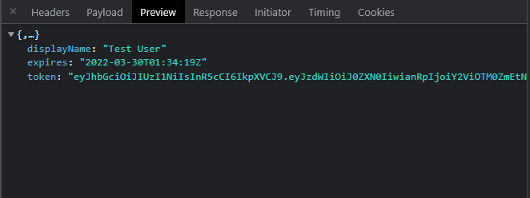
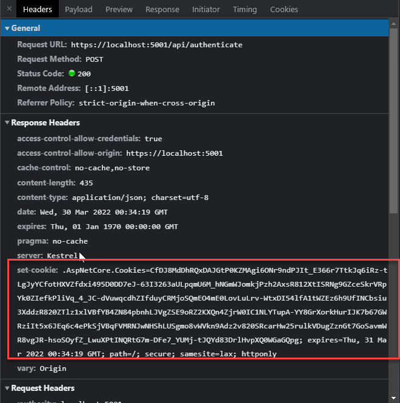

# Combining Bearer Token and Cookie Authentication in ASP.NET


And we're back for another episode in the seedy TV drama that is ASP.NET Authentication. In today's show we'll discuss the mysterious case of combining multiple authentication schemes in a single application. Tune in at 11 for the scary conclusion... 

In this post I'll talk about:

* Combining JWT Bearer Token and Cookie Authentication
* Using Manual JWT Tokens
* Using Manual Cookies
* Using only ASP.NET's low level Auth features - **not using ASP.NET Core Identity**

If you're new to manual authentication, you might want to read an earlier post of mine that talks about the basic concepts in the context of token authentication:

* [Manually integrating JWT Bearer Token Authentication](https://weblog.west-wind.com/posts/2021/Mar/09/Role-based-JWT-Tokens-in-ASPNET-Core).

Just a heads up: This post deals specifically with  multi-scheme authentication and assumes you are somewhat familiar with the manual authentication logistics. If you get lost, check out the older post which explains the manual auth logistics in much more detail.

Combining multiple authentication schemes doubles up on complexity, mainly because it's not easy to find the right information for invoking the magic incantations to make it all work. I spent most of my afternoon yesterday trying to cobble together the information and failed to find a working solution when I took to Twitter for help. Apparently I'm not the only one struggling with this - check out some of the responses to get a feel for the level of confusion around this topic:

<blockquote class="twitter-tweet" data-theme="dark"><p lang="en" dir="ltr">I can&#39;t for the life of me get both JWTToken &amp; Cookie Auth to work at the same time. <a href="https://twitter.com/hashtag/aspnet?src=hash&amp;ref_src=twsrc%5Etfw">#aspnet</a><br><br>Regardless of what I do only the default theme seems to be respected. <br><br>This help topic for multiple providers seems more than a little ambiguous. <br><br>Any ideas? <a href="https://t.co/ngdONnrxLt">https://t.co/ngdONnrxLt</a> <a href="https://t.co/5XzyEbGUvd">pic.twitter.com/5XzyEbGUvd</a></p>&mdash; Rick Strahl (@RickStrahl) <a href="https://twitter.com/RickStrahl/status/1508672326790889473?ref_src=twsrc%5Etfw">March 29, 2022</a></blockquote> <script async src="https://platform.twitter.com/widgets.js" charset="utf-8"></script>

But there were several responses that ended up pointing me in the right direction and trying some combinations of settings that I missed and eventually led me to the working solution which I share in this post.

## Use Cases for Tokens and Cookies
Before jumping to the  solution, let's talk about use cases. Using both tokens and cookies is not a common use case, but it typically comes up when you have a **SPA or pure API applications that also need to secure some non-SPA pure Web Browser end points** that the server sends directly to the browser. If that content needs to be protected behind authentication you might need Cookie authentication, because you can't do Bearer Token authentication with plain HTML interfaces in the browser. Instead you need to use Cookies to capture and control the authentication of direct server resources or endpoints accessed directly by browser.

ASP.NET supports both Token and Cookie authentication and they work in similar ways and can even be combined into a single authentication routine as I'll show later. 

But it's tricky to combine them both together in terms of configuration and making ASP.NET recognize the authentication schemes **at the same time**.

In my case, the scenario is my Swagger/OpenAPI endpoint which should require a login to access. This endpoint is served directly by the Web Server and consumed in the browser, so it can't use a Bearer token. 

In my [AlbumViewer sample](https://github.com/RickStrahl/AlbumViewerVNext) where I do this, the Swagger access is frivolous and serves merely as an example for protecting the API docs. But in several of my production SPA applications I usually have a few direct access admin requests that don't go through the SPA for administration and maintenance purposes, and those need to also be behind authentication and require authentication separate from Bearer Tokens.

##AD##

## Multiple Authentication Schemes in ASP.NET Core
Ok, so let's look at what's required to make multiple authentication providers work. Here's a high level overview of the APIs involved.														

* `services.AddAuthentication()`
	* `services.AddJwtBearer()`
	* `services.AddCookies()`
	* `services.AddPolicyScheme()`
		* Create `options.ForwardDefaultSelector`
* `app.UseAuthentication()`
* `app.UseAuthorization()`
* Add an `Authenticate` end point (Action Method)
	* Create and return a JWT Token
	* Set an Authentication Cookie `HttpContext.SignInAsync()`
* Add `[Authorize]` to endpoints as usual 
* Add `app.Use()` for static or external endpoints

It's important to note that much of the ASP.NET documentation tends to show Authentication in the context of the ASP.NET Identity which is a high level abstraction that ties together both authentication schemes and user management storage, but there's also support to directly implement low level features for the individual authentication schemes directly. 

I'm not going to talk about ASP.NET Identity here, but about manual authentication. If you're new to ASP.NET authentication I have another blog post that specifically talks about [manual JWT Token and Role Based Authentication](https://weblog.west-wind.com/posts/2021/Mar/09/Role-based-JWT-Tokens-in-ASPNET-Core).


### Multiple Authentication Schemes Configuration
From the list of steps I showed above, the first step of the configuration is the part that I was getting hung up on. The pipeline of this command is quite long and the invocation needs to be just right.

The following is a good chunk of configuration in one block, but it only makes sense as a whole, so here it is all at once. The following code goes into the service configuration section of your ASP.NET Core application in `program.cs` (or `ConfigureServices()`):

```csharp
services.AddAuthentication(options =>
    {
        // custom scheme defined in .AddPolicyScheme() below
        options.DefaultScheme = "JWT_OR_COOKIE";
        options.DefaultChallengeScheme = "JWT_OR_COOKIE";
    })
    .AddCookie("Cookies", options =>
    {
        options.LoginPath = "/login";
        options.ExpireTimeSpan = TimeSpan.FromDays(1);
    })
    .AddJwtBearer("Bearer", options =>
    {
        options.TokenValidationParameters = new TokenValidationParameters
        {
            ValidateIssuer = true,
            ValidIssuer = config.JwtToken.Issuer,
            ValidateAudience = true,
            ValidAudience = config.JwtToken.Audience,
            ValidateIssuerSigningKey = true,
            IssuerSigningKey = new SymmetricSecurityKey(Encoding.UTF8.GetBytes(config.JwtToken.SigningKey))
        };
    })
    // this is the key piece!
    .AddPolicyScheme("JWT_OR_COOKIE", "JWT_OR_COOKIE", options =>
    {
        // runs on each request
        options.ForwardDefaultSelector = context =>
        {
            // filter by auth type
            string authorization = context.Request.Headers[HeaderNames.Authorization];
            if (!string.IsNullOrEmpty(authorization) && authorization.StartsWith("Bearer "))
            	return "Bearer";

            // otherwise always check for cookie auth
            return "Cookies";
        };
    });
```

You then also need to hook up the Authentication and Authorization:

```cs
var app = services.Build();

...

// add these before controllers and any
// handlers that need to be authenticated
app.UseAuthentication();
app.UseAuthorization();
```

Let's break down the configuration block starting from the bottom  with the `.AddPolicyScheme()` section first, because **that's the key to making multi-scheme authentication work**. 

This configurator lets you define a custom policy scheme, that combines JWT and Cookies by dynamically deciding at runtime which scheme to use. We add a dynamic handler that - based on the Authorization header in use - determines which of the default schemes (`Bearer` or `Cookie`) that are added with `Add<scheme>()` to use on a per request basis.

So we create custom scheme and give it a name of `JWT_OR_COOKIE`. 

```cs
.AddPolicyScheme("JWT_OR_COOKIE", "JWT_OR_COOKIE", options => {...})
```

This gives a name to the custom scheme which is then applied at the top of the config stack in `AddAuthentication()` by applying the default and challenge schemes:

```csharp
// custom scheme defined in .AddPolicyScheme() below
options.DefaultScheme = "JWT_OR_COOKIE";
options.DefaultChallengeScheme = "JWT_OR_COOKIE";

```

The `options.ForwardDefaultSelector` (what kind of name is that???) handler in `AddPolicyScheme()` then allows you to specify an `Action` that **is fired on each request and determines which authentication scheme should be used to authenticate**. 

```csharp
options.ForwardDefaultSelector = context =>
   {
       // filter by auth type for each request at runtime
       string authorization = context.Request.Headers[HeaderNames.Authorization];
       if (!string.IsNullOrEmpty(authorization) && authorization.StartsWith("Bearer "))
          return "Bearer";

       // otherwise always check for cookie auth
       return "Cookies";
   };
```

This implementation checks for a `Bearer` token in the `Authorization` header and if it finds it returns a scheme name of `Bearer`. Otherwise it assumes **Cookie Auth** scheme with the name of `Cookies`. Cookies are always present once authenticated, while the Bearer token may be available only on some requests depending on the application. Note that this check **only checks authentication type. It doesn't authenticate**. The actual authentication check happens later in the request cycle.

These two names returned - `Bearer` and `Cookies` - need to match the name of scheme name provided in `AddJwtBearer()` and `AddCookie()`. 

```cs
.AddCookie("Cookies", options => { ... })
.AddJwtBearer("Bearer" options => { ... })
```

I provided the **scheme names explicitly** above, to demonstrate that **you can create custom scheme names**, but these two values I used actually happen to be the default scheme names.

So, the whole configuration code above can be slightly simplified by using the default scheme names and not providing an explicit name in `AddJwtBearer()` and `AddCookie()`:

```csharp
services.AddAuthentication(options => 
    {
        options.DefaultScheme = "JWT_OR_COOKIE";
        options.DefaultChallengeScheme = "JWT_OR_COOKIE";
    })
    .AddCookie( options =>
    {
        options.LoginPath = "/login";
        options.ExpireTimeSpan = TimeSpan.FromDays(1);
    })
    .AddJwtBearer( options =>
    {
        options.TokenValidationParameters = new TokenValidationParameters
        {
            ValidateIssuer = true,
            ValidIssuer = config.JwtToken.Issuer,
            ValidateAudience = true,
            ValidAudience = config.JwtToken.Audience,
            ValidateIssuerSigningKey = true,
            IssuerSigningKey = new SymmetricSecurityKey(Encoding.UTF8.GetBytes(config.JwtToken.SigningKey))
        };
    })
    .AddPolicyScheme("JWT_OR_COOKIE", "JWT_OR_COOKIE", options =>
    {
        options.ForwardDefaultSelector = context =>
        {
            string authorization = context.Request.Headers[HeaderNames.Authorization];
            if (!string.IsNullOrEmpty(authorization) && authorization.StartsWith("Bearer "))
                return JwtBearerDefaults.AuthenticationScheme;
                
            return CookieAuthenticationDefaults.AuthenticationScheme;
        };
    });
```

Unless you're adding additional custom that go beyond the built in schemes, the latter approach is the better way to go as it will work without requiring any changes to `[Authorize]` attributes which otherwise require explicit `AuthenticationSchemes=` overrides to work.

Alright, so we've now enabled Cookie and Token authentication and authorization of requests. The next step is to actually authenticate users and issue an Authorization cookie or token.

### Authenticating Users and Setting a Token and Cookie
When you create your Authentication endpoint, you need to set it up so it both creates and returns a token to the client, **and** set a cookie that is assigned and cached in the browser. 

Again I remind you that I'm doing **manual authentication** that's not using ASP.NET Identity, so I'm manually checking the user and then generating the JWT token and Cookie using ASP.NET's low level features that provide this functionality.

Here's my Authenticate method:

```csharp
[AllowAnonymous]
[HttpPost]
[Route("api/authenticate")]
public async Task<object> Authenticate([FromBody] User loginUser)
{
    var user = await accountRepo.AuthenticateAndLoadUser(loginUser.Username, loginUser.Password);
    if (user == null)
        throw new ApiException("Invalid Login Credentials", 401);

    // APP SPECIFIC: create a state object we can serialize as a single claim
    var UserState = new UserState();

    // track user state through our claim
    UserState.UserIdInt = user.Id;
    UserState.Name = user.Fullname;
    UserState.Email = user.Username;

    // create a new token with token helper and add our claim
    var token = JwtHelper.GetJwtToken(
        user.Username,
        Configuration.JwtToken.SigningKey,
        Configuration.JwtToken.Issuer,
        Configuration.JwtToken.Audience,
        TimeSpan.FromMinutes(Configuration.JwtToken.TokenTimeoutMinutes),
        new[]
        {
            new Claim("UserState", UserState.ToString())
        });

    // also add cookie auth for Swagger Access
    var identity = new ClaimsIdentity(CookieAuthenticationDefaults.AuthenticationScheme, ClaimTypes.Name, ClaimTypes.Role);
    identity.AddClaim(new Claim(ClaimTypes.NameIdentifier, user.Username));
    identity.AddClaim(new Claim(ClaimTypes.Name, user.Username));
    var principal = new ClaimsPrincipal(identity);
    await HttpContext.SignInAsync(
        CookieAuthenticationDefaults.AuthenticationScheme,
        principal,
        new AuthenticationProperties
        {
            IsPersistent = true,
            AllowRefresh = true,
            ExpiresUtc = DateTime.UtcNow.AddDays(1)
        });

    // return the token to API client
    return new
    {
        token = new JwtSecurityTokenHandler().WriteToken(token),
        expires = token.ValidTo,
        displayName = user.Fullname
    };
}
```
<small>*[JwtHelper class](https://github.com/RickStrahl/Westwind.AspNetCore/blob/master/Westwind.AspNetCore/Security/JwtHelper.cs)*</small>

This code is an API controller endpoint that tries to authenticate a user based on username and password. On failure it returns a 401, and on success responds with a token response for the client to use for subsequent Bearer token authentication. Here's the token response:



Additionally the success request creates an Auth Cookie by calling `HttpContext.SignInAsync()` which creates the Auth Cookie that gets set and persists in the interactive user's browser. 



So even though the request may be a SPA login request, the `fetch()` that makes the request from the browser assigns the cookie to the browser for the active domain. Once set that cookie is now available for accessing other resources - like the Swagger link in my AlbumViewer app.

The JWT code above includes a [JwtHelper.GetJwtToken()](https://github.com/RickStrahl/Westwind.AspNetCore/blob/master/Westwind.AspNetCore/Security/JwtHelper.cs) helper method that makes it easier to create a JWT token from its component parts. It's part of [Westwind.AspNet.Core Nuget](https://www.nuget.org/packages/Westwind.AspNetCore/) package or you can just copy the code.

> #### @icon-info-circle Separate Logins for Cookie and Tokens
> If your application is very security sensitive or you simply want to separate Cookie and Token Authentication in the same application,  you might benefit from creating two separate authenticate methods or adding a flag or custom route that differentiates between token and cookie logins. 
> Separating like this avoids shipping around cookie on each request that may not be needed on most requests and also remove a potential attack vector for 'always-on' cookies.  
<small>*thanks to comment from Dalibor*</small>

##AD##

### Protecting [Authorize] EndPoints with Cookies and Tokens
Ok so now we have a way to log in users and create both a JWT token that works for SPA app authentication and Cookie that is set in the browser.

Once all this is hooked up you can use standard `[Authorize]` attributes to secure code for access either via Cookie or Bearer authentication, like this simple controller method:

```cs
[Authorize]
[HttpGet("api/amievil")]
public async Task AmIEvil()
{
    Response.ContentType = "text/html";
    await Response.WriteAsync("<html>" +
                              "<h1> 🎸 Yes I Am!</h1>" +
                              "</html>");
}
```

If accessing in a browser, unauthenticated will then redirect to the `/login` page which is specified in the cookie auth configuration. If the user is authenticated she can access the HTML 'page'.

### Protecting Non-Application and Static Resources
To handle the Swagger endpoint works a little differently because it's not under my application's control since the endpoint is generated by the Swagger Gen tooling. 

To secure my generated Swagger endpoint at `/swagger/index.html` I can use a custom Middleware handler using `app.Use()` to explicitly check for the swagger Url and **check explicitly** for authentication:

```csharp
app.UseAuthentication();
app.UseAuthorization();

// check Swagger authentication
app.Use(async (context, next) =>
{
    var path = context.Request.Path;
    if (path.Value.Contains("/swagger/", StringComparison.OrdinalIgnoreCase))
    {
        if (!context.User.Identity.IsAuthenticated)
        {
            context.Response.Redirect("/login");
            return;
        }
    }

    await next();
});

// endpoint handler terminates and allows for catch-all middleware below
app.UseEndpoints(app =>
{
    app.MapControllers();
});
```

This too now works - if a user is not authenticated they are routed to the `/login` SPA page. Once logged in they can then access the Swagger documentation.

Yay!

Relevant code in the AlbumViewer application:

* [Startup code (program.cs)](https://github.com/RickStrahl/AlbumViewerVNext/blob/master/src/AlbumViewerNetCore/Program.cs#L79)
* [Authenticate() EndPoint](https://github.com/RickStrahl/AlbumViewerVNext/blob/master/src/AlbumViewerNetCore/Controllers/AccountController.cs#L59)

## Summary
ASP.NET Core authentication can be a pain in the ass to set up - not because it's hard or because it's impossible to do something specific - quite the opposite, it's extremely feature rich and capable.  No, it's usually because you can't find the right invocations of commands to make a specific feature work. Using multiple authentication schemes in a single application is no different - the set up and configuration makes perfect sense, but finding the right exact steps can be frustrating. There are number of different configuration settings that are described in various places of the documentation, but nowhere is this specific scenario described. So a lot of trial an error and combining examples is often needed to come up with working solutions.

Hopefully this post helps some of you jump straight to the solution, instead of poking around a lot of blind alleys like I did...

## Resources

* [Using multiple Authentication Schemes with ASP.NET Core](https://docs.microsoft.com/en-us/aspnet/core/security/authorization/limitingidentitybyscheme?view=aspnetcore-6.0#use-multiple-authentication-schemes)
* [Manually Setting up JWT Role Based Authentication in ASP.NET](https://weblog.west-wind.com/posts/2021/Mar/09/Role-based-JWT-Tokens-in-ASPNET-Core)
* [Album Viewer Sample (GitHub)](https://github.com/RickStrahl/AlbumViewerVNext)
* [Album Viewer Online Sample](https://albumviewer.west-wind.com)


<div style="margin-top: 30px;font-size: 0.8em;
            border-top: 1px solid #eee;padding-top: 8px;">
    
    this post created and published with the 
    <a href="https://markdownmonster.west-wind.com" 
       target="top">Markdown Monster Editor</a> 
</div>