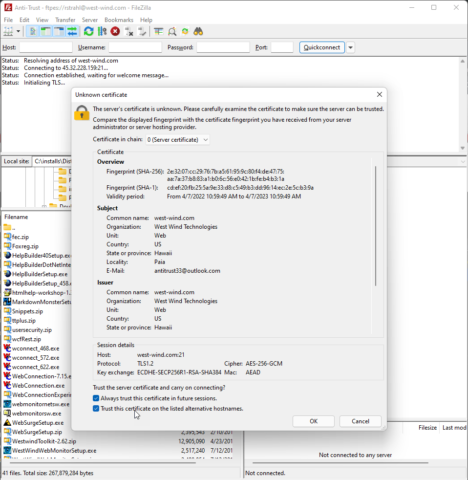
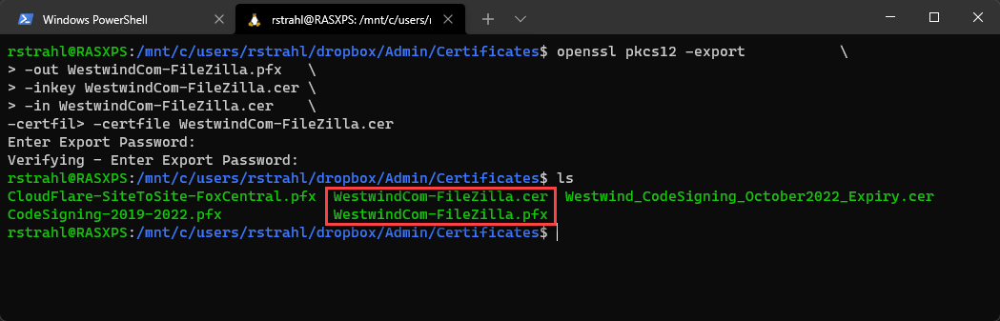
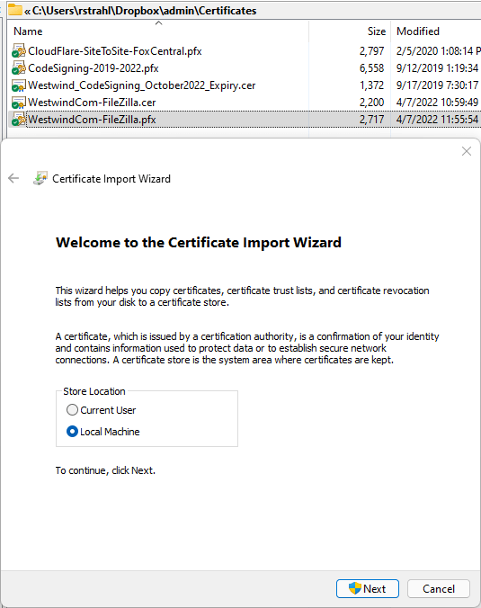
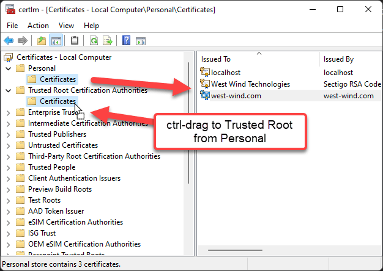
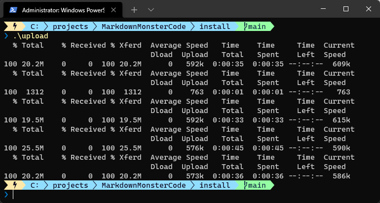

# Export a FileZilla Server Client Certificate for use on Windows


On my server I use[ FileZilla FTP server](https://filezilla-project.org/download.php?type=server) for private uploads of files. FileZilla Server supports FTPS for secure FTP over TLS (as well as SFTP). The server can generate client certificates you can use to secure connections to the server for you easily enough. With a server certificate, uf you're using FileZilla (and some other FTP clients) the clientcan automatically import the certificate once you approve it, and use it from within the application. 



That's great - as long as you use an interactive tool like FileZilla that supports internal import of certificates.

But, I also automate **the upload of distribution files for various applications** to my Web site via FTP, and for that I use a Windows version of good old `curl.exe` (not the PowerShell alias). `curl` also has support for FTPS but it won't recognize the FileZilla certificate  or attempt to install or use them automatically. So if I try to run something like:

```ps
~\DropBox\utl\curl.exe `
-T "$distributionFolder\MarkdownMonsterSetup.exe" `
   "ftps://$hostSite/Ftp/Files/"  `
-u ${uid}:${pwd} -k
```

Notice the `ftps://` request Url... it fails due to the missing certificate. While it's possible to explicitly provide the certificate to `curl`, to do that you'd also have to provide a password, which tends to be cumbersome and lousy for a shared repository, so instead it's better to install the certificate into the Windows Certificate store and have `curl` apply it from there.

The main problem is: 

> The Windows Certificate store can't deal directly with the combined `.cert` file that FileZilla generates.

Some conversion is needed to turn the `.cert` file into a `.pfx` that can be imported into the Windows Certificate Store.

I've been here so many times and once again had to search for the solution and make sense of it. There are lots of articles that point out how to convert a `.cer` file, but not what files you need and how these files can vary. So this post is for my own sanity to refer back to, next time I need to install a FileZilla Server cert on a client machine.

## Overview of Steps for Windows Certificate Store Installation
To get a FileZilla Server certificate installed into the Windows Certificate Store a number of steps are required:

* Convert FileZilla Server `.cer` file to  `.pfx`
* Add the `.pfx` to Local Machine and User Stores (as needed, I need both)
* Copy installed cert to Trusted Root Store in both

## WSL and OpenSsl to convert the .cer File to .pfx
The first - and for me most confounding - step is to convert the FileZilla Certificate to something that the Windows Certificate store can work with, which is a `pkcs12` (or `.pfx`) formatted certificate. 

The easiest way to do this is to use **OpenSSL**, but Windows doesn't have native support for that. If you have **Windows SubSystem for Windows** (WSL) installed you can use that to access OpenSSL. Or you can use one of the [Windows OpenSSL implementations](https://stackoverflow.com/questions/50625283/how-to-install-openssl-in-windows-10) that are available. I'll use WSL here.

Open a WSL window, and navigate to the folder of the certificate file.
The FileZilla exported certificate contains public, private and domain info all in the single single file, so when running openssl, you specify the same certificate file for all three of the required keys (private, public keys and the certificate itself).

Run this command to create a `.pfx`:

```bash
cd /mnt/c/users/you/admin/certificates

openssl pkcs12 -export             \
  -out WestwindCom-FileZilla.pfx   \
  -inkey WestwindCom-FileZilla.cer \
  -in WestwindCom-FileZilla.cer    \
  -certfile WestwindCom-FileZilla.cer
```

Here's what that looks like:



This should produce a `.pfx` file that can be imported into the Windows Certificate Store.

## Install the Certificate
Once you have a `.pfx` version of the certificate you have to install it into the Windows Certificate Store. You can now install the certificate either or both for `User` and `Local Machine` Certificate Stores by simply **double clicking the file**. 



Use the **Current User** if you're sure you only need it for the current user, or - more importantly - if you don't have Admin access on the machine. Otherwise, I prefer installing to **Local Machine** which works both for the Current User but also works if you are running with elevated rights as Administrator. Current User does not work with elevated rights.

## Add to Trusted Root Authorities
In addition to installing the cert you also have to add the Certificate to the **Trusted Root Certificate Authorities** in order for it to be trusted machine wide. To open the certificate store type `Certificate` into the Windows Start menu and choose from Computer or User Certificate Management. The go to **Personal** and ctrl-drag the certificate you created to the **Trusted Root Certificate Authorities** folder.



And that's all that it should take. Now when I run my upload scripts that look something like this:

```ps
~\DropBox\utl\curl.exe `
-T "$distributionFolder\MarkdownMonsterSetup.exe" `
   "ftps://$hostSite/Ftp/Files/"  `
-u ${uid}:${pwd} -k
```

I see this when uploading the 4 files that my `upload` script runs:



Yay!

## Summary
None of this is new or overly exciting. As mentioned I'm putting this into a self-contained blog post as a note to self mainly because I found no explicit reference on how to use a FileZilla certificate on the client, nor how to specifically convert one so that you can import it into the Windows Certificate Store. 

Hopefully this is useful to some of you too. I know I'll be back here, revisiting this next time I pave my Windows machine :smile: