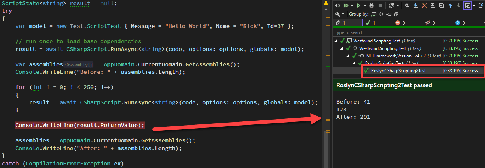
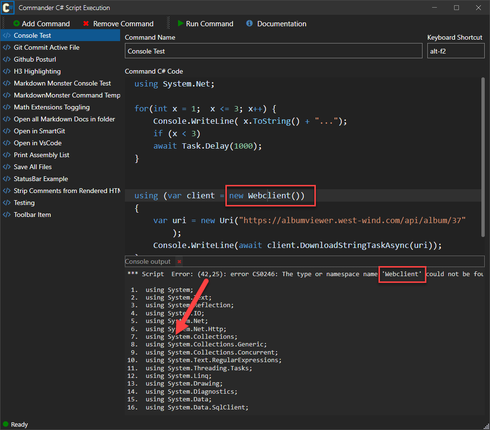
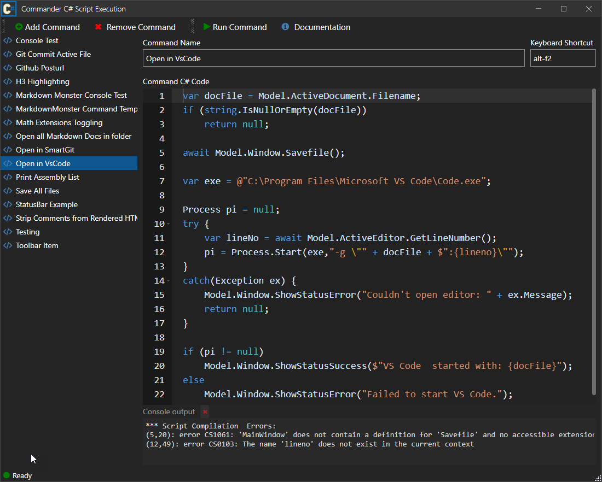
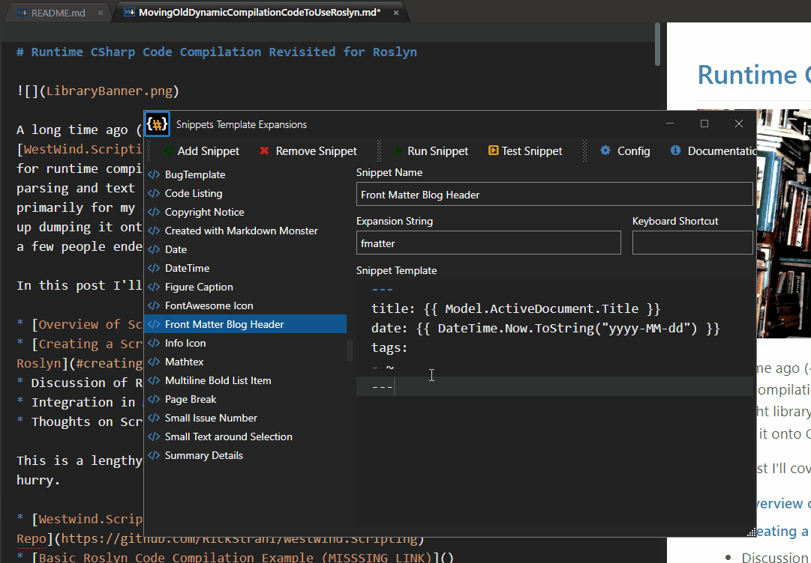

# Runtime C# Code Compilation Revisited for Roslyn


Runtime Compilation

A long time ago (~2008 or so) I built a dynamic runtime compilation library in [WestWind.Scripting](https://github.com/rickstrahl/westwind.scripting), which allows for runtime C# compilation of code expressions, code blocks and as of late templates script expansion in a small and lightweight library. I built this tool primarily for my own use in order to support user authored application automation and - more commonly - for a drop-in  template C# based scripting engine for text editor expansions in various applications.

At some point in 2014 I ended up [releasing it on GitHub](https://github.com/RickStrahl/Westwind.Scripting) along with a NuGet package which have been updated a bit over the years. One limitation and a frequent request that came up in issues was that up until recently this library used the old **CodeDom C# compiler APIs** limited to .NET Framework - CodeDom doesn't work in .NET Core. Last month I finally got around to updating the code use the latest Roslyn APIs.

In this post I'll talk about the process of using the Roslyn C# Code compilation APIS and the why's and how's of creating a `WestWind.Scripting` wrapper and more importantly how I actually use it in one of my popular applications. 

Here are some things I'll cover in this post:

* Scripting and Templating in Applications - Why?
* Raw Roslyn Code Compilation and Script Execution
* Creating a library around compilation APIs
* Creating a tiny C# Templating Engine
* Real world scripting and templating use case in [Markdown Monster](https://markdownmonster.west-wind.com/)

Since this is a very long post, here are a few quick links to the more actionable areas:

* [Compiling Code with Raw Roslyn](#compiling-code-with-raw-roslyn)
* [Dependency Management: The Hard Part on .NET Core](#dependency-management-the-hard-part-on-net-core)
* [Westwind.Scripting: Creating a Dynamic Code Execution Library](#westwindscripting-creating-a-dynamic-code-execution-library)
* [C# Script Templates and Parsing Script into Code](#parsing-script-into-code)

And links for the **Westwind.Scripting** library:
* [Westwind.Scripting on GitHub](https://github.com/RickStrahl/Westwind.Scripting)
* [Westwind.Scripting NuGet Package](https://www.nuget.org/packages/Westwind.Scripting)

## Scripting, what's it good for?
Dynamic code execution/scripting can be very useful for applications to provide automation features for user provided code input. Rather than formal integrations with more complex addins, scripting allows users to create automation operations interactively without doing 'software development'. Rather they can 'write a small block of code or script' as part of the application, and the engine can dynamically execute that interactively created code. 

To put a practical point to this, I've been relying on this type of automation and  `Westwind.Scripting` extensively in my [Markdown Monster editor](https://markdownmonster.west-wind.com) where it's used for dynamic [text snippet expansion](https://markdownmonster.west-wind.com/docs/_5gs0uc49h.htm), and for the [Commander Addin](https://github.com/RickStrahl/Commander-MarkdownMonster-Addin) that provides scripted automation features of the application and UI. 

##AD##

## C# Compiler History
Over the years runtime code compilation has changed quite bit in .NET. These are the main milestones of compilation approaches in .NET:

* CodeDom Compilation (.NET FX)  <small>built into .NET framework</small>
* CodeDom Compilation with Roslyn (.NET FX)  <small>external lib stacked on top of CodeDom</small>
* Roslyn CodeAnalyzer Libraries (.NET Core/.NET FX/.NET Standard)  <small>separate library</small>

### The Original: CodeDom 
The first version of `Westwind.Scripting` used the original CodeDom compilation model which was built into the .NET Runtime and updated with it. The compiler supported the current version of the C# language based on the runtime, and the compiler was backwards compatible with various language versions - up to the point that it was discontinued which is when C# 6.0 came out. The original CodeDom compiler supports versions up through C# 5. 

CodeDom was a wrapper around the runtime provided `csc.exe` or `vbc.exe` compiler executables which handle code compilation by launching these exes. The API was pretty straightforward and allowed for relatively easy compiling of code into an assembly that can be executed dynamically at runtime. 

### Roslyn Part 1: Early Days
Sometime after the .NET 4.0 release Microsoft externalized the compiler from the framework with Roslyn. Rather than including the compiler in the framework, the compiler was externalized so it didn't have to be released in sync with the big .NET Framework releases.

Initially this support was via new compilers that were installed separately and required external execution. They were drop in replacements (in a new location) of the old `csc.exe` and `vbc.exe` compilers.

If you're using Roslyn with the original CodeDom provider in full .NET Framework, you can see this by way of the required `/roslyn` folder that gets installed by the `Microsoft.CodeDom.Providers.DotNetCompilerPlatform` NuGet package. This also requires some directives in an `app.config` to point at the location for the `/roslyn` folder. This folder has a lot of files and is large in size (~10mb trimmed).

When Roslyn was initially introduced it wasn't easy to access the new compiler features in runtime code for quite some time. But luckily Microsoft provided a CodeDom wrapper around the APIs so that Roslyn and new C# feature can still work with old CodeDom compatible code.

Using the CodeDom implementation of Roslyn *allowed continued use of the old class CodeDom API with Roslyn* simply by swapping out the CodeProvider:

```csharp
if (CompilerMode == ScriptCompilerModes.Roslyn)
	// NuGet Package: Microsoft.CodeDom.Providers.DotNetCompilerPlatform
    _compiler = new Microsoft.CodeDom.Providers.DotNetCompilerPlatform.CSharpCodeProvider();
else
    _compiler = new Microsoft.CSharp.CSharpCodeProvider();
```

With very little effort **but a large runtime distribution hit** for the Roslyn libraries/compiler that have to be shipped - taking advantage of the latest C# features with Roslyn was essentially a drop in replacement. Very nice - it allowed me to continue to use my old code with new features for a number of years.

The Roslyn CodeDom works fine, but it has a few shortcomings:

* Only works on .NET Framework not on .NET Core
* Runs external compilers (out of proc)
* Is very slow to start up
* Large dependency: Compiler libs have to be shipped with application

### Roslyn Compiler Libraries
When Roslyn first showed up, there was a lot of discussion about building new **scripting and compilation APIs**. In fact, the term *Compiler as an API* was often thrown around. Seems quaint now that we have those APIs in place, but it took quite a while after Roslyn's debut for those compiler APIs libraries to actually arrive for general non-preview use.

Eventually, the `Micorosoft.CodeAnalyzer` and related libraries provided the integration of the compiler as an **in-process component** that is part of the application. The end result of this tooling is closer integration into existing applications, in-process operation that removes the external compiler invocation and improves the initial compiler startup time considerably.

Roslyn is **big** - there is so much functionality and finding what you need can be daunting mainly because the documentation is decidedly sparse and - due to years of churn before release - there is a lot of out of date info that can take you down the wrong path. If you use docs and code samples be sure you check dates for something semi recent (2019+).

## Compiling Code with Raw Roslyn
Docs aside - compiling code with Roslyn now is surprisingly easy. The Roslyn compiler APIs have evolved and it's relatively straight forward to compile and execute code. What helps is that the defaults for most operations are sensible so you don't need to know about all the details and knobs available in these complex APIs, and just use the defaults for the most part.


### Roslyn Compilation
To compile code with Roslyn you need to add a NuGet package:

```ps
install-package Microsoft.CodeAnalysis.CSharp
```

> The Roslyn libraries incur a large runtime hit as you are essentially packaging all the libraries required to run the compiler. My typical distribution runtime hit ends up ~10mb in a deployed application generally.

#### The simplest Thing
The smallest compilation unit that you can use to compile an assembly is by creating a C# type - typically a class. This means in order to run even a code snippet you actually need to create a class and method that wraps that code snippet or expression.

The following is the simplest thing you can do to:

* Create a class as text
* Compile class to an assembly
* Load it from the resulting assembly
* Execute a method on it

```cs
var source = @"using System;
using System.Text;
using System.Reflection;
using System.IO;
using System.Net;
using System.Net.Http;
using System.Collections;
using System.Collections.Generic;
using System.Collections.Concurrent;
using System.Text.RegularExpressions;
using System.Threading.Tasks;
using System.Linq;

namespace __ScriptExecution {
public class __Executor { 

    public async Task<string> GetJsonFromAlbumViewer(int id)
    {
        Console.WriteLine(""Starting..."");

        var wc = new WebClient();
        var uri = new Uri(""https://albumviewer.west-wind.com/api/album/"" + id);

        string json = ""123"";
        try{
            Console.WriteLine(""Retrieving..."");
            json =  await wc.DownloadStringTaskAsync(uri);

            Console.WriteLine(""JSON retrieved..."");
        }
        catch(Exception ex) {
            Console.WriteLine(""ERROR in method: "" + ex.Message);
        }

        Console.WriteLine(""All done in method"");

        dynamic name = ""Rick"";
        Console.WriteLine(name);

        var s = Westwind.Utilities.StringUtils.ExtractString(""132123123"",""13"",""23"");
        return json;
    }

} }";

#if NETFRAMEWORK
	AddNetFrameworkDefaultReferences();
#else
	AddNetCoreDefaultReferences();
	
	// Core specific - not in base framework (for demonstration only)
	AddAssembly("System.Net.WebClient.dll");  
#endif

AddAssembly(typeof(Westwind.Utilities.StringUtils));

// Set up compilation Configuration
var tree = SyntaxFactory.ParseSyntaxTree(source.Trim());
var compilation = CSharpCompilation.Create("Executor.cs")
    .WithOptions(new CSharpCompilationOptions(OutputKind.DynamicallyLinkedLibrary,
        optimizationLevel: OptimizationLevel.Release))
    .WithReferences(References)
    .AddSyntaxTrees(tree);

string errorMessage = null;
Assembly assembly = null;

bool isFileAssembly = false;
Stream codeStream = null;
using (codeStream = new MemoryStream())
{
    // Actually compile the code
    EmitResult compilationResult = null;
    compilationResult = compilation.Emit(codeStream);

    // Compilation Error handling
    if (!compilationResult.Success)
    {
        var sb = new StringBuilder();
        foreach (var diag in compilationResult.Diagnostics)
        {
            sb.AppendLine(diag.ToString());
        }
        errorMessage = sb.ToString();

        Assert.IsTrue(false, errorMessage);

        return;
    }
    
    // Load
    assembly = Assembly.Load(((MemoryStream)codeStream).ToArray());
}

// Instantiate
dynamic instance = assembly.CreateInstance("__ScriptExecution.__Executor");

// Call
var json = await instance.GetJsonFromAlbumViewer(37);

Console.WriteLine(json)
```        

<small>full code [on GitHub](https://github.com/RickStrahl/Westwind.Scripting/blob/master/Westwind.Scripting.Test/RoslynScriptingTests.cs#L22)</small>

You start by creating a syntax tree from your source code, which is what Roslyn needs to compile your code. Syntax tress contain parsed C# code that break down the source code into each operation. The compiler uses this this syntax tree to compile, but code analyzers can also use this for examining the code and create tooling from the insights available (ie. source code analysis, refactoring, other language tooling).

Next you can create *Compilation* which essentially assigns the syntax tree, along with a host of settings to set up the compiler. Most options are default and work fine, but at minimum you need to provide your dependencies as assembly meta data references, which is the trickiest part about this entire process via the call to `.WithReferences()`:

```cs
.WithReferences(References)
```

The complexity of creating the `References` is hidden from this code in the `AddXXX()` methods described below.

#### Adding References
Compilation requires that **each and every dependency** that your code references has to available to the compiler. This means both explicit external libraries, as well as implicit system libraries have to be explicit added. It's not always obvious what dependencies are required, especially when it comes to framework libraries in .NET Core.

Every referenced type needs to be provided as a **MetaDataReference**, which unlike assembly contain only their dependency metadata. These references get loaded from an assembly's file on disk (`Assembly.Location`) or, alternately, from pre-existing Meta data library or any stream. Unless you're using explicit Reference Assemblies (which are not shipped in the framework runtimes) this usually means you have to load from an assembly file location and you need a full path in order to use `MetadataReference.CreateFromFile(file)`. This is a pain as paths have to be resolved. 

To help in creating these references, it's best to create a couple of helpers that can resolve MetaDataReferences from files or a type and create a default list of assemblies that all of your or most applications need.

Here's the file version of `AddAssembly()` that resolves pathless references by looking in the app and app's runtime folders.

```cs
public bool AddAssembly(string assemblyDll)
{
    if (string.IsNullOrEmpty(assemblyDll)) return false;

    var file = Path.GetFullPath(assemblyDll);

    if (!File.Exists(file))
    {
        // check framework or dedicated runtime app folder
        var path = Path.GetDirectoryName(typeof(object).Assembly.Location);
        file = Path.Combine(path, assemblyDll);
        if (!File.Exists(file))
            return false;
    }

    if (References.Any(r => r.FilePath == file)) return true;

    try
    {
        var reference = MetadataReference.CreateFromFile(file);
        References.Add(reference);
    }
    catch
    {
        return false;
    }

    return true;
}
```

And here's the type based version that uses the `Assembly.Location` to load the reference:

```cs
public bool AddAssembly(Type type)
{
    try
    {
        if (References.Any(r => r.FilePath == type.Assembly.Location))
            return true;

        var systemReference = MetadataReference.CreateFromFile(type.Assembly.Location);
        References.Add(systemReference);
    }
    catch
    {
        return false;
    }

    return true;
}
```     

The next sticking point is assigning a default assemblies so that at least basic framework functionality is available. The list of base assemblies heavily depends on your .NET platform. For example, full framework and .NET Core have very different default dependencies.

Here's the default version for .NET Core:

```cs
public void AddNetCoreDefaultReferences()
{
    var rtPath = Path.GetDirectoryName(typeof(object).Assembly.Location) +
                 Path.DirectorySeparatorChar;

    AddAssemblies(
        rtPath + "System.Private.CoreLib.dll",
        rtPath + "System.Runtime.dll",
        rtPath + "System.Console.dll",
        rtPath + "netstandard.dll",

        rtPath + "System.Text.RegularExpressions.dll", // IMPORTANT!
        rtPath + "System.Linq.dll",
        rtPath + "System.Linq.Expressions.dll", // IMPORTANT!

        rtPath + "System.IO.dll",
        rtPath + "System.Net.Primitives.dll",
        rtPath + "System.Net.Http.dll",
        rtPath + "System.Private.Uri.dll",
        rtPath + "System.Reflection.dll",
        rtPath + "System.ComponentModel.Primitives.dll",
        rtPath + "System.Globalization.dll",
        rtPath + "System.Collections.Concurrent.dll",
        rtPath + "System.Collections.NonGeneric.dll",
        rtPath + "Microsoft.CSharp.dll"
    );
    
    // this library and CodeAnalysis libs
    AddAssembly(typeof(ReferenceList)); // Scripting Library
}
```

And here's the .NET Framework one with similar dependencies:

```cs
public void AddNetFrameworkDefaultReferences()
{
    AddAssembly("mscorlib.dll");
    AddAssembly("System.dll");
    AddAssembly("System.Core.dll");
    AddAssembly("Microsoft.CSharp.dll");
    AddAssembly("System.Net.Http.dll");
}
```

The .NET Framework version is a lot shorter, because most common framework features live in the monolithic `mscorlib` and `system` dlls. In .NET Core libraries are scattered across many, many small assemblies. More about dependencies later - this is literally the hardest part about runtime code compilation although the list above should give you a good starting point.

> If you want to add **all .NET Framework references**, there is a NuGet package from Jared Parsons ([@jaredPar](https://twitter.com/jaredPar) called [Basic.Reference.Assemblies](https://www.nuget.org/packages/Basic.Reference.Assemblies/) which holds all the framework references in one place. You can assign these to the script engine in one swoop:
> ```cs
> .WithReferences(Basic.Reference.Assemblies.Net60.All)    // framework references
> .AddReferences(References)   // add additional app specific references
> ```
> The downside of this library is that it is **large** and adds ~5mb per framework reference to your distribution.

#### Loading and Executing
Once you've figured out which dependencies to add and how, the rest of the compilation process is pretty easy.

The result is an assembly that gets written to a stream which you can use to load the assembly:

```cs
assembly = Assembly.Load(((MemoryStream)codeStream).ToArray());
```

To load the compiled type you can then use Reflection:

```cs
// Instantiate
dynamic instance = assembly.CreateInstance("__ScriptExecution.__Executor");
```

The result will be an `object` reference, and the easiest way to use it is by using `dynamic`.

```cs
// Call
var json = await instance.GetJsonFromAlbumViewer(37);
```

There are other ways you can use this type of course:

* Reflection
* Typed Interfaces that are shared between host app and compiled code

Either way it's easy to execute the retrieved code.

#### Compilation Startup Performance
Code compilation isn't fast under the best of circumstance, but there are few thing to consider in terms of performance:

* Roslyn Startup Performance
* Compilation Performance
* Repeat Invocation Performance

Roslyn startup performance is a big deal because the Roslyn libraries are large and incur a hefty resource hit both in terms of load time and memory usage as is to be expected. On my machine initial startup of Roslyn for first compilation (mid-range I7 laptop) is roughly ~2 seconds for first hit operation.

Subsequent compilations are significantly faster, running in the 30-50ms range for small code blocks. While that's not unreasonable it's still very very slow compared to just instantiating a class and calling a method even dynamically.

For this reason it's important that any dynamic code solution has some way of caching compile code or the assembly to avoid repeatedly having to re-compile the code. Code invocations of the same code can run thousands of operations vs. a single code compile/run cycle.

I'll come back to this when I'll talk about `Westwind.Scripting` which automatically caches compiled code and only recompiles when new code snippets are executed.

##AD##

### Roslyn Scripting APIs
The previous section essentially uses compilation of a class to compile an assembly. The assembly can be either in memory (as per example) or can be sent to a file. 

Roslyn also includes a **Scripting API** that is meant to simplify this process by letting you run just a snippet of code or an individual expression rather than having to first create a class manually. Behind the scenes the code still produces a class and assembly, but with the Scripting API this is hidden so you just pass in a code snippet.

Here's the simplest possible example using the Scripting API:

```cs
var westwindAssemblyPath = Path.GetFullPath("Westwind.Utilities.dll");

var code = $@"
#r ""{westwindAssemblyPath}""
Console.WriteLine(Message);

Console.WriteLine(""Hello World #2"");

// External Reference
Console.WriteLine(StringUtils.Replicate(""42"",10));

// dynamic
dynamic name = ""Rick"";
Console.WriteLine(name);

// Uncommon (deprecated) type - still works
var wc = new System.Net.WebClient();
var json = wc.DownloadString(new Uri(""https://albumviewer.west-wind.com/api/album/37""));

return ""OK"";
";          

var options =
    ScriptOptions.Default
        .AddReferences(typeof(StringUtils).Assembly)
        .AddImports("System","System.IO", "System.Text",
    "System.Text.RegularExpressions", "Westwind.Utilities");

ScriptState<object> result;
try
{
    var model = new Test.ScriptTest { Message = "Hello World", Name = "Rick" };
    
    result = await CSharpScript.RunAsync(code, options, model);
    Console.WriteLine(result.ReturnValue);
}
catch (CompilationErrorException ex)
{
    Console.WriteLine(code);

    var sb = new StringBuilder();
    foreach (var err in ex.Diagnostics)
        sb.AppendLine(err.ToString());

    Console.WriteLine(sb.ToString());
}
// Runtime Errors
catch (Exception ex)
{
    Console.WriteLine(code);
    Console.WriteLine(ex.ToString());
}
```

This code is decidedly simpler as you the script itself is just an executable code snippet. The concept is similiar to the full code compilation, but somewhat simplified. Notice the `ScriptOptions.Default` object, provides a working set of default references and includes that make basic code just work without explicitly adding references.

> **TIP**: The `ScriptOptions` object is **immutable** and all of the the methods **have to be chained together** in a single command to work properly reflect multiple assignments. If you need to assign and store, make sure you always do `options = options.XXXX()` to create a new instance to preserve existing state.

You can add additional references via `.AddReferences()`:

```cs
ScriptOptions.Default   // includes default system references
    .AddReferences(typeof(StringUtils).Assembly)
```

or by adding a script reference directly into the code by using the `r#` directive along with a full path to an assembly to load:

```csharp
var westwindAssemblyPath = Path.GetFullPath("Westwind.Utilities.dll");

            var code = $@"
#r ""{westwindAssemblyPath}""

Console.WriteLine(Message);
...
";
```

### Assembly Loads and Performance
Although the scripting code is significantly simpler than the full compilation code, it's important to understand that behind the scenes the library still creates and compiles a C# type and produces an in-memory assembly. 

To see this in action, try running this code with the scripting example above:

```cs
// run once to get depedencies loaded
result = await CSharpScript.RunAsync<string>(code, options: options, globals: model);

var assemblies = AppDomain.CurrentDomain.GetAssemblies();
Console.WriteLine("Before: " + assemblies.Length);

for (int i = 0; i < 250; i++)
{
    result = await CSharpScript.RunAsync<string>(code, options: options, globals: model);
}

Console.WriteLine(result.ReturnValue);
```

The result:



You'll find that **there are now ~250 more assemblies loaded** in the process. 

Unfortunately that's not the only problem: These script calls **are also very slow**. On my mid-range I7 laptop to run these 250 invocations of the script code took over 30 seconds. The compile and script execution cycle is definitely not fast. There are some ways to mitigate this with caching but it's not immediately obvious how to set that up.

### Scripting API Limitations
While the scripting API is easy to use and provides some compelling features, it has a few limitations that ended up being a deal breaker to be used for my needs:

* **No non-Async Run support**  
The scripting API has no support for synchronous script calls which makes it really difficult to call these APIs from non-async code especially in desktop applications where async -> sync transitions tend to cause application lockups.

* **Global Object**  
I really dislike the idea of a global object passed in that exposes the properties of that object. I prefer to pass in a `Model` of some sort or perhaps in other scenarios multiple parameters but that doesn't really work here. 

* **No default Caching Mode**  
By default scripts create new assemblies on every script run which can bloat a processes memory usage very quickly.

* **No Documentation**  
The scripting API isn't documented anywhere and there are very few examples anywhere on how it works, what the options mean etc. In fact the entire Roslyn APIs have crappy documentation - most of the docs are merely what comes out of XML documentation in the *as-the-name-suggests* style. 

The bottom line is while the Roslyn Scripting API looks easier at first, I think that by using the full compilation API and only a little more effort to turn 'script' code into a class, I can get a lot more control over the compilation process out of it and that's what I ended up doing in `Westwind.Scripting`.

## Westwind.Scripting: Creating a Dynamic Code Execution Library
The main advantages using the full compiler are that I can both execute code snippets as well as create entire classes and capture and cache them for later reuse, as well as explicitly allowing for creating and storing assembly output for storage and later reuse. Roslyn Scripting hides those low level details.

As mentioned, I have two practical use cases for this functionality:

* Plain C# Code Execution for application automation
* Template Scripting with embedded C# code for dynamic text expansion

and both of these are addressed in the `Westwind.Scripting` library. 

The Template Scripting feature is a very simple implementation of a text templating engine based around raw C# code and text. It's a code generator that generates a string by mixing literal text and C# code. The parser creates the code, and the execution engine compiles it and then executes the code on the fly.

One key feature of the library is that anything you execute is cached. The assemblies are keyed based on a code hash and if code was previously compiled it simply re-executes the already compiled assembly which makes multi-invocation much faster and more memory efficient.

##AD##

### Code Execution Examples
Before diving into implementation it's probably best to show by way of some examples what functionality is available. For Code Execution the idea is to allow execution of :

* A generic piece of code with parameter input and result value
* A single expression with parameter input
* A fully self-contained method with signature and result value
* A fully self contained class that can be loaded  

This translates to the following method implementations of the `CSharpExecution` class:

* `ExecuteCode()` -  Execute an arbitrary block of code. Pass parameters, return a value
* `Evaluate()` - Evaluate a single expression from a code string. Expression value is the return value
* `ExecuteMethod()` - Provide a complete method signature and call from code
* `CompileClass()` - Generate a class instance from C# code 

There are also async versions of the Execute and Evaluate methods:

* `ExecuteMethodAsync()`
* `ExecuteCodeAsync()`
* `EvaluateAsync()`

Additionally there are also generic overloads for coercing the result type on most of these methods.

The library also supports caching of generated assemblies and at the end of this post I'll talk about various approaches for caching and potentially optimizing many code snippets.

#### Simple Code Execution
Let's start with a simple example that takes a couple of parameters as input, and generates an expression string that is return as result.

```cs
var exec = new CSharpScriptExecution() { SaveGeneratedCode = true };
exec.AddDefaultReferencesAndNamespaces();

var code = $@"
// pick up and cast parameters
int num1 = (int) @0;   // same as parameters[0];
int num2 = (int) @1;   // same as parameters[1];

var result = $""{{num1}} + {{num2}} = {{(num1 + num2)}}"";

Console.WriteLine(result);  // just for kicks in a test

return result;
";

// should return a string: "10 + 20 = 30"
string result = exec.ExecuteCode<string>(code, 10, 20);

if (exec.Error) 
{
	Console.WriteLine($"Error: {exec.ErrorMessage}");
	Console.WriteLine(exec.GeneratedClassCodeWithLineNumbers);
	return
}	
```

#### Simple Code Execution with a Typed Model
`GenerateCode()` is the highest level implementation that takes a string and any number of parameters that can be accessed as object parameters like `parameters[0]` or the shortcut `@0`. Parameters are of type `object` and have to be cast to a type (unless you use `dynamic`).

If you'd rather pass a strongly typed model as a single parameter you can do that too by using the following overload:

```csharp
// Simpler: Creates a default instance with default references and namespaces
var exec =  CSharpScriptExecution.CreateDefault();

// have to add references so compiler can resolve
exec.AddAssembly(typeof(ScriptTest));
exec.AddNamespace("Westwind.Scripting.Test");

var model = new ScriptTest() { Message = "Hello World " };

var code = @"
// To Demonstrate Async support
await Task.Delay(10); // test async

string result =  Model.Message +  "" "" + DateTime.Now.ToString();
return result;
";

// Use generic version to specify result and model types
string execResult = await exec.ExecuteCodeAsync<string, ScriptTest>(code, model);
```

Notice that I'm using an `Async` version of the method which creates an `async Task` based method so that `await` can be used in the code.

A couple of additional things that are important in this example: The type of the model parameter is set in the second generic parameter, but more importantly any custom types you use inside of the code, **have to have their references included**. In this case, the model class is defined in the executing assembly so I have to add the assembly and the namespace to the execution engine before the call is made:

```cs
exec.AddAssembly(typeof(ScriptTest));
exec.AddNamespace("Westwind.Scripting.Test");
```

Without this reference the compiler can't resolve `ScriptTest` parameter and compilation fails.

Assemblies can be added as a dll name or by type. dlls are loaded via full or relative paths relative to the execution folder, or with just a filename from the runtime folder (if using a shared runtime).

#### Evaluating an Expression
A slight variation of code execution with `ExecuteCode()` is `EvaluateExpression()`  you can provide parameters to an expression to process:

```csharp
var script = CSharpScriptExecution.CreateDefault();

// Numbered parameter syntax is easier
var result = script.Evaluate<decimal>("(decimal) @0 + (decimal) @1", 10M, 20M);

Console.WriteLine($"Result: {result}");  // 30
Console.WriteLine(script.ErrorMessage);
```
`Evaluate()` is just a shortcut for `ExecuteCode()` that automatically provides the `return` statement on the result of the expression.

#### More Control with ExecuteMethod()
If you want to be more explicit than `ExecuteCode()` or `Evaluate()` in your parameter and result values, you can use `ExecuteMethod()` instead. It's lets you write the **entire method body** including the type signature which lets you be explicit about parameters and result values. This looks very similar to the last example but is a little more verbose:

```cs
var script = CSharpScriptExecution.CreateDefault();

// have to add references so compiler can resolve
script.AddAssembly(typeof(ScriptTest));
script.AddNamespace("Westwind.Scripting.Test");

var model = new ScriptTest() { Message = "Hello World " };

var code = @"
public async Task<string> HelloModel(ScriptTest Model) 
{{
	// To Demonstrate Async support
	await Task.Delay(10); // test async
	
	string result =  Model.Message +  "" "" + DateTime.Now.ToString();
	return result;
}}
";

// Use generic version to specify result and model types
string execResult = await script.ExecuteMethodAsync<string>(code, model);
```

If you are calling an Async method you'll want to use the `Async` version. Otherwise use the non-async version for synchronous calls. Make sure the signature matches the async mode you are using (ie. `async Task` result types for `ExecuteMethodAsync()`).

> Note that `ExecuteMethod()` and `ExecuteMethodAsync()` are the low level methods that `ExecuteCode()` and `Evaluate()` generate to - both wrap their base code into a method and then execute through `ExecuteMethod()` or `ExecuteMethodAsync()`.

### Template Script Execution
Scripting and templating is the second piece in this library. It's a combination of code generation - transforming a tempalte into an executable block of code - and then executing that code.

Template expansion is useful for text transformations that mix text and C# code. This implementation provides a very small and self-contained code generator using Handlebars like syntax that uses `{{ }}` for expressions and `{{% }}` for code elements.

#### Expression Evaluation with `{{..}}`
At its simplest you can do expression evaluation using C# expressions embedded in a string. Here are a couple of examples I use in Markdown Monster with a model passed in.

**Text Wrapping of a selection**

```markdown
<div class="warning-box">
{{ await Model.ActiveEditor.GetSelection() }}
</div>
```
#### Structured Code with `{{% .. }}`
Simple expressions are useful, but sometimes you need structural block commands that can wrap around text or expressions.

For this you can use code block syntax using `{{% }}` which essentially allows injecting raw C# code that makes it possible to use structured statements like `for` or `if` to wrap text and other expressions or code blocks:

```markdown
### Open Editor Documents

{{% foreach(var doc in Model.OpenDocuments) { }}
* {{ doc.Filename }}
{{% } }}
```

#### ScriptParser Example
Here's a simple example that demonstrates how this works with a self-contained script. This first example has no parameters:

```csharp
string script = @"
Hello World. Date is: {{ DateTime.Now.ToString(""d"") }}!

{{% for(int x=1; x<3; x++) { }}
{{ x }}. Hello World
{{% } }}

DONE!
";

Console.WriteLine(script + "\n\n");

var scriptParser = new ScriptParser();
var code = scriptParser.ParseScriptToCode(script);

Assert.IsNotNull(code, "Code should not be null or empty");

Console.WriteLine(code);
```

The output generated from this looks like this:

```cs
Hello World. Date is: 6/4/2022!

1. Hello World
2. Hello World

DONE!
```

This is based on code that was generated and looks like this:

```cs
var writer = new StringWriter();

writer.Write("\r\nHello World. Date is: ");
writer.Write(  DateTime.Now.ToString("d")  );
writer.Write("!\r\n\r\n");
 for(int x=1; x<3; x++) { 
writer.Write("\r\n");
writer.Write(  x  );
writer.Write(". Hello World\r\n");
 } 
writer.Write("\r\n\r\nDONE!\r\n");
return writer.ToString();
```

As with C# Execution, the script parser may also require dependencies. Internally the class has a `ScriptEngine` reference that can be customized as well as a pass-through methods and properties for the `ScriptEngine` properties.

This code calls the script with a Model which is exposed as a `Model` variable in the script code:

```csharp
var model = new TestModel { Name = "rick", DateTime = DateTime.Now.AddDays(-10) };

string script = @"
Hello World. Date is: {{ Model.DateTime.ToString(""d"") }}!
{{% for(int x=1; x<3; x++) {
}}
{{ x }}. Hello World {{Model.Name}}
{{% } }}

And we're done with this!
";

var scriptParser = new ScriptParser();

// access the contained CSharpScriptExecution instance
scriptParser.ScriptEngine.SaveGeneratedCode = true;

// or use pass-through methods on ScriptParser itself
scriptParser.AddAssembly(typeof(ScriptParserTests));
scriptParser.AddNamespace("Westwind.Scripting.Test");

// Execute
string result = scriptParser.ExecuteScript(script, model);

Console.WriteLine(result);

// Using pass-through Properties
Console.WriteLine(scriptParser.GeneratedClassCodeWithLineNumbers);
Assert.IsNotNull(result, scriptParser.ErrorMessage);
```

## Dependency Management: The Hard Part on .NET Core
As in previous examples, a recurring theme is dependency management for code compilation. You probably noticed the `script.AddDefaultReferencesAndNamespaces()` method. This method loads a set of default assemblies and namespaces using one or two approaches:

*  **AddDefaultReferencesAndNamespaces()**
A core set of System assemblies and namespaces that provide access to common BCL/FCL functionality.

* **AddLoadedReferences()**  
Loads all assemblies loaded in the host process (plus the compilation/scripting assemblies) and makes them available to the compiled code.

The latter can be a good approach for applications that want to provide automation as this allows you to automatically inherit whatever assemblies the host is already using. However, this can be a long list of assemblies, so if your compiled code doesn't use most of those assemblies then using the default references and adding a few additionals that are required for the task can be more efficient. Load overhead - even for 200 assemblies - isn't massive, but it can add a few milliseconds to the execution process.

### Dependencies differ for .NET Frameworks
The compiler has be able to resolve all dependencies that the code uses, meaning that assembly references (or MetaData reference to be precise) have to be available in order for the compiler to resolve dependencies.

This gets tricky for a couple of reasons:

* .NET Core has a ton of assemblies even for base libraries (unlike .NET Framework)
* .NET Core and Full Framework use completely different sets assemblies

For full framework, it's very easy to get most of .NET's base behavior with a few System assemblies (`mscorlib.dll`, `system.dll`,`system.core.dll`)

On .NET Core because of the modularity of the framework, there are lots and lots small libraries that have to be loaded even for base functionality. This amounts to having to add a lot of - often non-obvious - dependencies that have to be added explicitly. 

To help with this, the `AddDefaultReferencesAndNamespaces()` adds core language and framework features or you can use `AddLoadedReferences()` to import the host process' references. 

But if you step outside of the basics you likely need to explicitly add assemblies.

```cs
 var script = new CSharpScriptExecution() {  SaveGeneratedCode = true }

// recommend default references to start
script.AddDefaultReferencesAndNamespaces();

// or: Host Loaded dependencies (and common namespaces)
// script.AddLoadedReferences();

// have to add this reference for .NET Core
script.AddAssembly("System.Net.WebClient.dll");

script.AddAssembly(typeof(ScriptTest));
script.AddNamespace("Westwind.Scripting.Test");

var model = new ScriptTest() { Message = "Hello World " };

var code = @"var client = new WebClient(); ...";

string execResult = await script.ExecuteCodeAsync<string>(code, model);
```

To give you an idea about default dependencies:

**.NET Framework**  

```csharp
public void AddNetFrameworkDefaultReferences()
{
    AddAssembly("mscorlib.dll");
    AddAssembly("System.dll");
    AddAssembly("System.Core.dll");
    AddAssembly("Microsoft.CSharp.dll");
    AddAssembly("System.Net.Http.dll");

    // this library and CodeAnalysis libs
    AddAssembly(typeof(ReferenceList)); // Scripting Library
}
```

**.NET Core**  

```csharp
public void AddNetCoreDefaultReferences()
{
    var rtPath = Path.GetDirectoryName(typeof(object).Assembly.Location) +
                       Path.DirectorySeparatorChar;

    AddAssemblies(
        rtPath + "System.Private.CoreLib.dll",
        rtPath + "System.Runtime.dll",
        rtPath + "System.Console.dll",

        rtPath + "System.Text.RegularExpressions.dll", // IMPORTANT!
        rtPath + "System.Linq.dll",
        rtPath + "System.Linq.Expressions.dll", // IMPORTANT!

        rtPath + "System.IO.dll",
        rtPath + "System.Net.Primitives.dll",
        rtPath + "System.Net.Http.dll",
        rtPath + "System.Private.Uri.dll",
        rtPath + "System.Reflection.dll",
        rtPath + "System.ComponentModel.Primitives.dll",
        rtPath + "System.Globalization.dll",
        rtPath + "System.Collections.Concurrent.dll",
        rtPath + "System.Collections.NonGeneric.dll",
        rtPath + "Microsoft.CSharp.dll"
    );

    // this library and CodeAnalysis libs
    AddAssembly(typeof(ReferenceList)); // Scripting Library
}
```
Getting this list right was tricky. For example, imagine you didn't include `System.Private.Uri.dll` *(not very obvious is it?)* and then try to access the `Uri` class:

```cs
var uri = new Uri("https://markdownmonster.west-wind.com");
```

This works fine on full framework with just the base libraries. On .NET Core without `System.Private.Uri.dll` this fails, although thankfully with a nice and descriptive error message:

> **(38,15): error CS1069:** *The type name 'Uri' could not be found in the namespace 'System'. This type has been forwarded to assembly 'System.Private.Uri, Version=6.0.0.0, Culture=neutral, PublicKeyToken=b03f5f7f11d50a3a' Consider adding a reference to that assembly.*

Kudos for this clear error message. But this means that you probably have to either add a ton of dependencies for generic code, or make sure you add everything you think you might use in the dynamically compiled code and **explicitly add it before script execution**. 

### .NET Core Reference Assemblies
There's a workaround for this to get .NET Core apps to reference all dependencies from the *Framework* package (ie. `Microsoft.NetCore.App`): [@jaredParsons](https://twitter.com/jaredpar) has created a set of meta packages for each specific framework that you can add as a NuGet package.

You can find them on NuGet as `Basic.Reference.Assemblies` either for all or specific frameworks. You can add this to your .NET Core project:

```xml
<PackageReference Include="Basic.Reference.Assemblies.Net60" Version="1.2.4" />
```    

You can then add the reference to your project like this:

```cs
var exec = new CSharpScriptExecution();

// Add all .NET60 Runtime Assemblies - Nuget: Basic.References.Assemblies.Net60
exec.AddAssemblies(Basic.Reference.Assemblies.Net60.All);

var result = exec.ExecuteCode(code);
```

which effectively gives you compile time support for the entire `Microsoft.NetCore.App`. Because this package also contains the pre-loaded Meta data for all the framework types, it's quite a bit more efficient than loading the meta data required by the compiler from the actual assemblies on disk which improves performance of dependency loading a bit.

The bad news is that these reference assemblies are pretty big since they contain the actual meta data for the entire framework. The `net60` version is around 5mb in size which has to be shipped with your project.

## Implementing a Script Library: How Westwind.Scripting works
Westwind.Scripting is a small library that has no dependencies outside of the large Roslyn dependency. The code execution piece is a single class that's very easy to integrate.

You've already seen the key piece that is required to make this library work, which the CSharp type compilation shown in the very first example I showed. The `Westwind.Scripting` merely provides a wrapper around this compilation engine to provide for:

* Easy compilation and Execution
* Sensible defaults
* Easy loading of default dependencies
* Caching of already compiled code
* A simple C# templating engine 

To walk through how these features work, here are the high level operations:

1. **Code parsing to create a Class to compile**  
In this step we take a code snippet, method, expression or an entire class and get it ready for compilation by fixing it up with namespace and default usings.

2. **Adding Dependencies**  
This step ensures that the compiler has what it needs to resolve any types that are accessed in the code. As mentioned above, this can be tricky for generic code that potentially can access any .NET library - it's up to the host app to ensure that more non-default libraries are available.

3. **Compiling the Code and Creating an Assembly**  
Actually compiling the code is pretty straight forward with Roslyn today. There's a very clear and relatively simple API for the core features. The output of this process is an assembly either stored explicitly on disk in the `OutputAssembly` specified path, or an *in-memory* assembly (which isn't really in-memory but the file is managed by the runtime and deleted when the process exits).

4. **Loading the Assembly and/or Type**  
Once the assembly's been create the type can then be loaded dynamically. Typically you can use `Reflection` or `dynamic` to use the result type or, if you pass back types or interfaces that you explicitly defined in a passed in assembly you can use strongly type values.

5. **Executing the Code**   
Once a type instance is available the code can be executed and we can use Reflection to do so. `ExecuteCode()`, `ExecuteMethod()` and `EvaluateExpression()` all execute the provided code after all the previous steps were performed.

### Code Parsing to create a Class to compile
The first step is to take a code snippet or partial method code, or a method and parse it into a class so it can be compiled.

At the lowest level there's a helper method that creates a class wrapper, with a class body that is user provided. This creates the namespace, the class header and wrapping braces for the class and the caller provides the body in the form for properties, constants and methods to fill in the class body.

Here's the `GenerateClass()` method:

<small>You can find the complete `CSharpExecution` class for the following code samples [on Github](https://github.com/RickStrahl/Westwind.Scripting/blob/master/Westwind.Scripting/CSharpScriptExecution.cs)</small>

```cs
private StringBuilder GenerateClass(string classBody)
{
    StringBuilder sb = new StringBuilder();

    // Add default usings
    sb.AppendLine(Namespaces.ToString());

    // *** Namespace headers and class definition
    sb.Append("namespace " + GeneratedNamespace + " {" +
              Environment.NewLine +
              Environment.NewLine +
              $"public class {GeneratedClassName}" +
              Environment.NewLine + "{ " +
              Environment.NewLine + Environment.NewLine);

    //*** The actual code to run in the form of a full method definition.
    sb.AppendLine();
    sb.AppendLine(classBody);
    sb.AppendLine();

    sb.AppendLine("} " +
                  Environment.NewLine +
                  "}"); // Class and namespace closed

    if (SaveGeneratedCode)
        GeneratedClassCode = sb.ToString();

    return sb;
}
```

This helper is then used by `ExecuteMethod()` which in turn is used by `ExecuteCode()` and `EvaluateExpression()` to create an executable class and assembly.

`ExecuteMethod()` and it's `async` and generic alternates are the workhorse methods of this class that coordinate the process. You can pass a fully qualified method body to execute:

```cs
public object ExecuteMethod(string code, string methodName, params object[] parameters)
{
    ClearErrors();

    object instance = ObjectInstance;

    if (instance == null)
    {
		// create self-contained class (see above)
        var sb = GenerateClass(code);
     
    	// cache the instance if we have the same code   
        int hash = GenerateHashCode(code);
        if (!CachedAssemblies.ContainsKey(hash))
        {
            if (!CompileAssembly(sb.ToString()))
                return null;

            CachedAssemblies[hash] = Assembly;
        }
        else
        {
            Assembly = CachedAssemblies[hash];

            // Figure out the class name
            var type = Assembly.ExportedTypes.First();
            GeneratedClassName = type.Name;
            GeneratedNamespace = type.Namespace;
        }

        object tempInstance = CreateInstance();
        if (tempInstance == null)
            return null;
    }

    return InvokeMethod(ObjectInstance, methodName, parameters);
}
```

If you recall, to use `ExecuteMethod()` you use code like this:

```cs
var script = new CSharpScriptExecution()
script.AddDefaultReferencesAndNamespaces();

string code = $@"
public string HelloWorld(string name)
{{
    string result = $""Hello {{name}}. Time is: {{DateTime.Now}}."";
    return result;
}}";

string result = script.ExecuteMethod(code, "HelloWorld", "Rick") as string;
```

You can control the entire method including the parameter type and result type. 

> *In theory you can also pass in **additional class artifacts** like multiple methods, properties, nested classes etc. to this method. The `code` parameter is essentially an entire class body , although typically this is a method.*

There are also generic and async variations of this class.

The generic version wraps the base method and casts the result:

```cs
public TResult ExecuteMethod<TResult>(string code, string methodName, params object[] parameters)
{
    var result = ExecuteMethod(code, methodName, parameters);

    if (result is TResult)
        return (TResult) result;

    return default;
}
```

`ExecuteMethodAsync()` also relies on the base method to do all the work. This version requires that the method code passed in has a `async Task<TResult>`  signature which then allows executing code that contains `await` logic:

```cs
public async Task<TResult> ExecuteMethodAsync<TResult>(string code, string methodName,
    params object[] parameters)
{
    // this result will be a task of object (async method called)
    var taskResult = ExecuteMethod(code, methodName, parameters) as Task<TResult>;


    if (taskResult == null)
        return default;

    TResult result;
    if (ThrowExceptions)
    {
        result = await taskResult;
    }
    else
    {
        try
        {
            result = await taskResult;
        }
        catch (Exception ex)
        {
            SetErrors(ex);
            ErrorType = ExecutionErrorTypes.Runtime;
            return default;
        }
    }

    return (TResult) result;
}
```

Here's what this looks like for calling an async method:

```cs
string code = $@"
public async Task<string> GetJsonFromAlbumViewer(int id)
{{
    var wc = new WebClient();
    var uri = new Uri(""https://albumviewer.west-wind.com/api/album/"" + id);

    string json = ""123"";
    try{{
        json =  await wc.DownloadStringTaskAsync(uri);
    }}
    catch(Exception ex) {{
        Console.WriteLine(""ERROR in method: "" + ex.Message);
    }}

    return json;
}}";

var script = CSharpScriptExecution.CreateDefault();

// not imported by .NET Core
script.AddAssembly("System.Net.WebClient.dll");

var result = await script.ExecuteMethodAsync<string>(code, "GetJsonFromAlbumViewer", 37);
}
```

So with `ExecuteMethod()` in place in plain, async and generic versions, the other execution methods like `ExecuteCode()` and `EvaluateExpression()` are wrappers around `ExecuteMethod()` which simply add the method header around the code snippet or expression:

Here's the basic `ExecuteCode()`:

```cs
public object ExecuteCode(string code, params object[] parameters)
{
    ClearErrors();

    code = ParseCodeWithParametersArray(code, parameters);

    return ExecuteMethod("public object ExecuteCode(params object[] parameters)" +
                         Environment.NewLine +
                         "{" +
                         code +
                         Environment.NewLine +
                         // force a return value - compiler will optimize this out
                         // if the code provides a return
                         "return null;" +
                         Environment.NewLine +
                         "}",
        "ExecuteCode", parameters);
}
```        

And here's one of the the generic, async wrappers for `ExecuteCode()`:

```csharp
public TResult ExecuteCode<TResult, TModelType>(string code, TModelType model)
{
    ClearErrors();

    var modelType = typeof(TModelType).FullName;
    var resultType = typeof(TResult).FullName;

    var result = ExecuteMethod<TResult>("public {resultType} ExecuteCode({typeName} Model)" +
                               Environment.NewLine +
                               "{" +
                               code +
                               Environment.NewLine +
                               // force a return value - compiler will optimize this out
                               // if the code provides a return
                               "return default;" +
                               Environment.NewLine +
                               "}",
        "ExecuteCode", model);

    return result;
}
```

These wrappers make it easy to execute code, by passing in either untyped parameters, or a strongly typed Model value. The latter works great for addins and automation scenarios for example.

### Compiling a Class into an Assembly with Roslyn
Time to actually compile the code into an executable - an assembly.

The following `CompileAssembly()` method is the meat of the Roslyn compilation process:

```csharp
public bool CompileAssembly(string source, bool noLoad = false)
{
    ClearErrors();

    var tree = SyntaxFactory.ParseSyntaxTree(source.Trim());
    var compilation = CSharpCompilation.Create(GeneratedClassName + ".cs")
        .WithOptions(new CSharpCompilationOptions(OutputKind.DynamicallyLinkedLibrary,
                    optimizationLevel: OptimizationLevel.Release ))
        .AddReferences(References)
        .AddSyntaxTrees(tree);

    using (var codeStream = new MemoryStream())
    {
        EmitResult compilationResult = null;
        compilationResult = compilation.Emit(codeStream);

        // Compilation Error handling
        if (!compilationResult.Success)
        {
            var sb = new StringBuilder();
            foreach (var diag in compilationResult.Diagnostics)
            {
                sb.AppendLine(diag.ToString());
            }

            ErrorType = ExecutionErrorTypes.Compilation;
            ErrorMessage = sb.ToString();
            SetErrors(new ApplicationException(ErrorMessage));
            return false;
        }

        if (!noLoad)
           Assembly = Assembly.Load(((MemoryStream) codeStream).ToArray());
    }

    return true;
}
```

This method takes a C# class that includes the namespace, usings and the class itself. Basically the equivalent of `.cs` source file as a string (there's also a stream version).

The important code is the following that parses the syntax tree and creates a compilation unit:

```cs
var tree = SyntaxFactory.ParseSyntaxTree(source.Trim());
var compilation = CSharpCompilation.Create(GeneratedClassName)
    .WithOptions(new CSharpCompilationOptions(OutputKind.DynamicallyLinkedLibrary))
    .WithReferences(References)
    .AddSyntaxTrees(tree);
```

You can then create an empty stream which receives the compiled output from a call `compilation.Emit()`:

```cs
using (codeStream)
{
	// output assembly into the streeam
    var compilationResult = compilation.Emit(codeStream);
    ...
}
```

Finally the code loads the assembly that was generated either from a `MemoryStream` or an Output file:

```cs
if (!isFileAssembly)
    Assembly = Assembly.Load(((MemoryStream) codeStream).ToArray());
else
    Assembly = Assembly.LoadFrom(OutputAssembly);
```

That's it!

There are a number of options that you can apply with the `.WithOptions()` and a few other additional chained extension methods. But I've found that the default options work just fine for anything I've thrown at it for scripting and automation scenarios.

For scenarios when compilation fails due to syntax errors, or missing dependencies, you can also get extensive error information. This method captures each of the errors and writes out a multi-line error message that you can potentially display to users. This can be super useful especially if you also display the source code alongside the error messages.

Error messages are very detailed and include line numbers and error codes - just as you would see in your IDE. The line numbers can then be used to co-relate back to the source code that was passed in. More on that later.

Here's an example in Markdown Monster's Commander Automation Addin when an error occurs:



I can display the error message(s) and below it show the source code - in this case in a simple console style window. This lets the user see what when wrong and if not immediately obvious also lets them check the actual generated output along with matching line numbers.

### Creating an Instance and Executing the Script Code
For completeness sake, here are the final bits which:

* Create an instance of the generated class from the assembly
* Execute one or more methods

Generated classes for the Execute/Evaluate methods have a parameterless constructor so creating the class is as easy as `Assembly.CreateInstance(typeName)`.

```csharp
public object CreateInstance(bool force = false)
{
    ClearErrors();

    if (ObjectInstance != null && !force)
        return ObjectInstance;

    try
    {
        ObjectInstance = Assembly.CreateInstance(GeneratedNamespace + "." + GeneratedClassName);
        return ObjectInstance;
    }
    catch (Exception ex)
    {
        SetErrors(ex);
    }

    return null;
}
```

Then to invoke a method:

```cs
public object InvokeMethod(object instance, string method, params object[] parameters)
{
    ClearErrors();

    if (instance == null)
        instance = ObjectInstance;

    if (instance == null)
        throw new ArgumentNullException("Can't invoke Script Method: Instance not available.");

    if (ThrowExceptions)
    {
        return instance.GetType().InvokeMember(method, BindingFlags.InvokeMethod, null, instance, parameters);
    }

    try
    {
        return instance.GetType().InvokeMember(method, BindingFlags.InvokeMethod, null, instance, parameters);
    }
    catch (Exception ex)
    {
        SetErrors(ex);
        ErrorType = ExecutionErrorTypes.Runtime;
    }

    return null;
}
```
All things considered the process of parsing code into a class, compiling the class into an assembly, then loading the assembly, instantiating the class and finally executing the code is really straightforward and requires a surprising small amount of code. 

## C# Templating using Handlebars like Syntax
Template expansion is useful for document centric applications. There are many solutions that address this particular problem from full blown scripting engines like Razor, Handlebars or Flow which are not always easy to integrate and in some cases don't have any or good C# language support using other proprietary constructs instead. 

This scripting engine uses a simple Handlebars like syntax for C# expressions and code blocks:

* `{{ expression }}`
* `{{% any C# code }}`

The latter can be used for wrapping structure statements like `if` or `for` around other literal text or expressions or code blocks. Just as a review what that looks like:

```
Hello World. Date is: {{ Model.DateTime.ToString(""d"") }}!

{{% for(int x=1; x<3; x++) { }}

{{ x }}. Hello World {{Model.Name}}

{{% } }}

And we're done with this!
";
```

To implement the template engine involves two operations:

* Parsing the Template into Code
* Executing the Template and returning the result

### Parsing Script into Code
The script parser takes the tempalte and creates a small block of executable code that consists of:

* String literals 
* Expressions that are concatenated as evaluated output
* Raw code that is concatenated as is

The script parsing very simplistic. Code is collected in a `StringWriter` into which the literals, evaluated expressions and raw code are written into.  The generated code itself also uses a StringWriter to generate its final output.

```csharp
public static string ParseScriptToCode(
	string scriptText, 
	string startDelim = "{{", string endDelim = "}}", 
	string codeIndicator = "%")
{
    var atStart = scriptText.IndexOf(startDelim);

    // no script in string - just return - this should be handled higher up
    // and is in ExecuteXXXX methods.
    if (atStart == -1)
        return "return " + EncodeStringLiteral(scriptText, true) + ";";

    var literal = new StringBuilder();
    using (var code = new StringWriter())
    {
        var atEnd = -1;
        string expression = null;

        string initialCode = @"
var writer = new StringWriter();
";
        code.Write(initialCode);

        while (atStart > -1)
        {
            atEnd = scriptText.IndexOf(endDelim);
            if (atEnd == -1)
            {
                literal.Append(scriptText); // no end tag - take rest
                break;
            }

            // take text up to the tag
            literal.Append(scriptText.Substring(0, atStart));
            expression = scriptText.Substring(atStart + startDelim.Length, atEnd - atStart - endDelim.Length);

            // first we have to write out any left over literal
            if (literal.Length > 0)
            {
                // output the code
                code.WriteLine(
                    $"writer.Write({EncodeStringLiteral(literal.ToString(), true)});");
                literal.Clear();
            }

            if (expression.StartsWith(codeIndicator))
            {
                // this should just be raw code - write out as is
                expression = expression.Substring(1);
                code.WriteLine(expression); // as is
                // process Command (new line
            }
            else
            {
                code.WriteLine($"writer.Write( {expression} );");
            }

            // text that is left 
            scriptText = scriptText.Substring(atEnd + endDelim.Length);

            // look for the next bit
            atStart = scriptText.IndexOf("{{");
            if (atStart < 0)
            {
                // write out remaining literal text
                code.WriteLine(
                    $"writer.Write({EncodeStringLiteral(scriptText, true)});");
            }
        }
        code.WriteLine("return writer.ToString();");

        return code.ToString();
    }
}
```

This parser is very small and somewhat simplistic. It doesn't account for literal content that matches the delimiters for example (edge of edge cases). But it works well - especially for expression handling and simple looping or conditional block inclusions in script templates. It's not trying to be Razor or Flow - it's meant to be a quick and dirty and lightweight scripting solution that you can easily plug into an application without complex setup or dependencies.

### Compiling and Running the code
Once the code has been generated it's then easy enough to pass it to `ExecuteCode()` to execute it.

Here's the base `ExecuteScript()` method:

```cs
public static string ExecuteScript(string script, object model,
    CSharpScriptExecution scriptEngine = null,
    string startDelim = "{{", string endDelim = "}}", string codeIndicator = "%")
{

    if (string.IsNullOrEmpty(script) || !script.Contains("{{"))
        return script;

    var code = ParseScriptToCode(script, startDelim, endDelim, codeIndicator);
    if (code == null)
        return null;

    code = "dynamic Model = parameters[0];\n" + code;

    if (scriptEngine == null)
    {
        scriptEngine = new CSharpScriptExecution();
        scriptEngine.AddDefaultReferencesAndNamespaces();
    }

    return scriptEngine.ExecuteCode(code, model) as string;
}
```

Parse and execute using the tools already in place make this method and it's async and generic version overloads very simple.

## In the Real World: Integration in Markdown Monster
Just to put all this into a practical perspective I thought I'd show you how both the Template expansion and C# Execution features are integrated in [Markdown Monster](https://markdownmonster.west-wind.com/). 

### The Commander Addin for Application Automation
Although MM has support for full featured .NET Addins,  it requires a development setup and some effort to deploy an addin which is a big hurdle both for motivation and general barrier of entry.

To make automation for simple use cases much easier, there's also an optional [Commander Addin](https://github.com/RickStrahl/Commander-MarkdownMonster-Addin) that allows script based automation using C# code that users can create and then  execute either from the UI or via an assigned shortcut key:



The addin exposes a `Model` property to the C# scripts, that gives access to most of Markdown Monster's functionality, including open documents, the ability to load and save documents and even access and modify the MM user interface like adding menu items or toolbar buttons for example.

The example in the screen shot, saves the current document, captures the current document's filename and then opens the document in VS Code by using the `Process` class all while providing some status information on the status bar. A perfect example of a simple - and surprisingly commonly asked for example of the kind of things that are useful to automate with Automation scripts.

So what does it take to integrate this? Not much - in fact just about all of this is handled by the scripting library. Here's the Eval code the addin uses:

```csharp
public async Task<bool> EvaluateScriptAsync(string code, CommanderAddinModel model = null)
{
    ScriptInstance = CreateScriptObject();

    string oldPath = Environment.CurrentDirectory;
    code = "public async Task<string> ExecuteScript(CommanderAddinModel Model)\n" +
           "{\n" +
           code + "\n" +
           "return \"ok\";\n" +
           "}";

    string res = await ScriptInstance.ExecuteMethodAsync<string>(code, "ExecuteScript", model);            
    Directory.SetCurrentDirectory(oldPath);
    
    if (ScriptInstance.Error)
    {
        // fix error offsets so they match just the script code
        FixupLineNumbersAndErrors(ScriptInstance);  
        ErrorMessage = ScriptInstance.ErrorMessage;
    }

    return !ScriptInstance.Error;
}
```

Nothing unexpected here. Notice the customized method that passes in a strongly typed `CommanderAddinModel` available in the script as `Model` which allows access to most features of MM including the open documents, application state and even the UI.

More interesting is  `CreateScriptObject()` which - once again - deals with dependency management. That's pretty easy too, because here I can rely on the host application to provide me with all the dependencies from loaded references via `AddLoadedReferences()`:

```cs
private CSharpScriptExecution CreateScriptObject()
{
    var scripting = new CSharpScriptExecution
    {
        GeneratedNamespace = "MarkdownMonster.Commander.Scripting",
        ThrowExceptions = false,
        SaveGeneratedCode = true,
        AllowReferencesInCode = true  // #r Westwind.Utilities.dll
    };

    // Use loaded references so **all of MM is available**
    scripting.AddLoadedReferences();
    scripting.AddAssembly(typeof(CommanderAddin));

    scripting.AddNamespaces("System",
        "System.Threading.Tasks",
        "System.IO",
        "System.Reflection",
        "System.Text",
        "System.Drawing",
        "System.Diagnostics",
        "System.Data",
        "System.Data.SqlClient",
        "System.Linq",
        "System.Windows",
        "System.Windows.Controls",
        "System.Collections.Generic",

        "Newtonsoft.Json",
        "Newtonsoft.Json.Linq",

        "MarkdownMonster",
        "MarkdownMonster.Windows",
        "Westwind.Utilities",
        "CommanderAddin");

    return scripting;
}
```

The automatically created assembly list from `AddLoadedReferences()` is **large** - it comes in at over 80 assemblies, but I don't have to worry about missing some obscure assemblies because the dependencies are coming from the already running host. Sweet.

Additionally users can add references in the script using `#r AssemblyFilename`.  For this to work `AllowReferencesInCode` has to be enabled:

```cs
var script = new CSharpScriptExecution() 
{
	SaveGeneratedCode = true,
	AllowReferencesInCode = true   // required for #r to work
};
```

Once this is in place users can now add references as part of script code:

```cs
#r Westwind.Utilities.dll
using Westwind.Utilities

var codeLines = StringUtils.GetLines(Model.Code, 20);
...
```

> You probably want to be careful with user added references and selectively enable it because it potentially allows execution of unknown code. Depending on how the code is used and how it's activated (automatically or manually and explicitly invoked as in this case).

#### C# Script Templating
Another feature in MM is the ability to create text expansions via the [Snippet addin](https://markdownmonster.west-wind.com/docs/_53e0pnhea.htm). You can create custom snippets that are tied to an expansion keyword or a hotkey, which causes the text to be expanded into the editor. Expansions can be static or can contain dynamic C# expressions using the `ScriptParser` Handlebar like sytnax discussed above.

Here's what this looks like:



In the example a couple of dynamic values are embedded for a FrontMatter Markdown document header which includes a couple dynamic values from the Markdown Monster application model.

The logic to process the script is pretty much stock except for the default assemblies added:

```csharp
public async Task<string> EvaluateScript(string snippet, object model = null)
{
   // no code execution - just expand as is
   if (!snippet.Contains("{{"))
       return snippet;

   var scriptParser = new Westwind.Scripting.ScriptParser();
   scriptParser.AddDefaultAssembliesAndNamespaces();
   
   scriptParser.AddAssemblies(
       "System.Data.dll",
       "MarkdownMonster.exe",
       "Westwind.Utilities.dll",
       "System.Configuration.dll",
       "Newtonsoft.Json.dll");

   scriptParser.AddNamespaces("System",
       "System.IO",
       "System.Threading.Tasks",
       "System.Reflection",
       "System.Text",
       "System.Diagnostics",
       "System.Data",
       "System.Data.SqlClient",
       "System.Linq",
       "System.Collections.Generic",
       "Newtonsoft.Json",
       "Newtonsoft.Json.Linq",
       "MarkdownMonster",
       "Westwind.Utilities",
       "Westwind.Utilities.Data");

   string result = await scriptParser.ExecuteScriptAsync(snippet, model);

   CompiledCode = scriptParser.GeneratedClassCodeWithLineNumbers;

   if (result == null)
       ErrorMessage = scriptParser.ErrorMessage;
   else
       ErrorMessage = null;

   return result;
}
```

Unlike the commander addin I don't need all host dependencies but just the defaults plus a few very specific ones that are added explicitly.

After the expansion has run, the result is then embedded into he document at the current position:

```csharp
public async Task InsertSnippet(Snippet snippet)
{
    var mmParser = new ScriptParser();   // MM wrapper
    var snippetText = await mmParser.EvaluateScript(snippet.SnippetText, Model);

    if (string.IsNullOrEmpty(snippetText))
        return;

    int idx = snippetText.IndexOf("~");
    snippetText = snippetText.Replace("~", "");

    await SetSelection(snippetText);

    if (idx > -1)
    {
        var snipRemain = snippetText.Substring(idx);
        int move = snipRemain.Replace("\r","").Length;
        await Model.ActiveEditor.EditorHandler.JsInterop.MoveCursorLeft(move);
    }
}
```

And with that users can now embed snippets via the special expansion string, a shortcut key or explicit activation from the UI. 

I hope these examples give you some ideas how you can put this library or even the raw Roslyn APIs to practical use in your own applications with relatively little effort.

## Summary
Dynamic code execution and Template scripting are not exactly common features for most applications, but when you need it it's a morass of available options and features. If you want to build from scratch this post gives you the basic tools using the Roslyn compiler. Or just take advantage of the easy to use wrapper set up for common Automation and simple Templating scenarios by way of the [Westwind.Scripting library](https://github.com/RickStrahl/Westwind.Scripting).

## Resources

* [Westwind.Scripting on GitHub](https://github.com/RickStrahl/Westwind.Scripting)
* [Westwind.Script NuGet Package](https://www.nuget.org/packages/Westwind.Scripting)
* [.NET Core Reference Assemblies (NuGet)](https://www.nuget.org/packages/Basic.Reference.Assemblies/)


<div style="margin-top: 30px;font-size: 0.8em;
            border-top: 1px solid #eee;padding-top: 8px;">
    
    this post created and published with the 
    <a href="https://markdownmonster.west-wind.com" 
       target="top">Markdown Monster Editor</a> 
</div>