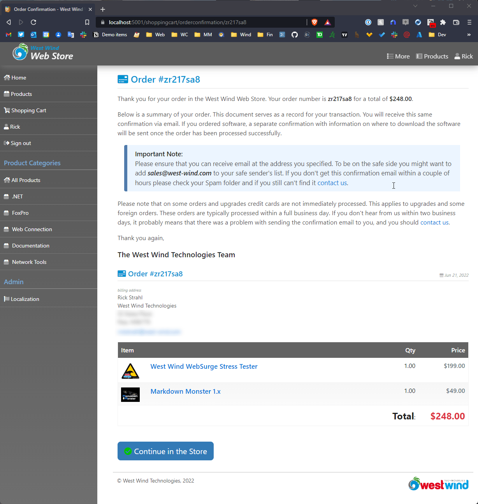
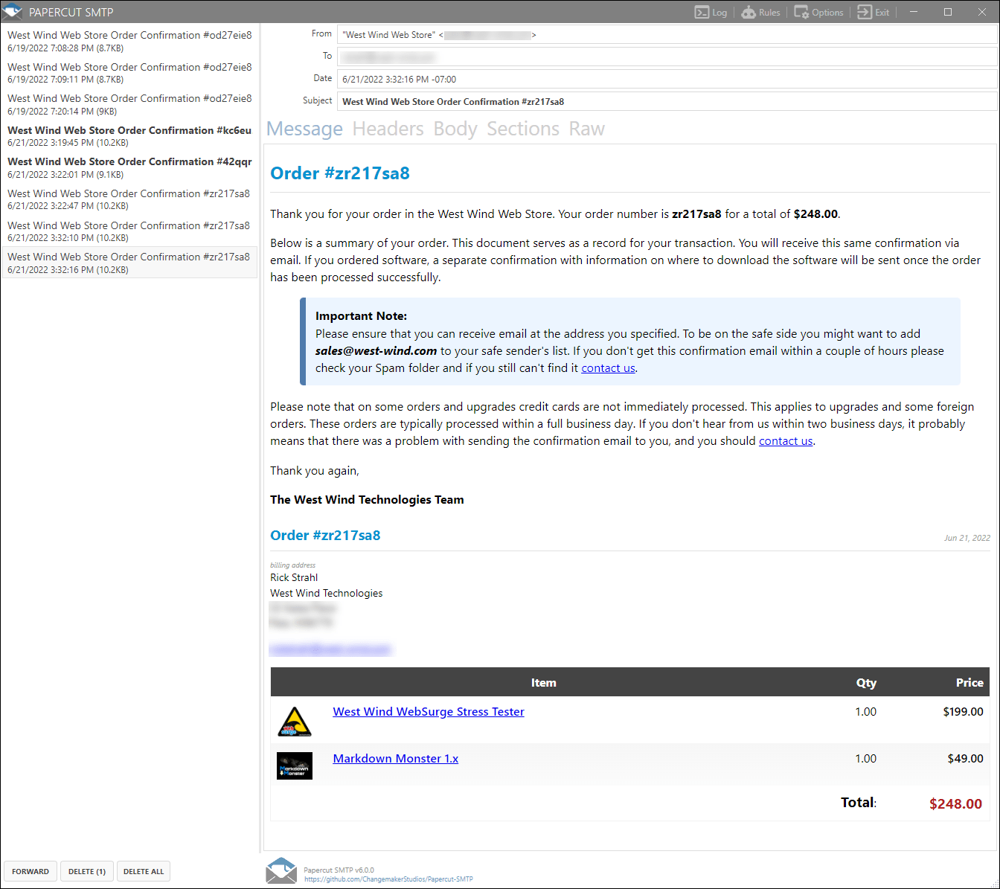

#  Back to Basics: Rendering Razor Views to String in ASP.NET Core


Many many moons ago I wrote a post that described how to [render Razor views to string in classic ASP.NET MVC](https://weblog.west-wind.com/posts/2012/May/30/Rendering-ASPNET-MVC-Views-to-String). It turns out that rendering views to string must be pretty common, because that post ended up being one of the most popular ones on the site for quite some time.

The most common scenario I have for 'template driven' **non-Web text output** is for emails of all sorts. Email confirmations and account verifications, order or receipt confirmations, status updates or scheduler notifications - all of which require merged text output both within and sometimes outside of Web application. On other occasions I also need to capture the output from certain views for logging purposes.

While it's certainly possible to create HTML (or non HTML) text output for sending emails or reporting in code, it's a heck of a lot easier and more maintainable to have that code in an easily editable text template, that can be easily edited and updated, potentially without requiring a recompile.

## How to capture Razor Output
The good news is that capturing Razor output to string **within the context of an ASP.NET Core application** is relatively easy to do. But the caveat is that this requires access to a `ControllerContext` and an active request, so the solution I describe here effectively **only works in the context of an active request in an ASP.NET Core application**.

##AD##

Without much further ado, here's the self-contained code to render a view to string:

```csharp
public static async Task<string> RenderViewToStringAsync(
    string viewName, object model,
    ControllerContext controllerContext,
    bool isPartial = false)
{
    var actionContext = controllerContext as ActionContext;
    
    var serviceProvider = controllerContext.HttpContext.RequestServices;
    var razorViewEngine = serviceProvider.GetService(typeof(IRazorViewEngine)) as IRazorViewEngine;
    var tempDataProvider = serviceProvider.GetService(typeof(ITempDataProvider)) as ITempDataProvider;

    using (var sw = new StringWriter())
    {
        var viewResult = razorViewEngine.FindView(actionContext, viewName, !isPartial);

        if (viewResult?.View == null)
            throw new ArgumentException($"{viewName} does not match any available view");
        
        var viewDictionary =
            new ViewDataDictionary(new EmptyModelMetadataProvider(),
                new ModelStateDictionary())
            { Model = model };

        var viewContext = new ViewContext(
            actionContext,
            viewResult.View,
            viewDictionary,
            new TempDataDictionary(actionContext.HttpContext, tempDataProvider),
            sw,
            new HtmlHelperOptions()
        );

        await viewResult.View.RenderAsync(viewContext);
        return sw.ToString();
    }
}
```
<small>*[code on GitHub](https://github.com/RickStrahl/Westwind.AspNetCore/blob/master/Westwind.AspNetCore/Views/ViewRenderer.cs)*</small>

Short and sweet. 

### Using the ViewRenderer
The code is surprisingly short, although finding the right combination of actions here is not exactly easy to discover. I had a bit of help from this [StackOverflow answer](https://stackoverflow.com/questions/40912375/return-view-as-string-in-net-core/40932984#40932984) which provides the base concepts. I used that code and distilled down into a more compact single methods that's more convenient to use without explicit service configuration.

To use the method is as simple as:

```cs
// inside of a Controller method
string confirmation = await ViewRenderer.RenderViewToStringAsync("EmailConfirmation", model, ControllerContext);
```

`EmailConfirmation` here is the name of a view **in the default View folder** for the current controller's `ActionContext` which is passed in as the 3rd parameter. So in my case I'm rendering a page called `EmailConfirmation` in my `ShoppingCart` controller and it finds the view in that same `ShoppingCart/OrderConfirmation.cshtml` file.

> #### @icon-warning View Path Resolution
> The way the ViewPath is resolved unfortunately is not very straight forward and doesn't quite work the same as it does for standard Views. So you can't use `~/` or even absolute paths. It appears only the following paths will resolve:
> 
> * Controller's default View folder
> * Shared folder
> * View relative paths ie `../SomeOtherViewFolder/MyView`
>
> For Razor Pages, the ActionContext is the single page running, and in that scenario the current page folder is used as the base.

### How it works
As said the code is surprisingly short given the functionality it provides for dynamic invocation and rendering of a view. 

The basic steps are:

* Finding the View
* Configuring the View's context
* Executing the view and capturing output into a `TextWriter`

The rendering method takes a view path, model and a controller context to retrieve the view using the active `RazorViewEngine` of the application. This is the globally registered ViewEngine that has all the configuration applied so it can find views using standard view naming formats. 

The view name **has to be specified without `.cshtml`** and follows the rules described in the side bar above. If the view is in a non-standard location you might have to experiment a bit to have the view engine find it.

The key item passed in is the `ControllerContext` which ties this functionality to the ASP.NET Core libraries and an actively running request. Using the context it's possible to get access to the other important dependencies such as the `HttpContext`, the `ActionContext` and - via the Service Provider - the `RazorViewEngine` and `TempDataProvider` all of which are required as part of the processing. In the code above the ServiceProvider is explicitly used to retrieve the required dependencies through DI.

The first thing that happens is retrieving the View from the `RazorViewEngine`. The view engine retrieves the View to process, assigns the `ActionContext` and sets whether it's a partial view or a top level view. Specifying top level automatically pulls in a Layout page if specified for example while a partial view processes just the current View.

Next a `ViewContext` is created which is then passed to the `View.RenderAsync(viewContext)`  to actually run the view and produce the result which is written into the the passed in `TextWriter`.

##AD##

### Rendering Views to String Considerations
Rendering is easy, but if you need to render to string and then use that content for use externally to the application, such as in an email there are some additional considerations you need to take into account.

Specifically, for rendering scenarios like output to email, you have to be careful about your **view dependencies**. 

For example, in my Order Confirmation email example it may seem tempting to use the main order confirmation Web page used on the site to confirm a completed order and just capture that to string with the View renderer. Here's what this page looks like:



While that page works on the Web, it can't be used **as is** for an email, as there are additional bits in the HTML output like the site chrome, dependencies on Bootstrap and FontAwesome, additional images etc.

Instead the email confirmation is a completely separate View that is a stripped down version of the full page (displayed here in the [PaperClip local SMTP server](https://www.papercut-smtp.com/):



The string rendered view looks very similar, but you can see it's a bit stripped down. There's no application chrome, no FontAwesome icons and the styling behind the scenes doesn't use Bootstrap and instead replaces the used styles with all inline CSS.

The self-contained view explicitly removes the Site Layout page and explicitly adds all needed CSS inline:

```html
<!--  EmailConfirmation.cshtml -->
@model OrderProfileViewModel
@{
    Layout = null;  // explicitly no layout page here!
    
    var config = wsApp.Configuration;
    string title =  "Order Confirmation - " + config.ApplicationName;
    var invoice = Model.Invoice.Invoice;
    var customer = Model.Customer;
}
<!DOCTYPE html>
<html>
<head>
    <title>@(title)</title>
    <meta name="viewport" content="width=device-width, initial-scale=1, maximum-scale=1">
    <style>
        html, body {
            font-size: 16px;
            font-family: -apple-system,BlinkMacSystemFont,"Segoe UI","Liberation Sans",sans-serif;
            line-height: 1.45;
        }
        .page-header-text {
            font-size: 1.52em;    
            color:  #0092d0;
            padding-bottom: 0.35em;
            margin-bottom: 0.6em;
            border-bottom: 1px solid #e1e1e1;
        }

   	/* all needed styles inline here */ 
   	
    </style>
</head>        
```

Then any links or references that are embedded in the page are fixed up with the application's full URL base path:

```html
<div class="d-flex" style="display: flex">
@if (!Model.NoItemImages) {
    <div style="max-height: 3em; max-width: 3em; min-width: 3em; margin-right: 1.7em; margin-top: 0.3em">
        
    </div>
}
	<div>
    <a href="@(wsApp.Configuration.ApplicationHomeUrl + "product/" + item.Sku)"
       class="lineitem-description d-block"></a>
    	@item.Description
    </a>
...
```

`ApplicationHomeUrl` is an application configuration value that specifies the full site root base path which typically is something like `https://store.west-wind.com/`.

Note that external images in email clients may or may not render initially depending on whether the email client (like Gmail, Outlook.com etc.) fixes up the image links with proxies, or doesn't render the images (Outlook desktop) unless explicitly allowed. In this case the images are *nice to have* but not a critical part so if they don't render it's not a big deal.

In general for string views I try to:

* Minimize or remove images
* Inline all CSS styles
* Explicitly make links absolute

Rarely is it possible to just reuse entire site views as is, so in most cases string rendered views are their customized views optimized for self-contained HTML output.

## Summary
So, rendering HTML views to string can be quite useful in creating content that needs to be somewhat self contained for common tasks like emails. It's easy to do inside of an ASP.NET Core application and works for MVC Views or Razor Pages.

Although you might be tempted to reuse existing views for string rendering, for most scenarios that involve sharing the HTML output externally from the application, you likely need to create separate views that are specifically set up to be self-contained. It's more work, but ultimately required for most scenarios.

I've found View string rendering useful in just about any application - it's one of those things that nobody thinks about until you end up needing to create HTML formatted emails or reports or otherwise sharing previously captured output.

Hopefully this View Rendering helper will be helpful to a few of you, given that its an easy drop-in component you can quickly plug into an existing application. 

No running with scissors... uh, razors, folks!

## Resources

* [Original Stackoverflow Post](https://stackoverflow.com/a/40932984/11197)
* [Full Source Code on GitHub]()
* [Part of Westwind.AspNetCore NuGet](https://www.nuget.org/packages/Westwind.AspNetCore/)


<div style="margin-top: 30px;font-size: 0.8em;
            border-top: 1px solid #eee;padding-top: 8px;">
    
    this post created and published with the 
    <a href="https://markdownmonster.west-wind.com" 
       target="top">Markdown Monster Editor</a> 
</div>