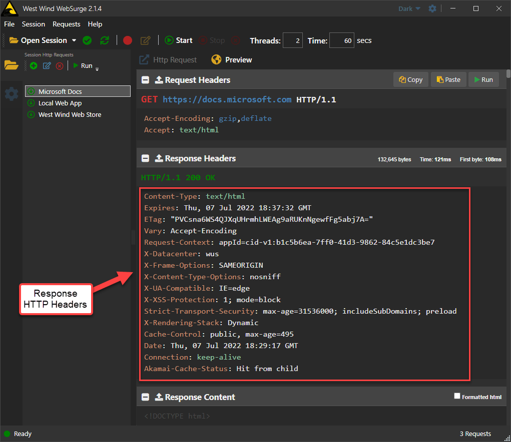
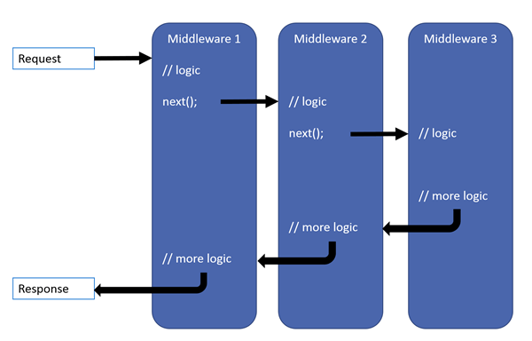

# Back to Basics: Custom HTTP Response Header Manipulation in ASP.NET Core


Custom HTTP Headers can be important in applications that need to explicitly manipulate headers either for system and security purposes, or for application specific messaging that provides app specific information to the caller which is not uncommon for API based implementations. For application headers, they are often used to communicate protocol or security information.

However the most common use case for custom headers most likely are special security headers that prevent malicious application high jacking and click jacking, which is something I ran into this recently in my custom online store application, which is why I'm working with this and writing about it now.  I ran afoul of some automated threat testing notices and needed to add some security related headers to every request.

## What are HTTP Headers?
HTTP headers are part of every HTTP request in both the request and response data. This post is specifically about the response data, but headers are both for request and response are always assigned as key value pairs. Keys are either a well-known key like `Content-Type` or `Cookie` which are used on generic HTTP requests and responses, or they can be completely custom values that are application specific. Although keys can be any name, typically the `X-` prefix is used for custom headers.

To see what headers look like, here's a full HTTP header Response from `https://docs.microsoft.com`:



You can see that this site uses a bunch of extra security headers (the various `X-` headers) plus a few custom application specific headers that are infrastructure specific.

I know nothing about the implementation of these headers on the Microsoft site, but it's very likely that most of these headers are added to **every request** on the site as part of the global application configuration.

##AD##

## Basic HTTP Header Manipulation in ASP.NET Core
Manipulating Response HTTP headers in ASP.NET Core is easy enough to do as part of a running HTTP request that has access to the `HttpContext.Response.Headers` collection. 

In any request, assuming you have an HttpContext in a Razor Page, API or Controller method, or even the new minimal APIs, you can easily access and manipulate headers:

```cs
public IActionResult HeaderMeThis()
{
   var headers = HttpContext.Response.Headers;
	
   // add headers	
   headers.Add("X-Frame-Options", "DENY");
   headers.Add("X-XSS-Protection", "1; mode=block");
   headers.Add("X-Content-Type-Options", "nosniff");
   headers.Add("Strict-Transport-Security", "max-age=31536000; includeSubDomains");

   // remove custom headers
   headers.Remove("X-Powered-By");
   headers.Remove("x-aspnet-version");
   
   ...
   
   return View();
}
```

You can add individual headers, or multi item headers, and remove headers that might already be in the request pipeline provided from the Web Server for example.

One specific example of headers to remove are the IIS headers that loudly shout what platform and tooling you're using which is both bandwidth wasteful and probably not a great idea from a security perspective.

> Headers - like the Form and QueryString collections - are implemented using a special StringCollection, which allows assign multiple values to a single key while also exposing overloads that let you set and retrieve single string values.

So far so easy, right?

## Custom Headers for every Request
Adding headers individually in each request is easy enough, but other than for application specific values or specific security features, you're more likely to want to **add headers to every single request** that the Web Server runs. The security headers shown above in particular are more likely than not to be set on every request.

I was surprised to find that ASP.NET Core doesn't appear to have any specific built-in way or middleware to set global headers, so while the process is easy enough, it's not immediately obvious where you can hook in to add your customer headers on every request.

I'm going to show two ways to do this:

* Using a generic Middleware handler (`app.Use()`)
* Using a small Middleware component (`app.UseCustomHeaders()`)

### Middleware
If Middleware is new to you, it's how ASP.NET Core incrementally builds functionality to process requests. Each piece of Middleware adds functionality and each of the Middleware components is chained together in a pipeline of handlers that execute in the order they were added until they reach the end or a terminating handler, and then reverse out in the opposite direction.

In effect, Middleware handlers allow you to intercept behavior before and after the terminating handler for each request. The terminating handler in most applications is a Razor Page, Controller Action, API Endpoint, Minimal API handler etc. - the operations that do the actual processing work. But most middleware that is configured in ASP.NET Core tends to be operational that handles 'system' tasks: Authentication, Static File handling, Live Reload Behavior, Error handling and so on.

##AD##

Here's is the quintessential middleware diagram from the Microsoft documentation that demonstrates this chaining process:



### Generic Middleware Hook
The simplest way you can add custom headers to every request response is by using a generic Middleware handler which uses `app.Use()`.

```csharp
app.Use((ctx, next) =>
{
   var headers = ctx.Response.Headers;

   headers.Add("X-Frame-Options", "DENY");
   headers.Add("X-XSS-Protection", "1; mode=block");
   headers.Add("X-Content-Type-Options", "nosniff");
   headers.Add("Strict-Transport-Security", "max-age=31536000; includeSubDomains; preload");

   headers.Remove("X-Powered-By");
   headers.Remove("x-aspnet-version");
   
   // Some headers won't remove
   headers.Remove("Server");

   return next();
});
```

The generic Middleware handler can be injected anywhere in the pipeline and as shown above can fire before the request is sent (as shown in the code above) or after which could be placed after a call to `var taskResult = await next()`. Here we want to inject the headers before the request runs. 

For adding headers you pretty much can inject this code anywhere. if you're removing headers you want to make sure that the headers you might need to remove have been added by some other middleware, so I would generally recommend you add the `app.Use()` before the main processing handler.

This code is simple and gets the job done:

```http
Content-Type: text/html; charset=utf-8
Content-Length: 79220
Date: Wed, 06 Jul 2022 20:39:06 GMT
Server: Kestrel
Transfer-Encoding: chunked
X-Frame-Options: DENY
X-XSS-Protection: 1; mode=block
X-Content-Type-Options: nosniff
Strict-Transport-Security: max-age=31536000; includeSubDomains
```

You can see that the security headers have been added and they will now show up on every request made to the server.

> Note that base headers like `Content-Type` or `Server` can't be removed because ASP.NET Core adds them as part of the request processing (in my case a Controller Action), but it depends on when the the application generates the headers. You may however be able to remove the headers as part of an actual request handler (ie. Controller Action, API endpoint, Razor Page etc.)


#### Middleware Positioning Matters!
Note that positioning of this middleware matters as certain handlers are **terminating handlers**. For example, if you want headers to apply to static files as well as controller/minimal API endpoints, you need to run the middleware **before** the relevant terminating handler.

For example, if you place the middleware after the `StaticFiles()` middleware, none of the static files receive the header updates, because the Static File middleware is terminating and never hits the custom headers code. This may actually be desirable in some cases where you really only want it to fire on requests that you generate yourself and not on plain static content.

> #### @icon-warning Check Custom Headers in Responses
> Once you add CustomHeaders generically via middleware, **make sure you check responses for various file formats** to ensure you're getting the headers into all the requests you're expecting them to go into!

#### Middleware runs on every Requests
Because middleware fires for **every request that comes through the server** you can also add logic to determine whether the headers you serve actually need to be provided. You can apply some processing logic based on the request type to decide whether you need to add headers or not. 

Unfortunately it's not easy to determine what output you're dealing with as `Response.ContentType` most likely will not be set by the time your middleware fires, so you may have to examine the `Request.Path` to figure out whether the headers apply or not.

### Create a CustomHeaders Middleware Component
The code above works just fine, but if you'd rather have a more integrated solution that doesn't require direct manipulation of headers you can use the following small middleware implementation instead.

Here's the middleware component ([code on Github](https://github.com/RickStrahl/Westwind.AspNetCore/blob/master/Westwind.AspNetCore/Middleware/CustomHeadersMiddleware.cs)):

```csharp
public class CustomHeadersMiddleware
{
    private readonly RequestDelegate _next;
    private readonly CustomHeadersToAddAndRemove _headers;


    public CustomHeadersMiddleware(RequestDelegate next, CustomHeadersToAddAndRemove headers)
    {
        if (next == null)
        {
            throw new ArgumentNullException(nameof(next));
        }
        _next = next;
        _headers = headers;
    }

    public async Task Invoke(HttpContext context)
    {
        foreach (var headerValuePair in _headers.HeadersToAdd)
        {
            context.Response.Headers[headerValuePair.Key] = headerValuePair.Value;
        }
        foreach (var header in _headers.HeadersToRemove)
        {
            context.Response.Headers.Remove(header);
        }

        await _next(context);
    }
}

public class CustomHeadersToAddAndRemove
{
    public Dictionary<string, string> HeadersToAdd = new();
    public HashSet<string> HeadersToRemove = new();
}
```

This middleware works on a pre-set set of headers to add and remove and internally adds/remove them to and from the HTTP response before calling the next handler in the middleware pipeline.

##AD##

The second bit is the middleware hookup extension methods to allow you to use `app.UseCustomHeader()` from the configuration:

```csharp
public static class MiddlewareExtensions
{
    /// <summary>
    /// Enable the Customer Headers middleware and specify the headers to add and remove.
    /// </summary>
    /// <param name="builder"></param>
    /// <param name="addHeadersAction">
    /// Action to allow you to specify the headers to add and remove.
    ///
    /// Example: (opt) =>  opt.HeadersToAdd.Add("header","value"); opt.HeadersToRemove.Add("header");</param>
    /// <returns></returns>
    public static IApplicationBuilder UseCustomHeaders(this IApplicationBuilder builder, Action<CustomHeadersToAddAndRemove> addHeadersAction)
    {
        var headers = new CustomHeadersToAddAndRemove();
        addHeadersAction?.Invoke(headers);

        builder.UseMiddleware<CustomHeadersMiddleware>(headers);
        return builder;
    }
}
```

This code extends the startup `ApplicationBuilder` and lets you specify the headers to add or remove via an object:

```cs
// in program.cs or `Startup.Configure()`
app.UseCustomHeaders((opt) =>
{
    opt.HeadersToAdd.Add("X-Frame-Options", "DENY");
    opt.HeadersToAdd.Add("X-XSS-Protection", "1; mode=block");
    opt.HeadersToAdd.Add("X-Content-Type-Options", "nosniff");
    opt.HeadersToAdd.Add("Strict-Transport-Security", "max-age=31536000; includeSubDomains");

    opt.HeadersToRemove.Add("X-Powered-By");
    opt.HeadersToRemove.Add("x-aspnet-version");
});
```

This doesn't necessarily reduce the code over the `Use()` case :grin:, but the signature makes it very explicit what this code is doing and it's consistent with other middleware configuration.

## More Header Addition Options
The ways described above are common ways to handle local and global header, but it's not the only way that you can get headers into requests.

## Controller Events or Filters
If you need to create controller specific headers that are applied to every controller action, you can use the the `OnActionExecuting` handler of a an MVC or API Controller, or `ActionFilter`. 

This allows you to specifically target a controller to use specified headers rather than every request in an application. This might actually be useful in API or MVC applications to avoid embedding headers into static files like images, css etc. that may not need it. 

## Web Server Global Headers
Another way to add headers globally is by using your Web Server's configuration to add headers.

For example if you host on IIS you can place headers to add and remove in `web.config`:

```xml
<configuration>
	<system.webServer>
		<httpProtocol>
			<customHeaders>
				<add name="X-Frame-Options" value="DENY" />
				<add name="X-XSS-Protection" value="1; mode=block" />
				<add name="X-Content-Type-Options" value="nosniff" />
				<add name="Strict-Transport-Security" value="max-age=31536000; includeSubDomains" />
				
				<remove name="X-Powered-By" />
				<remove name="x-aspnet-version"/>
			</customHeaders>
		</httpProtocol>
	</system.webServer>
</configuration>	
```

Similar options are available for most other Web Servers as well. 

This approach is probably the most efficient as it offloads the header processing entirely onto the Web server which is optimized for it. However, it externalizes the configuration which is often undesirable especially with ASP.NET's new configuration in code paradigm.

## Summary
So, choice is good. You've got a lot of options with what works best for your application environment. You can choose from:

* Individual Requests with `Response.Headers.Add()`
* Generic Middleware with `app.Use()`
* Custom Middleware Handler 
* MVC or Controller Filter `OnActionExecuting` Handler
* Web Server Global Headers

Ready to head on out...


<div style="margin-top: 30px;font-size: 0.8em;
            border-top: 1px solid #eee;padding-top: 8px;">
    
    this post created and published with the 
    <a href="https://markdownmonster.west-wind.com" 
       target="top">Markdown Monster Editor</a> 
</div>