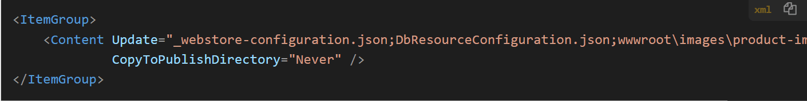

# Keeping Content from Publishing with WebDeploy in ASP.NET Core Web Applications



I've run into issues with keeping files from publishing with WebDeploy on numerous occasions. When working with large projects it's not uncommon to have some files that you might use during development but shouldn't be sent to the server when published. In my case I'm working on upgrading a legacy application that has an `product-images` folder that is updated on the site from administrative image uploads. Locally I need this folder to be filled but on the remote site there may be updates to this folder so I don't want to publish it to the server. 

I mentioned a workaround in [my previous post by storing the images in another location](https://weblog.west-wind.com/posts/2022/Aug/23/Mapping-Multiple-Static-File-Folders-in-ASPNET-Core) rather than in the application folder and mapping the Static Files provider to the alternate location. While this works it also adds some additional configuration requirements, an extra external folder to manage etc. For the time being using the in-app-folder is a better solution.

##AD##

## Publishing with WebDeploy
There are a couple of ways to use WebDeploy with .NET Projects:

* Using Visual Studio Publish
* Using `dotnet publish`

Both rely on a Publish Profile `.pubxml` file that describe the server, Web site and a number of operational settings that determine how files are copied. There are also other tasks that can be performed like running database migrations, handling file transforms and more.

Here's what a basic `.pubxml` file looks like:

```xml
<!-- file is located in `Properties/PublishProfiles -->
<Project ToolsVersion="4.0" xmlns="http://schemas.microsoft.com/developer/msbuild/2003">
    <PropertyGroup>
        <WebPublishMethod>MSDeploy</WebPublishMethod>
        <MSDeployServiceURL>https://mysite.com</MSDeployServiceURL>
        <DeployIisAppPath>store.mysite.com</DeployIisAppPath>
        <ExcludeApp_Data>false</ExcludeApp_Data>
        <RemoteSitePhysicalPath/>
        <SkipExtraFilesOnServer>true</SkipExtraFilesOnServer>
        <EnableMSDeployBackup>true</EnableMSDeployBackup>
        <_SavePWD>true</_SavePWD>
        <SelfContained>false</SelfContained>
        <_IsPortable>true</_IsPortable>
        <LastUsedBuildConfiguration/>
        <LastUsedPlatform/>
        <SiteUrlToLaunchAfterPublish/>
        <LaunchSiteAfterPublish>true</LaunchSiteAfterPublish>
        <TargetFramework>net6.0</TargetFramework>
        <MSDeployPublishMethod>RemoteAgent</MSDeployPublishMethod>
        <EnableMsDeployAppOffline>true</EnableMsDeployAppOffline>
        <UserName></UserName>

    </PropertyGroup>
</Project>
```

## Keeping Files from Publish: Should be easy, but...
... it's confusing, because there are a lot of similar sounding options to control what and where files are output to. The problem is that MSBUILD which is used to create the publish and WebDeploy processing has a ton of different ways to affect file processing for publishing but also for content.

You can control settings with:

* Web Deploy Publish Files using `<ExcludeFoldersFromDeployment>` and `<ExcludeFilesFromDeployment>` *(doesn't work currently for dotnet core projects!)*
* Project Content Items and `CopyToOutputDirectory`
* Project Content Items and `CopyToProjectDirectory`

## WebDeploy Publish Files and `<ExcludeFoldersFromDeployment>` and `<ExcludeFilesFromDeployment>` don't work
In the past I've used these settings to keep files from publishing, but it appears that in recent versions of .NET Core's processing these exclusion tags are not being respected when they are used in a `.pubxml` file.

The following does not work for me in any of my .NET Core projects when publishing from Visual Studio or via `dotnet publish` (assuming no other publish specific settings are made):

```xml
<Project>
    <PropertyGroup>
        ...
        <!-- Grrrr: these don't work!  -->
        <ExcludeFilesFromDeployment>
            _webstore-configuration.json;DbResourceConfiguration.json;wwwroot\admin\cclog.txt;wwwroot\admin\applicationlog.txt;
        </ExcludeFilesFromDeployment>
        <ExcludeFoldersFromDeployment>
            wwwroot\images\product-images
        </ExcludeFoldersFromDeployment>
    </ProjectGroup>
</Project>
        
```

Initially I had tried to use these settings in my WebDeploy `.pubxml` publish settings file, which are **supposed to exclude and files** but I couldn't make this work. 

I have seen this work, but I tried this on a couple of production projects and noticed that in none of them the files specified are getting excluded.

The likely reason for this is that the .pubxml file is actually an injected MSBuild task, and apparently that task is injected into the .NET project publish process. .NET projects have a huge number of default settings and it looks like those settings from the .pubxml file that relate to exclusion might not execute at the correct time. 

Luckily it turns out that the settings that likely are the reason for this **can be set directly in the `.csproj` file**.

## Using `.csproj` Content Exclusions
Since that didn't work I needed another solution. My first attempt was [to externalize images as mentioned in my previous post](https://weblog.west-wind.com/posts/2022/Aug/23/Mapping-Multiple-Static-File-Folders-in-ASPNET-Core), which moves the `product-images` folder to a separate location outside of the project root. Not surprisingly that works since the folder then is no longer part of the project. 😜

However, I wasn't giving up on the in-app solution of excluding files and folders just yet. 

As it turns out, .NET Core SDK projects have support for `<ItemGroup>` content that's used to specify if, and how content is copied into the output folder or for publishing. I was unaware you could specify a file specifically for copying for **publishing** rather than for the output folder, mainly because IDEs don't show that option.

Ready for combinations of settings?

You can specify whether a file can be specified as:

* **Content** - intended for files that are copied to output
* **None** - Files that aren't copied
* **Compile** - Files that are compiled or otherwise processed

Unfortunately it's not that simple - there are additional options that can be applied in combinations to each of those attributes and the options actually determine the actual behavior, while the descriptions above feel more like generalist descriptions.

There are project inclusion option attributes (which specify the project relative filename or glob):

* **Include**  
Forces a file to be included in the project when it otherwise wouldn't have been. Can also be used to set overridden behavior.
* **Update**  
Overrides stock behavior.

* **Remove**  
Removes the file from the project list so it's not visible in IDEs. You can still specify other options to copy though although that would be weird.

Examples: 

```xml
<Content Remove="_temporaryFile.txt" />
<Content Include="pingo.exe" CopyToOutputDirectory="CopyIfNewer" />
```

There output copying options:

* **CopyToOutputDirectory**  
Copies files to the Output directory. Note that Output and Publish are different. Output is the intermediate folder, but it's also used to run the application with `dotnet run` or from within IDEs.

* **CopyToPublishDirectory**

and then values that can be set on those:

* **Never**
* **PreserveNewest**
* **CopyAlways**

Are you confused yet? Yeah me too, because all of these designations have wicked behavior overlap.

## What Works: CopyToPublishDirectory=Never
Let me spare you all of my false attempts of combinations, and show you what worked. 

The following settings address this scenario I described above:

* Be able to run application locally with files that are to be excluded for publish
* Not publish excluded files to server when published 

The key thing is being able to run locally with `dotnet run` or from IDEs, yet when publishing removing the files in `product-images` and some of the configuration files that should not be updated on the server.

The following was the only thing that worked for me in this scenario:

```xml
<ItemGroup>
    <Content Update="_webstore-configuration.json;DbResourceConfiguration.json;wwwroot\images\product-images\**\*"
             CopyToPublishDirectory="Never" />
</ItemGroup>
```

Specifically this means:

* The item is a content item
* We want to override behavior that might have been previously assigned
* Allow copying to Output Directory
* Do not copy to Publish Directory (and hence don't publish with WebDeploy)

And sure enough that does the trick!

##AD##

I had previously gone through **all the combinations of using `CopyToOutputDirectory`** but I totally missed the availability of `CopyToPublishDirectory`. The subtle difference between these allows the local app when running with `dotnet run`, `dotnet watch run` or via Debugger in Visual Studio or Rider to have the excluded files available, but **not have those files published to the server via WebDeploy**.

If you want to **always exclude the files** - even in local development operation, then you should use `CopyToOutputFolder` instead of `CopyToPublishFolder`.


## Summary
MSBuild and the abstractions built on top of it are crazy complicated and while overall I think the .NET SDK team has done a pretty amazing job paring down that complexity to something very lightweight and usable, it does have it warts when you need to deal with more uncommon scenarios as it relates to obscure or heavily overloaded settings.

As is often the case the solution to the problem is tantalizingly simple - in this case the use of `CopyToPublishDirectory=Never` - but figuring out that magic incantation is locked away behind a fog of complexity and lack of documentation. To be fair even if documentation was better I'm not sure how you would find this other than something like a very specific blog post like this. As helpful as this might be (I hope so) it's not very likely to be the first place you land to find a solution to this problem.

Well, I did my part, so i may find this in the future when for the millionth time I decide I need to exclude a file from my project. Now exclude me, please... :smile:

## Resources

* [SDK Project Publish Notes from Microsoft (Microsoft.NET.Sdk.Publish)](https://github.com/dotnet/sdk/tree/main/src/WebSdk)
* [Default Content Globs (via EnableDefaultContentItems default)](https://github.com/dotnet/sdk/blob/main/src/RazorSdk/Sdk/Sdk.Razor.StaticAssets.ProjectSystem.props#L28)

<div style="margin-top: 30px;font-size: 0.8em;
            border-top: 1px solid #eee;padding-top: 8px;">
    
    this post created and published with the 
    <a href="https://markdownmonster.west-wind.com" 
       target="top">Markdown Monster Editor</a> 
</div>