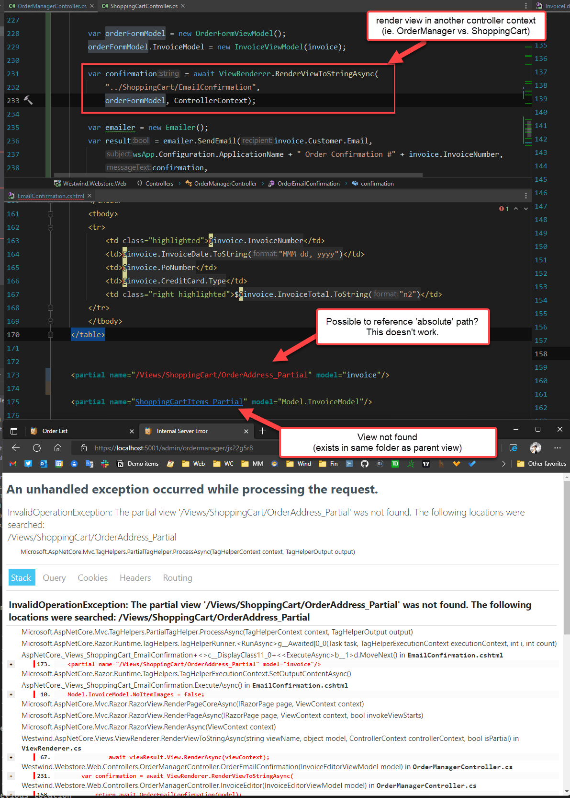
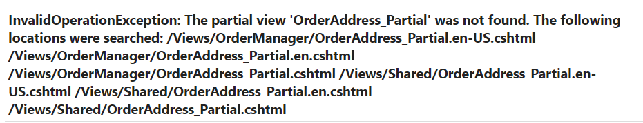
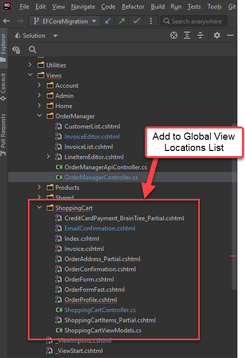

# ASP.NET Core MVC Views not Resolving Partials Views outside of the default ControllerContext


I recently ran into a problem with ASP.NET Core MVC views where rendering a view in a Controller Context other than the originally designed context. The scenario is the following:

* I have a `EmailConfirmation` View that's rendered as part of a `ShoppingCartController`
* The View renders fine when called from `ShoppingCartController`
* I'm also calling the `EmailConfirmation` View in my `OrderManagerController`
* The View fails to resolve non-pathed Partials referenced when rendered from `OrderManagerController`

When I try to render the `EmailConfirmation` from the non-default `OrderManagerController`, I run into View resolution problems:



I'm trying to render a view from the OrderManager controller, but calling into the `ShoppingCart` Views folder. What happens is that the main view resolves properly using the relative pathing - `../ShoppingCart/EmailConfirmation.cshtml` - but this view then fails to find the `ShoppingCartLineItems_Partial.cshtml` view which lives in the same folder as the ShoppingCart View folder.

This sure seems like it should be able to resolve, but alas it doesn't.

##AD##

## A little more Detail: Child Views Not Found
In my case I'm rendering a view to a string using a [ViewRenderer I described in a recent post](https://weblog.west-wind.com/posts/2022/Jun/21/Back-to-Basics-Rendering-Razor-Views-to-String-in-ASPNET-Core):

```cs
var orderFormModel = new OrderFormViewModel();
    orderFormModel.InvoiceModel = new InvoiceViewModel(invoice);

    
    var confirmation = await ViewRenderer.RenderViewToStringAsync(
        // this view in an 'external' context
        "../ShoppingCart/EmailConfirmation",
        orderFormModel, this.ControllerContext);

    
    var emailer = new Emailer();
    var result = emailer.SendEmail(invoice.Customer.Email,
        wsApp.Configuration.ApplicationName + " Order Confirmation #" + invoice.InvoiceNumber,
        confirmation,
        "text/html");
```

The `EmailConfirmation.cshtml` View lives in the `Views/ShoppingCart` folder and it contains references to child views that live in the same `ShoppingCart` View folder. They are referenced as 'same folder' partials without any path reference, ie. assumed to be in the same path as the parent View:

```html
<partial name="OrderAddress_Partial" model="invoice"/>
    
<partial name="ShoppingCartItems_Partial" model="Model.InvoiceModel"/>
```

The `EmailConfirmation` View works fine when rendered as part of the `ShoppingCartController`, but fails when rendered here as part of the `OrderManagerController`.

The difference here is that in the `OrderManagerController` the `ControllerContext` is not the same as the original rendered from within `ShoppingCartController`.

When this renders it fails with this View resolution error:



Just to be sure that this isn't just an issue with the string ViewRenderer, I also tried just rendering the View directly as an ActionResult:

```cs
 return View("~/Views/ShoppingCart/EmailConfirmation.cshtml", orderFormModel);
 
 // or
 return View("../ShoppingCart/EmailConfirmation", orderFormModel);
```

Either of these produce the exact same error result with missing Views. In short, when rendered from `OrderManagerController` - ie. not the 'declared' controller that matches the View folder, **path resolution to a 'local' child View fails**.

Yuk!

## Fixing Cross Referenced View Dependencies
To be clear IMHO this behavior is a bug. 

**Locally referenced Views should always be able to resolve a local to the parent View path and find dependencies in the same View folder as the parent.**

Realistically, any relative paths should be able to resolve **relative to the View** and not only relative to the `ControllerContext`. Not doing so seems just plain unintuitive and weird, and if I'm not mistaken that used to work just fine in classic MVC.

There are a couple of ways to work around this issue:

* Move 'external' referenced component to the `Shared` folder
* Using Absolute View Paths for Child Views
* Adding the Path to the Global View Folder List

Neither of these solutions are great because they are essentially band-aids around a bigger problem, but they allow you to work around the problem and get shit done. Let's take a look.

### Use the Shared Folder for 'shared' Views
MVC (and RazorPages) contains a `Views/Shared` folder specifically to house components that are shared across Controllers and View locations. If you have components that are shared across multiple Controllers or Pages, it makes sense to store these shared components in a common location where they can be easily found and re-used. You can use the Shared folder, or as I show later, you can add additional view location folders where Razor looks to resolve View paths.

While using the Shared folder would work, in my scenario that would be pretty ugly as there actually 5 different components that are specifically associated with the ShoppingCart. The `EmailConfirmation` just happens to use several of these components so while this is an option, it would be a really ugly solution in this scenario. 

Also if you have multiple levels of nesting (which I don't but is possible) this can get ugly to try to figure out all the things that have to go to the sharing folder.

That said, for self-contained and truly global components, using the `Shared` folder is an easy and outright supported way to work around the problem described above.

### Using Absolute Pathing in Child Views
Another solution is to use **an absolute View Path** to reference the child views in the shared parent view. 

My original View definition in `EmailConfirmation.cshtml` uses local relative paths (ie. no extra path) to reference the Views and that doesn't work with the external `ControllerContext`:

```html
<partial name="OrderAddress_Partial" model="invoice"/>
    
<partial name="ShoppingCartItems_Partial" model="Model.InvoiceModel"/>
```

But I can reference these views using absolute pathing and that **does work**:

```html
<!-- Important: .cshtml extension is required -->
<partial name="~/Views/ShoppingCart/OrderAddress_Partial.cshtml" model="invoice"/> 
    
<partial name="/Views/ShoppingCart/ShoppingCartItems_Partial.cshtml" model="Model.InvoiceModel"/>
```

> #### @icon-warning .cshtml Extension required for Absolute Paths
> Note the inconsistency: When using relative paths no extension is needed, but **when using absolute paths the `.cshtml` extension is required**. If you leave out the `.cshtml` with the absolute path the View is not found.

This works, and it's a quick fix that just works albeit an ugly one. 

Hard coding Views makes the markup a little harder to read, and potentially breaks the View if you move it to a different View folder. But there's very little downside to this solution other than aesthetic aspect so for a low impact quick solution this one works great.

##AD##

### Adding the View Folder to the Global View Folder List
The final approach lets you keep your views as they are defined, but requires a little more setup. This solution extends the shared folder list where Razor looks for Views via the Global View Locations list. Folders added to this list then behave in a similar way the `Shared` folder behaves with all Views in the folder available.

So, in my case I want to add the `ShoppingCart` folder to my Global View Locations list so Views in that folder can be found:



This isn't difficult to do by any means, but yet another one of these frustrating  features that **are not discoverable** or obviously configurable via a simple options setting.

To add your View Folder to the Global View Locations List you have to:

* Create a custom `ViewLocationExpander`
* Add it to the list of existing ViewLocationExpanders
* Hook up the newly created ViewExpander into the RazorConfiguration pipeline


#### Create a ViewLocationExpander
The first step is to create the ViewLocationExpander based on `IViewLocationExpander`:

```cs
/// <summary>
/// Add custom View Locations:
/// * ShoppingCart folder - so Confirmations can find dependent views
/// </summary>
public class ViewLocationExpander: IViewLocationExpander {

    public IEnumerable<string> ExpandViewLocations(
        ViewLocationExpanderContext context, 
        IEnumerable<string> viewLocations) 
    {
        //{2} area, {1} controller,{0} action - all actions in folder
        string[] locations = new string[] { "/Views/ShoppingCart/{0}.cshtml"};
        return viewLocations.Union(locations);
    }

    public void PopulateValues(ViewLocationExpanderContext context) {
        context.Values["customviewlocation"] = nameof(ViewLocationExpander);
    }
}
```

> #### @icon-warning Add new Locations to the End of the ViewLocations List
> You probably want to make sure you add the custom paths **to the end of the existing ViewLocation list** to avoid possible naming conflicts. 
>
> I made the mistake of adding to the beginning of the list and ran into problems with `Index.cshtml` now always resolving to the `ShoppingCart/index.cshtml` rather than the local path first - it took a minute to try and figure out why an index view for home was requiring a `ShoppingCartViewModel` :smile: 
>
> Add to the end unless you explicitly need to have files override existing resolution and you're sure that the Views in the added folder don't match other View names.


#### @icon-warning Caution: Watch for View Conflicts when Adding Paths 
When you add paths that point at existing View folders rather than specific folders be aware that you can get odd side-effects with View resolution.

For example, if your added path has an in `index.cshtml` view, that View will now fire on any unresolved view - and likely give you unexpected Invalid Model type errors. The same applies to any other name overlaps so be careful. 

Another tip if you share a 'standard' folder: Possibly rename your `index.cshtml` to something else to avoid the potential of falling through to the index view which is the most common problem. For example in my ShoppingCart renaming `index.cshtml` to `shoppingcart.cshtml` works to ensure that `index.cshtml` is triggered for another controller.

An alternative to avoid this, might be to **explicitly add individual views** that should be shared instead of `{0}.cshtml`.

##AD##

#### Hooking up the ViewLocationExpander
You then need to hook it up as part of the ASP.NET Application service configuration. There are two ways that you can do this:

```cs
services.AddControllersWithViews()
    .AddRazorOptions(opt =>
    {
        // Add ShoppingCart View Folder to Shared list
        opt.ViewLocationExpanders.Add(new ViewLocationExpander());
    })
```

or you can use the free-standing code outside of the MVC Controller configuration:

```cs
services.Configure<RazorViewEngineOptions>(options => {
    // Add ShoppingCart View Folder to Shared list
    options.ViewLocationExpanders.Add(new ViewLocationExpander());
});
```

Personally I prefer the first one if using MVC Controllers. The second scenario might be useful if you're using View discovery for Razor Pages in arbitrary folders.

## It works!
All three of these solution let you get around the issue of shared child views not resolving. In my Web Store application I opted for the ViewLocations approach because it allows me to leave the Views as is without introducing 'hardcoded' View paths which I prefer. But both of the other solutions are good options, although I would leave the `Shared` folder solution for truly shared, global components. If you've gone the `ViewLocationExpander` route it's now easy to start adding additional folders to the list as well, so it's easy to segregate functional behavior without a big mess of files all piled into `Shared`. 

For one-off scenarios 'hard coded paths' is by far the easiest, while the Global ViewLocation solution is the cleanest, provided you don't have any View naming conflicts in the folder added.

**At the end of the day I wish that ASP.NET Core MVC would just handle relative paths as expected when rendering child views. The behavior as is that is dependent on the ControllerContext is very unexpected. Rather MVC should be able to resolve Views in the same folder as the Parent View regardless of the ControllerContext used to render the top level View.**

The workarounds for this issue are easy enough - once you know of the options. The absolute path solution is problematic because of the quirk that the `.cshtml` extension is required - I tried this initially and didn't think it worked because **I didn't put the extension on**. The ViewLocations solution is easy and clean, but difficult to discover unless you know what you're looking for - without an example, you'd have no idea how to do this, and the official ASPNET documentation doesn't have an example that I could find. You have to dig into StackOverflow or blog posts that cover this - and hell, now there's one more of those :smile:...


<div style="margin-top: 30px;font-size: 0.8em;
            border-top: 1px solid #eee;padding-top: 8px;">
    
    this post created and published with the 
    <a href="https://markdownmonster.west-wind.com" 
       target="top">Markdown Monster Editor</a> 
</div>