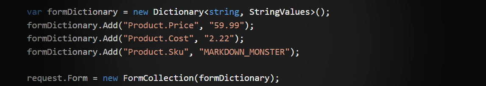

# Testing HttpRequest.Form Variables in Unit Tests for ASP.NET Core Components



Here's a quick post I'm leaving here as a note to self on how to create an `HttpContext` and associated `Request.Form` collection that can be tested in a Unit test. While working on a small helper component ([FormVariableBinder](https://github.com/RickStrahl/Westwind.AspNetCore/blob/master/Westwind.AspNetCore/Utilities/FormVariableBinder.cs) and  [related Tests](https://github.com/RickStrahl/Westwind.AspNetCore/blob/master/Westwind.AspNetCore.Tests/FormVariableBinderTests.cs)) I needed to set up a test to retrieve `Request.Form` variables to verify my binder is working.

In the ASP.NET past, creating a writable `Request.Form` instance was a pain, but thankfully this is a lot easier in ASP.NET Core, which has many base abstractions and default helper implementations that can be used for testing. Finding the required information though was a bit of a drag as I ran into a lot of old, outdated posts about classic ASP.NET/MVC rather than ASP.NET Core. There are a few StackOverflow posts that point at the solution but it took a few misfires before getting to [the right solution](https://stackoverflow.com/a/66536517/11197).

The process to create a new `HttpRequest` instance and attach a new `FormCollection` is pretty straight forward:

```csharp
public HttpRequest GetRequest()
{
    var httpContext = new DefaultHttpContext();
    var request = httpContext.Request;

    var formDictionary = new Dictionary<string, StringValues>();
    formDictionary.Add("Product.Price", "59.99");
    formDictionary.Add("Product.Cost", "2.22");
    formDictionary.Add("Product.Sku", "MARKDOWN_MONSTER");

    request.Form = new FormCollection(formDictionary); 
    return request;
}
```

As is the case with many `HttpContext` related objects, you can't directly instantiate `HttpRequest` so it has to be created as part of an `HttpContext` instance. To help with testing there is a `DefaultHttpContext()` class that **can be** instantiated and that includes all the relevant intrinsic object references, including  the `Request` object relevant for my `FormVariableBinder` testing.

##AD##

Once the `HttpRequest` is created I can now use it to access the newly created `Form` collection to set and access values on the collection in a test:

```csharp
[TestMethod]
public void RequestTest()
{
    var request = GetRequest();

    Assert.AreEqual(request.Form["Product.Sku"],"MARKDOWN_MONSTER");
    Assert.AreEqual(request.Form["Product.Price"], "59.99");
    Assert.AreEqual(request.Form["Product.Cost"], "2.22");

}
```

Sweet.

### Also works in a Full ASP.NET Core Application
Incidentally you can also use this approach for **modifying in flight HTTP requests** in an actual ASP.NET Core application. While that scenario is very rare, I've  needed to do this on a few occasions. 

Because the Request.Form collection is not writable by default, you can replace the existing `FormCollection` by copying the old collection, modifying the dictionary and creating a new `FormCollection`.

Here's what that looks like in an active request:

```csharp
// Update the Form Collection
var dict = new Dictionary<string, StringValues>(Context.Request.Form);
dict.Add("NewKey","NewValue");
var formCol = new FormCollection(dict);
Request.Form = formCol;

// Retrieve the new value added
var newVal = Context.Request.Form["NewKey"].ToString();
```

You can add, update and remove keys as needed, just make sure you do it before the Form collection is accessed in the request. 

This is an uncommon scenario but I've run into several situations - especially with custom binders - where overwriting or removing values from the Form collection can be useful.

## Summary
Nothing to see here - this isn't anything new, but I'm leaving it here so I can find it again in the future. Searching for this ended up a version quagmire, as old ASP.NET MVC classic content was showing up at the top of the search lists that I ran into. I ended up looking at a few *wrong number* posts before finding what works in ASP.NET Core.

Maybe some of you will also find this useful to get to this simple solution a little bit quicker...

<div style="margin-top: 30px;font-size: 0.8em;
            border-top: 1px solid #eee;padding-top: 8px;">
    
    this post created and published with the 
    <a href="https://markdownmonster.west-wind.com" 
       target="top">Markdown Monster Editor</a> 
</div>