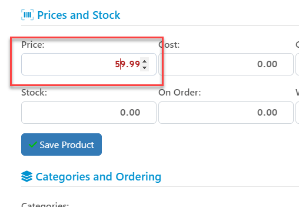
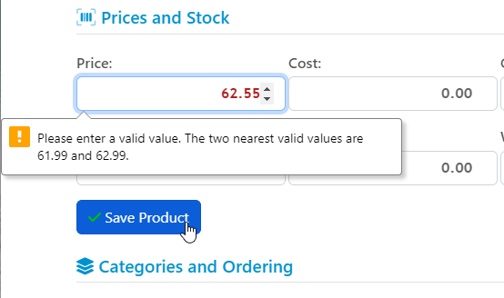
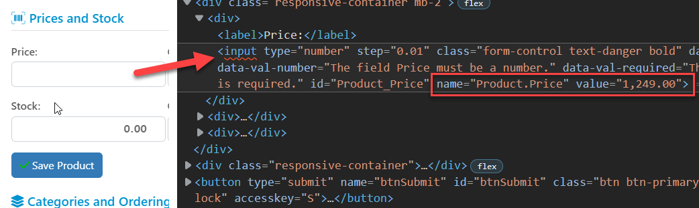
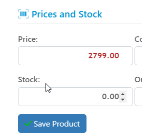

# Working with `Input type=number` in ASP.NET Core Views and Pages
Another day another struggle with the dreaded default HTML input control behaviors - this time with the HTML Number control using `<input type="number" />`. There's nothing straight forward about any of the stock HTML controls, if you want to do anything slightly off the simplest thing possible and the number control is no exception.

My recent battle started when I was working with a set of HTML input controls in ASP.NET Core MVC Views and trying to bind decimal values with up to two decimals values to an input control.

It's a number, so it should be simple enough if we use a number field, right? Right??? 

Of course the answer is - No it's not that simple!

## Why use `type=number`?
Before diving into some of the problems I ran into, let's talk about why you even want to use the `<input type=number />` control functionality. After all it's really just a variation of `<input type=text />`. In fact, because the number control is very quirky for anything but integer values, I've for the longest time stayed away from it and just used a `text` mode for number input along with some CSS and JavaScript to simulate common number input behavior.

With the advent of mobile devices though, using the number type is more important: Using `<input type=number />` forces the phone input editor into defaulting to the numbers keyboard by default, which is more natural and makes the input options more obvious.

Beyond that some advantages of the number input are:

* Mobile Number Keyboard is the default
* Input is limited to numeric input (depends on platform/browser)
* Number validation can be applied on input fields
* Number element value is retrieved as a JavaScript number rather than string

On the downside:

* Numbers on non-Mobile devices show an up-down scroll control which is almost always useless
* Default number support for anything non-integer sucks (no decimals supported)
* Number formatting even for simple things like thousand separators are not supported
* Issues with Visibility built-in validation (general issue with built-in validations)

Most of these downsides have workarounds and that's what this post is about - I'll discuss some of the issues you're likely to run into and then provide a work around for most.

The first of these downsides you can work around with some browser specific CSS options, the second using the `step=` attribute, but the third options which is essentially formatting option, doesn't have a decent work-around, namely that there isn't a good way to allow common number formats as input/changed values to the input control.

## Number Field - Not As Straightforward as you'd think
So let's look at some of the issues that you're likely to run into with number input.

* Integers only by Default
* Problems with 1000's separators
* Number Control UI Display (on desktop especially)
* Validations aren't sticky if not shown in visible Viewport

### Integers only by Default
So the first problem I ran into is that the number control **by default only works with integers**. Oh, you can easily **show** values that are not integers, but you'll find out quickly that if you just use a control like this:

```html
<div >
    <label>Price:</label>
    <input type="number" 
           class="form-control text-danger bold"
           asp-for="Product.Price"  
            />
</div>
```

Keep in mind that value I'm binding here is a decimal so it can and often has numbers after the decimal point such as 1.50, or 59.99 for a price. I can display the original value just fine:



But now if I make a change and add another decimal value, I get a validation error that the value entered is invalid:



Huh? 

What's happening here is that the number value uses an implicit step value of `1` so the initial value bound was `59.99` and so the implicit `step=1` now wants to use 

Fucking brilliant right? I mean who wouldn't want to use step 1 with a decimal value for data entry. 

#### Step to the Rescue
Even more brilliant: When HTML 5 rolled out originally in 2014 (even though it was in popular as early as 2009)  **it didn't support the `STEP`** keyword, so the above behavior was all you got. Fortunately, that was eventually remedied via the `STEP` keyword which allows fixing this decidedly unproductive flaw.

The `step` keyword allows you to specify the increments in which numbers are allowed to be provided. So for decimals you can use the fractional minimums that you want to allow.  In the example above using a value of `step=0.01` does the trick to allow input for 2 decimals:


```html
<div >
    <label>Price:</label>
    <input type="number" 
           class="form-control text-danger bold"
           asp-for="Product.Price"  
           step="0.01"
            />
</div>
```

This works fine in the above scenario and any place where you know what the max number of decimals will be. 

Alternately you can also use `step=any` which allows you enter any amount of decimals which works for numbers that can vary. 

For typical currency style scenarios and many other common decimal number scenarios I find `step=0.01` works works well. 

### Problems with 1000s Separators
The next problem is that the number field isn't a text field so you can't format the number and provide number embellishments such as thousands separators for example.

In the past I've mostly stuck to `type=text` with some CSS formatting for numbers to avoid problems with number and one of the problems that you might want to support using thousands separators might still require to use a text input instead of number.

To demonstrate the problem if you format your number like this:

```html
<div >
    <label>Price:</label>
    <input type="number" 
           class="form-control text-danger bold"
           asp-for="Product.Price"  
           asp-format="{0:n2}"
           step="0.01"
    />
</div>
```

with a large number, you'll find that the number simply doesn't display. In the following screen capture I'm trying to display a value of `1,249.00`, but here's what I get:



Ugh...

Worse: This can be an easy one to miss when you're building your app because it works just fine if you pass a number that is smaller than `1,000`. The problem only occurs when you have a number that renders with a 1,000s separator or you try to enter a number that way. Depending on the platform you may not be allowed to actually enter the separator but that too is very inconsistent.

In my desktop chromium browser I can't type a comma (in my `en-US` locale) and put in a value of `1,249.00` but I can get a value of `1249.00` in - which seems fine. 

The value will save just fine too, and - in ASP.NET with Model binding echoing back the input value - it'll display the entered value on the form after saving:


I can get the value in and it saves, but... if I now navigate off and come back to the same item form (ie. a new `GET` operation) the price is now back to a blank unrendered number box:


So you might say let's just not use a format string number on our .NET generated decimals - I can live without the thousands separators.

But that also doesn't work as you might expect as the number now shows with **4 decimal places**. 


This problem is actually a .NET issue where .NET is overeager with its decimal usage. I only use 2 decimals in this app and nowhere is a value entered with more than 2 decimals, but somewhere along the data update stack the decimal is turned into 4 decimals (probably at the EFCore -> database level), so when the value is retrieved it comes back as a 4 decimal number. `asp-for` is doing the right thing but unfortunately there's no good stock number format that can lets you set the number of decimals only and not also cause a 1000s separator. 


In my use case in this app, none of the decimal values ever exceed two decimals, but when the data is saved it ends up getting saved with 4 decimals which then goes through the entire stack and results in what I show here. The use of `asp-for` just binds the 4 decimal value. 

Aaargh! This is enough to drive anybody to drink. 


### What works: `asp-format="{0:0.00}"`
In the end what works is to use an not often used number format that:

* Doesn't use thousands separators
* Specifies the exact number of decimals
* Format to use: {0:0.00}   (ie. `2400.00`)

Here's what that looks like in the `asp-format` on the control:

```csharp
<div>
    <label>Cost:</label>
    <input type="number" 
           step="any" 
           class="form-control right"
           asp-for="Product.Cost" 
           asp-format="{0:0.00}"/>
</div>
```

Here's what that looks like:



You're stuck with using raw numbers which is probably fine, but just one more of these silly things that HTML should be able to handle just like most other number entry fields in most applications do.

> #### @icon-warning ASP.NET Model Binding will not Format on Postbacks
> Here's another gotcha - if you use any custom number format, that format will only be used when the model is initially rendered. Once you input a value and change it, a Postback always **displays what you entered** not what the `asp-format` template specifies. Not what I would expect for this feature. So if I put in `1555` that is what will be displayed on postback, rather than the `{0:0.00}` formatted value which should be `1555.00`.
>
> This is not unusual - the model binder in general doesn't re-format bound values, but always displays what you explicitly entered. 
>
> You can override this by clearing the modelbinder or an individual modelbinding value with `ModelState.Clear` or for a specific field `ModelState.Remove("Product.Price")` which then goes back to rendering an *original value* rather than the entered value.

### HTML Validations and Scrolling off the Visible ViewPort
Another one of my pet peeve is the shitty way that in browser text validations work. On one hand it's nice that some validations are natively supported in the browser - such as `required` and `range` validations for example. What's not so nice is that these validations don't kick in until you submit the form. 


