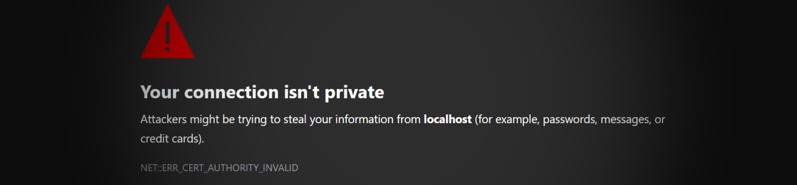
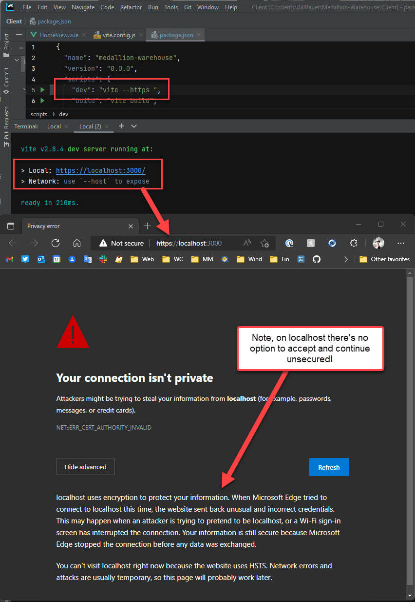
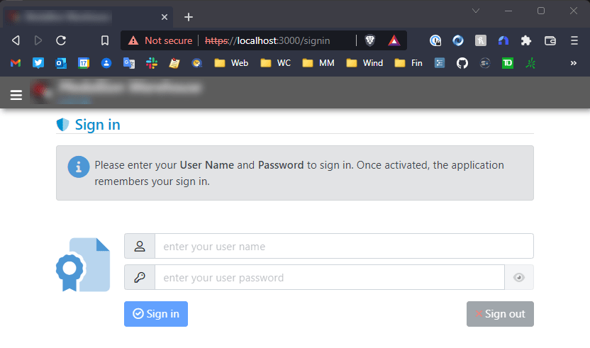
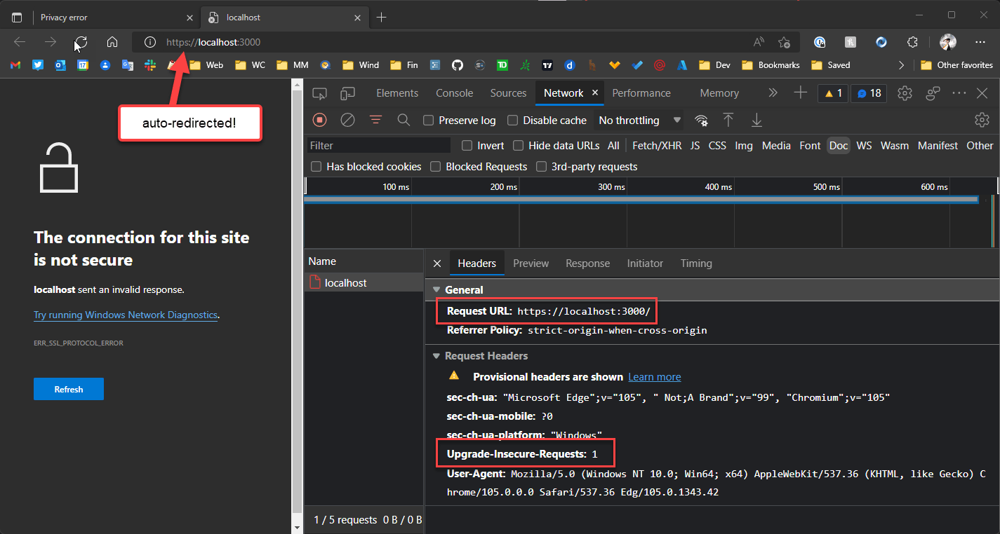
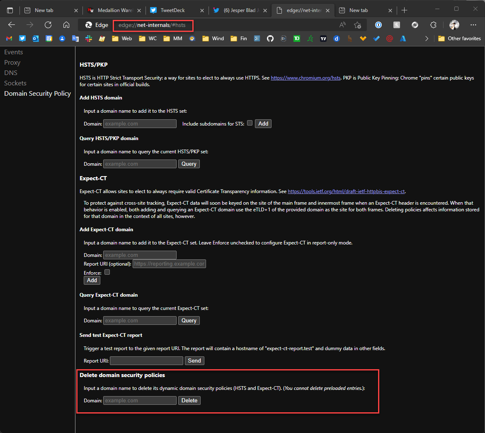
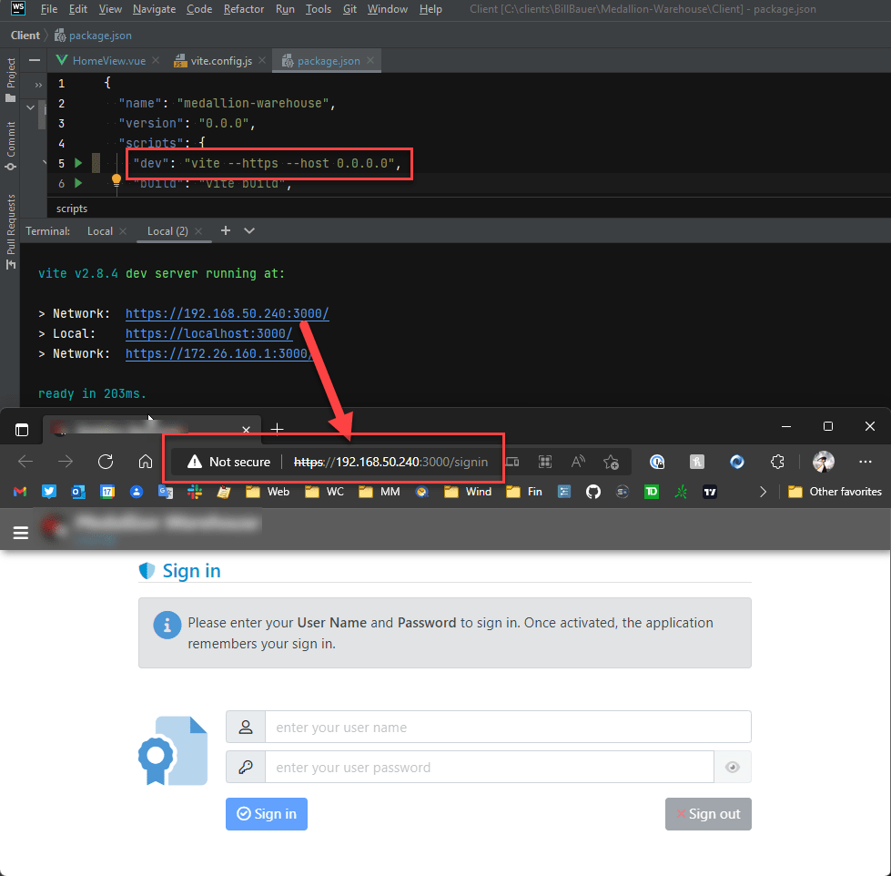
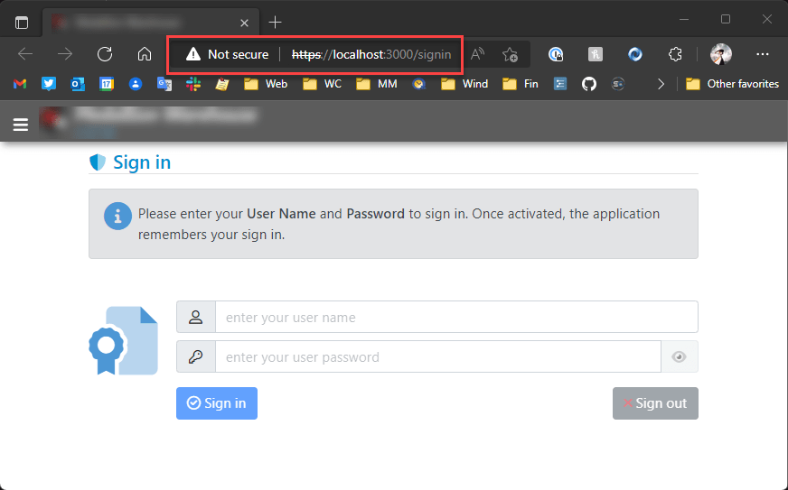
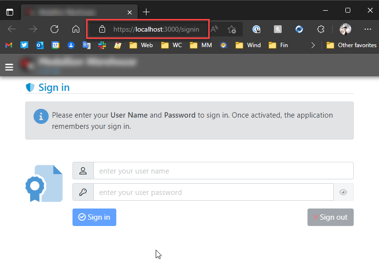

# Work around localhost unsecured https access for Development Sites in Edge



I've run into a lot of problems recently when it comes to accessing local Dev sites for development. The problem is that the browser automatically forces `http://` requests to `https://`. Because this usually happens on a site that does not have a certificate there's a hard SSL page error. And to make things worse there's no longer allows a bypass option on the page that lets step around the issue as you often can with other protocol or certificate based errors.

The cause of this is typically related to an application that locally uses `HSTS`, which an HTTP security protocol used to force a domain that uses it to automatically redirect `http://` requests to `https://`. This is fine for the application using HSTS because it knows and intends this behavior and as a result likely has a certificate setup both on the live site and is running on `https://` locally as well. 

But insidiously **the HSTS protocol caches and applies itself to the entire domain beyond the lifetime of the running application**, and if the domain you are running the HSTS app on happens to be `localhost` it can end up affecting a whole lot of other things that have nothing to do with HSTS themselves. 

## Side Effects, Side Effects
HSTS can affect other applicationS on localhost such as other 'dev' servers and locally triggered Web pages like those used for desktop logins for many applications. For example, I ran into problems like the Angular and Vue dev servers which by default do not use `https://`. If HSTS was triggered and cached say by my .NET application I ran on localhost a week ago, the Angular or Vue local dev server apps will fail to run. They'll redirect to `https://` without a certificate and fail. There are workarounds for that by installing addins that provide local certificates and `https://` dev server ports, but it certainly is not obvious or built-in.

What's even worse and more disruptive is that many applications these days use a local Web page on `localhost` in order to handle their OAuth/OpenID Connect authentications. For example, just today I ran into problems with authentication with the Git Credentials Helper, and the Azure Storage Explorer both of which open the default browser with a `http://localhost:port` address to validate the OAuth token. Both of these fail and become unusable when HSTS is cached on `localhost`. That sucks!

In short, if HSTS gets enabled on `localhost` it can affect a lot of other applications that have nothing to do with `HSTS`.

## Causes
Depending on what development tools you use this may or may not be a problem. If you don't use HSTS in your local development it's unlikely this will be a problem. But if you're building .NET applications for example, it enables `HSTS` by default:

```cs
app.UseHsts();
```

This is fine for .NET server development as you can easily set up local development certificates and install them via the  `dotnet dev-certs https import` command. Once installed `https://` connections just work locally using the Kestrel Web server. Unfortunately other tools are not so complete.

By doing the above in your app unconditionally you can inadvertently trigger the HSTS related problems for your entire `localhost` tool chain. I've done this and have run into a number of problems.

This post describes some of the issues with the requirements that Edge has for using `https://` on localhost and for working with `https://` requests if you don't have certificate installs and that cannot be easily just ignored in Edge.

## Localhost HTTPS Hell 
Intially I ran into this problem with my local Vue dev server and there are a couple of problems with the handling the issue. The browser:

* Doesn't allow to override an Invalid Certificate
* Doesn't allow access to a plain `http://localhost` URL

##AD##

### No way to Escape from Invalid HTTPS Certificate on Localhost
So my scenario is that I'm working on a local Vue application and when I launch the local Vite server I see this on `localhost`:



Note that I'm using:

```ps
vite --https
```

Now I don't really need to run in `https://` but Edge (and Chromium browsers in general) now automatically redirect to `https://` - even on localhost. So `--https` is essentially **required** (more on that in a moment).

In effect I have to run the server using `https://` but I don't have a certificate and the screen above is what I get in Edge. Now I'm fully aware **that there should be a security error** since there's no certificate present, but in the past **you were able to bypass this error** via an advanced options link that explicitly asked, if I'm sure I want to take life in my own hands :smile: : 

**Yes, damn it! I like to live on the Edge. But Edge won't let me actually live on the Edge  (ironic don't you think? :stuck_out_tongue_winking_eye:)** - at least not with `localhost`. 

The `https://` certificate behavior on localhost seems to be specific to Edge, as using [Brave](https://brave.com/) (another Chromium based browser) I can bypass the invalid certificate via the Advanced options override link. With Brave I can get to `https://localhost:3000` without a valid certificate:



Not so in Edge!

### localhost `http://' links get forced to `https://`
So you might think - screw all this `https://` bullshit, lets just use plain old `http://`. You Heathen, you! 

So for the Vite server, if I don't use the `--https` flag and serve plain `http://` content, I have another problem: Going to `http://localhost:3000` Edge immediately redirects me to `https://localhost:3000` and then fails with a protocol error:



The error makes sense at the `https://` link - the server is not serving `https://` but Edge insists on going there, and then of course there's no response from port 443.

The point is by default you really can't use `http://localhost` anymore as Chromium browsers  always redirect to `https://`.

This is the HSTS trap with the cached HSTS headers applying to this non-HSTS site. Are we having fun yet?

**Heads you win, tails I lose!**

The redirect behavior seems to be common to all Chromium Browsers now (FireFox also) so I think that's something we have to live with (but... why? why? why?).

> #### https://localhost Rant
> I'm happy with HTTP for public sites - these days with LetsEncrypt it's easy enough to create a certificate and install it. Fine! 
>
>But for localhost it's not quite a simple. Setting up certificates for a local site is a pain  - especially for Windows. So why this insistence on making life more difficult when http:// would clearly suffice for a local development setup?


### Solved: Clear the HSTS Cache for Localhost
As it turns out this the `http://` redirection problem is not a universal problem, but related to a very specific problem with  `HSTS` policy that is applied to **all of localhost** and cached if an application sets it. 

Jesper Blad Jensen pointed this out on Twitter in reply to my post:

<blockquote class="twitter-tweet" data-conversation="none" data-theme="dark"><p lang="en" dir="ltr">Have you tried clearing the HSTS setting for localhost? We have the problem that if just one project running on a port has sent a HSTS header then all localhost gets the https only treatment: chrome://net-internals/<a href="https://twitter.com/hashtag/hsts?src=hash&amp;ref_src=twsrc%5Etfw">#hsts</a><br>You need to ensure that edge is completely restarted after.</p>&mdash; Jesper Blad Jensen (@jesperbjensen) <a href="https://twitter.com/jesperbjensen/status/1572994586787684353?ref_src=twsrc%5Etfw">September 22, 2022</a></blockquote> <script async src="https://platform.twitter.com/widgets.js" charset="utf-8"></script>


`HSTS` is a security policy that enforces certain security defaults including forcing requests from insecure to secure URLs (ie. `http://` to `https://`). But as Jesper points out, the policy is applied to all applications that run on a given domain and - worse - cached! 

This means if I run one application that uses `HSTS` - for example a server side ASP.NET application - it then **sets this policy for all of localhost** and caches that HSTS policy for all other applications I might be also running on `localhost`.

**This effectively means that my local ASP.NET application just affected the HSTS policy for my local Vue/Vite application, even though the latter never used any HSTS policy settings at all.**

Brilliant!

To fix this - again thanks to Jesper's suggestion - you can go to: 

```txt
chrome://net-internals/#hsts
```

In the list of settings use the **Delete domain security policies**. Put in `localhost` (or any other domain) and press the Delete button:



Make sure to restart the browser. And voila - now the `http://localhost` works just fine.

This seems like a big fat design flaw. HSTS headers should not be cached and certainly not beyond the scope of the active session. The headers can and should be added to each request and then be processed accordingly. Even more appropriately a lot of these types of security (and cookie) policies should not be tied to the domain or worse the root domain, but to a very specific domain and port combination if applied. If caching of any sort is applied specificity should be a priority, but clear it's not in this case.

Ok - problem found and issue solved, but :man_facepalming:. 

With this in place I could now go back to using `https://localhost:3000`. But now that we're here, let's see if we can still using `https://localhost:3000`

## Hackity Hack
On getting `https://` to work on localhost.

There are a number of approaches that you can take which break down into two groups:

* Bypass security and allow an invalid or missing certificate
* Install an actual certificate

### Edge: Use an explicit local IP Address
As mentioned Edge appears to **not allow you to override invalid or missing certificates** on `localhost`. Oddly it appears that Edge **does allow** other URLs than `localhost` to override an invalid certificate. If I run `vite --https --host 0.0.0.0` which allows me to connect to a the local IP address, I can then bypass the HTTPS certificate:



So that's one way around this problem: Using `http://192.168.50.240:3000` lets me get past the invalid HTTP certificate. 

That makes perfect fucking sense, doesn't it? `localhost` - nope, `192.168.50.240` - yep. Brilliant!

### `thisisunsafe` Security ByPass Hack
The next hack is a weird one: If you get a security dialog that you cannot bypass like the one above for `localhost` and `https://` access with a certificate error in Edge, you can type `thisisunsafe` anywhere in the active browser window's Viewport.

If I do this I get through and now get the page to display with the broken `https://localhost:3000` link in the address bar (ie. same behavior as with the dedicated IP Address except it now works with `localhost`):



Once you've done this the security setting is cached for some time so repeated restarts of the browser continue to bring up the page without the warning page. Note you still get the broken security lock (or whatever iconry your browser uses).

It works, but man, that is one hell of a hack! 

##AD##

### Vue/Vite Specific: Use `vite-plugin-mkcert`
The next solution is probably the appropriate one to use, which is: Use a valid certificate!

There are lots of ways to do this, and you may already have a valid localhost certificate on your machine for IIS Express or for the ASP.NET Dev server that you could export and make available to another dev server like Vite for example. Not exactly simple especially if like me you're not very certificate-management-savvy and falter over certificate types and conversions.

Creating a certificate is easier said than done on Windows, where it's a major pain to create a new certificate and install it. But even on other platforms you have to do finger gymnastics with the `SSH` command to create or export a certificate and then use it with the server.

Luckily for the Vue application there's an easier way: There's a `mkcert` plugin that handles the entire process of creating a certificate, putting it in the local store, and automatically loading it when the server starts up.

The plug-in is called `vite-plugin-mkcert` and it creates and automatically installs a local dev certificate  for `localhost`. You can install from NPM:

```ps
npm i vite-plugin-makecert -d
```

Then add the plugin config to the `vite.config` file:

```js
import {fileURLToPath, URL} from 'url'

import {defineConfig} from 'vite'
import vue from '@vitejs/plugin-vue'

// *** THIS
import mkcert from 'vite-plugin-mkcert'

// https://vitejs.dev/config/
export default defineConfig({
  plugins: [
    vue(),
    // *** THIS
    mkcert()
  ],
  server: { https: true },  // *** THIS or use --https on the command line
  resolve: {
    alias: {
      '@': fileURLToPath(new URL('./src', import.meta.url))
    },
  }
})
```

With the installed certificate, I now get a clean `https://` Url in the browser, regardless which browser I use. Here's Edge:



This solution is Vite specific, but there are similar plug-ins for other dev pipelines like the Angular CLI etc.

Creating, and using a local client certificate that is trusted locally is the proper, puppy friendly way to handle local `https://` certificates. No more warnings. So yay!

### Another Option: LetsEncrypt and a local Web exposed domain name
Certificates don't need to be local client certificates of course - if you can tunnel to your local machine from the public Internet and map a domain name, you can also take advantage of standard public certificates like those created by LetsEncrypt.

I've used this approach in the past with my local 443 port mapped from the router to my dev machine and then mapping DNS to the router IP. Or you can use a dyanmic DNS service that does soemthing similar. Public DNS accessallows Web access to the machine and subsequently you can also register a public certificate that is Web verified. 

Once the domain is Web visible, you can then use LetsEncrypt to create a public  certificate and use that in the server configuration.

This is a bit of work, but is actually quite useful for quite a few different scenarios including easier testing with mobile devices which can then use a simple DNS name to find the local server without explicitly entering IP Addresses through a phone DNS entry app.

## Summary
So in summary Edge is being relentlessly **Edgy** with `https://` requests on localhost, more so than other Chromium browsers. The two problems are:

* Always redirecting to `http://` links `https://`
* Not allowing to bypass `https://` certificate errors on localhost

The former problem as described was due to the `HSTS` caching for the local domain and can be fixed by clearing the HSTS cache in the `chrome://net-internals/#hsts` settings. If you don't explicitly need `https://` in your local Web application this is by far the least painful approach. However, if you're like me and you're running literally a dozen different applications on your machine - you likely will have a few that use `HSTS` so you'll continue to run into that nasty issue and will continually chase down the cache clearing which is hardly a solution. 

So for me at least making `https://` work is probably the best idea.

For getting `https://` working, here's a summary of the work arounds discussed in this post:

1. Use a different Chromium browser for `localhost` and bypass `https://` warning
2. Use a local fixed IP address in Edge (ie. `192.168.xxx.xxx`) and bypass `https://` warning
3. Use `thisisunsafe` trick (type into browser) and bypass `https://` warning
4. Create a self-signed certificate for localhost and register with your server
5. Map localhost to a Web accessible domain and install a LetsEncrypt Certificate
6. Use a tooling plug-in to create and install a local self-signed cert (ie. `vite-plugin-mkcert`)

For me #6 was ultimately the cleanest, which works for the application I'm working on, but it's a specific solution to the Vue project I'm working on at the moment.

I've used #5 on quite a few occasions and that works well too if you can map a local IP or use dynamic DNS of some sort.

Onwards...

<div style="margin-top: 30px;font-size: 0.8em;
            border-top: 1px solid #eee;padding-top: 8px;">
    
    this post created and published with the 
    <a href="https://markdownmonster.west-wind.com" 
       target="top">Markdown Monster Editor</a> 
</div>