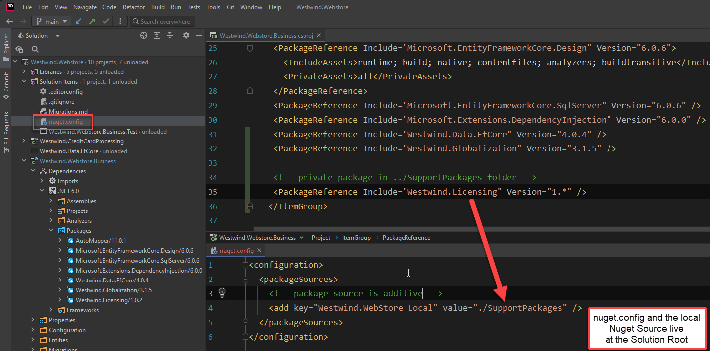
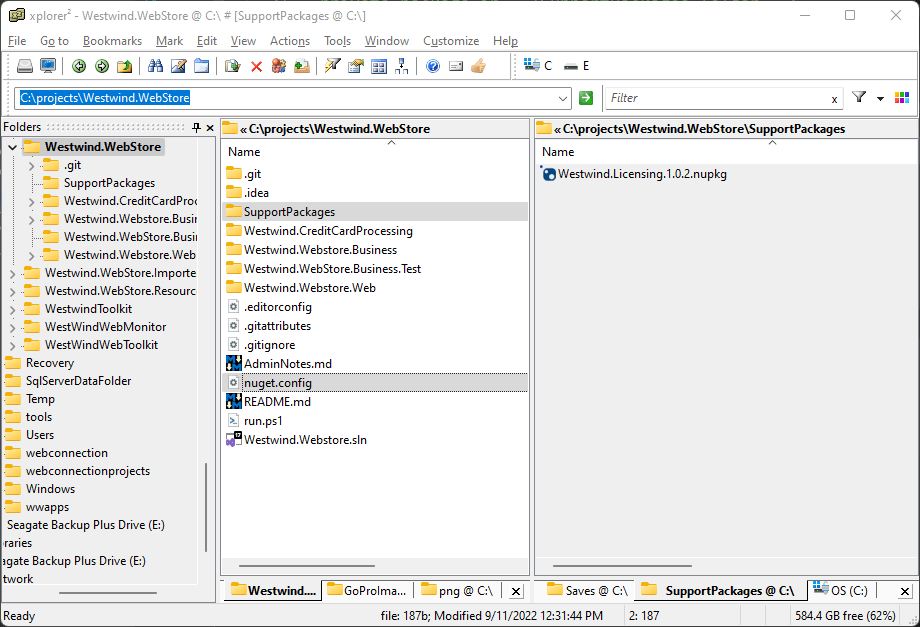
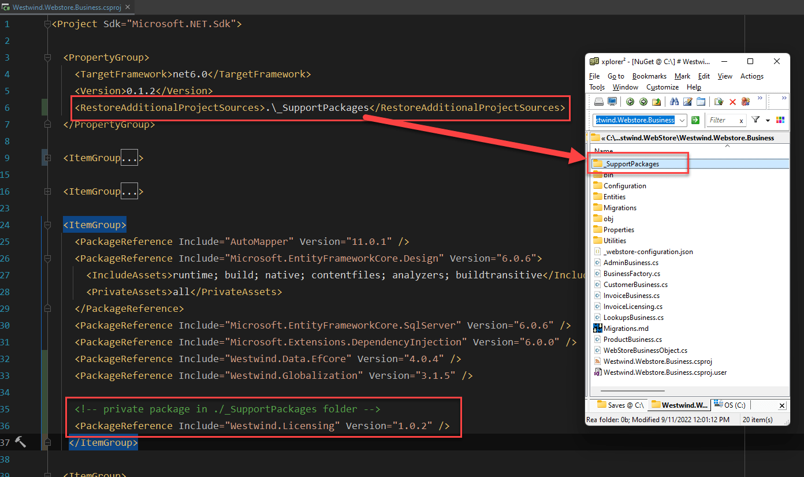

# Referencing a Local Private NuGet Package in your Solution


The other day I needed to reference a 'private' package or reference into a project that otherwise is public and published as a Git repository.

This is a rare scenario where I have a library that is not public, but that I'm using in an otherwise public project. I want to use the library, but don't necessarily want to publish a NuGet package or the source code as part of the repository for broad access.

Further, I want to make sure that if somebody pulls down the repository from Git that **they can build the Solution without explicit configuration**.

There are a couple of options for this:

* Use an Assembly Reference with a local Assembly File 
* Use a local NuGet Feed

##AD##

## File Referencing a NuGet Package?
Yesterday I publicly mused that it would be nice to actually be able to use a referenced path in a Nuget Package Reference:


<blockquote class="twitter-tweet" data-theme="dark"><p lang="en" dir="ltr">Sure would be nice if you could reference a local NuGet package by its path. Instead I end up with a reference and might have dependency issues.<br><br>Something like this below &amp; could even be a Web path.<br><br>This would avoid having to specify explicit package repository. <a href="https://twitter.com/hashtag/dotnetcore?src=hash&amp;ref_src=twsrc%5Etfw">#dotnetcore</a> <a href="https://t.co/7ityKQSHRn">pic.twitter.com/7ityKQSHRn</a></p>&mdash; Rick Strahl (@RickStrahl) <a href="https://twitter.com/RickStrahl/status/1568847306153132038?ref_src=twsrc%5Etfw">September 11, 2022</a></blockquote> <script async src="https://platform.twitter.com/widgets.js" charset="utf-8"></script>

In a nutshell, I wouldn't mind seeing a relative path be able to pull in a NuGet reference from within a package reference in a project:

```xml
<ItemGroup>
    <PackageReference Include="../SupportPackages/Westwind.Licensing/WestWind.Licensing.nupkg" />
</ItemGroup>
```

This seems like a quick and logical way to refernece a NuGet package that doesn't come from a feed.

I realize all sorts of things can go wrong with this if you hard code a path or that path is just not available. However, for the specific scenario of referencing **project relative NuGet packages** it seems like a good and somewhat logical approach for a simple and - judging from the comments to my Tweet - common scenario.

Alas, while that specific scenario isn't supported, it turns out that there are other ways you can achieve this behavior with only a little more extra work by using a local NuGet feed that's specific to your project/solution. More on that in a minute.

## Adding Local References and Packages to a Project
As mentioned there are a couple of ways you can pull private code into a project by using:

* A local Assembly Reference
* Using a private or local NuGet Feed

## Using a Library Assembly Reference
In the past I've always used local assembly references for this scenario. Although it's kind of downplayed in .NET Core in favor of NuGet packages, you can still reference assemblies in Core projects.

You can use the `<Reference>` element in a project file and hard reference a `.dll` file to pull in an assembly reference. 

To do this:

* Create a folder inside of the project/solution
* Copy the assembly or build output folder into that folder
* From projects that need it, add an assembly reference to the DLL

Here's what that looks like in a referencing project:

```xml
<ItemGroup>
    <Reference include="../SupportAssemblies/Westwind.Licensing/Westwind.Licensing.dll" />
<ItemGroup>
```

where `../SupportAssemblies/Westwind.Licensing/` contains the full build output of from the `Westwind.Licensing` project. In this case it's just a single assembly with no dependencies, but if there were direct dependencies they would also show up in that folder and are required to resolve the dependencies when the assembly is loaded from this reference.

This works, and I've been using this approach for ages all the way back to .NET 1.x. But in this age of NuGet packages that can reference other dependencies more easily it seems a bit quaint :smile:. There are also potential complications when it comes to resolving dependencies especially these days when most libraries have other NuGet dependencies which can't be automatically resolved by an Assembly Reference unless the dependencies are explicitly output and copied into the library folder.

So while direct assembly referencing still works, NuGet referencing would be a better choice if it can be made self-contained.

##AD##

## Using a Solution or Project Local NuGet Source
So you can also use a local NuGet Source. I've always known that you can add a local NuGet package source, but in the past I've shied away from this solution because I thought - incorrectly - that would mean consumers of a repository *would have to explicitly set up the secondary package source*. Turns out that's not correct and you can pre-configure a package source as part of your Solution.

Additional Package Sources can be set in a number of places:

### Global Package Source
The global package source lives in `%appdata%\nuget\nuget.config` and looks like this:

```xml
<?xml version="1.0" encoding="utf-8"?>
<configuration>
  <packageSources>
    <add key="NuGet Package Source" value="https://api.nuget.org/v3/index.json" />
    <add key="Microsoft Visual Studio Offline Packages" value="C:\Program Files (x86)\Microsoft SDKs\NuGetPackages\" />
    <add key="Local NuGet" value="c:\projects\nuget" />
  </packageSources>
  <apikeys>
    ...
  </apikeys>
</configuration>
```

This configuration is set when you make changes to your package source configuration in most IDE tools like Visual Studio, Rider, OmniSharp etc.

### Solution Local Package Source
But you can also override this global  `nuget.config` file with a local `nuget.config` in your local Solution Root folder.  So to **override** or **add** additional package sources I can create a local file, add it to the **Solution Root Folder** and then add a package source like this:

```xml
<configuration>
  <packageSources>
    <!-- package source is additive -->
    <add key="Westwind.WebStore Local" value="./SupportPackages" />
  </packageSources>
</configuration>
```

I can now add any *local* packages into the `SupportPackages` folder and it will now be found on build.

Here's what this looks like:



And here's the local folder setup:



While this is not as easy as a relative path package reference as per my original musing, it's still a pretty simple solution. As a bonus it works for many packages and doesn't require for projects to use any path references, so it's actually a cleaner solution.

### Project Specific PackageSource
Another even easier way to add a package source at the **project level** is to use `<RestoreAdditionalProjectSources>` in an individual .NET project, **right inside of your project file**.

So in my `Westwind.Webstore.Business` project I can now reference a project relative path:

```xml
<PropertyGroup>
    <TargetFramework>net6.0</TargetFramework>
    <Version>0.1.2</Version>
    <RestoreAdditionalProjectSources>./_SupportPackages</RestoreAdditionalProjectSources>
</PropertyGroup>
```


which keeps the extra NuGet package tied to the project rather than the solution. I can of course still point back to the solution folder as well, but the real value of this option is that I can keep the NuGet reference with my specific project that needs it, keeping the dependency management confined to the project that needs it, rather than pushing it up to the Solution. This makes this approach portable even if the project is attached to another solution later.

Here's what this looks like in my project:



Thanks to [Patrick Westerhoff](https://twitter.com/poke/status/1569083456893616129) for pointing this out on Twitter - another option I had no idea existed.

##AD##

## Summary
I'll be the first to admit I waste a lot of time trying to find simple solutions like this, because I simply don't know about them. The MS Build process has so many components to it, and Microsoft has done a good job of extracting the most common features and defaulting them where everything 'just works' out of the box which is awesome (Kudos!). But when you end up doing a little bit different it's often really hard to discover the customizations that are available. This feature I describe here is great, but judging from responses to my Tweet few know about it. Hopefully a post like this helps out in discovery and taking advantage of this functionality a little bit more easily.

The ability to add a local `Nuget.config` to a solution or use `<RestoreAdditionalProjectSources>` in a project to  override behavior are great tools to add a private NuGet feed that is pre-configured and doesn't required consumers of the project to fiddle with setting up a custom package source.

It ticks all the boxes for features and convenience - once you figured out the functionality is available. Well now I know, and perhaps if you didn't already,  you now do too...

<div style="margin-top: 30px;font-size: 0.8em;
            border-top: 1px solid #eee;padding-top: 8px;">
    
    this post created and published with the 
    <a href="https://markdownmonster.west-wind.com" 
       target="top">Markdown Monster Editor</a> 
</div>