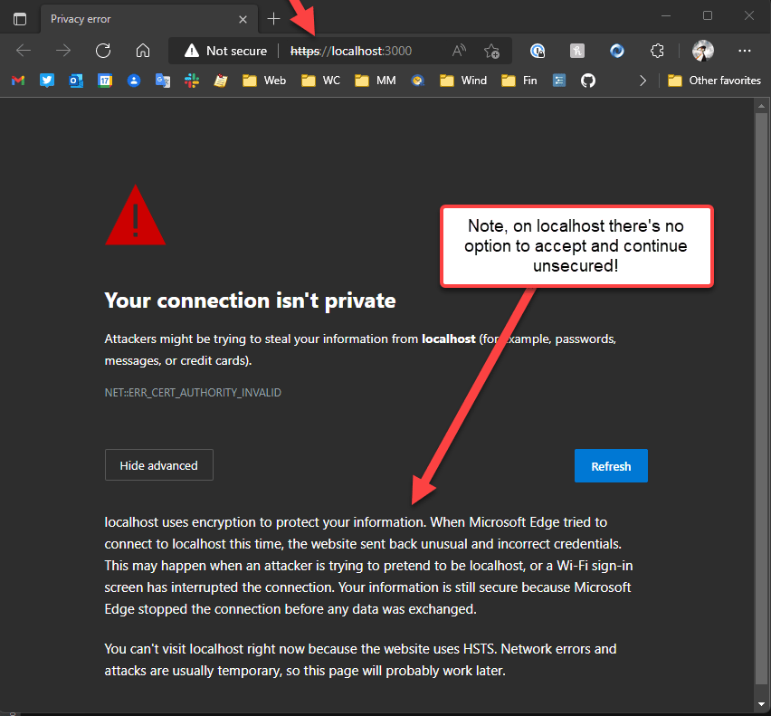
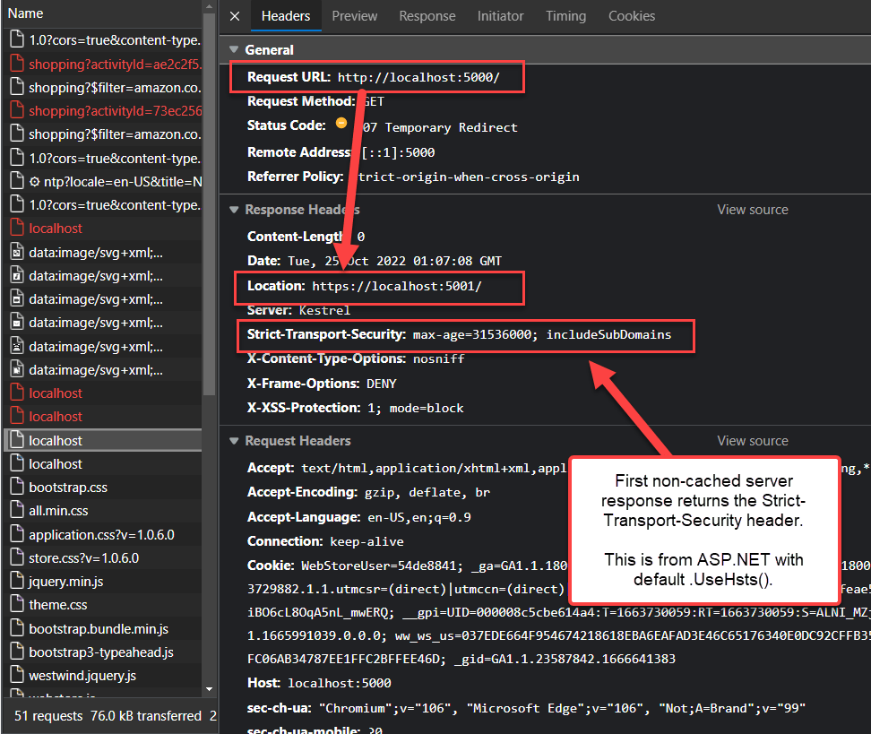
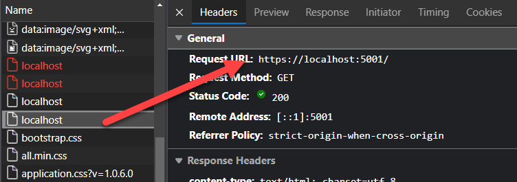
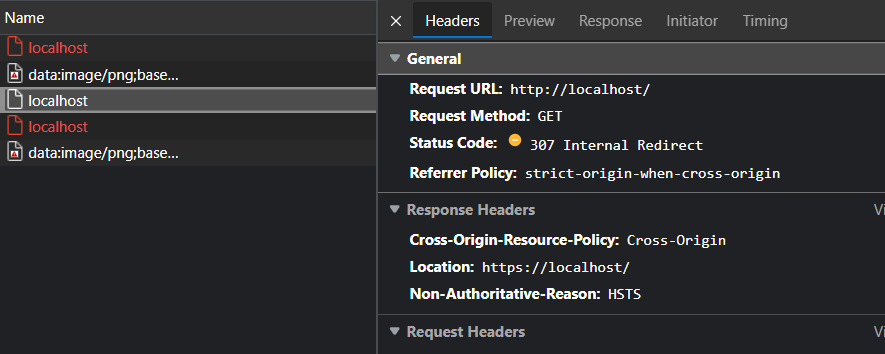
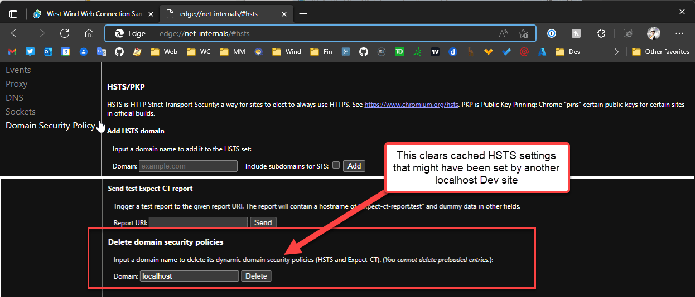

# Fix automatic re-routing of http:// to https:// on localhost in Web Browsers


If you're a developer and you are running multiple development Web sites locally on `localhost` you may have run into issues with not being able to access `http://localhost` or even `http://localhost:5200` with the browser instead immediately redirecting to `https://localhost` or `https://localhost:5200`. No matter what you try at that point, the site always goes to `https://` and then fails because there's no certificate there.



## Why is this Happening: HSTS
This issue isn't going to bite everyone, but it will cause problems if any of your `localhost` sites use `HSTS` security.

A good example is ASP.NET Core which has applications enable HSTS by default so if you use it, and also use some other local development environment that is not .NET you're likely to hit this problem. Any local development that uses HSTS will affect **all other local sites you might work on locally** regardless of whether these other apps are using HSTS or not.

**[HSTS](https://https.cio.gov/hsts/)** stands for **HTTP Strict Transport Security** which is a server requested header directive that instructs the client to automatically switch non-secure `http://` requests to `https://`.

It's typically initiated by the server which sends an HTTP header like this:

```
Strict-Transport-Security: max-age=31536000;
```
Notice that the header has a `max-age` which causes the browser to cache this setting for that duration **unless explicitly reset** via another header request or explicit clearing.

When the client sees this it initiates the HSTS policy for the domain and once set, any request that comes in for `http://` is then immediately and automatically changed into a request for `https://`. For the first request though the server does a redirect to `https://` and sends the `Transport-Security-Header`:



Any subsequent requests from the client then are made over `https://`:



That all sounds perfectly fine, except for the fact the setting is essentially cached by the client **on a per domain level** where the domain includes different ports and even sub-domains. The browser 'remembers' the settings and as soon as you go to `http://` on a new navigation it immediately jumps to `https://`.

The following is accessing a site on `localhost` **that is not set up for HSTS** or `https://` for that matter:



You can see that even so the browser immediately redirects to `https://` not even hitting the server - it looks like it's creating a fake redirect on the client as the server is not automatically redirecting. If you go to this same site when no HSTS caching is active from the ASP.NET Core site previously, it loads fine in `http://`. But now with HSTS applied to the ASP.NET Core site, the root site that doesn't use HSTS doesn't work.

##AD##

The **HSTS security policy applies to the entire domain** and can even apply to sub-domains if the `includeSubdomains` flag is set, as it is in ASP.NET's defaults. This means if you're testing 3 different applications on your machine on `localhost` - including using different ports - and only one of them uses HSTS, **the other two now are also affected by the HSTS policy** even though they **don't use HSTS** themselves.

The end result is that you simply cannot open the site via non-secure  `http://`. The site will automatically redirect, and not allow direct `http://` access, and... most likely will not work because there's no certificate. 

Fun, huh?

## Just Fix it
The good news is that you can fix this HSTS mess fairly easily, the bad news is that if you have multiple applications and at least one of them uses HSTS, you probably will have to apply this fix **frequently**. Any time you run the application that actually uses HSTS, it's going to impose HSTS on all the other apps running on `localhost`.

The fix is simple enough if you know where to look which is in the network browser settings. You clear HSTS caching via the `net-internals/#hsts` settings section in your Chromium browser. You can access them with (depending on your browser):

* chrome://net-internals/#hsts
* edge://net-internals/#hsts
* brave://net-internals/#hsts

(should work for other Chromium browsers too)

then go to:

* Delete domain security policies
* Put in `localhost` (or whatever domain)
* Press the **Delete** button



Once you've done this you should now be able to once again access `http://localhost` without any issues.

Yay!

### FireFox? Clear Site Data
You'll have the same issues with HSTS in FireFox but the only way that I found to clear all settings about a specific site.


This clears all data related to the site - History, Cookies, HSTS and more so this is a bloody hammer of a solution. I didn't find any other way to reset the HSTS cache, but this blunt tool works.

##AD##

## Live with it!
So yeah, security sucks as it ever did!

*"Live with it"* seems to be the operating word I hear a lot lately from the security wonks.  *'We know this sucks but that's as good as we could figure out how to do this.'* 

There are a few approaches you can take to this issue on in addition to the fixes above.

### Use Https for all Things
The obvious solution is to use `https://` all the things, even on localhost. This is getting a bit easier these days as more and more development tools provide easier ways to either use private certificates, or run servers that automatically install local dev certificates for you on installation (like .NET does these days) or offer built in dev certificate management. 

This by far the best solution, but if you're working on legacy applications that might be using an old server like full IIS or IIS Express without a pre-installed SSL certificate this is easier said than done. Creating of local self-signed certificates is still a pain in the ass especially on Windows.

Also most client side frameworks (VueJs and Angular is what I use) certainly don't default to https and don't offer native tools, although there are dev pipeline plug-ins that do provide integration. The problem isn't that there isn't a solution, but that the problem is not real obvious to even reach for that solution eventually. It seems that eventually we need to get to a point where every tool automatically uses Https for its local development setup/dev servers. 

It pays off to spend a little time to see if you can get Https to work with your local solution - it just might save some of these unpredictable further down the line.

### Disable HSTS for Local Dev
If HSTS is the problem one thing you can do is try to not send the HSTS headers when doing local development. Either set an explicit flag or differentiate between explicit

If you are using a tool that supports HSTS, it might be a good idea to disable it on the local machine so that it **doesn't pollute other applications on localhost**. 

For example, in ASP.NET Core you can do something as simple as this:

```cs
if (builder.Environment.IsProduction()) 
{
    // only enable in production not on dev
    app.UseHsts();
}
```

If the rules for deciding are more complex you can create a dedicated configuration setting for this functionality as I do now in most of my apps which disable HSTS locally:

```cs
if (wsApp.Configuration.System.UseHsts) 
{  
   // only enable in production not on dev
    app.UseHsts();
}
```

### `thisisunsafe` Security ByPass Hack
This hack is a weird one: If you get a security dialog that you cannot bypass like the one above for `localhost` and `https://` access with a certificate error, you can type `thisisunsafe` anywhere in the active browser window's Viewport. Yes - anywhere as long as the active browser window has focus. Then just type - invisibly - `thisisunsafe` into the browser and refresh the page.

The page should now come up and display your content. You'll still see the broken security icon in the address bar, but the page loads and works otherwise. This has the same effect as clicking on that button that says *I accept the risks*.

Once you've done this, the security setting is cached for some time so repeated restarts of the browser continue to bring up the page without the blocking insecure warning page.

This won't help you if you have no `https://` binding at all on the server because the server will just not allow the connection on port 443, but you can apply even a non-verified certificate and use this feature to get past it.

It's not a good idea to use this 'out' as there's obviously a security issue. Better to fix the problem at the root and hopefully the HSTS fix above might provide the clean if temporary fix. If however you just don't have a workaround this `thisisunsafe` hack is one way to get on with life.

##AD##

## Summary
Browser security is getting to be more and more in the way of development. While the move to secure browser applications is nice, the technologies that drive this and are tied into the browser itself tend to be cryptic and non-transparent, difficult to troubleshoot and manipulate if you run afoul of the settings. In fact, when I originally ran into the `https://` redirection issue I conflated it to be a browser 'feature' (because there are options for forcing `http://` to `https://` via settings as well). Turns out it wasn't the browser at fault, but HSTS. Of course this isn't obvious at all,  until you start digging into requests and in my case get scolded on Twitter for blaming shit on browser vendors :smile:.

With HSTS it certainly doesn't help that domain policies aren't specific enough to separate between domain + port or even between sub-domains. This non-granular separation seems like a massive oversight of an obvious problem that might affect behavior **especially on localhost**. 

But alas here we are - at least there's a relatively easy fix for this via browser settings - once you know where to look. Well, now you do... until next time you need it when I'll see you back here - I know I will be back :smile:


<div style="margin-top: 30px;font-size: 0.8em;
            border-top: 1px solid #eee;padding-top: 8px;">
    
    this post created and published with the 
    <a href="https://markdownmonster.west-wind.com" 
       target="top">Markdown Monster Editor</a> 
</div>