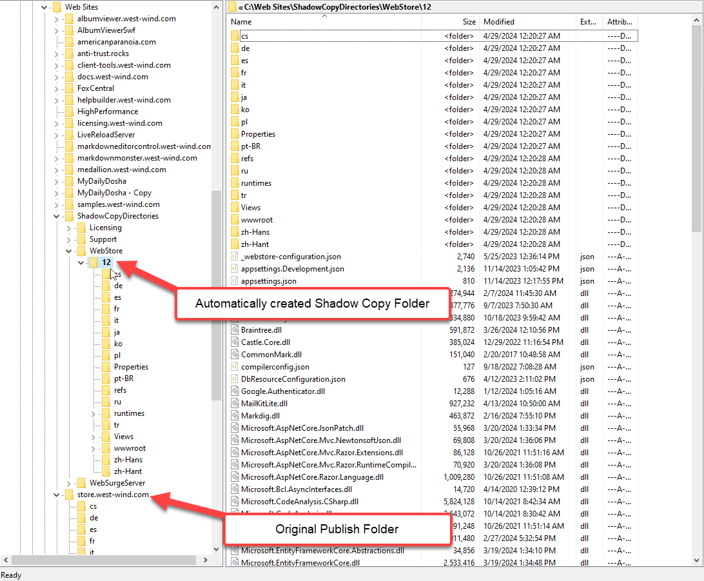

# Avoid WebDeploy Locking Errors to IIS with Shadow Copy for ASP.NET Core Apps


If you're self-hosting ASP.NET Core applications on IIS and using WebDeploy to publish to the server, you've very likely run into the dreaded locked file problem on the server. You start to publish to the server, and the publish fails half way through, with an File in Use error because files on the server are locked. 

Regardless of whether you publish from within Visual Studio or you publish from the command line (via `dotnet publish` or `MSDeploy`) you have probably run into this issue:


The error is the dreaded `ERROR_FILE_IN_USE` which indicates that one of the files - most likely one of the application assemblies is use.

This means when applications are shut down for updates from WebDeploy, sometimes it's possible to retry and succeed, but at other times this update never succeeds. This happens even, if the `AppOffLine.html` option is enabled in the profile, which is supposed to unload the app before it starts updating. Alas - it does not, at least not always.

I'll break this post down into two major sections:

* Part 1: Shadow Copying - What is it, what problem does it solve, and how do you use it
* Part 2: Setting up WebDeploy for Publishing to IIS both on the client and server

The latter is obviously out of order, but if you're new to IIS Publishing and WebDeploy or it's been a while, it might be good to get a quick start or refresher to get up to speed.

## Why are Files Locked Files in ASP.NET Core Applications?
Unlike classic ASP.NET applications, by default ASP.NET Core applications are hosted and execute **in place** when running in IIS or anywhere else. This means that the application **runs directly in the location that it is deployed** and loads all files out of that folder. 

On IIS, ASP.NET Core is hosted through the **ASP.NET Core Hosting Module (ANCM)** which is responsible for firing up the .NET Runtime - either in-process or out-of-process - and starting up your .NET core application. The module handles translating IIS's inbound data stream so ASP.NET Core can consume the data using the familiar ASP.NET Request/Response/Server model.

WebDeploy is the tooling technology you can use to publish ASP.NET Core applications to a self-hosted instance of IIS. It copies files, is supposed to unload the running application (with mixed results), updates files and then is supposed to restart the application. 

Although WebDeploy has a basic mechanism of unloading the running Application on IIS before copying files using `AppOffline.html`, often this simple IIS unload mechanism fails, and files continue to be locked. Usually this is due to the application still running pending requests or running some background operations that have not completed and released their background threads. End result: In some cases the IIS application does not unload.

Sometimes you can wait a little bit and try again, but if the application is super busy or has long running requests or background services it might be increasingly difficult to update the application without explicitly shutting down the Web application on the server.

This experience sucks, especially if you need to get a fix out quickly. Even worse in some scenarios this can leave your application in a non-running state as some files were updated and others did not. Unfortunately, **this default behavior  is not uncommon.**

##AD##  

## Part 1: Shadow Copying
Thankfully with .NET 6.0 and later an oldie but goodie feature called **Shadow Copying** is coming back. This feature originated in Classic ASP.NET where it was the default deploy scheme, but it is not the default behavior in ASP.NET Core which executes binaries in-place in the original deploy folder.

Unlike in-place execution where binaries are run from where they are copied, Shadow Copying copies files into a separate temporary folder in addition to keeping them in the actual deploy folder. Files are published to the deploy folder first and a background operation in IIS then detects that the binaries have changed and copy the files to a secondary, temporary location. Once the copy operation is complete, the application is restarted with binary file loading re-directed to retrieve binaries from the temporary, shadow copy location.

In .NET Core this, this is how this works:

`Environment.CurrentDirectory` continues to reflect your original deploy folder - the application isn't actually running out of the shadow deploy folder. But if you check the currently executing assembly you'll find that it is executing out of a temporary folder.

It looks like the IIS Hosting module is redirecting assembly loading to the temporary folder, so assemblies load from the there, rather than the original deploy folder, while actually running out of the original application folder where the application was installed.

The following shows values for:

* `Environment.CurrentDirectory`  - deploy folder 
* `Assembly.GetExecutingAssembly().Location` - temporary shadow copy folder


### ASP.NET Core doesn't use Shadow Copying by Default
ASP.NET Core doesn't use Shadow Copying by default and as a result - even with `AppOffLine.html` it's frequent to see publish operations on IIS fail.  

The good news is that as of .NET 6.0 shadow copying is back - albeit as an experimental and optional feature that nevertheless works as advertised.

The shadow copying behavior in ASP.NET Core is provided as part of the ASP.NET Core IIS Hosting Module (ANCM) that manages hosting .NET Core application inside of IIS. This module behavior handles monitoring the Web folder for changes and copying files to a new temporary location, then re-launching the ASP.NET Core application and referencing all binaries **from that temporary folder**.

### Enabling Shadow Copy Folders in .NET 6.0+
Shadow Copy deployment is a **new, experimental feature in .NET Core 6.0** using experimental keys you set in `web.config`. This feature is implemented at the .NET Core IIS Module level and configured via configuration settings in the `<aspNetCore>` key in `web.config`

Although it's marked 'experimental', after implementing this on several of my own IIS applications, I can safely say that it works without any issues for me and I get now reliable deploys that don't get hung up on file locking errors. This is in contrast to the frequent and somewhat random `ERROR_FILE_IN_USE` errors I was getting previously. I'd say roughly 3 out of 10 installs would fail for me prior to using Shadow Copy. No lock failures any more.

**So yay, Shadow Copy!!!**

### Configuring Shadow Copy in web.config
Because Shadow Copy is not an application feature, it's not set in your .NET Core project file. Rather it is implemented as part of the ASP.NET Core IIS Hosting Module and therefore configured in `web.config`.

```xml
<aspNetCore processPath=".\Westwind.Webstore.Web.exe" 
            hostingModel="inprocess"
            stdoutLogEnabled="false" 
            stdoutLogFile=".\logs\stdout" >

 <handlerSettings>
   <handlerSetting name="experimentalEnableShadowCopy" value="true" />
   <handlerSetting name="shadowCopyDirectory"       
                   value="../ShadowCopyDirectory/" />
 </handlerSettings>
 
</aspNetCore>
```

You enable the feature and provide a folder name. The folder name can be a relative path as in the example, or a fully qualified OS path.  You can point multiple applications at the same Shadow Copy folder, as the unique temporary folders are created underneath that folder with a unique ID.

Here's what the shadow copy folder looks like for the above setup:



Each application and each 'change' in the application generates a new shadow copy folder. The ASP.NET Core handler figures out whether it needs to create a new shadow copy folder, can reuse an existing one and also cleans up no longer running shadow copy folders. 

All of this works very well and has eliminated any publish errors for me due to file locking. This is a simple fix for an annoying problem and I'm very glad to see Shadow Copying again supported for publishing.

Again: **Yay!**

### Potential Problems with Shadow Copying
While Shadow Copying has fixed all of my issues, and I haven't run into any issues personally, it's important to point out that **there can potentially be some issues** that have to do with timing the file copy operation properly and the new location assemblies run out of.

For me personally, switching from in-place, to shadow-copy was a zero change event, all I did is add the handler settings in `web.config` and got to enjoy no lockup publishing and the same application behavior as before.

#### Restart before Copy is Complete
But I do remember running into issues with partial updates with classic ASP.NET especially on large applications.
It's feasible that if you have very large publish distributions that multiple shadow copies occur, potentially leaving the application **temporarily** in an unstable state. Once copying is complete, this always sorts itself out, but on rare occasions you may end up with an incomplete application briefly.

I've not seen that in my applications, mainly because the apps are not very large and self contained. The larger the distribution the more likely to run into a situation where Shadow Copy processing considers the app update complete, while more files are still published.

#### Relative Assembly Paths
Another potential problem is that if some component relies on `Assembly.GetExecutingAssembly()` or `Assembly.GetEntryAssembly()` and makes assumptions based on that location, there could be problems due to the relative path changes. This can cause problems with files getting copied to a temporary location instead of into the application structure for example or it could be something internal like a dynamically loaded assembly not being found where it's expected to be.

#### Make sure you Test First, Ask Questions Later
If you plan on using Shadow Copy make sure you test your application publishing to make sure everything works as expected.
  
Don't take my word or my specific application scenarios for it - do your own Due Diligence and test your application to see if there are any of the rare side effects that might apply to you.

## Shadow Copy Summary
If you've run into publish problems on IIS using plain Web Deploy publishing, you should definitely take a look at Shadow Copying files as it almost certainly will eliminate any locking issues in your applications. However, make sure that you test for any of the minor problems that can creep up due to the changed locations of the binary assemblies loaded from Shadow Copied file.

##AD##

## Part 2: Setting up and Running WebDeploy with .NET Core apps in IIS
If you're new to publishing to IIS or it's been a while you probably could use a quick refresher on what you need in order to use Web Deploy both on the client and on the server.

### Make sure that the  WebDeploy is installed
Although the .NET Core SDK supports publishing via WebDeploy, the feature is not automatically installed with the SDK. **You have to separately install WebDeploy first**.

You can install Web Deploy from:

* [WebDeploy from Microsoft Platform Installer](https://www.iis.net/downloads/microsoft/web-deploy)
* From Chocolatey: `choco install WebDeploy`

These installers will install both the Web Deploy client and also the server IIS addin, if IIS is installed locally. If IIS is not installed and you later install it you'll have to re-install WebDeploy at that time.

#### A Word about the Web Deploy Agent Service Server Component
The Web Deploy server component installs as Windows Service called **Web Deployment Agent Service** with a dependency on the Windows Http service which is used for communication.


You'll want to make sure the service is started and running - otherwise you won't be able to connect to it. 

> #### @icon-warning Make sure the Service is running
> If for some reason you can't connect to the Web Deploy server, make sure to double check that the **Web Deployment Agent Service** is actually running!
>
> I've noticed in some cases that starting with default service startup setting of **Automatic** the server fails to start when the machine starts up. Instead using **Automatic (Delayed Start)** is more reliable for ensuring the WebDeploy server is started on machine restarts.

### Create a Web Deploy Profile in Visual Studio
In order to publish from the client you need to create one or more Publish Profiles that tell WebDeploy where and how to publish your Web application. Publish Profiles are XML files that are used by command line tools to execute, but Visual Studio and other IDEs have UI tools that help create these profiles more interactively.

The easiest way to create a new publish profile from scratch is to let Visual Studio (or Rider) to create a profile for you from your .NET Web application. The following uses a .NET Core project, but it also works with most other Web project types including classic ASP.NET projects. Otherwise you can also just copy an existing `.pubxml` file and modify the configuration.

**In Visual Studio:**

Right click on your Web project, then select **Publish**


You then choose **Web Deploy** as the publish type and fill in your Web site information:


* **Server**  
You need to specify a domain name here that you want to publish to. You can use either:
    
    * A domain or IP Address on its own (ie. `www.domain.com`)
    * An http url: `http://mydomain.com`
    * **NOT an https url**: `https://mydomain.com`

    Regardless of whether you use a domain or url the value is parsed into an internally used URL that communicated between Windows machines using your Windows credentials.  
    *Example: `mydomain.com`*


* **Site Name**  
This is the I**IIS site name** to which you want to deploy. The site has to already exist and have a valid root folder. The Site name is the description you see for the site in the IIS Manager application for each site. You can also specify virtual directories using `/` to separate the site name and virtual.  
*Example: `store.west-wind.com` or `west-wind.com/wconnect`*

* **Destination Url**  
This is an Url value that's used to open the site after publishing is complete and should just point at your Web Site. I noticed that this URL should be `http://` - even if it auto-redirects to `https://` or else the validation fails.

* **Username and Password**  
In order to publish you need to authenticate on the server using a Windows Administrative account. If this doesn't work also make sure the `<AuthType>` key in the `.pubxml` is set to `NTLM`.

* **Validate Button**  
You'll want to validate the settings by clicking this button. If all is well you'll see a little checkmark, if not you'll get an error icon that you can click for error info. 

    * **Common Validation Errors**  
    Common problems are user validation failing (credentials, non-admin account), WebDeploy service not running on the server, server not resolving or firewall is blocking requests. 

#### A Web Deploy Profile
The interactive tool simply creates a **Publish Profile** `.pubxml` file which by default is stored in your project at:

* Properties/PublishProfiles

> You can also create these profiles by hand and skip the Visual Studio or other tooling by simply copying and modifying an existing profile which tends to be much quicker. Once you've created the profile, if it lives in to the `Properties/PublishProfiles` folder it'll also be visible in Visual Studio and Rider as an available profile by its filename in the publish options.

You can create multiple profiles to multiple servers, so you can easily set up profiles for `Production`, `Staging`, `Backup` etc. 


In this publish file there are a few keys that are important that may or may not be in your automatically created profile (depending on your version of Visual Studio):

* **EnableMsWebDeployAppOffline**  
Ensures that the WebDeploy places an `AppOffline.html` file in the deploy folder before updating files. This file causes IIS to unload the currently running App Pool and keep it from restarting until the file is removed. This setting wasn't the default until very recently in Visual Studio (v17.2+)

* **MsDeployPublishMethod**  
Use `RemoteAgent` for this setting. I've had a number of issues with connections failing, and when they did this setting made it work. This setting should be the default for WebDeploy but explicitly setting it ensures it is always used.

* **AuthType**  
WebDeploy always uses Windows Authentication or `NTLM` but in some instances the default for this setting is not `NTLM` resulting in authentication failures. Explicitly setting to `NTLM` ensures that the right authentication is used for Web Deploy.

##AD##

#### Publishing from Visual Studio
Once you've got one or more publish profiles set up, you can then use them to publish to the server easily using... wait for it... right click deploy.

In Visual Studio you can publish from the project's context menu:


From there you can the publish:


Done and Done.

### Publishing with dotnet publish
For those that hate **Push Button Deploy** there's also **Command Line Deploy** which is really still Push Button deploy but with more keystrokes - but hey at least you can look cool and pretend it's more sophisticated :smile:.

The .NET SDK has support for publishing Web applications including publishing to IIS via WebDeploy using the `dotnet publish` command. The process is very simple and boils down to a single command:

```ps
dotnet publish /p:PublishProfile=Properties/PublishProfiles/WebStoreLive.pubxml `
               /p:Username=$uid `
               /p:Password=$pswd -c Release
```

You can pass any MS Deploy parameters here via the `/p:` flags, but 


> #### @icon-warning Web Deploy is a Separate Install from the .NET SDK
> Although you can publish to WebDeploy with `dotnet publish`, WebDeploy **is not installed with the .NET SDK**, so you still need to install the Web Deploy client explicitly as discussed earlier. 
> 
> Visual Studio on the other does install WebDeploy since the publish tooling is integrated. Rider downloads it as a plugin on the fly with similar on demand behavior.


Using .NET Publish in this way allows you to automate the build process via simple scripted PowerShell or Command scripts or you can integrate this process into a DevOps build pipeline, or combine commands to provide a sequence of events. For example, on some of my bigger applications I push to a separate Git publish branch with a Tag before publishing to have an full current state of the published application that I can roll back to if something goes wrong.


## Summary
WebDeploy is old technology and it shows. All sorts of quirks from the funky options to choose domains, http:// only URLs, to funky file locking. But, once you have a connection, it actually works surprisingly well with its options to incrementally update or do a full nuke and start over installation.

WebDeploy and 'push button' deployment is frowned upon by many, but if you're not on a dedicated server platform like Azure or AWS, WebDeploy continues to be a very useful tool. And with only a little bit automation via `dotnet publish` (or directly using `MSDeploy`) you can create a robust publish process without a full dev pipeline while still having reliable fallbacks and options to do A/B publishing and multiple publish environments. Or - just do the push button deploy, as I still often do for many of my mostly static content Web sites where I literally push button deploy from Visual Studio or from CLI from VS Code with a single batch file without any fanfare. It works and does what it should... so use it for what it's good for!

<div style="margin-top: 30px;font-size: 0.8em;
            border-top: 1px solid #eee;padding-top: 8px;">
    
    this post created and published with the 
    <a href="https://markdownmonster.west-wind.com" 
       target="top">Markdown Monster Editor</a> 
</div>