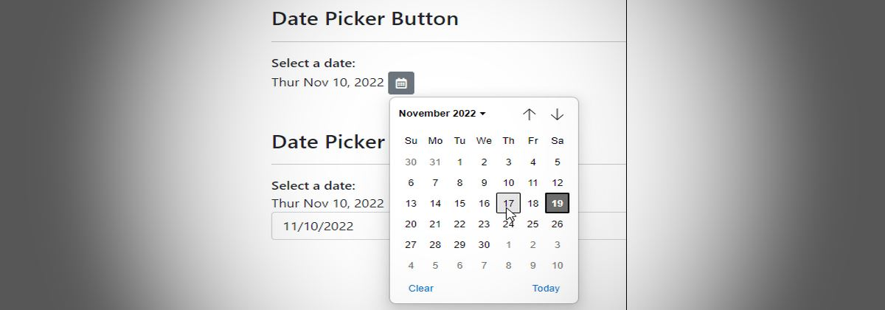
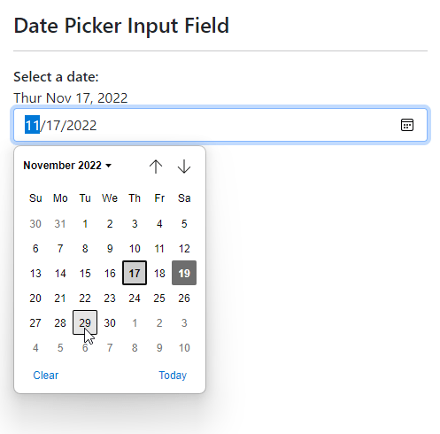
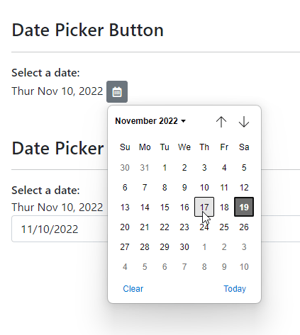

# A Button Only Date Picker and JavaScript Date Control Binding



Ah, date pickers! My favorite HTML UI feature to harp on, because it's such a shit show. How many times do we have to re-create a DatePicker for various different tools or technologies? Too many to keep track of for me...

However, it turns out that desktop browser vendors have finally gotten the memo and made at least **some minimal effort** in cleaning up the lackluster date controls in Chromium, WebKit and Firefox to the point that one can actually consider using them for date input universally now. They still only work for some feature subsets but if you just need single date entry they are actually reasonably usable now.

But even today - 50 million years after the creation of the HTML5 standard which first introduced `<input type="date" />` we still have this bare bones type control:

* Supports only UTC time, thus forcing just about any apps to convert to and from local time (with no native JS support for that)
* No control over the `<input>` control UI
* No easy way to use the calendar without the text box

In short, the control is designed for exactly one simple use case, which is date entry in a specific format with a specific non-customizable UI. For everything else there's still a requirement of using some sort of third party control.

This post is about using what's there - warts and all - and making the process of using date pickers a little easier by handling the date formatting to and from and by providing a button only calendar popup.

I'll talk about the following:

* A Date-Input wrapper component
* Button-only Calendar Popup
* A datepicker-button Vue component

You can find the code for these components on GitHub and a slightly simplified sample on CodePen:

* [date-picker native on GitHub](https://github.com/RickStrahl/datepicker-native)
* [Sample on CodePen](https://codepen.io/rstrahl/pen/vYawNzE)

## Date Controls and Dates
Why this post and small library? In short, everytime I decide to just use the native date control I have to remember how the control works and re-figure the logic and conversions required to make binding and unbinding work with a typical application that expects to display and enter dates in local time format.

If you're using plain JS code, there's a bit of work you have to do coerce dates into the right format both when binding and then again when retrieving the updated value from the control. So to do this once and for all I created a small, plain JS wrapper that makes this easier by just assigning the date value to a control and allowing for a callback when the date is updated.

##AD##

### How the native Date Control works
The way the date input controls natively works is a pain, as dates have to be formatted as a string in `ISO8601` format without a time component:

```html
<input type="date" 
       value="2022-11-29" 
       max="2022-12-05"/>
```

There are two problems with this:

*  `value` has to be assigned as a string (not a date)
*  The `value` format is a universal format (`yyyy-MM-dd`) which typically is different than local time format
* The `value` has to be provided in `UTC` time not the local time

Note that there's a `type="datetime-local"` variation that doesn't need local date adjustment, but that displays the date **and** time picker, rather than just the date picker. There's not `date-local` (Duh!). And before you say *"But Rick, a date doesn't have a time component"*, realize that dates **always** have a time associated with them, even if it's `00:00` and even that date can end up changing the date by +1 or -1 day depending on the timezone that you are in! It's not as easy as lopping off the time value and setting it to `00:00`.

So  `type="date"` controls have to be adjusted for UTC time. If you've never worked with the datepicker before you may not notice this subtle difference until you run into atime value on the date that ends up rolling over into the next (or previous) day. 😢

### Local Date Fix ups
So even for a 'date' only value, in order to reliably bind to the date control, the date has to be adjusted to UTC time. Then, when the control value has been updated, the conversion process has to be reversed to get back to a local time value from the UTC date that gets stored in the control's `value` property. 

The simple `DatePickerNative` component automatically fixes up the date both on binding and unbinding of values.

### Date UTC Conversions
The core UTC time calculations needed are from a local `Date` value to a UTC string value, and from a UTC string value back to a local `Date` value:

```javascript
// Local Date to UTC string Date
function localToGmtDate(localDate) {
    return localDate && new Date(localDate.getTime()-(localDate.getTimezoneOffset()*60*1000)).toISOString().split('T')[0];        
}

// UTC String Date to Local Date
function utcToLocalDate(utcDate) {
    return new Date(utcDate.getTime()+(utcDate.getTimezoneOffset()*60*1000));        
}
```
The first function returns a string value that can be bound to the `value` property. The second function returns a new `Date` object from a string value, which contains the local date and a `00:00` time.

Without going into too much [detail of the component](https://github.com/RickStrahl/datepicker-native/blob/master/date-formatter.esm.js), here is how it uses these function to bind the value and the pick it up the result when the date value changes via the `change` event:

```javascript
// called from initialization
function datePickerBind(element, dt) {        
    var newDate = localToGmtDate(dt);
    
    opt.element.dateValue = dt;              // pseudo property on element to hold Date value
    opt.element.value = newDate;             // the  string formatted UTC date 

    if (opt.min)
        opt.element.min = normalizeMin(opt.min);        
    if (opt.max)
        opt.element.max = normalizeMax(opt.max);
}

// called from control's `change` event
function datePickerUnbind(event) {        
    var dt = event.target.valueAsDate;
    let newDate =  utcToLocalDate(dt);
    
    opt.element.dateValue = newDate;      // pseudo property on element
    opt.activeDate = newDate;             // instance property 

    // user provided callback
    if(opt.onDateChanged){  
        opt.onDateChanged(newDate, event, _this);
    }
}
```

### Wrapping into a simple Component
To make the process of assignment and retrieval easier I use a component that basically maps a date value to an element and then allows specifying a callback handler when the date changes. You also can set min/max values to limit the displayed date range of the picker.

In use this looks something like this:

```html
<!--
*** USM globals use these imports instead:
<script src="datepicker-native.js"></script>
<script src="date-formatter.js"></script>
-->

<script type="module">
    import  DatePickerNative from "./datepicker-native.esm.js";
    
    var startDate = new Date(2023,1,7);
    var el = document.getElementById("DatePickerInput");
     
    // option configuration syntax        
    let dpn = new  DatePickerNative({            
        element: el,
        activeDate: startDate,
        // + or - 5 days
        min: 5,
        max: 10,
        // passed Date and Event object
        onDateChanged: function(dt, event, instance) {                
            console.log( dt.toLocaleString(), " onDateChanged() result date value")   

            // element gets a dateValue property
            var el = document.getElementById("DatePickerInput");
            console.log(el.dateValue.toLocaleString()," control pseudo property `dateValue`");

            console.log(dpn.options.activeDate.toLocaleString," instance.option.activeDate");
        }        
    });
</script>    
```

If you're using a standard date picker control like this:

```html
<input id="DatePickerInput" type="date" class="form-control" />
```

here's what you're going to see in a Chromium style browser (Edge here):



### Plain JavaScript
Because this component uses plain, old JavaScript it'll work in any JavaScript based environment. You can drop into a standalone page, or use it with a framework.

This component is simple, small and self contaiend and does little more than collecting the input parameters, assigning the date value on initialization, and then hooks up an event to detect the date change, that is then forwarded to code you provide.

If you want to use it, or are curious about the code, you can grab or check out the complete code on GitHub:

* [datepicker-native.esm.js](https://github.com/RickStrahl/datepicker-native/blob/master/datepicker-native.esm.js)


## Button Only Lookups
The genesis of this example was my need to add a date picker to an application that is based on a button, rather than on a full `<input type='date' />` control. 

What I want to do is essentially the following:



Where the button is independent of the date display, or there is no date display at all.

To make this work I can use the save `DatePickerNative` control described above, and apply some custom HTML and styling to essentially hide the input control part of the stock date picker control.


##AD## 

### How the native Button only Component works
To create a button only calendar involves a few steps:

* Add the button HTML
* Add `DatePickerNative.js` library
* Add `DatePickerNative.css` styles (or you can inline the CSS)

Let's start with the HTML:

```html
<button id="DatePicker" class="datepicker-native btn btn-secondary btn-sm">
    <i class="far fa-calendar-alt"></i>
    <input type="date" class="datepicker-native-input" />
</button>
```

I'm using **font-awesome** for the icon here, but you can use whatever you like for the content for the button - text, image, icon, it doesn't matter. The `btn` styles are **bootstrap** and likewise, you can use whatever you want or no styling for the button.

The important and only **required** pieces are the two styles:  

* **datepicker-native** on the`<button>`
* **datepicker-native-input** on the embedded `<input type="date" />` control

The trick to making the button work without the input control visible, is to effectively **make it invisible but still active** and then overlaying the button content over it. 

The key to **active but invisible** behavior is the CSS that uses z stack positioning:

```css
.datepicker-native {
    position: relative;
}
.datepicker-native-input {
    position: absolute;
    overflow: hidden;
    width: 100%;
    height: 100%;
    right: 0;
    top: 0;
    opacity: 0;
}
.datepicker-native-input::-webkit-calendar-picker-indicator {
    position: absolute;
    right: 0;
    width: 100%;
    height: 100%;
    margin: 0;
    padding: 0;
    opacity: 0;
    cursor: pointer;
}
```

The button is marked as `position:relative` with the input control made full width and height inside of the button. The `opacity` is 0 so the input control is not visible, but because it's `position: absolute` it sits **ontop of the button content** and is still responsive. So now when you click the button you really are clicking on the invisible date control which fires the calendar.

There's one more important piece to this: The `.datepicker-native-input::-webkit-calendar-picker-indicator` style makes the entire input date control clickable instead of just the calendar button of the native control. Interestingly FireFox makes the entire control clickable by default, so if you click anywhere on the control it always opens the calendar.

The script operation then activates the initial date binding which adjusts the date appropriately and allows any changes to fire a callback:

```js
var startDate = new Date(2022,10,10);
var el = document.getElementById("DatePicker");
 
// *** Create the component and handle the callback
DatePickerNative(el, startDate, function(dt, event) {
    // updated date is returned
    console.log(dt.toLocaleString());

    // update date display   
    showDate(dt,"ActiveDate");
});

showDate(startDate,"ActiveDate"); // initial display 
```

## Vue Component
For good measure I ran into all of this originally within a Vue application and I initially build a Vue component for a drop-in `data-button` component only later back-fitting the plain JS component. 

The Vue version is a bit less generic as it uses bootstrap and font-awesome in the template, but you can customize the template as you see fit.

The component can directly bind dates and min/max values *(activeDate is a date value on the Vue model)*:

```html
<date-picker-button
    v-bind:date-value="activeDate"
    v-on:update:dateValue="dateUpdated($event)"
    v-bind:min="7"
    v-bind:max="7"
></date-picker-button>
```       

Date value binding is one way only, and instead you have to handle an event to capture and update the new date value - `dateUpdated()` in the code below:

```js
export default {
    name: "ServiceOrderListView",
    components: { DatePickerButton },
    data() {
        vm = this; // hang on to proxy reference
        return {
            // this is our date binding value
            activeDate: mdApp.global.lastAssignedServiceSearchDate,
        };
    },
    methods: {
        // Date Update Handler 
        dateUpdated(newDate){
            if (vm.activeDate === newDate) return;
            
            // this updates the model
            vm.activeDate = newDate;
            
            // now re-run the filtered list with the new date
            vm.getServiceOrders();
        }
    }
}    
```  

> **Note:** The event does not fire if you select the currently selected date - the value has to actually change for the event to fire.


##AD##

### Vue Component Implementation
I ran into the button-only requirement originally within a Vue application, so I initially built a Vue component for a drop-in `date-button` component. Only later did I figure this would be more useful as a generic JavaScript component for other applications or single pages that need to capture and display dates. 

The Vue version is a bit less generic as it uses bootstrap and font-awesome in the template, but you might find this useful anyway as you can customize the layout for your own application.

Here's the Vue Component:

```html
<template>
    <button v-bind:class="buttonClass  + ' ' + addButtonClass" v-bind:title="title">
        <i v-bind:class="buttonIconClass"></i>

        <input type="date" class="datepicker-button-input"
               :value="datePickerBind(dateValue)"
               @input="datePickerUnbind($event.target.valueAsDate,dateValue)"
        />
    </button>
</template>

<script>
export default {
    name:"DatePickerButton",

    props: {
        title: {type: String, default: "Select a date"},
        dateValue: {type: Date, default: new Date() },
        dateId: { type: String, default: new Date().getTime().toString() },

        buttonClass: {type: String, default: "btn btn-secondary btn-sm datepicker-button" },
        addButtonClass: {type: String, default: "" },
        buttonStyle: {type: String, default: "" },
        buttonIconClass: { type: String, default: "fad fa-calendar-alt fa-fw" }
    },
    methods: {
        datePickerBind(dt) {
            return dt && new Date(dt.getTime()-(dt.getTimezoneOffset()*60*1000)).toISOString().split('T')[0];
        },

        datePickerUnbind(dt) {
            let newDate =  new Date(dt.getTime()+(dt.getTimezoneOffset()*60*1000));
            this.$emit("update:dateValue",newDate, this.dateId);
        }
    },
}
</script>

<style scoped>
.datepicker-button {
    position: relative;
}
.datepicker-button-input {
    position: absolute;
    overflow: hidden;
    width: 100%;
    height: 100%;
    right: 0;
    top: 0;
    opacity: 0;
}
.datepicker-button-input::-webkit-calendar-picker-indicator {
    position: absolute;
    right: 0;
    width: 100%;
    height: 100%;
    margin: 0;
    padding: 0;
    opacity: 0;
    cursor: pointer;
}
</style>
```

The  [date-picker-button.vue](https://github.com/RickStrahl/datepicker-native/blob/master/vue/datepicker-button.vue) component is tiny and you can simply copy and drop it into your project as needed.

## Summary
Date handling in JavaScript is a pain since there's limited support for date conversions and the native controls are extremely rudimentary in features and customization options. But with a little bit work they can be made to work reasonably well, and I hope the code here makes that process a little bit easier, or at minimum helps you with doing your own data adjustments for your custom date handling...

Time's up!


## Resources

* [DatePicker Native Helpers and Button Only Date Picker](https://github.com/RickStrahl/datepicker-native) *(GitHub)*
* [Sample on CodePen](https://codepen.io/rstrahl/pen/vYawNzE)

<div style="margin-top: 30px;font-size: 0.8em;
            border-top: 1px solid #eee;padding-top: 8px;">
    
    this post created and published with the 
    <a href="https://markdownmonster.west-wind.com" 
       target="top">Markdown Monster Editor</a> 
</div>