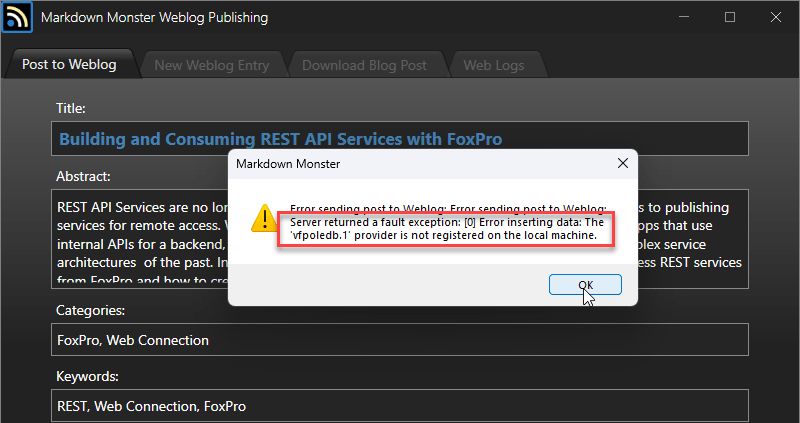
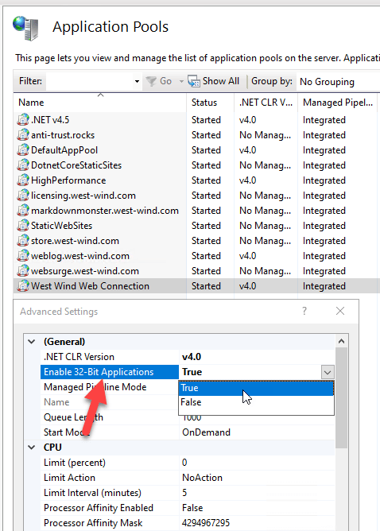
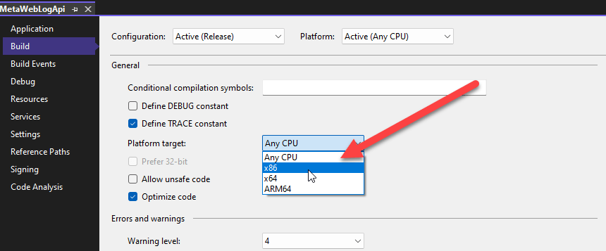

# Watch out for 64 bit Incompatibility using the Visual FoxPro OleDb Provider

Yesterday I ran into a problem in an application that has been using the the Visual FoxPro OleDb Provider. There dreaded error is:

> 'VFPOLEDB.1 provider is not registered on the local machine'

## Old Driver, New Problems
The VFP OleDb driver is old, as is FoxPro and it hasn't been updated since FoxPro was last updated around 2009. The driver is also 32 bit which is the cause of  most common problems you are likely to run into these days as host applications tend to be 64 bit by default.

There are a couple of common reasons for this error to come up:

* Most obvious: Make sure the VFP OleDb Provider is actually installed
* Make sure you are using a **32 bit version for the host application**

### Make sure the VFPOleDb Driver is installed
If you install a full version of Visual FoxPro on a machine, it automatically installs the VFPOleDb provider. But if you do a runtime install, or you have a machine that has no FoxPro installation at all, **you need to explicitly install the Visual FoxPro OleDb provider in order to use it**. 

The last version of the provider is the VFP 9.0 version.

> #### @icon-info-circle Download the last Visual FoxPro OleDb Driver
> Digging up a download of the last VFP OleDb provider is tricky, because the various Microsoft links for the 9.0 versions no longer work.
>
> However, thankfully you can download the VfpOleDb driver from the VFPX GitHub repo here (all support installers are here BTW!):
>
> [Microsoft OLE DB Provider for Visual FoxPro 9.0 (VFPX )](https://github.com/VFPX/VFPInstallers)

Make sure you install the driver and then also make sure you restart the host application that is using the driver, because the registration may not be visible until the application refreshes its environment. If you're running a Web application, you'll want to restart the Application Pool that hosts your site.

### Make sure you're using the VFP OleDb Driver in a 32 bit Application
The Visual FoxPro OleDb driver is a **32 bit component** and it **only works inside of a 32 bit application**. Most applications these days are **64 bit by default**, and that simply won't work with the VFP OleDb driver.

The big issue with this is that when you try to use the VfpOleDb provider in a 64 bit application it fails with an error that suggests that the driver is not installed:

> 'VFPOLEDB provider is not registered on the local machine'

The reason you see this message even if the driver **is installed** is because it's **not registered in the 64 bit registry** where a 64 bit application looks for it.  The error message is very misleading because the driver is installed, but the host application is not seeing it due to the bitness mismatch.

It's easy to go down the wrong rabbit hole trying to fix a non-existing driver install problem. Ask me how I know and how I wasted well over an hour in the wrong direction trying to check out the VFP OleDb installation. :smile:

But even if the driver could be found by the 64 bit application, it still wouldn't work as the VFP OleDb driver is a **32 bit InProcess COM component** and you **can't load a 32 bit COM component into a 64 bit process**. 

In summary, the error message is misleading but the result is the same: 

> You simply can't use the Visual FoxPro OleDb provider in a 64 bit application!

## How this bit me recently with an IIS Application
To give you an idea how this might affect you, here's how I chased my tail yesterday...

I ran into this issue in my [FoxPro WebLog application](https://west-wind.com/wconnect/weblog). It's a FoxPro [Web Connection](https://webconnection.west-wind.com) application, but it uses a small ASP.NET HttpHandler support component that I created to handle uploading of Weblog posts to the Web site using the MetaWebLog (WordPress) format. It's a component I use on my main WebLog Website and I adjusted it to capture the date into the FoxPro database via the VFP OleDb provider. Works great and is a nice usage of .NET and FoxPro working side by side in harmony.

The app had been running fine, and post uploads have been working just fine and dandy for years. But recently I updated my Web Server VPS machine, and ended up reinstalling IIS and manually re-creating all of the Web sites on the server.

I don't update posts on the blog much these days so it's been a while since the original upgrade, but yesterday I tried to upload a post and ran into this now familiar error from the server:

Ugh. The problem is that IIS Application Pools running .NET defaults to **64 bit**, which is why I get the error message shown in the dialog. I forgot to toggle the Application Pool to 32 bit.

### Fixing the Problem in IIS
To fix this I have to make sure that the IIS Application Pool for this application is configured as 32 bit explicitly:

In IIS the hosting is determined by the IIS Application Pool hosting process so the bitness is set by the IIS Application Pool which is the actual host process of the application. .NET Components loaded into the process then adjust to the host processes bitness (unless explcititly to something else which is unusual)

### Making .NET Applications run 32 Bit
When you create your own .NET standalone applications - an EXE most likely - you  have to specify what bitness the application should run in. 

In .NET the bitness is determined by the **Platform Target**. 

The default is **Any CPU** which means that the code is compiled so it can run in either 64 bit or 32 bit. In IIS this results in the component being able to run either 32 or 64 bit depending on what the host is running - it works either way.

For standalone EXEs that are built with **Any CPU**, the default for execution is 64 bit unless you explicitly provide a platform hint (the **Prefer 32 bit** checkbox when when **Any CPU** is set).

If you're building an application that uses the VFP OleDb driver, you probably want to **explicitly** mark it as 32 bit, since the OleDb provider won't work in any other mode.

## 32 Bit is a Dead End
The older software components like the VFP OleDb driver become, the more likely the 32 bit only use case becomes an issue as more and more software now runs as 64 bit applications. Already plugins and integrations often can't use the VFP OleDb driver because the host applications no longer support 32 bit interfaces. Unfortunately there's no good solution to that problem.

However, if the host application is under your control, or you're running under IIS, you may still be able to switch the application to 32 bit to make it work, but regardless it may be better to look for other interfacing solutions. Unfortunately you'll be no better off with the VFP ODBC driver which also exists only as a 32 bit driver.

## Alternatives: Out of Process COM or Services
There aren't very good alternatives for FoxPro if you have to work with 64 bit applications. 

One option is to build out of process COM components. Because the components are out of process they run separately from the host application in their own host and so allow you to use a 32 bit FoxPro server with a 64 bit application.

Another option is to build a Web service (including a local service) that can run in 32 bit and share data that way.

Finally VFP 10 Advanced also offers options for compiling FoxPro code to 64 bit including creating COM objects, but that introduces its own set of problems if you depend on DLLs that FoxPro might be using (I do in most of my applications) because now the 64 bit FoxPro application can't use 32 bit DLLs. Heads you lose, tails you lose, huh?

[Advantage OleDb drivers](https://www.connectionstrings.com/advantage-ole-db-provider/using-foxpro-tables/) also used to support 64 bit access to FoxPro databases, however since SAP bought them out those drivers no longer seem to be available - I can't find them any longer. If you can dig up the old drivers, that's *a potential option*.

It sucks being stuck in 32 bit, but unfortunately that's what happens eventually with legacy software that is far removed from modern development stacks.

## Alternatives: Don't use FoxPro Data!
Finally it probably should be stated that using FoxPro data from other applications is probably not the best course of action. If you use a more common data store like SQL Server, PostGres or MySql/MariaDb you have a much easier path to data interoperability. If you still are on FoxPro data, and you plan on continuing to use FoxPro, it might be a worth while consideration to at least update the data access to use a centralized data store that does not require FoxPro specific components to be accessed.

## Summary
32 bit technology is on its last leg and the VFP OleDb provider is one of the 32 bit only components that on the very end of that leg and so both the VFP OleDb and ODBC drivers are unlikely to be used in new development that needs to interface with modern applications.

But if you're already using this driver most likely you're using it in a legacy application that is 32 bit and it can probably stay that way. The key part is making sure that you remember to run the host application in 32 bit. 

That means, for now we can keep the lights on at least on the old applications...

## Resources

* [Visual FoxPro Installers and Support Files (VFPX)](https://github.com/VFPX/VFPInstallers)  
You can download the OleDb and ODBC drivers, along with VFP installers, SP2+Hotfix and Html Workshop from here.

    
    this post created and published with the 
    <a href="https://markdownmonster.west-wind.com" 
       target="top">Markdown Monster Editor</a> 

