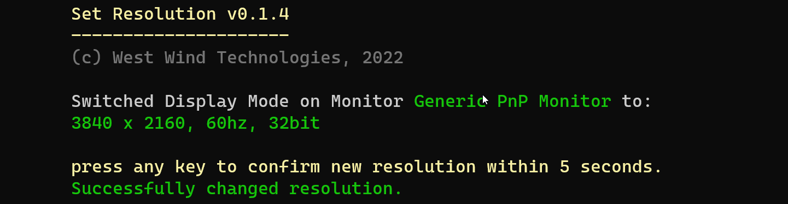
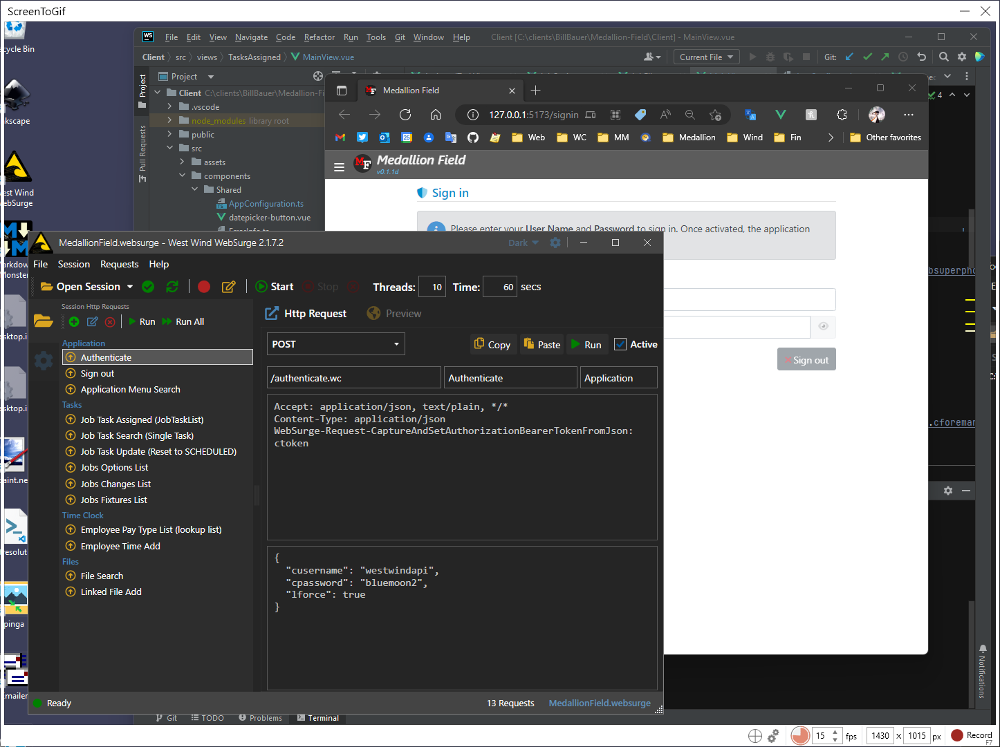

# SetResolution: Setting Windows Display Resolution from the Terminal



<small>[Download SetResolution from GitHub](https://github.com/RickStrahl/SetResolution#installation)</small>

I recently started using a desktop machine with a single attached 4k monitor after years of running on laptops with at least a dual screen setup. The single large 4k screen at 100% resolution works great in most situations, except I recently also started having constant meetings that require interactive screen sharing and the need to quickly bump resolution down to a meager 1080p or something even smaller. Eeek!.

Doing this interactively in Windows using the Windows Display Settings Widget is a pain in the ass: It requires a bunch of UI navigation and mouse clickery to get to the Display Dialog, then scroll down to the Resolution picker and then pick a mode of the long list of options. Then make sure to click '*Keep Settings*' to accept.  It takes a bit. Yeeeech!

## Do it yourself
A bit of searching didn't reveal any tools that let you quickly switch resolutions, so I sat down to create a small command line utility that lets me do just that. How hard could it be, right?

The end result is a `SetResolution` tool that looks something like this:


The idea is that you can quickly switch display modes via pre-configured profiles that specify a resolution, frequency, color bitness and if support screen orientation. Alternately you can just explicitly screen sizes and the other options directly.

The tool can:

* Set an explicit Display Resolution
* Create and use Display Mode Profiles for quick access
* List all available Display Modes and Monitors
* Support multiple Monitors
* Prompt for confirmation by default to avoid invalid display modes

The full command syntax looks like this:


After a couple of days with the tool and dozens of screen sharing sessions later, I can honestly say this was worth the couple of days of Windows Hardware hackery it took. It's making it much quicker to quickly jump back and forth between different display resolutions.

## Download Binary and C# Project on GitHub
If this is something that sounds useful you can download the binary file, or check out the full source code on GitHub. 

The output binary of this project, is a **single-file Exe** that you can just download as is and install anywhere on your machine, preferably in a folder that is referenced in your system path for easy access from anywhere.

Get it here:

* [Download single file binary directly (GitHub)](https://github.com/RickStrahl/SetResolution/blob/master/Binaries/)
* [GitHub Repository](https://github.com/RickStrahl/SetResolution)

For .NET developers, you can also quickly install this utility as a **Dotnet Tool** using the .NET 6.0 SDK

```powershell
# install
dotnet tool install -g SetResolution

# Use it
SetResolution 1080 -m2

#update
dotnet tool update -g SetResolution
```

##AD##

## Building SetResolution
As is often the case with these hare-brained ideas, I started out with a simple desire for a nice evening hacking job that ended up turning into a full weekend hacking job instead. 

First of all credit where credit is due: The initial code I used to get and set screen resolutions in Windows via the various Display Settings Win32 APIs (`EnumDisplaySettings()`, `ChangeDisplaySettings()`) are based on an old article I found on [C# Corner](https://www.c-sharpcorner.com/) by [Mohammad Elseheimy](https://www.c-sharpcorner.com/members/mohammad-elsheimy):

* [Changing Display Settings Programmatically](https://www.c-sharpcorner.com/uploadfile/GemingLeader/changing-display-settings-programmatically/)

This nice article does the hard work of pulling together all the PInvoke calls required to get all available display settings, apply a set of display settings, and return the current settings. Mohammed's code describes the required APIs and provides the PInvoke code along with a C# wrapper, which served as the base and proof of concept to allow me to build the basic resolution switching code.

For the first cut I essentially built a Console application front end around around these core APIs to allow displaying available display modes, setting a display mode, and also creating Profiles that can store the display settings into a named setting that you be quickly recalled with a single command.

I realized a few more things were needed to make this more usable:

* Filtering the Display Modes list down to a useful number to display
*(some drivers have **hundreds of modes**)*
* Adding support for multiple monitors/display devices
* Making sure you don't lock up your screen by allowing for undoing of a setting

I'm not going to rehash code in this post, since the original article from Mohammad breaks down the most relevant PInvoke code that is the meat of all this.

However, the original article doesn't discuss multiple monitors so I did have to get my hands dirty adding support for retrieving multiple monitors and applying the available display modes to a specific display driver and monitor combination.

Turns out this was a bit tricky due to the funky nested API calls required to retrieve the monitor and related display driver and available modes as well as some APIs that used different string behavior than the similar APIs Mohammed had already built and were working fine with standard PInvoke string marshalling. 

*Ah the joys of Windows API inconsistencies from API to API :smile:* 

I stuck with the original classes and added the `DisplayManager.GetAllDisplayDevices()` method and all the related native APIs required for this implementation. The [DisplayManager](https://github.com/RickStrahl/SetResolution/blob/master/SetResolution/DisplayManager.cs) and [DisplayManagerNative](https://github.com/RickStrahl/SetResolution/blob/master/SetResolution/DisplayManagerNative.cs) classes are self-contained and can be easily used outside of this project if you need this behavior in your own apps.

If you're interested all the code is on GitHub, so have at it.

## Summary
All in all this was a nice change of pace for a fun side project for me and  it has already proven to be very useful as I continue to flip back and forth between presentation modes and the full 4k on my single monitor.  It's been a nice workflow enhancing tool for me.

I hope some of you also find this `SetResolution` tool useful...

##AD##

## Bonus: Share part of your big screen using ScreenToGif
As I was looking for ways to share my screen in meetings in reasonable sizes, I thought of another cool way **to share only part of my 4k screen in a presentation**. 

Most Screen Sharing tools like Skype, Zoom, GotoMeeting, Teams etc. maddeningly let you only share either the entire screen, or an individual window, but **not an area of your screen**. Individual windows sometimes work, especially if everything can be done in a browser, but I find for the work I do I often end up having to share multiple application windows. For single screen sharing though other windows tend to display as grey boxes which is less than useful. What I really could use in some cases is to share an aproximately 1080p sized window of my 4k screen parked in one corner of the 4k screen. Or - have a way to share a window **and** al the content that overlays it. It's certainly possible as screen capture tools like CamTasia or ScreenToGif do it, so why not a meeting tool? Seems like a missed usability opportunity.

Alas - turns out you can do this one of these screen capture tools. I'm using [Nicke Martin's excellent ScreenToGif Utility](https://www.screentogif.com/) in an unconventional way as a **sharing window**. Using `ScreenToGif`'s capture window I can select a portion of my screen and 'outline' in it in the capture window. But rather than use if for capturing a screencast, I can now share the `ScreenToGif` window in Skype, Zoom, Teams etc. 

Here's what that looks like:



I can now drag any window into the capture area, and any of that content is shared in the meeting because it lives within the display of the target window. Sweet!

Note that the reason this works is because ScreenToGif's **classic mode** displays as a regular Win32 window, the content of which is used to capture moving content for creating animated GIF/APNG etc. files. Apparently STG is in the process of introducing a new capture mode that doesn't use a window but a selection area - this does not work because the sharing tools look for windows that can be shared. Looks like STG's classic mode will still be available via options though. So you might have to stick with 'classic' mode to get the sharing functionality to work for meeting window capture.

Anyway, this is another useful tool for quickly sharing a small content area from your massive 4k screen.

## Resources

* [SetResolution single file binary download (GitHub)](https://github.com/RickStrahl/SetResolution/blob/master/Binaries/)
* [SetResolution GitHub Repository](https://github.com/RickStrahl/SetResolution)
* [ScreenToGif](https://www.screentogif.com/)

<div style="margin-top: 30px;font-size: 0.8em;
            border-top: 1px solid #eee;padding-top: 8px;">
    
    this post created and published with the 
    <a href="https://markdownmonster.west-wind.com" 
       target="top">Markdown Monster Editor</a> 
</div>