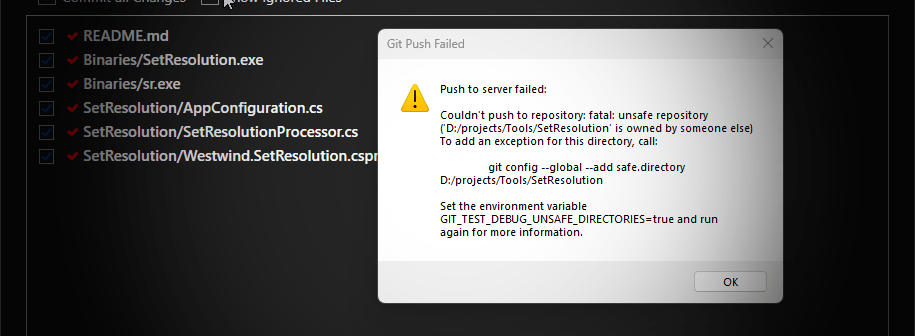
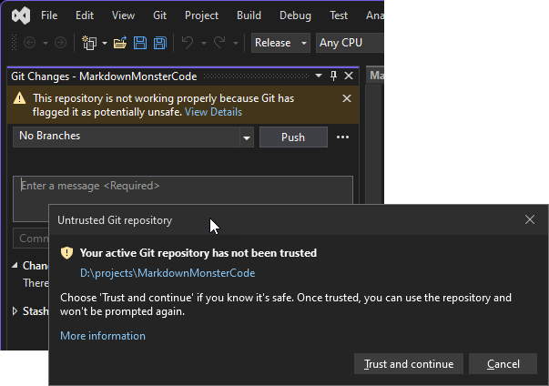
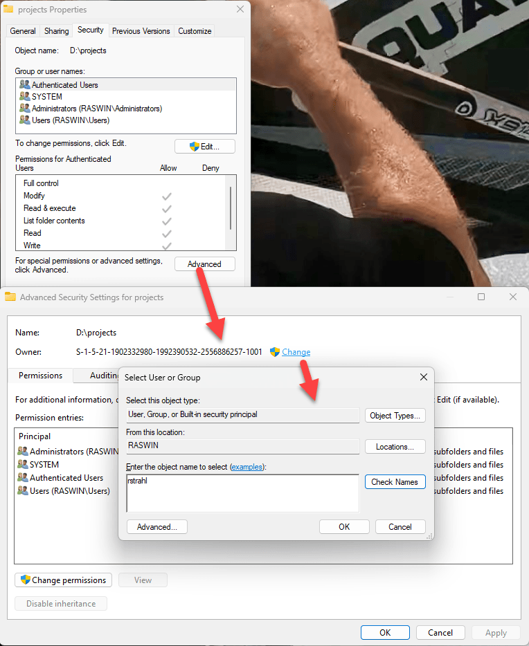

# Fix that damn Git Unsecure Repository



I'm sure you've at some point or other in recent months run into this new-ish Git issue where it haughtily declares that all of your repositories are insecure as shown in the dialog above.

This shows up from the command line as well as from various Git clients or applications that have integrated Git support (here inside of [Markdown Monster](https://markdownmonster.west-wind.com)).

This security issue started showing up in Git `v2.35.2` and later, where Git now checks for ownership of the folder trying to ensure that the folder you are using Git in has the same user as the owner as your current user account.

Windows however, has other ideas as it by default uses a generic ACL to assign user ownership which has the effective result that Git **considers every repository as unsafe** by default. Nice!


## Why oh Why?
This change in Git came about due a security issue which allows parent repositories directories to override permissions of child repositories in some situations which would potentially allow execution of commands with unintended consequences. You can read more detail about the specific vulnerability here:

[Git Security Issue: CVE-2022-24765](https://github.blog/2022-04-12-git-security-vulnerability-announced/#cve-2022-24765)

## Quick Fixes
There are a number of solutions for this problem.

* [`git config` Command](#git-config-command-fix)
* [`.gitconfig` Safe Folder List](#gitconfig-safe-folders)
* [Developer Tools can set Safe Repo Status](#some-developer-tools-can-automatically-trust-repositories)
* [Change Folder Ownership](#folder-ownership)

##AD##

### Git Config Command Fix
The most obvious solution is to run the command that the Git error suggests, which uses `git config` to add the folder to [safe] folder list:

```ps
git config --global --add safe.directory <Git folder>
```

This works fine, but it's a long command and you have to essentially do this for each and every repository - you can't use top level folders and have it recurse down the hierarchy.


What I've done originally is create a small powershell script called `gitSafeDir.ps1` that makes this a little more palatable to my limited memory:

```ps
# gitSafeDir <folder>
git config --global --add safe.directory $args[0]
```

stored in my utilities folder that's on the global path. While that's better it's still a hassle as you still have to type out or copy the folder name which can be lengthy. It's Ok if you have a one repo, but if you're like dozens you use regularily this gets old in a hurry.

### .gitconfig [safe] Folders
Another way that lets you add folders more easily in bulk is via the `.gitconfig` file which has a `[safe]` section that cotains folders that are deemed safe.

The file lives in the your user directory:

```ps
code c:\users\<username>\.gitinfo
# or
code ~\.gitinfo
```

Inside of the file you have:

```text
[user]
	name = rick
	email = 
[safe]
	directory = d:/projects/Westwind.AspNetCore
	directory = d:/projects/Westwind.AspNetCore.Markdown
	directory = D:/projects/LicenseManagerService
	directory = D:/projects/MarkdownMonsterCode
	directory = D:/projects/MarkdownMonster
	directory = d:/projects/WestwindWebSurge
	directory = d:/projects/WestwindWebSurge2
	directory = d:/projects/Westwind.WebStore
	directory = d:/clients/PRA/PraMobile
	directory = d:/projects/Westwind.Utilities
	directory = d:/projects/Westwind.WebStore
	...
```

Finally it was pointed out in the comments that you make this change **globally** by providing a wildcard operator:

```text
[user]
	name = rick
	email = 
[safe]
	directory = *
```

Et voila: Fogettaboutit! You now should not see any more of those pesky warning popups.

### Some Developer Tools can Automatically Trust Repositories
Some applications including Visual Studio and Rider now have updated their Git functionality to detect when you get an untrusted repository and prompt you to trust the repository:



which is a welcome addition.

Yet some other Git tools completely side step this issue with their own private versions of Git that don't have this issue. For example I use [SmartGit](https://www.syntevo.com/smartgit/) as my interactive Git client and even though it's on recent versions of Git I never saw this dialog. That's helpful in a pinch, but doesn't help if you're still using command line or other tool integration (ie. VS Code, WebStorm etc.) that don't have support.


### Folder Ownership
Another way that you can avoid this is by setting the folder ownership to your specific account. Folder ownership is the one thing you can do that allows you to specify a top level folder and have it recursively apply down the line which is useful if you keep your repositories in a base folder as I typically do - I have a couple of development folders under which all my repos live. I can set ownership to my account at these top level folders and the ownership can be applied recursively down so that all the repos are then under my ownership. That too appears to work.

To do this:

* Open the folder (or top level folder) in Explorer
* Right click Properties
* Go to Security -> Advanced




> #### @icon-info-circle Don't use Ownership on Shared Drives
> If you're using some sort of shared drive you might want to avoid this option as ownership is likely to vary across machines. 
> 
> For example, I'm currently using a `d:` drive that I move between machines and by setting ownership on the folder to the non-generic account, I would set ownership to a machine specific account that may not exist on another machine that I plug my drive into. For those scenarios it's better to use the other approaches of explictly specifying folder. If necessary you can copy or diff the `[safe]` folders from `.gitinfo` and move them to another machine.

## Does this fix the Security Issue? Yes...
So this fixes a fairly obscure security issue that is unlikely to apply to most people. But alas even if it applies to a small subset it has to be taken serious, right? Unfortunately, that the state of security these days - everything requires an extra step here, and another there - it's annoying as heck! 

I've been moving between multiple machine in the last few months, taking my data drive with me and plugging it into each machine I work on - for each machine these security warnings pop up again because the git configuration is machine specific. So yeah it's freaking hassle.

But this hassle ensures that you have to be very explicit about green lighting your repositories so that you don't accidentally end up with a top level repository lording it over to a lower level repo that can execute remote commands. that would be an even bigger hassle, right?

At least that's what I tell myself at night :smile: 


##AD##

## Summary
The good news is once you know how to work around this the solutions are easy if somewhat tedious. Being able to assign folders in bulk either via `.gitinfo` or via setting folder Ownership makes the process a bit easier and can be a *one and done* task.

This has been discussed elsewhere but I wanted to write this up for my own reference with the things that have worked for me so my future self can find it again. Maybe it's useful to a few of you as well - if you read this far it probably is...

<div style="margin-top: 30px;font-size: 0.8em;
            border-top: 1px solid #eee;padding-top: 8px;">
    
    this post created and published with the 
    <a href="https://markdownmonster.west-wind.com" 
       target="top">Markdown Monster Editor</a> 
</div>