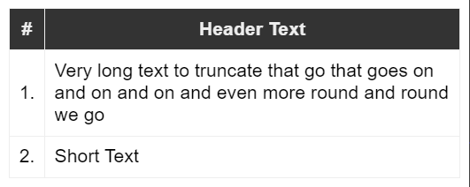
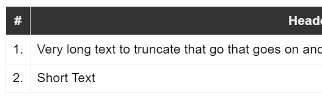
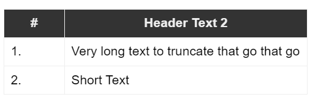

# HTML Table Cell Overflow Handling


Tables are always a pain in the ass in HTML and while I avoid them whenever I can, however sometimes you end up with list or table views that... well, that need a **table layout**. And tables are way easier for that than anything else.

Invariably though, using tables always ends in pain :cry:. Tables, rows and columns are different than any other HTML element in that they often don't follow the same rules that work everywhere else for flow characteristics, mainly in order to accomplish the dynamic layout required to keep tables rendering consistently for unknown blocks of text. I get it - browsers have to do all sorts of gynmnastics to make tables work as well as they do.

IAC, one that doesn't work the same is **text overflow handling** and that's what this post is about.

## Overflow Handling in Tables - NOT
HTML table columns - the `<td>` tag - are neither inline, nor block elements. In fact, it has its own `display` style called `table-cell`. What you'll find is that if you do something like this the content won't clip as you might expect:

```html
<tr>
   <td>1.</td>
   <td>
        <div style="overflow-x: hidden">
            Very long text to truncate that go
            that goes on and on and on and even
            more round and round we go
        </div>
   </td>
</tr>
```

Here's what that looks like:



<small>[try it on CodePen](https://codepen.io/rstrahl/pen/poZKJwJ)</small>

The text keeps wrapping despite the `overflow-x: hidden` (or `clip`) which normally clips any content that doesn't fit the width of the element, rather than wrapping to the next line.

This is because the `overflow` styles generally only work with block elements or - as we'll see in a second - fixed width elements, but not with inline or table elements.

So perhaps adding `white-space: nowrap` would be better:

```html
<tr>
    <td>1.</td>
    <td>
        <div style="white-space: nowrap; overflow-x: hidden">
            Very long text to truncate that go
            that goes on and on and on and even
            more round and round we go
        </div>
    </td>
</tr>
```

Here's what that looks like:



<small>[try it on CodePen](https://codepen.io/rstrahl/pen/poZKJwJ)</small>

This keeps the column from wrapping, but rather than clipping at the expected width, it just pushes out the table to the right beyond the Viewport.

That's even worse.

##AD##

## Fix OverFlow with a Fixed Width Cell
The fix for this is not very obvious, but you can essentially trick the table cell into thinking it's dealing with a fixed width column, **which the table can truncate**.  By using `max-width:` you trick the table into truncating at the cell limit, and so with a combination of `white-space: none; overflow-x: hidden` you can keep the table from wrapping or overflowing:

```html
<tr>
    <td>1.</td>
    <td style="max-width: 100px">
        <div style="white-space: nowrap; overflow-x: hidden;">
            Very long text to truncate that go
            that goes on and on and on and even
            more round and round we go
        </div>
    </td>
</tr>
```

Here's what that looks like:



<small>[try it on CodePen](https://codepen.io/rstrahl/pen/poZKJwJ)</small>

And that works as expected and gets the desired clipping of the text without wrapping!

Although it seems unintuitive to provide a fixed tiny max-width, the table more or less ignores that width in the cell size rendering, but treats the overflow as if the cell had that fixed width anyway.

### Adding a couple CSS Classes
To make this a little easier to remember perhaps I added a couple of CSS classes to my generic `application.css` that I use on most Web projects.

```css
}
/* allow overflow-x: hidden in child elements to work in a table cell */
.table-cell-overflow {
    max-width: 100px;
}
.table-cell-nowrap {
    overflow-x: hidden;
    white-space: nowrap;
}
```

To use it:

```html
<tr>
    <td>1.</td>
    <td class="table-cell-overflow">
        <div class="table-cell-nowrap">
            Very long text to truncate that go
            that goes on and on and on and even
            more round and round we go
        </div>
    </td>
</tr>
```

### Summary
Now do you see why HTML `<table>` tags are such a Pain in the ass? Normal styling and layout rules often don't apply to tables, but luckily there are often very hacky workarounds that are... uhm, not very intuitive. This hack is one of them!

In this case the trick is forcing the table cell that contains truncating content to a pseudo fixed width, which the table then treats as a bounded element that can be truncated. Ugly and unintuitive but hey, it works. 

I ran into this issue last week in a project where wrapping was not desired due to loss of space and we had a single table component that was reused in many places in our app. This fix solved that problem. 

I haven't seen any side effects although I can see that this might cause some odd column sizing in some scenarios depending on the column layout, but so far what I've seen in small tables, I haven't seen any change in column behavior due to the `max-width` applied. On the flip side, what if you really needed a `max-width` set? Apparently that won't work - but that's not my problem this time around :smile:

This is not exactly new, but I wrote this up because I've run into this twice now and had to go hunting through sub-sections in blog posts and SO answers to find a hint on how to fix this. I've looked this up before, but keep forgetting the solution since it's so unintuitive. Writing it up might help me find it next time. Maybe it'll be useful to some of you as well for an easier to find reference in the future. 

Go with the flow...

<div style="margin-top: 30px;font-size: 0.8em;
            border-top: 1px solid #eee;padding-top: 8px;">
    
    this post created and published with the 
    <a href="https://markdownmonster.west-wind.com" 
       target="top">Markdown Monster Editor</a> 
</div>