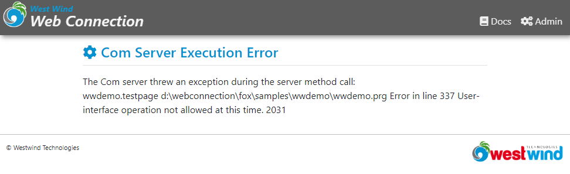

# Waiting for a delayed time in Web Connection

Here's a question that comes up quite frequently:

> How can I safely wait for a few seconds inside of Web Connection without running into problems in COM operation?

As you probably know if you use Web Connection, when you build a server application you are not supposed to have any UI interaction. So if you're used to using the following:

```foxpro
wait window timeout 2
```

or worse:

```foxpro
wait window "please hang on for a second..." timeout 2
```

to add a delay in your applications you are going to find that:

* It works fine when running Web Connection in File Mode
* It does not work when running Web Connection in COM Mode

When running in COM Mode you're likely to get an error like this one:



Not what you want...

## The Problem: No UI Support in COM
UI support is one of the few things that behave differently in file and COM modes, and while COM mode **can actually support UI operations** if you don't have `SYS(2335, 0)` set, you typically **want to enable that flag** to avoid having your application hang on 'accidental' application or system dialogs that might trigger on file access or locking or other errors.

> #### SYS(2335): Unattended COM Mode
> Web Connection by default sets an `UnattendedComMode=on` flag in your application's `yourApp.ini` file, to enable unattended mode when running in COM. When enabled any operation that uses FoxPro's user interface whether explicit via things like `WAIT WINDOW` calling `MESSAGEBOX` or the file open dialog, or implicit such as an error that can't find a database file, or a file locking operation that normally pop up a user interface.
> 
> Instead when `SYS(2335, 0)` is set, the COM server throws an error when the UI operation occurs (shown above).
> 
> This is one of the few differences between file and COM modes, so be aware of this discrepancy. It's a good idea to test your application in COM while you're working on it occasionally to make sure you don't miss an issue like this.


## Safely adding a Delay to your Code
So, `WAIT WINDOW` is not a good idea if you want your application to work both in file and COM modes. 

What should you be using instead?

There are two easy ways to do this:

```foxpro
inkey(2)
```

`INKEY()` is an old FoxPro input command used to wait for any kind of keyboard input for a given number of seconds. Note that you provided fractional seconds, however, the minimum is somewhere around *120ms* or so, so you can't do really short times beyond a value `0.1`. Although this command relies on input features which are technically not present in a COM server, this command works where `WAIT WINDOW TIMEOUT 2` fails.

The other command you can use is the Windows `Sleep()` which you can access quickly via:

```foxpro
WinApi_Sleep(2000)
```

`WinApi_Sleep()` is a global helper function in `wwAPI.prg`, which is always loaded in your WWWC apps so it should always be available to use. You specify a number of milliseconds and it basically pauses the active thread that your FoxPro COM server is using for the number of seconds.

Note that this effectively freezes the  application/COM Server while its waiting. For a server app this is likely not a problem, but you shouldn't use this function for long wait operations as it will cause Windows to think the application is frozen and cause it to get force shut down. I would say anything longer than 10 seconds is too long - if you have any thing longer that you probably should run either of these commands in a loop with a `DOEVENTS` to allow the application thread to yield to Windows and let it know that the app is still alive.

## Long Waits or Conditional Exits
If you have to wait for a long time, you should use a loop to wait along with `DOEVENTS` for yielding to Windows. But in addition to yielding and giving Windows time to breathe, you also can check for cancel or complete conditions that might be satisfied before the full wait cycle is up.

Here's what this looks like:

```foxpro
*** wait up to 20 seconds (20,000ms)
llCompleted = .F.
FOR lnX = 1 to 200 
    WinApi_Sleep(100)
    if (llSomeConditionIsSet)
       llCompleted = .T.
       EXIT  && allows checking and exiting
    ENDIF
    DOEVENTS
ENDFOR

** Go on processing regular code
IF llCompleted
   DoCompleted()
ELSE
   DoNonCompleted()
ENDIF
```

This is certainly a little more involved than a single line command, but it also allows for a lot more control over the wait process.

## Avoid Waiting in Web Applications
Now a short lecture: It's a bad idea to wait in a Web application in general. If you have long running operations that require waiting you probably should consider making the operation asynchronous, where you submit the process for processing by an external process or another service, and then check back for the result. Making users wait for anything more than a few seconds (and I mean **a few!!!**) is bad Web etiquette and is likely to result in users thinking the operation failed and re-clicking the same link which then can cause the application to get bogged down.

In addition long running requests tie up Web Connection server instances that while waiting can't process other requests. This can also result in stalling your app, especially if users think the current operation failed and they are retrying - it can quickly becomes self-reinforcing problem. 

For this reason you want to - as much as possible - avoid running requests that take more than a few seconds. My general guideline of *a few seconds* is max 5 seconds for end-user facing operations beyond which you should start thinking about offloading to some external background process using async operations.

## Summary
Sometimes waiting on an external operation to complete is necessary, and I've shown you a few ways you can deal with waiting. But make sure you are not making the user think your request has failed so keep wait times short or provide some sort of update information that provides information to the user while the long running operation is running. This is a lot more complicated than a single step operation, but it'll ensure both that your server doesn't get bogged down by the long running requests, and that your end user knows that your application is doing what it's supposed to be doing while they wait for their response.

<div style="margin-top: 30px;font-size: 0.8em;
            border-top: 1px solid #eee;padding-top: 8px;">
    
    this post created and published with the 
    <a href="https://markdownmonster.west-wind.com" 
       target="top">Markdown Monster Editor</a> 
</div>