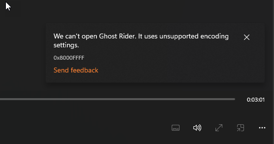

# Windows Audio Encoding Failure after Settings Change

I just ran into a crappy Windows issue that caused my machine to no longer play any audio that is going through standard Windows Audio drivers and codecs. This means most audio applications including music services such as Spotify and my browser. 

All of these apps would either just not play audio or throw up an error message similar to this one (from the new Media Player in Windows 11):

Took me a while to find the right solution for this and here is what worked for me:

* Use the Windows Troubleshooter for Audio 
* Windows Sound Setting - Audio Enhancements

### The Windows Troubleshooter
Let me start by saying I loathe to use the Windows Troubleshooter, because 90% of the time when I have a problem in Windows it doesn't do squat. 

**This is not one of those times!**  :smile:

It turns out the Windows Audio Troubleshooter is pretty thourough. When I ran it, it actually was chunking along for a good 2 minutes or so and audibly working with the audio device shifting working through different settings.

At the end of it, the Troubleshooter proudly announced success. Well, that's nothing new: It does that every time even if it doesn't fix shit. But this time around it actually **did fix shit**!

After completion I double checked audio files and several of the other apps that previously failed, and everything worked once again. Yay!

So what was it?

I noticed the **Audio format not set to default** line, which seems odd since I didn't recall setting any audio formats at any point.

However, I had made an adjustment to audio settings recently on the two audio devices I use regularily.

### Audio Enhancements Setting 
It turns out in my case the culprit was this obscure setting:

Setting the value **Off** is what causes audio to no longer play and show the afforementioned error. Apparently this setting affects the encoder that is used or some settings that are applied to the encoder which in turn then cause problems for any app using the Windows Audio encoders.

In short:

* **Off**  -  no workey
* **Device Default Effects** - all hunky dory

I don't know about you, last I checked 'playing audio' wasn't an *Audio Enhancement`. 😂 But apparently Windows thinks so and in `Off` mode audio codecs don't appear to work. Tried this on two separate machines with the same results. Not sure what Audio Enhancements does, but I guess you need it on if you want to play audio files. Hrrmph!

It's a pain to find out that an innocuous Windows setting, can be set to what seems like a perfectly valid value of -  doesn't get any more valid than off - can so thouroughly hose your system.

##AD##

### Some Apps do, some don't
What's also confusing is that apparently some applications don't use the Windows audio drivers. I have a couple of audio players that work fine with the setting in **Off** mode, while the media player, iTunes, Spotify and most other apps don't work.

Web Browsers, 5kPlayer, WinAmp all work just fine in **Off** mode while most others fail.

These applications are apparently not using the Windows audio system and instead using their own internally provided encoders so it's not a problem for them.

## Summary
Hopefully you don't run into this problem in the first place. But if you do I hope this post might help with fixing or at least pointing you in the right direction.

I'd also recommend (against the odds) the Windows Audio Troubleshooter - it seems fairly thourough for audio and managed to find the problem and fix it on its own. It also provided the necessary hint for me to track down of why audio was failing in the first place. 

    
    this post created and published with the 
    <a href="https://markdownmonster.west-wind.com" 
       target="top">Markdown Monster Editor</a> 

