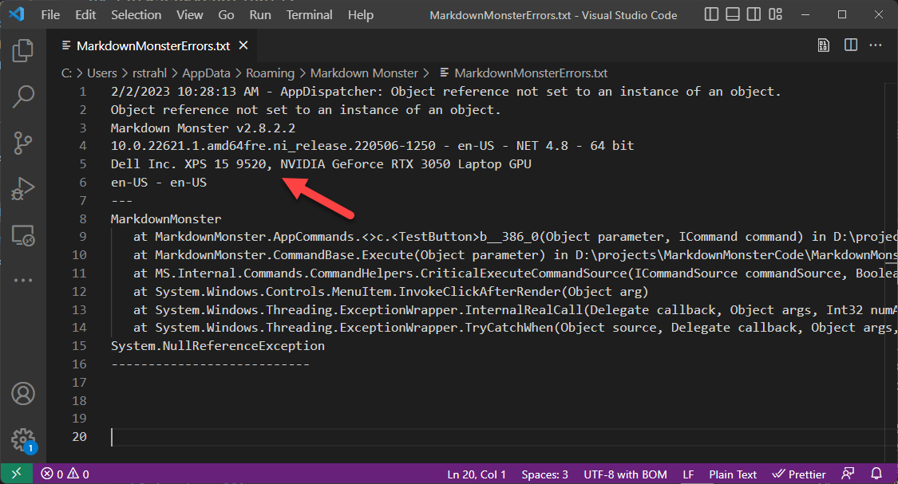

# Basic Windows Machine Hardware information from WMI for Exception Logging from .NET
Recently I've been running into problems with a couple of my WPF applications which appear to be hardware related - specifically due to two things:

* Running inside of a Virtual Machine
* Video Card used

In error logs it can be useful to track down what type of machine - and specifically whether it's a VM or a metal box - is in use and what video card is used to determine if there's a pattern.

One of the errors - [a DUCE Channel Exception in WPF](https://weblog.west-wind.com/posts/2016/Dec/15/WPF-Rendering-DUCEChannel-Crashes-due-to-Image-Loading) - for example, could be traced back to specific video cards that have a compatbility issue with specific video cards, which took forever to track down at the time.

Likewise I've now run into a few other issues that appear to occur only on virtual machines. 

## Retrieving Basic Machine Information from WMI
So, to make it a bit easier to know what type of machine is causing a problem I think it would be useful to record the basic hardware info about the machine and specifically:

* The manufacturer and model (from which you can gleam whether VM or not)
* Video Card used

All of this information is available on Windows via the Windows WMI System and in .NET via the `System.Management` libraries. WMI provides a wealth of information about the local machine and its configuration. I'm only after some basic information but you can dig up a lot more information into much of the  detail to what you can find in UI tools like [HWInfo](https://www.hwinfo.com/).

Here's some code that I added recently to provide that info into exception logs:

```csharp
// You'll need a reference to System.Management.dll

/// <summary>
/// Holds basic machine hardware info about Mfr, Model and GPU
/// </summary>
internal static string MachineInfo = GetMachineHardwareInfo();

/// <summary>
/// Get Machine Name and Model that allows to determine
/// whether the machine  is a virtual machine
/// </summary>
/// <returns></returns>
static string GetMachineHardwareInfo()
{
    string machine = null;

    try
    {
        using (var searcher = new System.Management.ManagementObjectSearcher(
                   "Select Manufacturer, Model from Win32_ComputerSystem"))
        {
            using (var items = searcher.Get())
            {
                foreach (var item in items)
                {
                    string manufacturer = item["Manufacturer"].ToString();
                    string model = item["Model"].ToString();
                    machine = manufacturer + " " + model;
                }
            }
        }

        using (var searcher = new System.Management.ManagementObjectSearcher(
                   "Select * from Win32_DisplayConfiguration"))
        {
            string graphicsCard = string.Empty;
            using (var items = searcher.Get())
            {
                foreach (var item in items)
                {
                    string gpu = item["Description"].ToString();
                    machine += ", " + gpu;
                }
            }
        }
    }
    catch { }

    return machine;
}
```

On my local machine this produces the following from `mmApp.MachineInfo`:

> **Dell Inc. XPS 15 9520, NVIDIA GeForce RTX 3050 Laptop GPU**

On my VPC Windows Web Server I get:

> **Vultr VHP, Microsoft Remote Display Adapter**

which clearly marks this as a Virtual machine.

I can now use this information and apply it to my logged output that then shows up in both local and telemetry logs:



For me this ticks the two criteria I'm looking for:

* Are we running in a Virtual Machine?  
* Which GPU is in use?

##AD##

## Code Notes
Note that the Virtual Machine question answers itself through the Manufacturer and Model name strings which are logged as is. I found a few posts that talked about determining VM status by checking the strings based on common, known VM namings, but I found that brittle as it's bound to change and even now is not reliable. For example, the VULTR VPC didn't work with the string filtering. So seeing the full Manufacturer and Model is actually more reliable in my opinion. 

The requirements may be different if you actually need to conditionally branch code based on the Virtual Machine status in which case [you can look for certain key words that indicate a VM](https://stackoverflow.com/a/11145280/11197).

Also note that the whole operation is stuffed into a `try\catch` block to make sure that if running in a very low rights environment a failure to retrieve values from WMI won't crash the application. In that case null is returned.

## Use in Logging
I use this for logging errors both locally and into AppInsights from my WPF application:

```csharp
if (ex != null)
{
    AppRunTelemetry.Telemetry.Success = false;
    AppInsights.TrackException(ex,
        new Dictionary<string, string>
        {
            {"msg", msg},
            {"exmsg", ex.Message},
            {"exbasemsg", ex.GetBaseException().Message},
            {"exsource", ex.Source},
            {"extrace", ex.StackTrace},
            {"extype", ex.GetType().ToString()},
            {"severity", unhandledException ? "unhandled" : ""},
            {"version", version},
            {"winversion", winVersion},
            {"dotnetversion", mmWindowsUtils.GetDotnetVersion()},
            
            {"machine", mmApp.MachineInfo},  // <!--- this
            
            {"usage", InternalUseCount.ToString()},
            {"registered", UnlockKey.IsUnlocked.ToString()},
            {"culture", CultureInfo.CurrentCulture.IetfLanguageTag},
            {"uiculture", CultureInfo.CurrentUICulture.IetfLanguageTag},

            {"seconds", secs.ToString() },
            {"level", ((int) logLevel).ToString() + " - " + logLevel.ToString()}
        });
}
```

## Wrap up
This works great and even after just a few days in use, this has already paid off as I've actually verified another bug I've been tracking for some time and tied it to running in a virtual machine. Unfortunately I don't have a workaround for that yet, but knowing part of the cause is a good place to start...

Lots of information is available to retrieve out of WMI so if you need to know something about the hardware environment it's probably there, although it'll take some digging in finding the right keys to retrieve. I was actually surprised that there isn't some ready-made WMI key that knows whether you're running under virtualization or not - if there is I didn't find any reference to it...


<div style="margin-top: 30px;font-size: 0.8em;
            border-top: 1px solid #eee;padding-top: 8px;">
    
    this post created and published with the 
    <a href="https://markdownmonster.west-wind.com" 
       target="top">Markdown Monster Editor</a> 
</div>