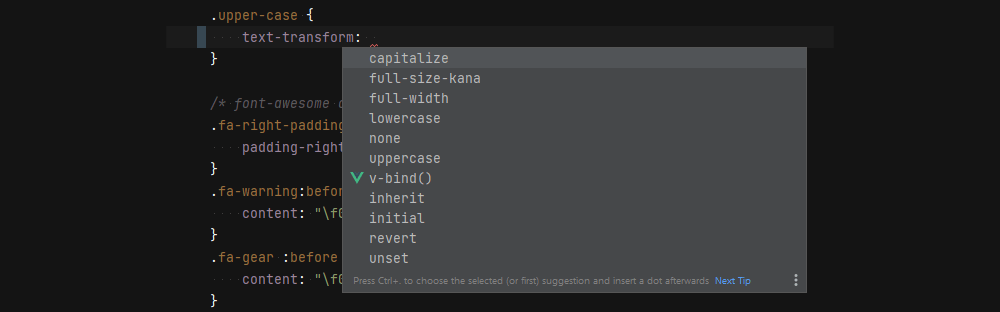
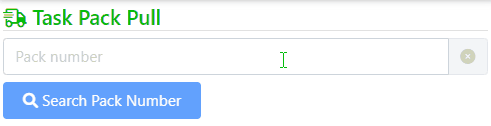
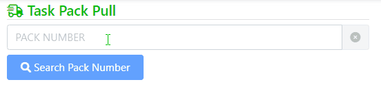
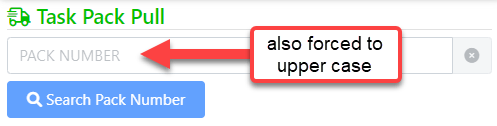
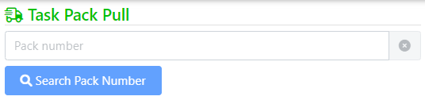

# UpperCase Styling in CSS with text-transform
I learned something new about CSS today: The `text-transform` style that allows you to apply a filter to text based **input**. It's not even a new-ish CSS property - it's [been around for quite some time in browsers](https://caniuse.com/?search=text-transform), but somehow for all these years I've missed it.

You can apply various text transformation filters to text input fields that provide things like `uppercase`, `lowercase` and `capitalize` among others:



This converts text as you type without requiring any JavaScript code, so this is a low impact solution if you need to have fields with specific case requirements.

## Using JavaScript?
In the past I've used JavaScript for this, `text-transform` is much better than JavaScript based solutions. These require intercepting the `keyup` or `oninput` event and then reassigning the text. This has all sorts of related issues, such as having to deal with selections and caret placement and characters changing as you type. 

It's not as easy as:

```html
<input onkeyup="this.value = this.value.toUpperCase()" />
```

or the slightly better version that maintains the caret position:

```html
<input onkeyup="
        const oldStart = this.selectionStart;
        const oldEnd = this.selectionEnd;
        this.value = this.value.toUpperCase();
        setTimeout(()=> this.setSelectionRange(oldStart, oldEnd),1);
    " />
```

This solution is jumpy and you can visibly see the characters changing from lower case to upper case as you type:




> To avoid the changing character behavior you can use `oninput` instead of `onkeyup`. Thanks to a comment below from Amit.

There are more complete solutions but they are essentially small libraries that aren't exactly quick and easy.

## text-transform is smoother
In many situations the `text-transform` filter is a better solution, as it is much simpler, and 'just works' the way you'd expect auto upper casing to work:

```html
<input type="text"
   autocomplete="off" autocorrect="off" autocapitalize="off" spellcheck="false"
   class="form-control"
   placeholder="Pack number"
   id="txtPackNumber"
   style="text-transform: uppercase"    
/>
```

Here's what that looks like on an input field:



I'm only typing lower case characters into the text box and as you can see the string is automatically upper cased as expected. The change is instant so you don't first see the lower case character turning to upper case as JS solutions often tend to do.

Only alpha characters are affected and number and symbols work as you'd normally expect.

Sweet! How did I miss this for so long? :smile:

## Caveat 1: It's a Transformation, not a Value Assignment
So this feature ensures that **the value you see is smoothly updated** to the correct case. However, **the underlying value is not actually updated**. 

This means if you enter `hello world`, you see `HELLO WORLD` displayed, but if you do this:

```javascript
// you see: hello world
document.getElementById("txtHello").value
```

you actually get `hello world`. Likewise if you end up posting the value to the server via server post operation you are sending the non-transformed `hello world` value as well.

To complete this solution we still need to update the actual value, and the easiest way to do that without interrupting the display is to do it when the control loses focus via `onblur`:

```html
<input type="text"
   autocomplete="off" autocorrect="off" autocapitalize="off" spellcheck="false"
   class="form-control"
   placeholder="Pack number"
   id="txtPackNumber"
   style="text-transform: uppercase"    
   onblur="this.value = this.value.toUpperCase()"
/>
```

By adding the `onblur="this.value = this.value.toUpperCase()` you are forcing the actual value to the correct case when focus leaves the field. This works fine with upper and lower which are common, but a bit more complicated if you should use `capitalize`...

You could also use the code I showed earlier using `keyup` or `input`, but then you're back to dealing with the caret location updates.

Regardless of approach, you probably still need at least a little bit of JavaScript to complete this solution.

## Caveat 2: Placeholder Text is also Transformed
There's one caveat with `text-transform` that I see with this functionality: The `placeholder` text in the control is also transformed. If you look closely at the screen capture you can see that although I have:

```html
placeholder="Pack number"
```   

set in the `input` elements, the value that actually displays is **PACK NUMBER**:



I have to squint really hard for that to make sense: I guess the idea is that the placeholder is meant to be an example of the data to enter, which then  should also be upper case. Uhm Ok, but I could also just provide the `placeholder` in upper case, and decide whether I want it to be upper or not? 

The problem here is that many applications these days actually use the placeholder as a label or comment and not necessarily as an example of what the data should look like. The placeholder casing override seems extremely heavy handed and and as a result may limit some use cases where you just can't have upper case place holder text. Grrr...

Chalk that one up as another of the silly things that W3C HTML design by comittee comes up with.

The workaround for this particular solution is to explicitly style the placeholder:

```css
.upper-case::placeholder {
    text-transform: none;
}
```

which gives back proper casing for the placeholder:



## Reuse it
Since this is a pretty useful  (especially in this application which has tons of upper cased field inputs) I created a CSS class to add to the `application.css`:

```css
upper-case {
    text-transform: uppercase;
}
```

which is then more easily reusable without explicit styling:

```html
<input type="text" id="txtPackNumber"
   class="form-control upper-case"
   onblur="this.value = this.value.toUpperCase()"
   
   placeholder="Pack number"
   autocomplete="off" autocorrect="off" 
   autocapitalize="off" spellcheck="false"
/>
```

## Supported text-transform Values
The obvious values available and most likely used ones are:

* **uppercase**
* **lowercase**
* **capitalize**

But there are also:

* **none, revert, initial, inherit**  
Standard element level CSS values

* **full-width**  
Is a keyword that forces the writing of a character — mainly ideograms and Latin scripts — inside a square, allowing them to be aligned in the usual East Asian scripts (like Chinese or Japanese). -  *[from MDN](https://developer.mozilla.org/en-US/docs/Web/CSS/text-transform)*

* **full-size-kana**  
Generally used for `<ruby>` annotation text, the keyword converts all small Kana characters to the equivalent full-size Kana, to compensate for legibility issues at the small font sizes typically used in ruby. - *[from MDN](https://developer.mozilla.org/en-US/docs/Web/CSS/text-transform)*

Honestly, I have no idea what the last one even means :smile:


## Applies to more than Input Fields
`text-transform` can be used with any element type, it's not limited to input fields. You can apply against indvidual document tags, or even entire sections of a document to force text to a specific case which can be useful. So rather than binding values using `.toUpperCase()` you can apply the `text-transform` to force the case.

The biggest utility from this style though, 

## Is Upper Case Really Required?
The most common use case likely is forcing input text to upper case, as is necessary in the application that the textbox shown above is using.

When my client brought up upper casing various inputs, **I was somewhat resistant** to adding upper casing to fields at first. After all this is a Web application with a backend API that can easily fix up user input on the server when the data is saved on the backend. After all a server application should make sure the data is valid regardless of what the client sends from the UI.

But after giving this some more thought to the issue, I also realized that not providing upper case input make things ambiguous for users. They'll ask, *Do I have to worry about casing, or not?* It's never obvious and many users will - even if auto-fixed up on the server - spent the extra and now wasted effort of explicitly using upper case, which can be a pain especially on mobile devices. 

My main hesitation originally (before finding out about `text-transform`) was I knew that JS based input solutions to upper casing are clunky and require code hookups to map.

The 'native' solution of using `text-transform` however is nearly transparent in behavior, so that's pretty much a no-brainer to add. After creating the CSS class, it's a simple matter of adding the new style to the class list of the controls in question. Easy peasy.


So auto-casing has definitely its benefits especially if it's as simple as a CSS style.


## Resources
* [text-transform Documentation <small>(Mozilla Web Docs)</small>](https://developer.mozilla.org/en-US/docs/Web/CSS/text-transform)

<div style="margin-top: 30px;font-size: 0.8em;
            border-top: 1px solid #eee;padding-top: 8px;">
    
    this post created and published with the 
    <a href="https://markdownmonster.west-wind.com" 
       target="top">Markdown Monster Editor</a> 
</div>