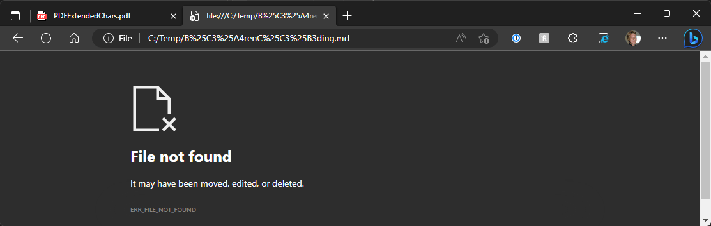
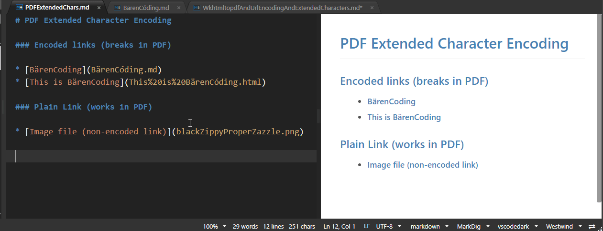
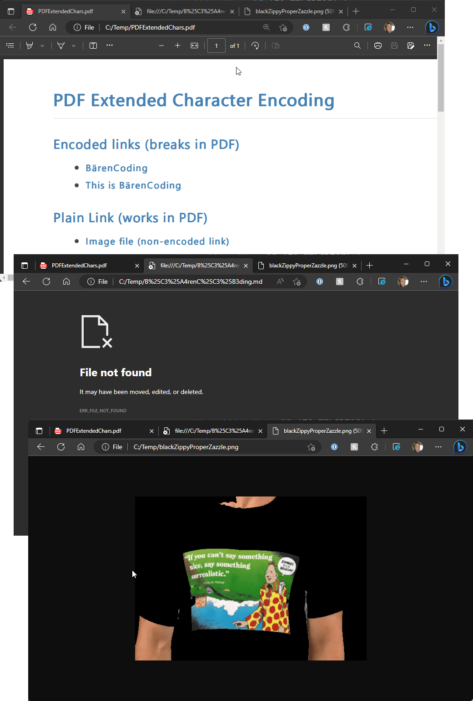

# WkHtmlToPdf: Dealing with broken Url Encoded and Extended Character Links

 ssss

[WkHtmlToPdf](https://wkhtmltopdf.org/) is a command line utility based on an old version of the Chromium engine that can be used to create PDF output from HTML documents. It's an Open Source tool with [source code on GitHub](https://github.com/wkhtmltopdf/wkhtmltopdf) that's been around for a long time and is used by many other tools and components both online and offline. It has many options for customizing the PDF output and does a fairly good job of converting documents.

But - it's definitely dated and the code base has basically been frozen 8 years or so ago. It's based on an old version of the Chromium engine, which means there are new HTML/CSS features that are not supported, along with a number of issues that don't look like they are going to get fixed.

In this post I'll talk about one of these issues which is:

WkHtmlToPdf fails to properly handle embedded links that are **already URL Encoded Links**. This sounds silly, but it appears that WkHtmlToPdf forces links to be Url Encoded **even if they are already encoded** resulting in broken links in your PDF document, even though those same links work perfectly fine in the source HTML.

Links that are not in any way Url Encoded work fine inside of the generated PDF.

##AD##

### What doesn't work?
I ran into this problem initially in [Markdown Monster](https://markdownmonster.west-wind.com) which uses WkHtmlToPdf to generate HTML output from Markdown rendered HTML. 

The [following GitHub issue](https://github.com/RickStrahl/MarkdownMonster/issues/1011) describes a specific scenario that was causing problems which is:

* Any Url that contains extended characters
* Any Url that contains already Url Encoded characters (`%20` or other escaped values)


The problem apparently is that WkHtmlToPdf *explicitly URL encodes all links** in the document before rendering the document. The problem of course is if the links were **already Url Encoded** the encoding would now double up. Not sure what purpose this double encoding serves or why you'd ever would explicitly encode link urls in what should be an already valid HTML document, but that's the observed link behavior in the PDF output.

Let me demonstrate...

The following is a simple Markdown document in Markdown Monster. It contains 3 links on the page - the first two are a link that contains extended characters in the upper ASCII set and an already URL encoded link. The last link is a link to an image file which should just open - that link contains normal text and is not url encoded.



The Markdown looks like this:

```markdown
# PDF Extended Character Encoding

### Encoded links (breaks in PDF)

* [BärenCoding](BärenCóding.md)
* [This is BärenCoding](This%20is%20BärenCóding.html)

### Plain Link (works in PDF)

* [Image file (non-encoded link)](blackZippyProperZazzle.png)
```

and the rendered, relevant part of the HTML looks like this:

```html
<h1>PDF Extended Character Encoding</h1>

<h3 id="encoded-links-breaks-in-pdf">Encoded links (breaks in PDF)</h3>

<ul>
    <li><a href="B%C3%A4renC%C3%B3ding.md">BärenCoding</a></li>
    <li><a href="This%20is%20B%C3%A4renC%C3%B3ding.html">This is BärenCoding</a></li>
</ul>

<h3 id="plain-link-works-in-pdf">Plain Link (works in PDF)</h3>

<ul>
    <li><a href="blackZippyProperZazzle.png">Image file (non-encoded link)</a></li>
</ul>
```

The HTML for this page renders fine in the preview and a standalone browser, and in both cases all three links can be navigated:

1. Opens a text editor (`.md` file not directly supported in browser)  
<small>*(inside of MM it opens the document in the Markdown editor)*</small>
2. Opens a new tab of the HTML page 
3. Opens a new tab with an image

So far so good - no surprise here.

**In short: The HTML is valid and does what you'd expect!**

##AD##

### You're breaking my Heart WKH2P!
Unfortunately, when passing this document to WkHtmlToPdf things are not so smooth. I can generate the output with this lengthy command line (all on one line):

```text
"D:\apps\MarkdownMonster\BinSupport\wkhtmltopdf.exe" 
    --enable-local-file-access 
    --image-dpi 300 
    --page-size Letter 
    --orientation Portrait 
    --enable-internal-links 
    --keep-relative-links 
    --print-media-type 
    --encoding UTF-8 
    --footer-font-size 0 
    "<veryLongPath>\__WkhtmltopdfAndUrlEncodingAndExtendedCharacters.html" 
    "C:\Temp\PDFExtendedChars.pdf" 
```

The output **looks** correct:



But... the first two url encoded links **do not work**. They show `ERR_FILE_NOT_FOUND`.

Taking a look at the link that is fired we can see why (1st one which is just extended chars):

```text
file:///C:/Temp/B%25C3%25A4renC%25C3%25B3ding.md
```

The content ended up being double encoded. Remember we started out with:

```text
B%C3%A4renC%C3%B3ding.md
```

and are now ending up with:

```text
B%25C3%25A4renC%25C3%25B3ding.md
```

What's happening is that WkHtmlToPdf is encoding the **already encoded** link again resulting in a totally incorrect and unusable URL.

Seriously??? Unfortunately - yes.

What should be happening is that the link should first be unencoded (in case it's already encoded) and **then** re-encoded. But that's not what's happening...

### Hacky Workaround: Remove HTML Link Url Encoding
After a bit of screwing around with various document encoding options, none of which help anything related to the embedded link Urls, I decided to fix this via a brute force hack:

I went ahead and pre-processed the HTML document by **explicitly removing all URL Encoding** from all Href links. 

Here's some C# code that demonstrates, using [HtmlAgilityPack](https://html-agility-pack.net/) for the HTML parsing:

```csharp
// HACK: wkhtmltopdf fucks up UrlEncoded links or links with extended characters

/// <summary>
/// Rewrites the HTML by URL decoding all links
/// letting wkhtmltopdf do the encoding to ensure that links work.
/// </summary>
/// <param name="htmlFile"></param>
public void UrlDecodeLinks(string htmlFile)
{
    // URL Decode all links
    var htmlDoc = new HtmlAgilityPack.HtmlDocument();
    using (var fs = new FileStream(htmlFile, FileMode.Open, FileAccess.Read))
    {
        htmlDoc.Load(fs, System.Text.Encoding.UTF8);
    }

    var hrefs = htmlDoc.DocumentNode.SelectNodes("//a");
    var docChanged = false;
    foreach (var href in hrefs)
    {
        var link = href.Attributes["href"]?.Value;
        if (!string.IsNullOrEmpty(link))
        {
            var newLink = WebUtility.UrlDecode(link);
            if (newLink != link)
            {
                href.Attributes["href"].Value = newLink;
                docChanged = true;
            }
        }
    }

    if (docChanged)
    {
        using (var fs = new FileStream(htmlFile, FileMode.Open, FileAccess.Write))
        {
            htmlDoc.Save(fs, System.Text.Encoding.UTF8);
        }
    }
}
```

I apply this just before running the `wkhtmltopdf.exe` executable:

```csharp
public bool GeneratePdfFromHtml(string sourceHtmlFileOrUri, string outputPdfFile)
{
    if (!sourceHtmlFileOrUri.StartsWith("http"))
    {
        UrlDecodeLinks(sourceHtmlFileOrUri);
    }
               
    var sbCmd = new StringBuilder();

    // options
    
    // required for local file access
    if (!NoLocalFileAccess)
        sbCmd.Append("--enable-local-file-access ");

    sbCmd.Append($"--image-dpi {ImageDpi} ");
    ...
```

And that fixes the problem.


In all reality that's **what WkHtmlToPdf should be doing** instead of blithely Url encoding every link. But alas, given the tool's defunct status, that's not going to happen. So here we are - we have to pre-process all document links to **not be url encoded** before passing to WkHtmlToPdf, which then Url Encodes every link to give us a valid link in the PDF. 

Convoluted as hell... but hey it works.

## Summary
WkHtmlToPdf is a useful and pretty powerful tool to convert HTML to PDF, but issues like this one and many other little quirks can be a huge time sink. Since the tool is effectively discontinued it's unlikely that this will ever get fixed. The version of Chromium that this tool uses is old and also deprecated so at some point anybody using this tool likely will have to find a replacement. It's actually surprising how well it works given the old engine status.

Unfortunately I've not had much luck finding a free or somewhat reasonably priced replacement. Most companies that make PDF converters either aren't much better than wkhtmltopdf (ie. they have their own set of different quirks), or are insanely expensive, and way beyond my budget what I can justify for a small VAR sold tool.

So I'm stuck with WkHtmlToPdf and it's quirks for now. 

As a side note, another option is using Chromium's Save to PDF functionality, which works much better in preserving document quality including this linking issue. In Markdown Monster I provide that Print to PDF as an alternative. You can either *View in Web Browser* and print from there, or in the internal preview use the the *Print* (or Ctrl-P) to bring up the same print options since the Previewer uses the MS Edge WebView control. It's an easy alternative, that has its own set of quirks and rendering issues.

When generating PDFs I often alternate between using the above WkHtmlToPdf generation and Save As Pdf. Unfortunately, Save As PDF (and print in general) doesn't optimize text layout for page breaks in the same way that WkHtmlToPdf does being more of an exact replication of the HTML content. It also doesn't produce a PDF internal TOC as most other PDF converters do.

No perfect solutions - always trade offs.

In a nutshell for large documents I prefer WkHtmlToPdf. For things like invoices or short one or two pagers Save to PDF often works and looks better.

For now this URL Decoding hack for WkHtmlToPdf allows me to plod on with this option...

<div style="margin-top: 30px;font-size: 0.8em;
            border-top: 1px solid #eee;padding-top: 8px;">
    
    this post created and published with the 
    <a href="https://markdownmonster.west-wind.com" 
       target="top">Markdown Monster Editor</a> 
</div>