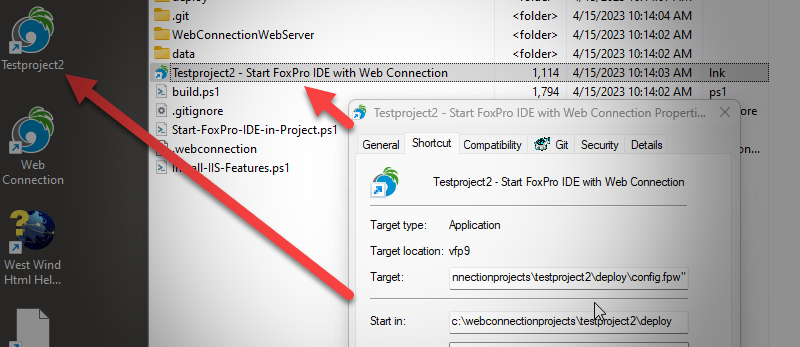
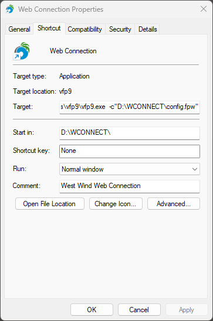
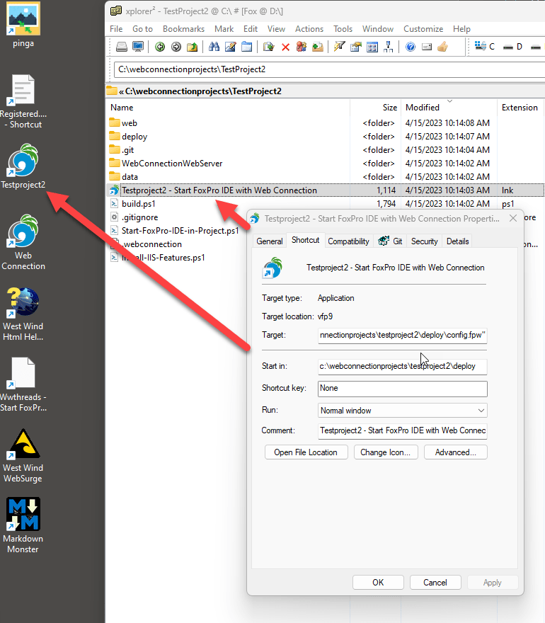
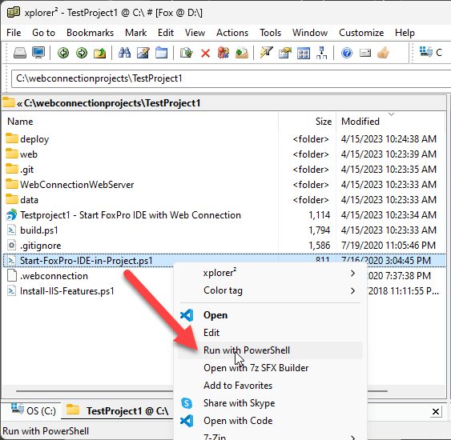
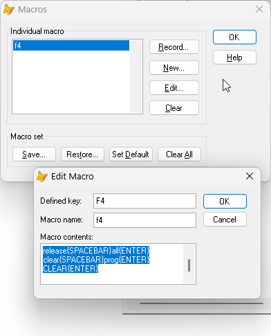

# Launching FoxPro in a Project Folder Consistently



I work with a lot of different customers that use FoxPro to build applications, and it always amazes me when I see developers launching into their application by starting FoxPro and then explicitly navigating - via `CD` commands or even interactively - to the actual project folder for about a minute, and then manually adding paths and other configuration commands to 'set up' their environment just to run their application.

To me that seems a crazy proposition: When you launch FoxPro you should be able to consistently start in a known configured environment. When you launch via a generic FoxPro command and navigate to the project folder you may or may not get a pre-configured environment that is ready to run your application. 

## Project Configuration
I like to configure projects in such a way that I have a reliable way to start them: 

* In the known project folder location
* With a clean start up environment configured
    * `config.fwp` - Base environment configuration
    * `Startup.prg` - For more complex stuff, launch from `config.fpw` via `COMMAND=DO Startup`
* Dependency paths added to the `SET PATH` setting
* Common SET Variables set:
    * `EXCLUSIVE OFF`
    * `DELETED ON`
    * `EXACT OFF`
    * `CENTURY ON`
    * `SAFETY OFF`
    * `STRICTDATE 0`
    * `REPROCESS 1 SECOND`
    * `DEBUG ON`
    * `DEVELOPMENT ON`
    * `RESOURCE ON`

Here's what my Web Connection Development startup `config.fpw` looks like for example:

```ini
SCREEN=On
TITLE=West Wind Web Connection 7.32
EXCLUSIVE=OFF
DELETED=ON
EXACT=OFF
DEVELOPMENT=On
DEBUG=ON
SAFETY=OFF
CENTURY=ON
STRICTDATE=0
MEMOWIDTH=200
RESOURCE=ON
REPROCESS="1 second"
RESOURCE=.\FoxUser.Dbf
PATH=.\classes; .\;  .\tools;.\console;.\samples\wwipstuff_samples;.\samples\wwdemo;.\samples\wwdotnetbridge;
COMMAND=DO wcStart
```

Your default environment settings may be different, but the point is that they are defined clearly here in the startup `config.fpw` file.

All of this ensures that **if I start FoxPro out of the project folder** my FoxPro environment will look a very specific way and it's ready to start running my application, without having to do additional configuration or manual folder navigation that takes up valuable seconds development time.

If your environment setup is more complex - say you need to map drives and set up other things I highly recommend you create a `Startup.prg` file that can perform all of those tasks programmatically. In that file you can do anything from setting the environment values that I also set in `config.fpw` but you can also run complex operations like making API calls to mapping drive mappings, or make wwDotnetBridge calls to set other system related settings or get startup information from services on your network or the internet. Anything at all really...

If you are using a complex setup it's probably best you only set development environment related settings in `config.fpw` and let the rest be handled by `Startup.prg`. This is a simpler version that defers to `Startup.prg`

```ini
SCREEN=On
TITLE=My Great Application v1.1
DEVELOPMENT=On
DEBUG=ON
RESOURCE=ON
RESOURCE=.\FoxUser.Dbf
COMMAND=DO Startup.prg
```

The nice thing about a `Startup.prg` file is that you can also run it from within the environment to 'reset' everything. 

> #### @icon-warning Application Configuration is Separate
> It's important **you don't rely solely on external configuration of your environment for your production applications**.  It's one thing to have a development configuration that auto-configures your development setup, but it's quite another for your deployed application running for customers.
>
> It's a good idea to have very clear environment configuration logic **inside of your application**. Whether you include something like `Startup.prg` directly into your application, or whether you create a separate explicit configuration (I typically have an `appName_load.prg` I call as part of my startup), you need to ensure your application can configure itself without any prerequisite environment requirements.
> 
> Nothing pisses customers off more than you saying: Oh you have to start the application out of this folder or you have to make sure that X is set.
>
> **Do whatever possible to make your application self-configurable** even if launched in non-standard situations.

## Launching your Development Project Environment
The key to making all of this work however is to ensure that you start with a clean environment **in the project folder**. This means avoid launching some generic FoxPro instance and then navigating to the project folder. For one, you can't take advantage of the `config.fpw` launch settings which is very useful and serves as a good default environment configuration record. But also if you `CD` into the project folder you may have other environment settings already running, paths configured, libraries loaded into memory that might interfere with your actual application. 

This is why a clean start in the startup folder IMHO is so desirable - you'll know you have a clean environment and you can get quickly back to if for some reason the environment becomes 'corrupted' or heck simple if FoxPro crashes.

So how do you launch your App out of a specific folder? There are a few ways that I use:

* Create a Desktop Shortcut
    * Place the shortcut on the desktop
    * Place a similar shortcut into the project folder (might be slightly different)
    * Web Connection automatically creates a Project Shortcut on the Desktop and in Project Folder
* Use a PowerShell script to launch FoxPro generically in the project folder


### Desktop Shortcut
Desktop Shortcuts are nice for local machines and developer setups because they are easy to launch and visually pleasing if you assign an appropriate icon to it. On the downside shortcuts require hard coded paths to the FoxPro installation, so when you manually create a shortcut you have to find the FoxPro Exe path to use. You'll have to do the same for a custom icon if you don't want the default FoxPro icon.

Here's what the Web Connection project shortcut looks like:



**Target:**\
`C:\programs\vfp9\vfp9.exe  -c"D:\WCONNECT\config.fpw`

**Start in:**\
`D:\WCONNECT\`

**Icon:**\
`D:\WCONNECT\wconnect.ico`

Notice that I explcitly provide the startup folder for the project, but also **the explicit path to the project's `config.fpw` file**. This ensures that the specified `config.fpw` is used **and not the default file that might be configured in your FoxPro IDE settings**. This one has bitten me on a number of occasions where my `config.fwp` settings were ignored when I launched out of the project folder, but didn't explicitly provide the  `-c` configuration file override.

You can place a shortcut like this on the desktop or on the Windows Taskbar for quick access on busy projects, and also add it into your project folder.

For example, when Web Connection creates a new project it automatically creates a desktop and project folder shortcut for you. Alternately if you don't auto-generate a shortcut, just copy the desktop shortcut into the project folder.



### Creating a Desktop ShortCut with FoxPro Code
As an aside you can create a desktop shortcut programmatically using the `Wscript.Shell` COM interface:

```foxpro
IF IsComObject("Wscript.Shell")
	*** Create a desktop shortcut
	loScript = create("wscript.Shell")

	lcPath = SYS(5)+CURDIR()

    IF    MessageBox("It's recommended that you use a desktop shortcut"+CHR(13)+;
              "to start Web Connection in order to configure" +CHR(13)+;
              "the development environment on startup."+CHR(13)+CHR(13)+;
              "Do you want to create the shortcut now?",32+4,"West Wind Web Connection") = 6
                  
       	lcDesktopPath = loScript.SpecialFolders("Desktop") 

		loSc = loScript.createShortCut(lcDesktopPath + "\Web Connection.lnk")
		loSC.Description = "West Wind Web Connection"
		loSC.IconLocation = lcPath + "wconnect.ico"
		loSC.WorkingDirectory = lcPath
		loSC.TargetPath = lcVFP
		loSC.Arguments = [ -c"] + lcPath + [config.fpw"]
		loSC.Save()
	ENDIF
	...
ENDIF	
```

### Creating a Generic PowerShell Launch Script
As nice as a desktop short cut is, it's not portable. Shortcuts don't work with relative paths, and you pretty much have to hard code the path to both the FoxPro IDE and location of the startup folder and `config.fpw`. This means every time you move the project you have to adjust the shortcut. It's not a huge deal, but if you share your project in a source code repository, shortcuts likely won't work necessarily across machines - in fact you probably should exclude shortcuts from committing into the SCC.

To provide a more generic solution that can:

* Find the FoxPro installation
* Determine the project relative path
* Build an execution command

you need something that can execute some code. Preferably something that can generically retrieve the location of the FoxPro installation. 
You can accomplish this with a small PowerShell script. Here's a generic launcher that also gets created into a new Web Connection project:


```powershell
###########################################################
# Project FoxPro Launcher
#########################
#
# This generic script loads FoxPro in the Deploy Folder and
# ensures that config.fpw is loaded to set the environment
#
# This file should live in any Project's Root Folder
###########################################################

# Force folder to the script's location
cd "$PSScriptRoot" 

# Get VFP Launch Command Line
$vfp = (Get-ItemProperty -Path "HKLM:\SOFTWARE\Classes\WOW6432Node\CLSID\{002D2B10-C1FA-4193-B134-D86EAECC5250}\LocalServer32")."(Default)"
if ($vfp -eq $null)
{
   Write-Host "Visual FoxPro not found. Please register FoxPro with ``vfp9.exe /regserver``" -ForegroundColor Red
   exit
}

$vfp = $vfp.Replace(" /automation","")
$vfp

# Launch VFP from the .\Deploy folder
cd .\Deploy
$path = [System.IO.Path]::GetFullPath(".\Deploy")
$path

& $vfp -c"$path\config.fpw"

# Command line back to project root
cd ..\
```

Unlike the shortcut, this code discovers the FoxPro install location when it runs, and can use relative paths based on the script's startup path. In other words, it's totally portable and can be shared by multiple developers in a shared project regardless of whether their base folders are different or not.

The code reads out the FoxPro installation location out of the registry in case installed in a non-default location (my scenario) or if using a locale that might not be using the English `Program Files (x32)` location. 

The registry holds the location of the registered FoxPro IDE runtime - a ClassId for the COM object that refers the `VisualFoxPro.Application` - and this code strips that out from the `/automation` command that COM uses to launch the FoxPro IDE.

In this case the rest of the code then is specific to the Web Connection installation which launches the FoxPro out of the `.\Deploy` folder rather than the project root where the `.ps1` script file lives. This might vary for your application, but because you can use relative paths here, this can be made to work generically regardless of what your project root folder is.

Here's how you can run the script from Explorer in the project root folder (in this case a Web Connection project):



If you have a recent version of PowerShell Core installed you can use **Run with PowerShell** context menu option to run the command. There are also PowerShell installation configuration options that allow you to run `.ps1` scripts on double click which is **not the default** (like `.bat` or `.cmd` - but hey, Windows security idiocy!) .

The advantage of the PowerShell script is three-fold:

* It's fully self-contained
* It's portable across machines as you can use relative paths
* It's text and can be shared in Source Code Repositories

## Reset your Environment
Another related tip is to be able to reset your environment by completely unloading everything loaded.

In FoxPro I use the following commands and tie them to my `F4` key as a shortcut:

```foxpro
CANCEL
CLEAR ALL
CLOSE ALL
RELEASE ALL
CLEAR PROGRAM
CLEAR
```

Go to **Tools->Macros** and add a new Macro. I use `F4` as the key: 



The macro text needs to include all whitespace expressions so it looks like this:

```foxpro
cancel{ENTER}
clear{SPACEBAR}all{ENTER}
close{SPACEBAR}all{ENTER}
release{SPACEBAR}all{ENTER}
clear{SPACEBAR}prog{ENTER}
CLEAR{ENTER}
```

Once the macro is created, you can press `F4` (or whatever key combo you assigned) in the command window to completely clear your environment, followed by `DO STARTUP` if you need additional local project configuration.

## Summary
Having a clean startup development environment is crucially important, especially if you work with many projects side by side. It saves time, reduces mistakes and makes your launch configuring automatically repeatable. It's easier to maintain as you don't have to remember random startup and launch instructions especially if you step away from the project for a few months or years and then come back.

I work with many customers and it's not uncommon for me to have multiple projects open, running and working on all of them at the same time. With totally isolated development environments that are self-configuring this process is easy.

To those of you that are already doing this you're probably nodding your head and going *Why are you telling me this? It's bloody obvious!* But as I mentioned I see  **a lot of developers** not doing this, and literally firing up either in one standard application, or even the generic Foxpro launch icon and manually navigating and then fiddling with configuration settings.

Even if you're working only on a single project, it's useful to have a simple launch sequence that gets you right into a runnable environment. Don't waste time and keystrokes on navigating to where you have to be or running commands to get the app ready - automate that process. If you're not you're also making it harder for on-boarding of new developers who have to follow the same inconsistent operations.

Do yourself a favor and make sure your environment is easily launchable and runnable, from the moment the FoxPro Command Window comes up...


<div style="margin-top: 30px;font-size: 0.8em;
            border-top: 1px solid #eee;padding-top: 8px;">
    
    this post created and published with the 
    <a href="https://markdownmonster.west-wind.com" 
       target="top">Markdown Monster Editor</a> 
</div>