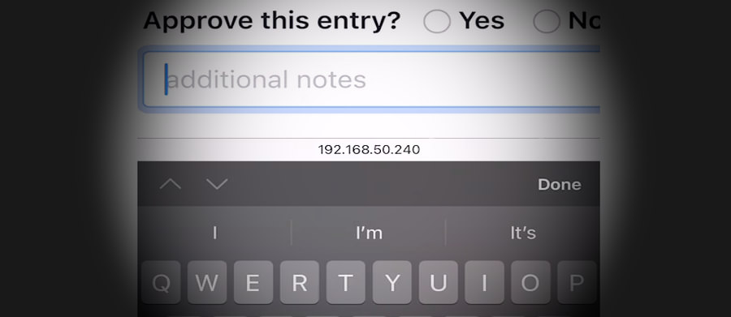
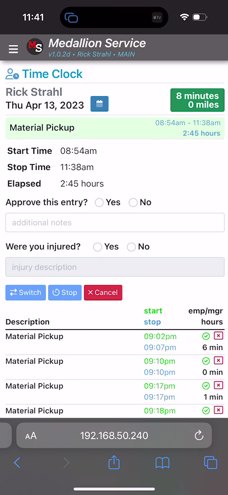
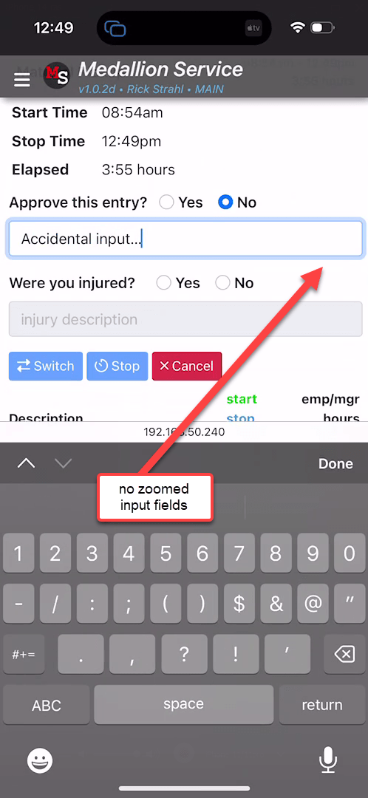

# Preventing iOS Textbox Auto Zooming and ViewPort Sizing



If you've build mobile Web applications that need to run on iOS Safari and on an iPhone you've probably run into the bouncing Viewport issue, which can occur when editing input fields:

* You focus on a Text Input box
* The keyboard pops up
* The remaining - now shrunk - Viewport zooms in
* The zoomed Viewport hides a bunch of content
* You type your text on the keyboard
* Hit done or click out into the Viewport

...and you find that the zoomed ViewPort state persists even though the keyboard is no longer active. IOW - the keyboard access zoomed in, but the zoomed in state is not ever released unless you:

* manually pinch and zoom back out to 100%
* double tap some empty area in the body content

Very ugly behavior and behavior that seems not uncommon in mobile Web applications (not just mine 😄) and which frankly makes for a real shitty mobile Web experience. 

Even worse, the experience seems incredibly pointless. Zooming in on keyboard input doesn't seem to serve a useful purpose. **After all you're not actually entering any input into the text field** - you're using the pop up keyboard. If the field was too small before zooming, it would be bad UI to just display it inactively. It's likely if the input field is too small to read/view it would get fixed, but zooming into the field on input doesn't make that scenario any better. It only provides annoying behavior that doesn't even revert when input is complete. Grrrr!

The good news is that once you know what causes the problem, the fixes are quite easy to address and that's what this post is about. As so many HTML related odd behaviors that are browser specific the cause of the problem is non-obvious and not well documented so it seems like something that's *just the way it works*. Well - that's what I thought at least, until I looked a little deeper into the cause.

For those of you too impatient to read a long form discussion here is the bottom line to avoid iOS auto-zooming:

* Use input fields with `font-size: 16px` or greater
* Use `maximum-scale=1` in the `viewport` meta tag *selectively for iOS Safari*

For more detail, read on...

##AD##

## HTML ViewPort and Sizing
Let's back up for a second. Mobile applications should set the ViewPort size in each page that displays mobile content. This can be done in the one `index.html` page for a typical Single Page Application (SPA) or each individual page that gets shown in a server rendered application. 

The recommended setting for the ViewPort tag in a mobile capable application is:

```html
<html>
    <head>
        <meta name="viewport" content="width=device-width, initial-scale=1" />
    </head>
</html>
```

This says that the ViewPort - ie. the main display area or body of the document - should use the available device's width, and that the initial scale is at 100% (1 is 100% as a fractional percentage) of the device's width. This results in your content sizing itself to the small mobile screen when it loads. Content fills from edge to edge regardless of the size of the screen, assuming responsive content sizing is applied.

And initially this looks totally fine with the view fitting exactly into the phone's screen width. For example:



But then you decide to click into the textbox and the popup keyboard pops up and at that point - depending on how your page is set up - things might start going awry. Here's what the above app looks like on text input:


As you focus onto the textbox, the keyboard pops up, but the entire ViewPort now zooms in resulting in a bunch of content overflowing on the right edge. This is annoying as hell, and I'd say one very common reason that many mobile Web applications can feel *off* and user unfriendly in behavior.

## Fixing Input Zooming on Safari iOS
As is often the case in HTML there are solutions that are relatively simple to implement, but figuring out what causes the problem often is not.

The behavior we want is:

* No auto-zooming of textbox input
* All other zooming (pinch and zoom) operations to still work

As to the fixes, there are a couple of ways that this funky zoom behavior can be avoided.

* `maximum-scale` in the ViewPort Meta Tag (selectively for iOS)
* `16px` or bigger text (easier said than done)

### maximum-scale
The first solution is an easy fix for iOS, but it has to to be selectively applied to iOS or it can cause potential accessibility issues on other mobile devices. 

The setting in question is to add `maximum-scale=1` to the ViewPort string:

```html
<meta name="viewport" content="width=device-width, initial-scale=1, maximum-scale=1" />
```

For iOS Safari (> v10) this actually fixes the problem by forcing textbox input not to auto-zoom content on focus. Despite the name and actual designed behavior of the tag - `maximum-scale` - **on iOS you can still manually pinch and zoom** and size the ViewPort larger than 100%, **but it's now a user initiated operation**: No more auto-zooming. 

On iOS this is the behavior you want to see and this fixes the auto-input zoom problem on iOS devices. Yay!

Well... not quite so Yay! Unfortunately, Android devices treat `maximum-scale` more literally and won't allow pinch and zoom sizing beyond the value specified in `maximum-scale`. So on Android, `maximum-scale=1` won't manually pinch and zoom beyond the 100% bound, which is a serious accessibility problem.

Arguably the Android/Mobile Chromium behavior - which doesn't 'auto-zoom' at any size - is the correct behavior, which is that maximum-scale defines the maximum and thus inhibits sizing beyond the scale boundary including for pinch and zoom gestures.

In fact, MDN recommends that `maximum-scale` should not be set under a value of 3 and the default is 10:

> #### maximum-scale
> Controls how much zoom is allowed on the page. Any value less than `3` fails accessibility. Minimum: `0.1`. Maximum: `10`. Default: `10`. Negative values: ignored.

What this means is once again browsers behaving differently depending on platform which is always a shitty proposition (echos of the 90's and 2000's).

Bottom line is that Safari on iOS more or less hi-jacks the `maximum-scale` behavior to affect the auto-zoom behavior, without affecting the pinch and zoom behavior, while Android treats `maximum-scale` literally and directly affects the pinch and zoom behavior. Which behavior is correct is moot, the fact is that the two platforms handle these things differently and you need to potentially work around it.

#### Selective maximum-scale for Safari on iOS
Since this unwanted auto-zoom behavior is selective behavior for iOS Safari, it's possible to hack together some startup code that only selectively replaces the meta ViewPort tag in your startup code only on iOS Safari.

First make it easy to address the ViewPort tag via an `id` tag:

```html
<html>
    <head>
        <meta id="HeaderViewport" name="viewport"
              content="width=device-width, initial-scale=1">
    </head>
</html>
```

Then check the browser's user agent for `iPhone` and replace by adding the `maximum-scale` parameter.

```javascript
if(navigator.userAgent.indexOf('iPhone') > -1 )
{
    document
      .getElementById("HeaderViewport")
      .setAttribute("content","width=device-width, initial-scale=1, maximum-scale=1");
}
```

On iOS this will stop the auto-zooming, but still leave you will the full ability to pinch and zoom. On Android the `viewport` meta tag is not updated, so it continues to use the default browser behavior since it doesn't exhibit and annoying auto-zoom behavior to begin with. In both cases pinch and zoom behavior is preserved.

The advantage of this hacky approach is that nothing in the application has to change for either iOS or Android and iOS devices can continue to use smaller than `16px` input fields without causing auto-zoom to kick in. 

It feels dirty due to the coded  nature of the fix, but it's a practical solution that works with minimal fuss and works well especially for SPA applications where this fix can be applied in one single place.

##AD##

### Font-Size: 16px or Greater
The *proper way* to fix this problem is by looking at the underlying problem which is that **iOS triggers auto-zoom when the absolute, rendered text size of an input field is less than `16px`**. Once an input field's absolute size is `16px` or larger iOS Safari no longer zooms into the field and displays it as is which is the behavior I certainly prefer. 

Setting input field size to `16px` or larger, is an easy way to fix the problem **if you knew about this problem when you started building your app**. It can be a bit more difficult to fix if you have an existing application that has input fields with smaller values or uses default font sizes smaller than `16px`. 

In my use case, of the application shown above I had several problems that were causing fields to zoom:

* Using Bootstrap
* Using a root size smaller than `16px` (ironically `15.75px` 😂)

#### Bootstrap default input font sizing: 1rem
Bootstrap uses default input field sizing for it's widely used `form-control` style as `1rem`. My first inclination was trying to hunt down the base font size. Well, Bootstrap never hardcodes the size, using `1rem` as the base. `rem` is Root Element Relative sizing, so it's based on the root element's (ie. the `<html>` tag) font-size. 

This means the root sizing is set either by:

* A CSS size defined for the `html` element
* A hardcoded `font-size` style on the `<html>` tag
* Don't set a root font-size which uses the browser default (typically `16px`)

Personally I tend to set my root font settings like font family and size in my top level CSS file (`application.css`):

```css
html, body {
    font-family: -apple-system, BlinkMacSystemFont, "Segoe UI", Roboto, "Helvetica Neue", Arial, "Noto Sans", sans-serif, "Apple Color Emoji", "Segoe UI Emoji", "Segoe UI Symbol", "Noto Color Emoji";
    font-size: 16px;
}
```
If you don't have an explicit CSS file you can also declare the size directly on the HTML element:

```html
<html style="font-size: 16px">
```

With either of these in place `1rem` now equals `16px` and assuming I use `form-control` in Bootstrap, my input no longer auto-zooms. Yay!

> If you use Bootstrap's `form-control-sm` you'll fall below the 16px/1rem minimum and you end up zooming again, so you might want to avoid `form-control-sm` for mobile applications.

#### 16px - Not as quick to Fix
Not knowing about the `16px` minimum size to avoid zooming requirement, I'd been running my app at `15.75px` on the `html` tag style in my `application.css`. Which then caused **all input fields to auto-zoom in on iOS Safari**.

Once I found the root cause of the `16px` requirement, it still took a while to trace that down to the `html` root tag and `font-size`. 

And that only addressed any fields that are using `form-control` style which is the 'regular' font size box. Several additional input fields were using the smaller `form-control-sm` designation which falls below the `16px` boundary and so still failed even after adjusting the root font to `16px`. Luckily my base font-size of 15.75px was already close so bumping it to 16px didn't cause much of a difference. But if you used a size smaller it's quite possible that the larger base font might screw up existing layouts that now start overflowing due to the larger overall control sizes.

Another work around is to explicitly override the styles that you might use like `form-control` and explicitly adding the base font-size:

```css
.form-control {
    font-size: 16px;
}
```

While that works its a bit heavy handed as that now defeats the relative sizing of controls if the base size changes. But again if you need a quick fix **just for input fields, this might work better than the root tag html document `font-size`.

Because the initial switch to `16px` base font size, took me a while to figure and because once I did find it there were a number of broken layouts that needed fixing, my  initial fix was to use iOS Safari specific `maximum-scale` hack, as it allowed us to continue running with all existing fields **as is** temporarily, until I could fix all the input field CSS classes to ensure proper sizing for the entire application.

Eventually, I was able to remove the `maximum-scale` hack and rely solely on the base font size fix. The point is that both solutions are useful even though the font-size fix is clearly the preferred mechanism.

##AD##

## Success: No iOS Zoom, Zoom
With either `maximum-scale` hack or the `16px` minimum input field font-size in place, you now get a fixed view without any auto UI zooming on textbox input:



Yay! 

I'm kind of miffed that I didn't know about this sooner, because this auto-zoom behavior has been one of the reasons I've been sorely disappointed in mobile Web app behavior. All that auto-zooming and forced manual size resetting is annoying as heck. It took me so long because I assumed that was just another one of the shitty iOS HTML behaviors, without recognizing the arbitrary `16px` auto-zoom boundary that isn't described in any specs and required a few deep searches on SO and some Twitter feed responses.

### Which approach is Best: It depends!
As I pointed out above, in my application I actually ended up using both approaches:

* Using the iPhone targeted `maximum-scale` hack for a quick fix
* Using the `16px`+ as the permanent solution

Clearly the `16px` solution is the cleaner solution of the two and if you are starting a new application from scratch you should definitely focus on that approach. While this perhaps crimps your design style (if you for some reason need smaller inputs) in general `16px`, is a pretty reasonable size for a base font size for mobile applications.

The `maximum-scale` hack if you decide to use it should be targeted only at iOS Safari, as Safari ignores the actual scaling implied by the tag and really only affects the auto zooming behavior. Even with `maximum-scale` applied, iOS can still manually pinch and zoom, while Android doesn't allow pinch and zoom if `maximum-scale ` is applied. Hence the suggestion for selective use. This selective hack is useful as a quick fix, while you take the time to properly fix input field sizes to be larger than `16px`.

## Summary
Nothing new or earth shattering in this post, but I didn't know about the `16px` boundary condition until recently and I felt like I wanted to write this down so I would remember and easily find it next time I run into this. The auto-zoom fail in iOS is such a bad UI experience and I've run into this so often in my own as well as other third party Web apps, that it's good to be reminded...

Zoom along, but not on any text input please...

<div style="margin-top: 30px;font-size: 0.8em;
            border-top: 1px solid #eee;padding-top: 8px;">
    
    this post created and published with the 
    <a href="https://markdownmonster.west-wind.com" 
       target="top">Markdown Monster Editor</a> 
</div>