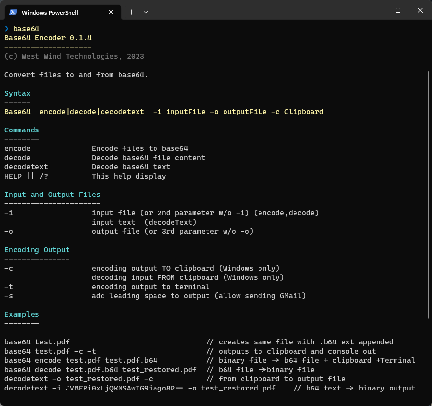

# Sending and Receiving GMail Email Attachments that contain Code or Binaries


As a developer, you're likely to occasionally send an email with attachments that are either code or binary executable files either as straight files or in a zipped up collection of code or binary files.

If you search the Web you're likely to find a few solutions like using encrypted zip files that no longer work, at least not with GMail as GMail appears to have cranked down hard on every even semi-obvious and even laborious workaround. 

In this post I go over what doesn't work and what does along with a tool that can help you to send messages and retrieve the file or files.

It's a bit of a twisted story and I'm inclined to calling **Google doing evil** on this one, so read on...

## Blockage!
The problem is that most email services - and especially GMail - these days don't actually let you send or receive binary files, or *'Code Files'* as attachments. Anything that might be **remotely** deemed dangerous or executable (even though most aren't that) are blocked. Not just in their native file form, but also when embedded in Zip or 7Zip archives and heck even inside of encrypted archives!

To give you an idea, here's GMail, trying to send a few attachments of code and binary files, that clearly won't be allowed:

  
<small>**Figure 1** - *Blocked files on an outbound email*</small>

You can see that some code files are (`.js` in this case) are marked as blocked while others like the `.cs` and `.prg` files are not. Presumably this is because `.js` files can potentially be executed **directly**. C# files can't be executed directly. The FoxPro `.prg` file is surprising in that it's not blocked, even though in really old versions `.prg` were once executable. Go figure.

You can also see in **Figure 1** that the `.zip` file contains the same `WebConnectionModule.dll` that is rejected outright and even though the content is not directly accessible it's still blocked due to the *contained* binary file and even though `.dll` files also aren't directly executable anyway. 
##AD##

If you want to find out what works and what doesn't with GMail you can create an email and start adding files - those that won't work are immediately flagged right in the UI as shown in **Figure 1**.

But it's not just GMail. For example, Outlook.com does something similar, but has different rules:

  
<small>**Figure 2** - Blocked outgoing files on Outlook.com</small>

Outlook.com is blocking the `.js` and (correctly?) `.prg` files on sending and ignoring the `.zip` file that contains both a `.dll` and `.prg` file. Encrypted Zip files are also allowed.

That seems better than GMail, until you realize that it's all really a race to the bottom: If you're using Outlook.com to send to GMail, you're still limited by GMail's stricter rules even though Outlook.com lets you send the files.

Here's Google's server rejection message:

  
<small>**Figure 3** - GMail's *Fuck you, I won't do what you tell me* email rejection notice. </small>

Are we having fun yet?

## What doesn't work?
At issue here is really what does and doesn't work and the reality is that it depends on the mail service. GMail has some of the strictest rules and unfortunately this is probably the baseline that we have to go by since so much of email goes through GMail either on the sending or receiving end. 

Googles rules for rejection are (per their policy - click on the Help link on the rejection notice):

* Any file with a possibly executable file extension (see below)
* Documents with malicious macros  (.doc/.xls etc)
* Archives that contain any of the above  (.zip,.7z,.rar,.tar etc.)
* Any archive that is password-protected or encrypted **and** contains a restricted file above. Apparently the file names are not encrypted and can be read by the scanner.
* Base64 encoded text in a `.txt` or `.b64` file if it contains a restricted file format or binary.

Filetypes that are blocked by Gmail are:   

`.ade, .adp, .apk, .appx, .appxbundle, .bat, .cab, .chm, .cmd, .com, .cpl, .diagcab, .diagcfg, .diagpack, .dll, .dmg, .ex, .ex_, .exe, .hta, .img, .ins, .iso, .isp, .jar, .jnlp, .js, .jse, .lib, .lnk, .mde, .msc, .msi, .msix, .msixbundle, .msp, .mst, .nsh, .pif, .ps1, .scr, .sct, .shb, .sys, .vb, .vbe, .vbs, .vhd, .vxd, .wsc, .wsf, .wsh, .xll`


## Sending Emails with Code or Binary Files Anyway
So, what can we do about the email restrictions, if you have one or more files that won't send or receive via email?

There are a few ways to get around this issue:

* Code Files: Rename with a `.txt` extension
* Publish Files Online and Share
* Base64 Encode files and modify slightly
* Obfuscate binary file signatures

### Code Files: Rename as .txt
If you have single code files that are text based, and that you want to attach to an email, you can simply change or add the `.txt` extension to the file. Adding is easiest as it maintains the old filename:

  
<small>**Figure 4** - Adding `.txt` to any 'dangerous' text file allows sending and receiving it.</small>

The file is then assumed to be a plain text file and from a security point of view at least can't easily be just executed as you have to at minimum rename the file explicitly. I found this to work reliably with any service.

*I find this fix ironic, because this negates the entire GMail blocking use case for `.js` files. `.js` is not a native executable script format, so whether you have a `.js` or `.js.txt` file you still have to either save the file (which you can now save to `.js`) or paste the JS text into some place where it can be executed. The whole charade around `.js` files is completely pointless.*

### Publish files online
The most reliable and also recommended way by the email providers themselves is to share restricted files using a file storage service like DropBox, OneDrive, iCloud or Google drive etc. These services make it relatively easy to drop or upload a file into a shareable location, and then create a sharing link that you can embed into your email in lieu of the files directly.

This always works, but - lets face it, it's kind of a pain in the ass and a nice scam to use up storage space on these services that are often hosted by the same company as the Email service you're using. Most users don't clean up old linked files and so you use up space.

Regardless of how you share your files externally, though, it bypasses the entire nightmare of file restrictions that email clients have on file attachments and you can publish anything everything at all.

> #### @icon-info-circle Is this really any safer?
> I fail to see how exposing an external link to a file is any safer than an email with attached files, especially attached archive files. Whether you click to download and save a file from an email, or click and save a file from a remote link is really no different. But that's where we are at with these *"We know better tech companies"*.

External file publishing comes in a number of different flavors:

* Share a file or folder link on DropBox/OneDrive/GoogleDrive/iCloud etc.
* Share on a Web or FTP Site
* Share in a GitHub Repository 

#### File Storage Sites: DropBox, OneDrive, iCloud, Google Drive etc.
If you use a file storage service, you can simply store the file in a storage folder locally usually, or you can upload it online on their Web sites. Getting the file there is easy enough, but it's still an extra step.

Here's local file in DropBox where I'm activating a shared file link:

  
<small>**Figure 5** - Sharing a file with a file storage link gets around email restrictions but it's more effort.</small>

It's obviously a bit more work as you first have to copy or upload/publish the file somewhere before you can share it. You then have to add the long cryptic link into an email so it can be accessed. 

The other issue is if you're trying to explain this to a non-techie person, they may have no idea that they may have a free OneDrive or DropBox account or how that even works. While you can receive files usually without anything other than a WebBrowser link, if you want to publish or share files, there's usually some setup that goes along with that regardless of whether you publish to a Web or FTP site, or a file storage service.

It always works once you've shared files, but the process is cumbersome.

#### Upload a File to a Web or FTP Site

You can also publish files to an FTP Site and share on your Web Site - I've done this for years, but that also is pretty tedious. 

And realistically that's only a one-way solution: I can relatively easily share a file on my server uploaded via FTP. But how about the other person on the other end? It's not so easy, unless I give FTP access to other users to share on my server (not bloody likely :smile:). 

#### GitHub Repository
Another approach is to use GitHub to share files. 

If you're dealing with other software developers using a shared repository or even separate GitHub repositories is a reasonably easy way to share files and links. 

You can either create a shared repository that both sender and receivers have access to and can simply drop files into. Or each user can have their own repository and then just link to the files independently.

I have several GitHub repositories that I use as file dumps and one of them is a generic file sharing location. 

On the downside it's all or nothing for visibility - it's either public or private but it can't be both. The other is the awkwardness of the links generated - you more or less have to navigate on the site to figure out the raw link to files.

To do this copy files into the repository folder, commit and push, then directly link to the **Raw** button link from the Web site. This looks like this:

https://raw.githubusercontent.com/RickStrahl/highlightjs-badge/master/highlightjs-badge.js

The recipient doesn't have to know how to use GitHub as long as you send them directly to the final download link.

### Send as Base64 Text File
This final solution is a bit geeky as it requires some tooling to create a Base64 file from your actual file or files.

The idea is that **you can turn any file into a Base64 encoded text file**. Now, GMail is still smart enough to detect Base64 content as binary content, and then scans it looking for specific file signatures and it can still sniff out restricted file formats. 

However there's a glitch in the Matrix: It appears that GMail can be fooled by slightly modifying the Base64 output **such as by pre-pending a  space to the base64 content** :joy: 

When you change the Base64 code even the slightest, it becomes just 'plain text' to GMail and is allowed to send and be received by GMail. The simplest thing to do is add **a blank space before the Base64 content** (at least for now GMail doesn't catch that).

Below I describe a small utility you can run to turn any file into a Base64 file with a single Terminal command, or - with a small registry tweak on Windows - as an Explorer File Context Menu action that does the same interactively. 

The tool can also convert back Base64 content and create a file from it. And: It has the ability to optionally inject extra characters before the Base64 content and it auto-trims any input Base64 content so any leading or trailing spaces are ignored.

But even better, on the receiving end to turn the Base64 back into a plain binary file, you can use the widely and easy to use the [7Zip Archiver](https://www.7-zip.org/)  to decode the Base64 content. 7Zip understands Base64 - including trimming the content of white space - and lets you pick up the original file. 

So the workflow to send an email with an attachment is:

* Find the file in Explorer
* Open a Terminal in that folder and run `Base64 WebConnectionExperimental.zip`
* *Or:* Use the File Context Menu mapping in Explorer (see below)
* Attach the `WebConnectionExperimental.zip.b64` file into the email
* Send the email (it goes through)

The recipient then receives the email and has an attached `.b64` file. The user then:

* Opens email
* Saves the attached `.b64` file to disk in desired location
* Use 7Zip to open the file
* *Or:* use `Base64.exe` to decode the file and save
* Save the file to the desired location
* Delete the `.b64` file

Here's what that workflow looks like:


<small>**Figure 6** - Using the Base64 conversion utility allows you to convert and attach files, and using 7Zip to convert back to file. </small>

Yeah it's still a bit more work than just attaching a file, but with a few extra steps you can at least get files that make it to the recipient and can be relatively easily retrieved by the recipient with a somewhat mainstream and free tool (7Zip).

#### Creating a Base64 Converter Console Utility
In the above example I use the Base64 converter utililty to convert the file to attach to Base64 with an extra leading space - so it's kind of custom to support these email shenanigans.

You can use this utility from a Terminal Command line as follows:

  
<small>**Figure 7** - The Base64 CLI conversion utility</small>

You can grab the utility from:

You can download the single file `Base64.exe` file directly from the [GitHub site](https://github.com/RickStrahl/Base64) here:

[Base64.exe Single File Exe](https://github.com/RickStrahl/Base64/raw/master/Distribution/Base64.exe)

Or, if you're a .NET user that has the .NET SDK 6.0+ installed, you can also install the cross platform version of the tool as a **Dotnet Tool**.

```ps
dotnet tool update -g Westwind.Base64
```

*Note that the Clipboard features (`-c`) do not work in the Dotnet Tool version at this time.*

The simplest way to use it is to pass in a single file name and it'll create a side by side `.b64` file:

```ps
# Creates WebConnectionExperimental.zip.b64
Base64 WebConnectionExperimental.zip
```

If you want to add the extra leading space:

```ps
# Creates WebConnectionExperimental.zip.b64
Base64 WebConnectionExperimental.zip -s
```

The Windows version also supports dumping the output to the Clipboard using the `-c` switch and you can dump the output into the terminal's Console output via the `-t` switch.

You can also reverse the encoding and retrieve the base binary file from a `.b64` file:

```ps
# Creates WebConnectionExperimental.zip
Base64 WebConnectionExperimental.zip.b64 
```

There are also more explicit commands using the `encode` and `decode` actions and the `-i` Input and `-o` output file names. You can find out more on the [GitHub site](https://github.com/RickStrahl/Base64) or by looking at the source code.

#### Creating a Base64 Windows Explorer Context Menu Option
On Windows you can make life for encoding a little easier by creating a Context Menu Shortcut to encode files to Base64:

  
<small>**Figure 8** - Making life easier with a Explorer Context Menu option to create a `.b64` file.</small>

If you plan on using Base64 conversion and sending a lot of attachments, you can make this a little easier by creating a context menu shortcut in the registry by pointing to your `Base64.exe` executable like this:

```plaintext
Windows Registry Editor Version 5.00

[HKEY_CLASSES_ROOT\*\shell\Base64]
"Command"="C:\\Users\\rstrahl\\Dropbox\\admin\\Base64.exe"
@="Convert to Base64 file (.b64)"

[HKEY_CLASSES_ROOT\*\shell\Base64\command]
@="C:\\Users\\rstrahl\\Dropbox\\admin\\Base64.exe \"%1\ -s" -s"
```

Adjust the path to point at your location. Once you do, you get a **Convert to Base64 (.b64)** shortcut on all files in the context menu that will create a base 64 version of the file with a `.b64` extension that you can attach to an email:


Note that 7Zip can decode and open Base64 files **natively**, including stripping off leading and trailing spaces. So if you have it installed you can open the `.b64` file and extract the original file to either copy to disk, or if it's an archive file, you can directly  drill into the archive to extract individual or all files. Yay!

If you rather do the conversion on the command line you can use the `Base64` tool:

```ps
# Simplified syntax
base64 WebConnectionExperimental.zip.b64

# Verbose syntax
base64 decode -i WebConnectionExperimental.zip.b64 -o WebConnectionExperimental-downloaded.zip
```

## More Options
I posted some thoughts of this topic originally on Twitter and that topic took off with lots of access and many comments. 

One other useful comment I saw relates to the fact that you can basically mangle any file by modifying the lead bytes of the file to throw of Gmail's file parser and treat the file as an unknown format.

For example:

<blockquote class="twitter-tweet" data-theme="dark"><p lang="en" dir="ltr">I&#39;ve just tried reversing byte array of a binary file using very simple powershell script and Gmail accepted</p>&mdash; Krzysztof Jeske (@krjeske) <a href="https://twitter.com/krjeske/status/1652756835386966018?ref_src=twsrc%5Etfw">April 30, 2023</a></blockquote> <script async src="https://platform.twitter.com/widgets.js" charset="utf-8"></script>

That's a good idea: You can reverse the entire file, or preferably just a few of the leading bytes, then write out the changed file. Boom - the file signature is no longer recognizable. You can then send that file using an unknown file extension like `.zzz` which google should accept. To decode you then reverse the reversion :smile: to create the original attached file.

This would be easy to set up, but it does have the drawback that you need tooling **on both ends** whereas the Base64 solution allows using a reasonably widely used and easy to use tool like 7Zip to decode the file for the recipient at least.

The idea of both of these approaches is the same though: Basically you set up to fool GMails file identification algorithm via the a fire few bytes signature that doesn't match a known format. 

## Summary
It's really sad to see that we've come to this point. While security surely is very important and we don't want people to receive just any kind of file, it really shouldn't be **this difficult** to send files - even files that can be executed - over email. 

It makes sense to prohibit anything that can be **executed directly** from within an email to avoid accidental or even automated clicking, or even if saved to disk, but going to the lengths of even prohibiting content in embedded Zip files that have to be **explicitly and deliberately unpacked** and may even require a password, is quite inappropriate. 

Nobody is going to *'accidentally click on a file inside of an encrypted zip file'*. And if somebody can socially manipulate you to do that, then I got a bridge to sell you!

The solution of using a Base64 encoding or binary re-writing of bytes in a file aren't especially intuitive, it can be useful especially if you are going to share files frequently with another user. With the right setup the process can be reasonably easy.

All of this is a pain in the ass, from understanding what you can and cannot send safely, to actually forcing content into a format that will make it to the recipient.

It is what it is and it sucks, but I hope this post has given you some idea how you can get around some of the email sending limitations.

## Resources

* [Download `Base64.exe` Console App (Windows)](https://github.com/RickStrahl/Base64/raw/master/Distribution/Base64.exe)
* [Westwind.Base64 Dotnet Tool](https://www.nuget.org/packages/Westwind.Base64)
* [Base64 Github Repository](https://github.com/RickStrahl)