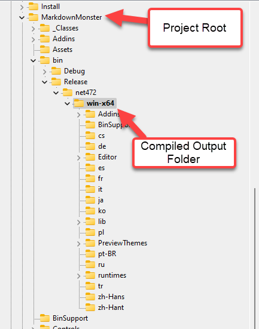

# Setting an Absolute Output Path for .NET SDK Projects


Here's a short post that I needed to write for my own sanity **so that I can remember** how to force build output from a .NET SDK Project into a very specific folder without the deeply nested target framework folder hierarchy.

Output from the .NET SDK project tend to be deeply nested:



Nothing like having to navigate 4 levels down to actually get to your compiled binaries. :joy: 

The structure is:

* `bin` output folder
* **Configuration** - Debug/Release typically
* **Target Framework** - ie. `net472`, `net60` or `netstandard2.0`
* **Platform Identifier** - ie. win-x64, win-x86, linux

While this looks messy and makes it annoying to navigate to your code, this is actually a **wonderful feature** of the new SDK style projects:

This folder structure among other things allows you to have a single project that can output to **many different kinds of output targets from a single build**. This is a huge time saver for building components or applications that **target multiple .NET frameworks or platforms from a single source**.

## Gimme, Gimme, Gimme a Single Folder
But on the few occasions when you want to **explicitly force a project into a specific folder** all of this nested output structure is **definitely not what you want**!

If you want to output your final build binaries into a very specific folder, without the folder hierarchy here's how to do it.

##AD##

The trick is a **a couple of settings** in your project file:

```xml
<PropertyGroup>
   <OutputPath>$('AppData')\Markdown Monster\</OutputPath>
   <AppendTargetFrameworkToOutputPath>false</AppendTargetFrameworkToOutputPath>
</PropertyGroup>
```

`OutputPath` is pretty obvious and you can probably find that with project IntelliSense pretty easily and you might even remember that setting.

But if you just use `OutputPath` on its own the output is written into the specified folder, but **you'll still end up with the entire enchilada of nested output target folders**. 

In order to get output in to the `OutputPath` you specified you also need `<AppendTargetFrameworkOutputPath>` set to `false`. Once set, the output will behave in the familiar way that class .NET projects used to output into the target folder you specified in the project settings.

The key is that you need both:

* `<OutputPath>Your-Final-Binary-Path<OutputPath>`
* `<AppendTargetFrameworkToOutputPath>false</AppendTargetFrameworkToOutputPath>`

## When do you need a forced Output Location?
This is not something you need often. In most situations there's no need to write output to a specific folder and you can use the default nested structure. After all it's rare that you need to access the binary output folder directly.

But I have a few situations where I need a very specific output location:

* **Addins**  
In Markdown Monster I need to ensure that Addins are written into a specific `Addins` folder so that the main application can find the Addins where it expects them.

* **In-Place Installed Application Debugging**  
In some situations, I've needed to debug an application **in place** in its installed location, in order to work with specific location, file and configuration dependencies.

* **Single File Applications**  
When building single file applications - mostly some sort of utility - it's often useful to just dump the application into it's final use location in a globally shared folder that's in the path and run it from directly from the Command Line. 
  
  Recently when I built a [SetResolution tool](https://weblog.west-wind.com/posts/2022/Dec/06/Setting-Windows-Display-Resolution-from-the-Terminal) using a global path and actually running the app directly from the command line was preferrable to running the app through Visual Studio or the debugger.

All of these tend to be rare use cases, but when you need it, you really need it.

## Quick note on Output Path
If you use the `<OutputPath>` element to force an explicit path there are a number of ways you can provide that path: 

* Hardcode a physical path
* Use a relative path
* Use any environment or project defined variables via `$('var')` expressions

For the latter you can do useful stuff like what I use for pushing my Markdown Monster Addins into the correct output folder for execution:

```xml
<OutDir>$(SolutionDir)MarkdownMonster/bin/
$(Configuration)/$(TargetFramework)/win-x64/Addins/Weblog</OutDir>
```
<small>*(all on one line)*</small>

> Note that in this case `<AppendTargetFrameworkToOutputPath>` is not required because the build system apparently detects the target and configuration keys in the path and doesn't explicitly add yet another path.

##AD##

## Summary
Nothing new or earth shattering here, but if you're anything like me you either didn't know about, or even if you did know, you probably couldn't remember what the name of that `AppendTargetFrameworkOutputPath` configuration switch was. I've used this thing on a number of occasions, but I'll be damned if I could remember the name of the configuration key

Just today before I started writing this up I had a support component that needed to be dumped into a folder to interact with an existing legacy non-.NET application. I didn't spent 20 minutes trying to unearth that fucking setting name, searching through old projects. :smile:

Well, no more. Now I know where to find it - right here. Hope this is useful to some of you as well...

 <div style="margin-top: 30px;font-size: 0.8em;
            border-top: 1px solid #eee;padding-top: 8px;">
    
    this post created and published with the 
    <a href="https://markdownmonster.west-wind.com" 
       target="top">Markdown Monster Editor</a> 
</div>