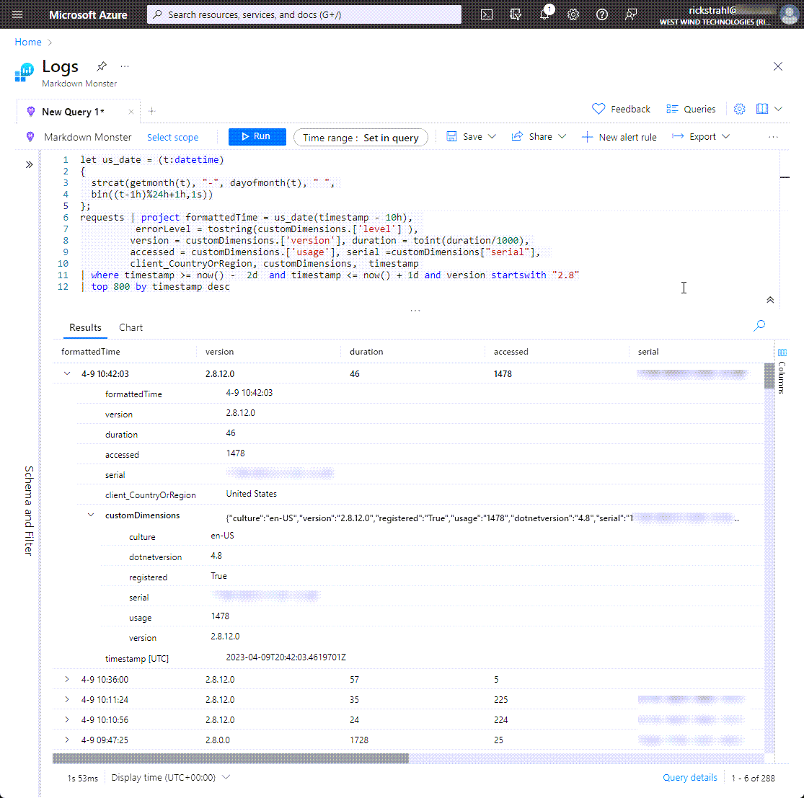
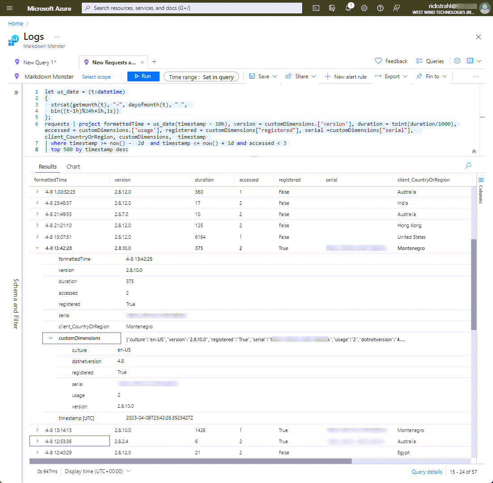

# Using Application Insights in .NET Desktop Applications


On several occasions in my blog I've talked about my use of Application Insights for application usage and exception logging in my desktop applications. Specifically both [Markdown Monster](https://markdownmonster.west-wind.com) and [West Wind WebSurge](https://websurge.west-wind.com) which are commercial desktop applications integrate with Application Insights to provide me with valuable feedback about my applications. Every time I mention it in a post, there are a few people who seem surprised that you can actually use Application Insights in desktop applications and want more info. Well, this post is for you.

The reason some people are surprised is that App Insights clearly was designed for Web sites, APIs or applications that are essentially request based. Whether for HTML Web apps or APIs the main features of the tool support request based processing, which is not how you typically deal with logging and analytics in a desktop application.

The needs of my desktop applications for analytic logging tend to be pretty basic and the operations really boil down to two top level tasks:

* Application Start and Stop logging
* Exception and Trace Logging 

The error logging breaks down into multiple types of logging from hard application failure logging (critical) to known and well understood logging of application 'incidents' plus a very few trace messages.

To be clear, this post isn't meant to cover all aspects of Application Insights. In fact, I'm going to be describing my very specific usage scenario and implementation. 

I'm by no means using all the features of Application Insights - I use a bare minimum, but yet I find this usage extremely beneficial for me to get the basic usage statistics and more importantly the critical error information that helps me track down and fix application errors in the application effectively.

## Application Insights - Setup
Application Insights is an Azure service, so in order to use it you'll need to use an Azure account and set up an Application Insights application. 


Then go ahead create a new Resource Group, and new Application Insights instance:


Once you're set up you should have an Application Insights main page that looks something like this:


The key item you'll need in order to add Application Insights to your application, is the **Instrumentation Key** and/or **Connection String** so copy that value to your clipboard for later use to provide credentials.

### Pricing
Before I jump in I also want to mention that although Application Insights uses Azure and you'll need an Azure account, using the tool - at least the way I'm using it - is very cheap. In fact, most months of usage **don't actually incur any charges** on my billing statement at all. I get a lot of $0 bills for my App Insights billing.  I'm on a Pay as you Go account and many months I don't see any charges at all - and the few times I have seen a bill with a balance it's usually between $2-4 - so it's very cheap and definitely not breaking the bank even in the worst case scenario.

For reference of what I'm doing, I have between 500-1000 active daily users and I'm interested primarily in:

* Usage Statistics (ie. how many people use the app)
* Unhandled hard exceptions
* A few well defined error traces
* A handful of operational trace operations

My logging in App Insights in both Markdown Monster and WebSurge mirrors this functionality and that's what I'll cover in this post. I'll cover the mechanics of logging and then talk about some of the queries I use to report on these statistics for my own use. 

I'm using a mere fraction of available tooling, but I'm very focused on what I need and that's what I focus on. Otherwise it's easy to get mired in a bunch of crap that is nothing but noise. That's not to say there are things that are useful for other usage scenarios, but I know what I need and I think this matches the base desktop application use case. You can easily expand upon these basics I cover here, if that's not enough for you.

> **Pricing Bottom Line:** Application Insights for basic usage is free to very cheap. If you want to go overboard with the information you log pricing will likely go up, but even so the pricing is very reasonable so even extensive logging is unlikely to break the bank.  
>
> Your mileage may vary, so make sure to do your own due diligence and test usage and pricing before going nuts!

##AD##

## Adding Application Insights to your Desktop Application
In this post I'm discussing a WPF Desktop application for my example, but the code I'll show should work for any desktop application regardless of framework. Where you hook in the code might vary for other types of desktop or hybrid applications, but the concepts and actual logging code will be the same.

The general steps discussed are:

* Add NuGet Package
* Initialize Application Insights 
* Start a Logging Session
* Optionally send individual Exception or Trace Requests
* Stop a Logging Session

Remember for desktop apps a logging session is essentially the lifetime of the application.

### Add the NuGet Package
The first thing you need to use Application Insights is the NuGet package.
Start by adding the Application Insights NuGet package to your application with this NuGet package reference in your project:

```xml
<ItemGroup>
 <PackageReference Include="Microsoft.ApplicationInsights" Version="2.21.0" />
</ItemGroup>
```

### Initialize Application Insights
Before you can log or record anything, Application Insights has to be initialized by specifying a connection string which includes a connection id, and also assigning a unique instance id. 

> You can find the connection string and connection ID in the Azure portal as shown above. **You'll want to keep that information hidden in your application** either by reading it from some sort of key store or by encrypting it.

In a desktop app, we'll only have a single instance that lives for the duration of the application.

In my desktop applications, I define the Application Insights logic on my top level 'global' Application object so it's easy to access from anywhere and I combine the App Insights initialization and session start into a single operation.

I have my logging hooked up as part of my `mmApp` top level global Application object that holds a number of static resources. Here's the relevant code for initialization:

```csharp
public class mmApp 
{
    // Global static instance for App Insights
    private static TelemetryClient AppInsights;
    
    // The actual logging instance used to write entries
    private static IOperationHolder<RequestTelemetry> AppRunTelemetry;

    /// <summary>
    /// Starts the Application Insights logging functionality
    /// Note: this should be set on application startup *once*
    /// </summary>
    public static void InitializeLogging()
    {
        try
        {
            if (AppInsights == null)  // make sure doesn't run more than once!
            {
                var config = new TelemetryConfiguration()
                {
                    // `Telemetry.Key` is a secret key in a static value loaded
                    //  from secure storage (from Azure Portal)
                    ConnectionString =
                    $"InstrumentationKey={Telemetry.Key};" + "IngestionEndpoint=https://eastus-1.in.applicationinsights.azure.com/;" +
                    "LiveEndpoint=https://eastus.livediagnostics.monitor.azure.com/"
                };
    
                // Initialize App Insights
                AppInsights = new TelemetryClient(config);
                AppInsights.Context.Session.Id = Guid.NewGuid().ToString();
                AppInsights.Context.Component.Version = GetVersion();
    
                // Create the actual logging instance that will be used to log 
                AppRunTelemetry =
                    AppInsights.StartOperation<RequestTelemetry>(
                        $"{GetVersion()} - {InternalUseCount} - {(UnlockKey.LicenseKey}}");
                AppRunTelemetry.Telemetry.Start();
            }
        }
        catch (Exception ex)
        {
            Telemetry.UseApplicationInsights = false;
            LogLocal("Application Insights initialization failure: " + 
                     ex.GetBaseException().Message);
        }
    }
 
    // ...   
}
```

The actual logging initialization code is this:

```csharp
// Create the actual logging instance that will be used to log
// You can pass any string as input - I pass a few useful state values
// which becomes the requests tag line
AppRunTelemetry = AppInsights.StartOperation<RequestTelemetry>(
        $"{GetVersion()} - {InternalUseCount} - {(UnlockKey.IsUnlocked ? "registered" : "unregistered")}");
AppRunTelemetry.Telemetry.Start();
```                

And it's used to initialize the telemetry client. It also initializes a 'request' which in the context of the desktop application, is the application's user session until the app is shut down.

`mmApp` is effectively my 'application instance', and I'll close out this log entry when the application is shut down (or when it crashes).

You'll want call `InitializeLogging()` or equivalent as early as possible in the desktop application startup sequence. I'm calling it from the WPF `App` constructor:

```csharp
public App() 
{
    // other startup code like splash screen 
    // and base configuration settings that
    mmApp.InitializeLogging();
}
```

The initialization early call ensures that you capture the entire app time sequence (ie. the start time) of the run, as well as ensuring that if an exception occurs during startup, that the exception can be captured and logged. You don't want to miss any failure events in your logs due to a delayed activation.

### Logging Application Activation and Shutdown
So `AppRunTelemetry.Telemetry.Start()` starts a logging session that basically runs for the entire duration of the running application.

To finalize the session entry, we then complete the original session request by providing application specific information in the form of a `Properties` dictionary. You can log values you want here and they become available in query results via a `CustomFields` collection.

When the application is shut down - or if it crashes - this initial log request is then shut down via the `ShutdownLogging()` method in my app which calls      `AppInsights.StopOperation()` to complete a session entry. The code for this looks like this:

```csharp
/// <summary>
/// Shuts down the Application Insights Logging functionality
/// and flushes any pending requests.
///
/// This handles start and stop times and the application lifetime
/// log entry that logs duration of operation.
/// </summary>
public static void ShutdownLogging()
{
    if (Configuration.System.SendTelemetry &&
        Telemetry.UseApplicationInsights &&
        AppInsights != null)
    {
        var t = AppRunTelemetry.Telemetry;

        t.Properties.Add("serial", UnlockKey.LicenseSerialNumber);
        t.Properties.Add("usage", InternalUseCount.ToString());
        t.Properties.Add("registered", UnlockKey.IsUnlocked.ToString());
        t.Properties.Add("version", GetVersion());
        t.Properties.Add("dotnetversion", MarkdownMonster.Utilities.mmWindowsUtils.GetDotnetVersion());
        t.Properties.Add("culture", CultureInfo.CurrentUICulture.IetfLanguageTag);
        t.Stop();

        try
        {
            AppInsights.StopOperation(AppRunTelemetry);
        }
        catch (Exception ex)
        {
            LogLocal("Failed to Stop Telemetry Client: " + ex.GetBaseException().Message);
        }

        AppInsights.Flush();
        AppInsights = null;                
        AppRunTelemetry.Dispose();
    }          
}
```

This method should be called when the application is shutting down in normal circumstances. For my WPF applications I use the main Window's `OnClosing()` handler to hook this up. It'll be the very last thing that is done, just before the final `Close()` operation of the main window. This cleanly handles the *controlled application exit* scenario.

In addition there are also calls to the shutdown in the fatal exception handlers of the application which may cause the application to abort unceremoniously. More on that a bit later in this post when I talk about exception logging and handling.

##AD##

### Querying the Session Data
Once you've logged a few requests from application start to shutdown, here's what you can get from this information using Application Insights queries:

```text
let us_date = (t:datetime)
{
  strcat(getmonth(t), "-", dayofmonth(t), " ", 
  bin((t-1h)%24h+1h,1s))
};
requests | project formattedTime = us_date(timestamp - 10h),  
          errorLevel = tostring(customDimensions.['level'] ), 
         version = customDimensions.['version'], duration = toint(duration/1000), 
         accessed = customDimensions.['usage'], serial =customDimensions["serial"],  
         client_CountryOrRegion, customDimensions,  timestamp 
| where timestamp >= now() -  2d  and timestamp <= now() + 1d and version startswith "2.8"
| top 800 by timestamp desc
```

you end up with a result that looks like this:



This tells me a bit of important information:

* How long the session lasted
* How many times the user has accessed the app
* License info
* Which version is in use

All of this is useful to determine uptake of the latest versions of the application, as well as providing some information on whether users are registering and how much license abuse there is.

A couple of other things I would like to figure from my log data:

* Usage statistics per day
* New Users 

#### Usage Statistics
It's useful to get an idea how many users are actively using the product over the last month.

```text
let us_date = (t:datetime)
{ 
  strcat(   getyear(t - 8h) , '-', getmonth(t - 8h), "-",  dayofmonth(t - 8h))
};
requests
| project timestamp, client_IP 
| where timestamp >= now() -  30d  and timestamp <= now() + 1d
| summarize  uniqueUsers = count(client_IP) by usdate = bin(timestamp - 8h,1d)
| order by usdate desc
```

which produces this output as a chart:


And yeah that's useful to see usage over time...

#### New Users
Another useful stat is how many new users are using the product, and how long they are running the application.

Here's the query

```text
let us_date = (t:datetime)
{
  strcat(getmonth(t), "-", dayofmonth(t), " ", 
  bin((t-1h)%24h+1h,1s))
};
requests | project formattedTime = us_date(timestamp - 10h), version = customDimensions.['version'], duration = toint(duration/1000), accessed = customDimensions.['usage'], registered = customDimensions["registered"], serial =customDimensions["serial"],   client_CountryOrRegion, customDimensions,  timestamp 
| where timestamp >= now() -  2d  and timestamp <= now() + 1d and accessed < 3
| top 500 by timestamp desc
```

Here's what that produces in the log viewer.



This is gives me an idea how many new users are using the product. In addition it also shows me how many people are trying to cheat on licenses - in theory new users should very rarely have license keys associated with new entries. Most of the license keys that show up here are attempted hacked license keys that are invalid and non-working.

While that doesn't help me cut down on the illicit license, it gives me a very rough idea how well license key highjacking prevention is working in my products, which is useful for mitigation efforts. Having this information has helped me make changes in how license are checked and how MM verifies application integrity against cracked instances. It's by no means perfect, but these counter measures have some effect in reducing illicit usage to some degree. The new user list used be almost completely filled with invalid license keys - now that's way down, so i'd call that a marginal success

##AD##

### Exception Logging
The other big usage scenario for Application Insights is logging application exceptions. Any application can benefit from an organized way to capture application failures for review and hopefully a mechanism to fix the tracked issues.

Above I used the `AppRunTelemetry` instance to log the application instance, but for Exception logging a slightly different approach is used. You can log exceptions using `AppInsights.TrackException()` or you can log trace messages using `AppInsights.TrackTrace()`.

I use a single consolidated method to handle log and trace messages. Basically if you pass an exception in an exception is logged, otherwise a trace message is logged.

Here's my application level, low level `mmApp.Log()` method:

```csharp
/// <summary>
/// Logs messages to the standard log output for Markdown Monster:
/// 
/// * Application Insights
/// * Local Log File
/// 
/// </summary>
/// <param name="msg"></param>
public static void Log(string msg, Exception ex = null, 
                       bool unhandledException = false, 
                       LogLevels logLevel = LogLevels.Error)
{
    string version = GetVersion();  // app version as string
    string winVersion = null;
    
    if (Telemetry.UseApplicationInsights && AppRunTelemetry?.Telemetry != null)
    {
        var secs = (int) DateTimeOffset.UtcNow.Subtract(AppRunTelemetry.Telemetry.Timestamp).TotalSeconds;

        if (ex != null)
        {
            AppRunTelemetry.Telemetry.Success = false;
            AppInsights.TrackException(ex,
                new Dictionary<string, string>
                {
                    {"msg", msg},
                    {"exmsg", ex.Message},
                    {"exbasemsg", ex.GetBaseException().Message},
                    {"exsource", ex.Source},
                    {"extrace", ex.StackTrace},
                    {"extype", ex.GetType().ToString()},
                    {"severity", unhandledException ? "unhandled" : ""},
                    {"version", version},
                    {"winversion", winVersion},
                    {"dotnetversion", mmWindowsUtils.GetDotnetVersion()},
                    {"machine", mmApp.MachineInfo + ", hw-acc: " + !Configuration.System.DisableHardwareAcceleration },
                    {"serial", UnlockKey.LicenseSerialNumber},
                    {"usage", InternalUseCount.ToString()},
                    {"registered", UnlockKey.IsUnlocked.ToString()},
                    {"culture", CultureInfo.CurrentCulture.IetfLanguageTag},
                    {"uiculture", CultureInfo.CurrentUICulture.IetfLanguageTag},
                    {"seconds", secs.ToString() },
                    {"level", ((int) logLevel).ToString() + " - " + logLevel.ToString()}
                });

        }
        else
        {
            // message only
            var props = new Dictionary<string, string>()
            {
                {"msg", msg},
                {"serial", UnlockKey.LicenseSerialNumber},
                {"usage", InternalUseCount.ToString()},
                {"registered", UnlockKey.IsUnlocked.ToString()},
                {"version", GetVersion()},
                {"culture", CultureInfo.CurrentCulture.IetfLanguageTag},
                {"uiculture", CultureInfo.CurrentUICulture.IetfLanguageTag},
                {"seconds", secs.ToString() },
                {"level", ((int) logLevel).ToString() + " - " + logLevel.ToString() }
            };
            AppInsights.TrackTrace(msg, props);                 
        }
    }
    
    // also log to the local error log
    LogLocal(msg,ex);         
}
```

Note that I'm logging a lot of application specific information here, like:

* License and Registration Status
* Application Version
* .NET Version
* Windows Version
* Machine Hardware Info ([more info here](https://weblog.west-wind.com/posts/2023/Feb/02/Basic-Windows-Machine-Hardware-information-from-WMI-for-Exception-Logging-from-NET))

What you log for your exceptions is really up to you, but I've found the above information immensely useful for tracking down application bugs when you otherwise have no way to follow up.

The key items that make this work are the exception details:

* Exception Message
* Exception Source
* Exception StackTrace

It also helps if you can compile Debug information into the application - even for a production application. Embedded debug code exposes the source code a lot easier, but it also provides detailed line numbers in the exception info which can be quite useful in quickly tracking down problems to the actual source code.

#### Querying Exception Information
Here's what I use to query exception information in the Application Insights Query editor:

```text
let us_date = (t: datetime) {
    strcat(getmonth(t), "-", dayofmonth(t), " ", 
    bin((t - 1h) % 24h + 1h, 1s))
};
exceptions
| project formattedTime = us_date(timestamp - 10h), errorLevel = tostring(customDimensions.['level']), 
    version = customDimensions.['version'], accessed = customDimensions.['usage'], seconds = customDimensions.['seconds'],
    serial =customDimensions["serial"],
    message=customDimensions["msg"], exmsg=customDimensions["exmsg"], trace=split(customDimensions["extrace"], '\n')[0],
    client_CountryOrRegion, customDimensions, itemType, timestamp
| where timestamp >= now() - 5d and timestamp <= now() + 1d and (version startswith '2.8')
| order by errorLevel desc, timestamp desc
```

The result looks something like this with one of the exceptions expanded:


There's a lot of information in these error reports. The selection here is a Critical error, meaning it was fired unexpectedly and handled by one of the generic application exception handlers (more on that in a minute).

Each error provides detailed info that's useful to help track this bug down:

* Exception message
* Stacktrace (I ship with Debug info so this goes down to the line number)
* Machine hardware info
* Windows and .NET Version
* Active UI Culture (surprisingly this is often important!)

If the error is an application level error, it's usually possible to track the exception down to the particular line number and in many cases fix the issue relatively quickly. This alone is highly useful.

Unfortunately not every error is an 'application' error - meaning that many exceptions are system level errors that are originating from deep inside of Windows or the WPF Application host or - in my applications often the WebView2  control. These types of errors are not so cut and dried to track down. Sometimes there's little to nothing I can actually do about them as the exceptions don't have any root in my application code, but originate from within system code. Still in some cases these issues can be forwarded to support forums or GitHub issue sites that might help track down these issues.

For example notice the the **AppRoot: Attempted to write protected memory** which is a system level memory corruption issue that has been cropping somewhat frequently recently after what seems to be some problematic WebView2 updates.

#### Capturing Manually Handled Exceptions
So my two main applications that I'm using Application Insights with are WPF applications and in both applications I pretty much use identical mechanisms for capturing exception information. 

I can obviously manually log exceptions and traces as there are issues that come up in my code and that works just fine:

For example in Markdown Monster an invalid file name for a pasted image from the Clipboard might trigger this manual logging code:

```csharp
string mdPath = Path.GetDirectoryName(MarkdownFile);
string relPath = fd.FileName;
try
{
    relPath = FileUtils.GetRelativePath(fd.FileName, mdPath);
}
catch (Exception ex)
{
    mmApp.Log($"Failed to get relative path.\nFile: {fd.FileName}, Path: {mdPath}", ex);
}
```


Likewise, sending a trace error message which is more of a notification looks like this:

```csharp
try
{
    file = Path.GetFullPath(file);
}
catch
{
    mmApp.Log($"Invalid startup command line file (skipping): {file}", logLevel: LogLevels.Error);
    continue;
}
```

This is pretty straight forward and is logging 101 type stuff, but it makes up a tiny percentage of what is actually logged in the application. Most of the error information logged doesn't come from 'controlled' errors, but rather from unhandled exceptions.

#### Capturing Unhandled Application Exceptions
Unhandled exceptions need to be trapped by the application using application level exception handlers. In this case I'm running a WPF application and there are two global application exception handlers that need to be implemented:

* Application Unhandled Exceptions
* Task Unhandled Exceptions

These two behave similar but require handle two separate application level events in order to trap the exceptions. The use of the `TaskScheduler.UnobservedException` may not be super obvious, but it's needed for any exception that's triggered inside of a `Task` wrapped operation which in both Markdown Monster and WebSurge is quite common.

The implementation for both of these handlers is not very different and consolidated into a single handler.

First the event handler assignment

```csharp
// when in DEBUG fail while running
#if !DEBUG
    DispatcherUnhandledException += App_DispatcherUnhandledException;
    TaskScheduler.UnobservedTaskException += TaskScheduler_UnobservedTaskException;
    
    // for non-WPF apps use this instead of the Dispatcher
    //AppDomain currentDomain = AppDomain.CurrentDomain;
    //currentDomain.UnhandledException +=
    //                new UnhandledExceptionEventHandler(GlobalErrorHandler);
#endif
```

And here are the implementations that delegate to the `mmApp.HandleApplicationException()`:

```csharp
private void App_DispatcherUnhandledException(object sender,
    System.Windows.Threading.DispatcherUnhandledExceptionEventArgs e)
{
    if (!mmApp.HandleApplicationException(e.Exception as Exception, ApplicationErrorModes.AppDispatcher))
        Environment.Exit(1);

    e.Handled = true;
}

private void TaskScheduler_UnobservedTaskException(object sender, UnobservedTaskExceptionEventArgs e)
{
    mmApp.HandleApplicationException(e.Exception?.GetBaseException(), ApplicationErrorModes.TaskExecution);
    e.SetObserved();
}
```

Both of these delegate to a shared method that handles both the logging as well as the application logic of displaying the error and deciding how to the handle the unexpected error behavior either by exiting or continuing:

```csharp
/// <summary>
/// Handles an Application level exception by logging the error
/// to log, and displaying an error message to the user.
/// Also sends the error to server if enabled.
///
/// Returns true if application should continue, false to exit.
/// </summary>
/// <param name="ex"></param>
/// <returns></returns>
public static bool HandleApplicationException(Exception ex, ApplicationErrorModes errorMode)
{
    string mode = errorMode.ToString() + ": ";
    if (errorMode == ApplicationErrorModes.AppDispatcher)
        mode = "App: ";
    else if (errorMode == ApplicationErrorModes.TaskExecution)
        mode = "Task: ";

    // Here's the key AppInsights and Local Logging call
    mmApp.Log(mode + ex.Message,
            ex, unhandledException: true,
            logLevel: LogLevels.Critical);

    // the rest of the code deals with handling the exception
    // and either attempt to continue or exit the application

    bool mustExit = ex is InvalidOperationException &&
                    !string.IsNullOrEmpty(ex.Message) &&
                    ex.Message.StartsWith("The WebView control is no longer valid");
    
    var exMsg =ex.Message;

    var msg = $"Yikes! Something went wrong...\n\n{exMsg}\n\n" +
              "The error has been recorded and written to the error log and you can " +
              "review the error details or report the error via Help | Show Error Log\n\n" +
              (!mustExit ? "Do you want to continue?" : string.Empty);

    MessageBoxResult res = MessageBoxResult.No;
    try
    {
        res = MessageBox.Show(msg, ApplicationName + " Error",
            MessageBoxButton.YesNo,
            MessageBoxImage.Error, MessageBoxResult.Yes);
    }
    catch { }


    if (mustExit || res.HasFlag(MessageBoxResult.No))
    {
        Shutdown(errorShutdown: true);
        return false;
    }
    return true;
}
```

Typically when this code fires the application is unlikely to be able to continue, but it's possible if the error is a minor, overlooked issue. More often than not however, these errors result in a shutdown requirement.

Thankfully these errors tend to be rare, but with a 500-1000 daily users I definitely see a few of these each day. Less all the time as some that originate in user code can be fixed quickly. Others that are system level end up dragging on and repeating often with no immediate resolution.

#### Exception Logs are immensely useful
Exception logs have been immensely useful to my applications and helped me track down many small issues. It's gotten to the point where there are literally only a few critical errors that show up in my logs on a daily basis, with almost all of the of the system level kind that are not easily addressable.

But if there are smaller, simpler user code bugs, those show up immediately often with detailed error information and even code line numbers to allow fixing issues quickly. While it's always better to catch these things before they go out to customers it sure helps to find them when something slips through the cracks.

> Note, I'm not providing a sample application with this post, because of the hassle of maintaining, so please don't ask. All the information you need to add Application Insights to a desktop application is in this post if you take the time to peruse the code snippets. It's not especially difficult and this post provides you with all the pieces of information you need to get started.

## Summary
In this post I've gone through my desktop set up for using Application Insights. As I mentioned at the start, I'm only using a small subset of the functionality that is available, but even so that small subset has proven to be immensely valuable in managing a commercial application with a fair number of active daily users. 

Between the ability to get an idea of general usage patterns of the application, and more importantly being able to get almost real time bug tracking information, Application Insight has been a big benefit in my apps. The fact that it's also extremely cheap to use - at least in the configuration that I am using makes it doubly rewarding. It's a powerful tool that can enhance any desktop application even if it's not immediately obvious how you can use Application Insights with a Desktop application.

<div style="margin-top: 30px;font-size: 0.8em;
            border-top: 1px solid #eee;padding-top: 8px;">
    
    this post created and published with the 
    <a href="https://markdownmonster.west-wind.com" 
       target="top">Markdown Monster Editor</a> 
</div>