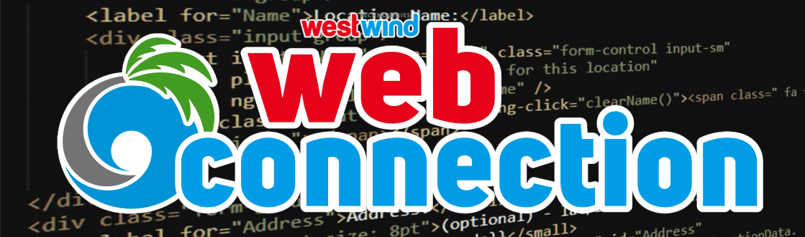

# Web Connection 7.32 released



[Web Connection 7.32](https://webconnection.west-wind.com) is out and in this post I'll go over some of the new features. This release is a small update, mostly with bug fixes and a few small adjustments to existing functionality. Some of these are quite productive if you use them, but all are relatively minor enhancements. There are no breaking changes.

## wwDotnetBridge Enhancements
.NET integration is becoming ever more important for integration with Windows and third party tools and libraries. Web Connection internally is starting to use more and more .NET related features and wwDotnetBridge over the years has become a key feature of the Web Connection library to support helper and support functionality from features like JSON Serialization, to encryption, to the email service functionality as well as small features like Unicode string handling support, UTC date conversions, advanced formatting for dates and number and much more.

So it's no surprise that there are many improvements that are thrown onto this library to make it easier to use and make integration with .NET code easier.

### Improved Collection Support
.NET makes extensive use of various collection types and in this release it gets a bit easier to access collection members and set collection values using simple `loList.Add(loItem)` (or `AddItem()`) functionality. Likewise you can also add new Dictionary items - lists are indexed lists, while dictionaries are key/value collections - using the `loList.AddDictionaryItem(lvKey, loItem)`. There's also a new `RemoveItem()` method that matches the native dictionary methods. 

All of this makes use of collections more natural and like you would see in .NET code examples thereby reducing some of the impedance mismatch between FoxPro and .NET. That isn't to say, wwDotnetBridge code works just like .NET but it makes things a little more transparent.

### Auto-Instance Parameter Fix Ups
As you probably know .NET features many types that FoxPro and COM can't directly pass to or receive from .NET, and wwDotnetBridge provides a `ComValue` wrapper object that can be used to 'wrap' a .NET type in such a way that you can receive it in FoxPro, update the value and pass back the wrapper in lieu of the actual .NET value. This allows the type to stay in .NET and therefore work within the confines of FoxPro code via indirect reference.

Some work has been done to make these wrapper `ComValue` objects more transparent when they are passed to .NET using the intrinsic `Invoke()` and `SetProperty()` methods. `ComValue` are now automatically unwrapped and can be treated like an actual .NET value passed again making it more natural to some of the wwDotnetBridge abstractions. Previously you had to manually unwrap the value and pass the value explicitly which in some cases also would not work. In most cases this should now work transparently.

## JSON Serializer Improvements
Another hot feature of Web Connection are REST Services and by extension the JSON Serialization support in the framework. JSON Serialization is what makes it possible to turn FoxPro objects into JSON and pass it to a remote service and Deserialization allows receiving of JSON data and turning it back into FoxPro objects for use in REST Service methods or for manual deserialization.

This update includes some updates that remove some of the naming restrictions for JSON objects based on the `EMPTY` class. By default the JSON Serializer has to exclude some property names from Serialization, because some property names are FoxPro reserved names. For example, `Name`, `Classname`, `Class`, `Id` etc. Every base object has some of these properties and by default Web Connection filters out these known base properties.

Well, it turns out that if you create an `EMPTY` object, it has **no base properties** at all, so these filters are not really required. In this update the serializer checks for `EMPTY` objects and if it is renders the objects as is without any property name filtering resulting both in a clean JSON export as well as improved performance as the filtering operation doesn't have to be performed.

As a recommendation: When generating JSON output for serialization, it's **highly recommended that you create objects based on EMPTY** (or `SCATTER NAME MEMO`) for serialization to ensure that your property names are preserved.

```foxpro
loPerson = CREATEOBJECT("EMPTY")
ADDPROPERTY(loPerson, "firstname", "Rick")
ADDPROPERTY(loPerson, "lastname", "Strahl")
ADDPROPERTY(loPerson, "address", CREATEOBJECT("EMPTY"))
ADDPROPERTY(loPerson.Address, "street", "123 North End")
ADDPROPERTY(loPerson.Address, "city", "Nowhere")

loSer = CREATEOBJECT("wwJsonSerializer")
loSer.PropertyNameOverrides = "lastName,firstName"  && force case
lcJson = loSer.Serialize(loPerson)
```
> As an aside, wwJsonSerializer internally uses `EMPTY` objects when creating cursor and collection items so the optimization is already prevalent. The recommendation is primarily for top level objects that you expose to the serializer.

### JSON UTC Date Conversion Fix
The [wwJsonSerializer::AssumeUtcDates](https://webconnection.west-wind.com/docs/_46j14e2pl.htm) flag can be used to specify that dates that you are passing as input are already UTC dates, and are not converted to UTC when serialized. 

By default the serializer assumes that dates are local dates, and when serializing turns the JSON dates into UTC dates (using the generic `Z` postfix to denote UTC date. Then when the date is deserialized it's turned back into a local date.

Although this flag has been around for quite some time, it wasn't actually working and some people had been reporting problems dealing with dates that shouldn't be converted.

## Web Connection Framework Features

### GetUrlEncodedCollection() to parse URL Encoded Lists
Web Connection has always included support for parsing form variables into collections using `Request.GetFormVarCollection()` and - prior to that the now deprecated `Request.aFormVars()`. But if you also wanted to get a collection of all the QueryString or ServerVariables you were out of luck, having to manually parse the string values and decoding.

In this release the `Request.GetUrlEncodedCollection()` function is a generic method that can be used to take **any** URL encoded string of key value pairs and parse it into a decoded collection of key\values.

```foxpro
loQueryStrings = Request.GetUrlEncodedCollection(Request.cQueryString)
FOR EACH loQuery in loQueryStrings FOXOBJECT
    ? loQuery.Key
    ? loQuery.Value
ENDFOR
```

### Default Cookie Behavior Changes for Security
Security is important and standards for cookie security have been changing a lot in recent years, so the latest releases of Web Connection make the default cookie configuration setting a bit more strict to ensure your sites are not flagged as insecure by even basic security scanning tools.

A couple of changes have been made in default Cookie policy:

* **Default is cookie is set to `HttpOnly`**  
This ensures that cookies cannot be read and modified on the client side. They are sent as part of the request and applied, but the cookie is not available for capture and reuse in client side code which avoid drive-by capture of cookies for replay attacks.

* **Default is set to `samesite=strict;`**  
Likewise same site cookie policy is recommdended by default to avoid bleeding out cookies for capture outside of the currrent site. In most cases `samesite=strict;` should work fine, unless you building a federated login system where cookies are shared across sites. The new value is the sensible default to use for any cookies created.

These cookies values are applied when:

* Creating a new Cookie with `CreateObject("wwCookie")`
* Using `Response.AddCookie()`
* Using Session Cookies in `Process.InitializeSession()`

Note that you can always override the cookie - `AddCookie()` returns the cookie instance and you can override any values as needed if you manually create it. Likewise you can override `Process.InitializeSession()` to explicitly specify your own cookie policy.

## Summary
There you have it - Web Connection 7.32 changes (and a couple of 7.30 changes as well) are essentially maintenance update features. Some of these are highly useful if you are using these feature as they make life a lot easier. The Cookie settings are a necessary security update, which is one of the reasons of why you should try to keep up with updates of the framework to ensure you have the latest fixes and security updates.

Until next update...

<div style="margin-top: 30px;font-size: 0.8em;
            border-top: 1px solid #eee;padding-top: 8px;">
    
    this post created and published with the 
    <a href="https://markdownmonster.west-wind.com" 
       target="top">Markdown Monster Editor</a> 
</div>