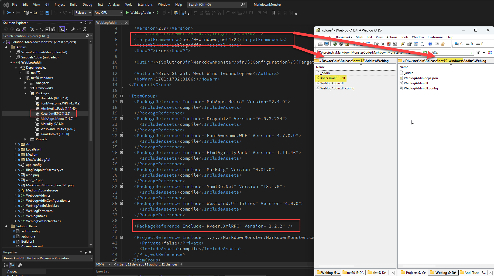

# Getting .NET Library Projects to Output Dependent Assemblies


If you are building standalone .NET Core libraries that are not destined for a NuGet package, you might have found out the hard way that the build output folder (ie. `bin/Release/{targetFramework}`) **doesn't contain any dependency assemblies**. So when you reference other packages, project references or raw assemblies in your project they are not automatically dumped into the build output folder.

This behavior is different than full .NET Framework (NetFX) and also original versions of .NET Core prior to 5.0,  which by default **did** output any dependencies into the build folder. 

The behavior is also different than top level applications (ie. an EXE on Windows) which continue to output dependent assemblies - as they have to in order to function at all.

In summary:

**Dependent Assemblies are generated**

* Any top level projects (NetFX and Core)
* .NET Framework Projects

**Dependent assemblies are not generated**

* .NET Core Library Projects

## TLDR: Short and Sweet

There's a bunch of nuance to this topic, and I'll go into it, but lets jump to the solution for those of you - and likely my future self - that are in a hurry.

##AD##

If you require that your build output folder contains the output of all dependencies, here's the quick fix that gives you essentially the same behavior that NetFX had and still has:

```xml
<PropertyGroup>
  <CopyLocalLockFileAssemblies>true</CopyLocalLockFileAssemblies>
</PropertyGroup>
```

This tounge-twisting and totally-not-obviously-named flag in the top level `<PropertyGroup>` of your class library is **a project global flag that outputs all dependencies into the output build (Release/Debug) folder**.

Unfortunately, as far as I can tell there's no mechanism available to explicitly specify an **individual package reference to output its dependencies**. If you need to keep dependencies from outputting you'll need to mark the `<PackageReference>` with `<IncludeAssets>compile</IncludeAssets>` to explicitly specify that you only want to use it at `compile` time.

So, the short answer is to use `<CopyLocalLockFileAssemblies>` to force all dependencies into the output folder and then hide any individual package dependencies that you don't want with `<IncludeAssets>compile</IncludeAssets>`. Bah!

## So what?
Dependency output or rather lack thereof isn't a very common use case, because these days most library projects are used in one of two ways:

* Built into a NuGet Package
* Referenced by another project

In both scenarios the build process handles resolving references and dependencies and passing them forward all the way to the top level application which then exposes the dependencies. So in many scenarios you don't really run into a problem with this behavior. Not outputting the intermediary assemblies reduces build time to a small degree so this is a likely reason that this behavior was changed in Core vs. NetFX.

It's relatively rare that you need to build a library into its raw assembly components and reference it directly. 

## PlugIns and Addins have different needs
The most common use case likely is building some sort of **plug in** or other dynamically loaded component that has is not directly linked by a top level application at compile time.

I have just this scenario in [Markdown Monster](https://markdownmonster.west-wind.com) where I have a number of addins that are installed in a custom folder and loaded dynamically at runtime. In order for this to work smoothly during development and package time, the application builds the Addins into a sub-folder of the main application by explicitly specifying an output path. In this scenario i need to make sure that the library outputs all of its dependencies so that the host application can see and load them alongside the main project assembly.

So related dependencies that are not already used by the parent application need to be available in the fixed `Addins` folder below the main application (3rd party addins can be loaded from a separate location - this is 1st party addins that are broken out for modularity).

To give you an idea, here's what one of my addin projects looks like. First the `<PropertyGroup>`:

```xml
<Project Sdk="Microsoft.NET.Sdk">
  <PropertyGroup>
    <Version>2.9</Version>
    <TargetFrameworks>net7.0-windows;net472</TargetFrameworks>
    
    <AssemblyName>WeblogAddin</AssemblyName>
    <UseWPF>true</UseWPF>
    
    <OutputPath>$(SolutionDir)MarkdownMonster/bin/$(Configuration)/$(TargetFramework)/Addins/Weblog</OutputPath>
    <AppendTargetFrameworkToOutputPath>false</AppendTargetFrameworkToOutputPath>
    
  </PropertyGroup>
</Project>  
```

For reference I'm building both for `net472` and `net7.0-windows` so we can see the difference in the build output in **Figure 1** below.

##AD##

You can see that the Addin project sets an explicit output path that points into the `Addins\WebLog` folder of the parent project - the main Markdown Monster executable project. As an aside, setting a fixed **and exact** output path is harder than it should be and requires that you set both the `<OutputPath>` and `<AppendTargetFrameworkToOutputPath>` elements (see here for [more info](https://weblog.west-wind.com/posts/2023/Apr/21/Setting-an-Absolute-Output-Path-for-NET-SDK-Projects)).

This addin project also has a number of dependencies, although most of them are explicitly hidden except for one - the XmlRpc dependency:

```xml
<ItemGroup>
  <PackageReference Include="MahApps.Metro" Version="2.4.9">
    <IncludeAssets>compile</IncludeAssets>
  </PackageReference>
  ...
  <PackageReference Include="Westwind.Utilities" Version="4.0.0">
    <IncludeAssets>compile</IncludeAssets>
  </PackageReference>
  
  <!-- this package explicitly **should** copy resources into the output folder -->
  <PackageReference Include="Kveer.XmlRPC" Version="1.2.2"  />

  <!-- no output for project reference -->
  <ProjectReference Include="../../MarkdownMonster/MarkdownMonster.csproj">
    <Private>false</Private>
    <IncludeAssets>compile</IncludeAssets>
  </ProjectReference>
</ItemGroup>
```

When I build this I end up with something like this:

  
<small>**Figure 1** - Build output on .NET Core doesn't include the dependent NuGet Package dependencies.</small>

Notice how the NetFX folder includes the `kveer.xmlrpc` package - while the .NET 7.0 project does not. The .NET Core project did not output the dependent assembly.

So how can I fix this output? 

Adding this:

```xml
<PropertyGroup>
  <CopyLocalLockFileAssemblies>true</CopyLocalLockFileAssemblies>
</PropertyGroup>
```

Now the `kveer.xmlrpc.dll` assembly is output into the build folder.

All dependencies now are sent to the build output folder. And now at least we have consistent behavior between the `net472` and `net7.0-windows` builds which might be important for multi-targeted projects.

### Too much and Too Little
Once you set `<CopyLocalLockFileAssemblies>` all output assemblies are generated into the output folder. Which means not only do I get the one assembly I need to be output into the build folder, but **all of them** - which is not actually what I want. 

This is where all those explicit `<IncludeAssets>compile</IncludeAssets>` directives come in. This setting explicitly states **not to include the package assemblies and resources in the build output** but only make them available at `compile` time. This effectively removes the dependencies from the output folder.

Hmmm... Ok. That seems to suggest you can control build output via these flags, right? Wrong. You can control **exclusion** but apparently **not inclusion**. 

Here are the [option flags](https://learn.microsoft.com/en-us/nuget/consume-packages/package-references-in-project-files#controlling-dependency-assets) which can be combined via `;` concatenation  for `IncludeAssets`:

| Value               | Description                                                                                                                                                                                                                                                 |
|---------------------|-------------------------------------------------------------------------------------------------------------------------------------------------------------------------------------------------------------------------------------------------------------|
| compile            | Contents of the `lib` folder and controls whether your project can compile against the assemblies within the folder                                                                                                                                         |
| runtime             | Contents of the `lib` and `runtimes` folder and controls whether these assemblies will be copied out to the build output directory                                                                                                                          |
| contentFiles        | Contents of the `contentfiles` folder                                                                                                                                                                                                                       |
| build               | `.props` and `.targets` in the `build` folder                                                                                                                                                                                                               |
| buildMultitargeting | *(4.0)* `.props` and `.targets` in the `buildMultitargeting` folder, for cross-framework targeting                                                                                                                                                          |
| buildTransitive     | *(5.0+)* `.props` and `.targets` in the `buildTransitive` folder, for assets that flow transitively to any consuming project. See the [feature](https://github.com/NuGet/Home/wiki/Allow-package--authors-to-define-build-assets-transitive-behavior) page. |
| analyzers           | .NET analyzers                                                                                                                                                                                                                                              |
| native              | Contents of the `native` folder                                                                                                                                                                                                                             |
| none                | None of the above are used.                                                                                                                                                                                                                                 |
| all                 | All of the above (except `none`)                                                                                                                                                                                                                            |

Options like `build` or `runtime` or even `all` seem to suggest that you can control output to the build folder, but unfortunately that's not so. 

The following **does not work**:

```xml
<PackageReference Include="Kveer.XmlRPC" Version="1.2.2" >
  <IncludeAssets>all</IncludeAssets>
</PackageReference>
```

So much promise, so little satisfaction 😂

## Summary
At the end of the day, the only thing works with explicit build output in library projects is:

* Use: `<CopyLocalLockFileAssemblies>true</CopyLocalLockFileAssemblies>` to output everything
* Mark all packages that you **don't want to output** with `<IncludeAssets>compile</IncludeAssets>`
* Everything else is then sent to the build output folder

This is tedious as this basically says:

* Include everything
* Then explicitly exclude everything, except the one thing I want to include.

But hey it gets the job done, even if verbose and counter-intuitive and that's better than not working at all :smile:

<div style="margin-top: 30px;font-size: 0.8em;
            border-top: 1px solid #eee;padding-top: 8px;">
    
    this post created and published with the 
    <a href="https://markdownmonster.west-wind.com" 
       target="top">Markdown Monster Editor</a> 
</div>