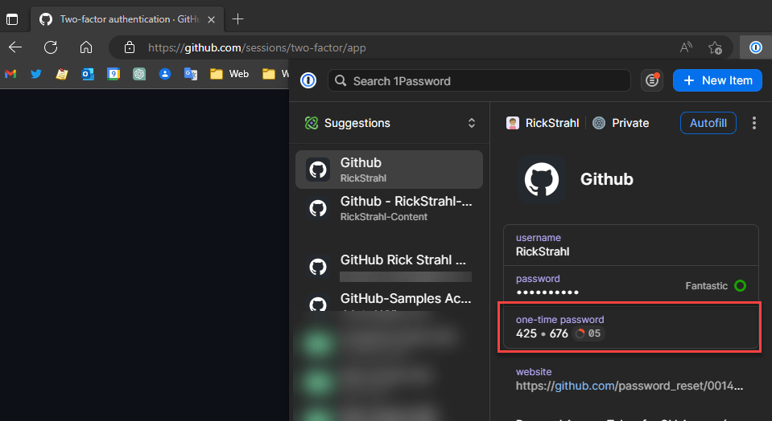

# Implementing Two-Factor Auth using an Authenticator App in ASP.NET


Authenticator based Two Factor Authentication (2FA) using an external app like [Authy](https://authy.com/), Google or [Microsoft Authenticator](https://support.microsoft.com/en-us/account-billing/download-and-install-the-microsoft-authenticator-app-351498fc-850a-45da-b7b6-27e523b8702a) or one of the Two Factor Authentication (2FA) enabled password managers like [1Password](https://1password.com/) are becoming more common in Web applications. Unlike using Email or SMS for the second piece of validation in 2FA, Authenticator apps don't require you give up another piece of private information or use an external service to verify an existing account. 

Two Factor Authentication is an **additional bit of security that you can use on top of an existing authentication system** to provide extra security and that can't be easily discovered or stolen as it uses one-time keys. As such you still need a primary authentication provider to verify the user first, and you can use 2FA to provide additional security or provide it as a way to verify an account in case passwords are lost.

In this post I'll describe how to to implement Authenticator based verification **outside of the context of ASP.NET Identity**, so you can add this to just about any solution. I'll describe my integration in my own Web Store, so it's somewhat app specific, but the examples I provide should be generic enough that you can easily modify to fit your particular application and integration scenario.

For reference, here is the implementation I'm going to be discussing:

  
<small>**Figure 1** - Two Factor Authentication with an Authenticator App (1Password)</small>

## Two-Factor Authenticators
This post is specific to 2FA with an Authenticator app, but there are other ways to implement 2FA including a second email address, SMS messages or phone callbacks. I prefer Authenticator apps because they are a self-contained solution - you don't need an external service as is the case for SMS and phone callbacks or another piece of private information in the case of an email address.

The downside is that Authenticators are still somewhat unconventional for the average computer user and the process of using one of them is not always obvious. If you haven't used an Authenticator before you have to install one which can also be annoying to users, although that's a one time installation.

##AD##

In order to use Authenticator based 2FA you **have to use one of the many Authenticator apps**. 

A few popular ones are:

* [Authy](https://authy.com/) (by Twilio)
* [Microsoft Authenticator](https://support.microsoft.com/en-us/account-billing/download-and-install-the-microsoft-authenticator-app-351498fc-850a-45da-b7b6-27e523b8702a)
* Google Authenticator (device only get on App store)
* Integration in [1Password](https://1password.com/)  
<small>*(and other password managers)*</small>

These apps are interchangeable and you can use any of them to set up sites/accounts.

To give you an idea, here's what Authy looks like on a phone:


Authenticators tend to have a list of configured 'accounts' that you choose from and a detail screen that lets generates a new validation code that updates at a shortish interval. The code is valid only for a short time. Typically you can copy this code to the clipboard and then paste it into the application requiring the code for 2FA.

To set up an account you either scan a QR code or provide a manual code. Again here's Authy's capture screen:


If you click the Scan button it then brings up a camera view that lets you point at a QR code. Alternately you can manually type in the Setup code.

This is on a phone, so you can use the camera to scan the QR code. If you're setting up on a desktop you can either use a text based Setup code, or if the tool has browser integration it sometimes can pick up a QR code off the current Web page (1Password does this). 
 
Some password managers also have 2FA integration. I use 1Password and it has integrated 2FA. This offers a seamless workflow that can autofill, username/password and 2FA auth code all in one quick automated pass. You can see that in the example screen capture a little later.

Alternately you can also do this manually. Here's 1Password once configured with 2FA auth:



You can copy the code (if set up to manually fill) or you can set up the 1Password to autofill, which completely automates the GitHub username/password and 2FA login which is pretty sweet.

> #### @icon-info-circle Single Source Two Factor Security?
>Some people commented that integrated 2FA in your password manager makes 2FA less secure. 
>
> While that's true to some extent, the important thing is that 2FA works not so much because of separate devices, but rather that you are validating two independent pieces of information. 
>
> While email and passwords can be hacked at the host site, Authenticator security comes from the fact that it's second, very short lived one-time piece of information that can only be compromised by physically gaining access to an unlocked device, or by corrupting the key store provider. If the key store is corrupted an attacker still would have to correlate the keys to a Web site and a username and password combo. Not impossible (social engineering or gun to your head), but pretty unlikely.

## Implementation
I'm going to be talking about this topic in the context of an actual application, so the code presented here **is not meant to be cookie cutter, of the 'just plug it in' type**. Rather it's intended to show you what you need to know and how it all fits together in the context of a larger application. The bits and pieces are pretty small and can be easily adapted for integration into your own solutions.  I do provide most of the code in small snippets and also with links to the implementation in [the Web Store on GitHub](https://github.com/RickStrahl/Westwind.Webstore) if you want to look at it in the full context of an application.

To give some context, in my Web Store application I'm using username/password based authentication with 2FA as an optional add-on that sits on top of the existing authentication scheme. 

##AD##

My use case at the outset was as follows:

* I have an existing Username/password Auth implementation (not using ASP.NET Identity)
* I'm adding Adding Two-Factor Auth as an optional Add-on

### First things First - you need Primary Authentication
2FA is not a standalone authentication technology. Rather it's an additional feature that can be used to make an existing authentication scheme more secure.

In the Web Store application shown in the screen capture I use Username/Password authentication, which also doesn't use ASP.NET Identity, but it does rely on ASP.NET's core authentication semantics to handle Cookie authentication. I've written about how this works [in a previous post](https://weblog.west-wind.com/posts/2022/Mar/29/Combining-Bearer-Token-and-Cookie-Auth-in-ASPNET) if you're interested.

### Overview
There are quite a few moving pieces so before starting out let's review what tools and steps are needed for the integration:

**Key Setup** 

* Install the NuGet Package for `GoogleAuthenticator`
* Implement a Setup Page that displays a barcode and manual key
* Generate a per user unique key 
* Create a new account in your Authenticator
* Verify the new Account with a Validation Code
* Save that unique user key with a user record for later use in validation

**Key Validation after Login**

* Implement a post login validation code verification page
* Once validated apply  to user tracking authentication

### The `GoogleAuthenticator` Library
The first thing we need is to use `GoogleAuthenticator` NuGet package to provide the key generation and validation logic needed to create a setup key, display a QR code and text key, and then also verify Authenticator generated validation keys. 

The  `GoogleAuthenticator` library by Brandon Potter is easy to use and provides the basic features you need in a few easy to use static methods that require little more than a few lines of code. This library solves all of the technical semantics of dealing with 2FA. Contrary to its name this library can be used with **any authenticator** including Microsoft Authenticator, Authy and as shown above using 1Password and other Password managers that have support for 2FA.

To install the package use the Package Manager in your IDE or from the command line:

```ps
dotnet add package GoogleAuthenticator
```

We'll use this library for two tasks:

* Creating a Setup key and QRCode
* Validating the user entered validation code

### Creating the Setup key and QR Code
The first thing is to create the 2FA Setup page which should look something like this:


The three key pieces on the page are:

* **The QR code**  
The QR code can be scanned or read by Authenticator apps to simplify setup of a site or 'resource' to provide keys for. The QR code represents a setup code that uniquely identifies this resource. 

* **Manual Setup Code**  
If your Authenticator or device doesn't support scanning a QR code you can also enter the code manually using the text based code.

* **Validation Form**  
Once the Authenticator app has the account set up it can generate a validation code which you then need to use to to actually create the account. This ensures that the account is setup and you can save the 2FA unique identifier with the user, and which you'll need later to verify validation codes generated by the Authenticator app.

Behind the scenes a few additional things need to happen:

* **Setup Code Generation**  
We can use the `GoogleAuthenticator` library to generate a new setup code.

* **Capture and Save a Unique User Key**  
In order to link a user and account you have to generate a unique id specific to the user and save it so it can be used for validation.

The bare bones code to generate a new setup key to create a QR and text code with `GoogleAuthenticator`, and then save the unique user key looks like this:

```csharp
var twoFactor = new TwoFactorAuthenticator();

// We need a unique PER USER key to identify this Setup
// must be saved: you need this value later to verify a validation code
var customerSecretKey = Guid.NewGuid.ToString(); 

var setupInfo = twoFactor.GenerateSetupCode(
    // name of the application - the name shown in the Authenticator
    wsApp.Configuration.ApplicationName,
    // an account identifier - shouldn't have spaces
    customer.Email,
    // the secret key that also is used to validate later
    customerSecretKey,
    // Base32 Encoding (odd this was left in)
    false, 
    // resolution for the QR Code - larger number means bigger image
    10);

// a string key
model.TwoFactorSetupKey = setupInfo.ManualEntryKey;

// a base64 formatted string that can be directly assigned to an img src
model.QrCodeImageData = setupInfo.QrCodeSetupImageUrl;

// Store the key with the user/customer (app sepecific)
customer.TwoFactorKey = customerSecretKey;
customerBus.Save();
```

The `GenerateSetupCode()` method from GoogleAuthenticator does most of the work in this and it returns a structure that contains both the QRCode as an image-ready base64 string, and the manual entry code that can be displayed as text. Both are bound to the Razor page via the model I'll discuss in a minute.

##AD##

Because the image data is returned in in base64 image-ready format (ie. `data:image/png;base64,base64Data`), the QR code image data can be directly assigned to a plain `` tag:

```html

```

The above code is simplified and lacks the logic to verify before creating key etc. I'm running actual code that includes the above bits in an MVC controller which:

* Checks that the user is logged in with username/password
* Loads the user/customer
* Checks whether 2FA is enabled for the user
* Creates the Setup code and displays it
* Validates that the account is set up by verifying a validation code

Here's the Razor View for the Setup page:

```html
@model SetupTwoFactorViewModel 

<div class="container" style="max-width: 800px">
    <h1 class="page-header-text">
        <i class="far fa-qrcode"></i>
        Set up Two Factor Authentication
    </h1>
    
    <div class="alert alert-info">...</div>    
    
    <error-display error-display-model="Model.ErrorDisplay" ></error-display>

    <div class="mt-3">
        
        
        <div title="Manual entry code to use instead of QR code"
             class="text-secondary">
            @Model.TwoFactorSetupKey
        </div>
    </div>
    
    <div class="mt-3">
        <form action="" method="POST">
            <input class="form-control" asp-for="ValidationKey"  />
            <button name="btnValidate" class="btn btn-primary mt-2">
                <i class="fad fa-check-circle"></i>
                Turn on Two Factor Authentication
            </button>

            <!-- we need to keep track of the CustomerSecret key so we don't 
                 regenerate a new key for each request                   -->
            <input type="hidden" asp-for="CustomerSecretKey" />
        </form>
    </div>
</div>
```

<small>*[full code on GitHub](https://github.com/RickStrahl/Westwind.Webstore/blob/master/Westwind.Webstore.Web/Views/Account/SetupTwoFactor.cshtml)*</small>


The middle section displays the QR code and manual key as read only values. The form on the bottom captures the validation code you need to verify using your Authenticator app. Additionally the `CustomerSecretKey`  hidden form value is used to persist the new unique user key that we eventually need to save with the user to validate subsequent requests.

The workflow flow is:

**On Get**

* Display the QR code and Manual Code
* Initialize the CustomerSecret key
* Remove a 2FA Setup ('remove' task parameter)

**On Post** 

* Verify a valid Authenticator App code
* Save the unique user key with the user data

> Note: This page is only accessible **once you are already authenticated** by the primary authentication, so this dialog is only accessible after you are already logged in both for adding and removing 2FA.

This code includes a number of my framework helpers that are app specific, so use this code as a guideline not as is. You'll need to handle the user mapping logic to map to whatever your user or customer record that holds your login and validation key data.

```csharp
[Route("/account/setuptwofactor")]
[HttpGet,HttpPost]
public IActionResult SetupTwoFactor(string task, SetupTwoFactorViewModel model)
{
    task = task ?? string.Empty;

    if (model == null)
        model = CreateViewModel<SetupTwoFactorViewModel>();
    else
        InitializeViewModel(model);

    if (!AppUserState.IsAuthenticated())
        return RedirectToAction("Profile", "Account");

    // App Specific user lookup
    var customerBus = BusinessFactory.GetCustomerBusiness();
    var customer = customerBus.Load(AppUserState.UserId);
    if (customer == null)
        return RedirectToAction("Profile", "Account");

    // REMOVE operation
    if (task.Equals("remove", StringComparison.InvariantCultureIgnoreCase))
    {
        customer.TwoFactorKey = null;
        customerBus.Save();
        return RedirectToAction("Profile", "Account");
    }

    if (!string.IsNullOrEmpty(customer.TwoFactorKey))
        return RedirectToAction("Profile", "Account");

    // Create or use generated Unique Id
    if(string.IsNullOrEmpty(model.CustomerSecretKey))
        model.CustomerSecretKey = Guid.NewGuid().ToString();

    var twoFactor = new TwoFactorAuthenticator();
    var setupInfo = twoFactor.GenerateSetupCode(
        wsApp.Configuration.ApplicationName,
        customer.Email,
        model.CustomerSecretKey,
        false, 10);

    model.TwoFactorSetupKey = setupInfo.ManualEntryKey;
    model.QrCodeImageData = setupInfo.QrCodeSetupImageUrl;

    // Explicitly validate before saving
    if (Request.IsFormVar("btnValidate") && !string.IsNullOrEmpty(model.ValidationKey))
    {
        if (twoFactor.ValidateTwoFactorPIN(model.CustomerSecretKey, model.ValidationKey))
        {
            customer.TwoFactorKey = model.CustomerSecretKey;
            if (customerBus.Save())
            {
                return RedirectToAction("Profile", "Account");
            }

            ErrorDisplay.ShowError("Unable to set up Two Factor Authentication");
        }
        else 
            ErrorDisplay.ShowError("Invalid Validation code.");
    }

    return View(model);
}
```
<small>*[full code on GitHub](https://github.com/RickStrahl/Westwind.Webstore/blob/master/Westwind.Webstore.Web/Views/Account/AccountController.cs#L452https://github.com/RickStrahl/Westwind.Webstore/blob/master/Westwind.Webstore.Web/Views/Account/AccountController.cs#L452)*</small>


This controller method handles a few operations:

* Initial Display (GET)
* Removing of a 2FA Setup (GET)
* Validating Authenticator Setup (POST)

The QR Code creation code is the same as described above. Note that I'm generating a new unique ID for the `TwoFactorSetupKey` which is used to create the the Setup code. The value is stored and passed through via the model, so the code doesn't change when we submit the validation code.

Only once the validation is completed successfully do I write the `TwoFactorSetupKey` to the user account and save it, which enables the account for 2FA.

The code also includes a removal operation via `?task=remove` query string. In this application 2FA is optional and user determined so clearing the key is all I need to no longer check 2FA. The key can only be removed of course when the user is fully signed in, including Two Factor Auth. 

At this point our 2FA is set up for the application.

### Validating a 2FA Authenticator Key
If 2FA is enabled the user has to first log in with username and password, and is then redirected to the additional Two Factor Validation form. 


The user then has to use the Authenticator app to generate a validation key, either types it in or auto-fills it.  The application then validates the key. For validation, `GoogleAuthenticator` makes it very easy to verify a validation key:

```cs
var twoFactor = new TwoFactorAuthenticator();
bool isValid = twoFactor.ValidateTwoFactorPIN(customer.TwoFactorKey, 
                                              model.ValidationCode.Replace(" ",""));
```

The `VarlidateToFactorPIN()` method takes two parameters:

* The unique customer key you created during 2FA setup (stored in user data)
* The validation code from the Authenticator entered into the form

Note that the Validation code **has to be stripped of all spaces**, so make sure to use `.Replace(" ","")`.

Here's the (simplified) layout for the validation form:

```html
@model TwoFactorValidationViewModel 

<div class="container" style="max-width: 640px">
    <h1 class="page-header-text">
        <i class="far fa-qrcode"></i>
        Two-Factor Validation
    </h1>
    
    <div class="alert alert-info mb-3">...</div>    
    
    <error-display error-display-model="Model.ErrorDisplay" ></error-display>

    <div class="mt-2">
        <form id="form1" action="" method="POST">
            <label class="d-block">
                Enter your Authenticator Validation Code
            </label>
            
            <!-- *** CAPTURE VALIDATION CODE ***  -->
            <input id="txtValidationCode" asp-for="ValidationCode"
                   class="form-control form-control-lg mt-2 mb-2"
                   placeholder="Validation code: ### ###" />
                   
            <button type="submit" name="btnSubmit" id="btnSubmit"
                    class="btn btn-primary btn-lg">
                <i class="far fa-check-circle"></i>
                Validate
            </button>
        </form>
    </div>
</div>
```
<small>*[full code on GitHub](https://github.com/RickStrahl/Westwind.Webstore/blob/master/Westwind.Webstore.Web/Views/Account/TwoFactorValidation.cshtml)*</small>

The authentication 2FA validation flow is:

* Validate username/password first
* Then redirect to this 2FA Validation form 
* Lookup a new Validation Code in an Authenticator
* Paste/auto-fill the value into the Validation box
* Accept

In the screen capture shown earlier I'm using **1Password** as my Authenticator and it **automatically** fills the field and submits the form (so it happens very fast in the video). Alternately you can use a separate Authenticator app either on the same machine or your phone, and then manually type or paste in the validation code provided by the app.

The code to handle the key display and validation in the controller looks like this:

```csharp
[Route("/account/twofactor")]
[HttpGet, HttpPost]
public IActionResult TwoFactorValidation(TwoFactorValidationViewModel model)
{
    if (string.IsNullOrEmpty(AppUserState.UserId))
        return RedirectToAction("Signin");

    if (model == null)
        model = CreateViewModel<TwoFactorValidationViewModel>();
    else
        InitializeViewModel(model);

    model.ReturnUrl = Request.Query["ReturnUrl"];
    if (string.IsNullOrEmpty(model.ReturnUrl))
        model.ReturnUrl = "/";

    if (Request.IsPostback())
    {
        if (string.IsNullOrEmpty(model.ValidationCode))
        {
            model.ErrorDisplay.ShowError("Please enter a validation code...");
            return View(model);
        }

        var customerBus = BusinessFactory.GetCustomerBusiness();
        var customer = customerBus.Load(AppUserState.UserId);
        if (customer == null)
            return RedirectToAction("Signin");

        var twoFactor = new TwoFactorAuthenticator();
        AppUserState.IsTwoFactorValidated = twoFactor.ValidateTwoFactorPIN(customer.TwoFactorKey, model.ValidationCode.Replace(" ",""));

        if (AppUserState.IsTwoFactorValidated)
        {
            return Redirect(model.ReturnUrl);
        }
        ErrorDisplay.ShowError("Invalid validation code. Please try again.");
    }
    return View(model);
}
```
<small>*[full code on GitHub](https://github.com/RickStrahl/Westwind.Webstore/blob/c6aa99caa1c6af088261f29588cbfa169a872de8/Westwind.Webstore.Web/Views/Account/AccountController.cs#L517)*</small>

This code has application specific logic in it, so you'll have to adjust for your specific scenario, but you should be able to see the flow of validation.

The key bit of code is in the Postback block:

```cs
var twoFactor = new TwoFactorAuthenticator();

// Persist the validation state for subsequent requests
AppUserState.IsTwoFactorValidated = twoFactor.ValidateTwoFactorPIN(customer.TwoFactorKey, model.ValidationCode.Replace(" ",""));
```

`AppUserState` is an internal framework component I use to hold cached state that is used throughout the application. It's persisted across requests and available at any time in the Request pipeline to give easy access to commonly accessed data like userid, username, displayname, etc. as well as some user related state like in this case the TwoFactorValidation status. Once logged in successfully both with user auth and the 2FA validation, `IsAuthenticated()` checks both the original login status (is there a userId) and the TwoFactorValidation status. If 2FA validation is turned off or the user decides not to use it the `IsTwoFactorValidated` is set to `true`.

The application can then at any point check `AppUserState.IsAuthenticated()` to check whether the user is authenticated - both for primary and 2FA auth.

`AppUserState.IsAuthenticated()` internally checks for both user authentication and 2FA success:

```csharp
public bool IsAuthenticated()
{
    if (!wsApp.Configuration.Security.UseTwoFactorAuthentication)
        return !string.IsNullOrEmpty(UserId);
    else
    {
        return !string.IsNullOrEmpty(UserId) &&
               IsTwoFactorValidated;
    }
}
```

This way no other authentication code has to be changed for the rest of the application.

### Handling User Login and redirecting to Two Factor
There's one more piece needed to make 2FA work in my Store app, which is integrating with the primary authentication flow on the Login form.

In my app the logic happens in the `Signin` Controller method:

```csharp
[AllowAnonymous]
[HttpPost]
public ActionResult SignIn(SigninViewModel model)
{
    InitializeViewModel(model);

    if (!ModelState.IsValid)
    {
        model.ErrorDisplay.AddMessages(ModelState);
        model.ErrorDisplay.ShowError("Please correct the following:");
        return View(model);
    }

    // Authenticate primary Username/password
    var customerBusiness = BusinessFactory.GetCustomerBusiness();
    var customer = customerBusiness.AuthenticateAndRetrieveUser(model.Email, model.Password);
    if (customer == null)
    {
        model.ErrorDisplay.ShowError(customerBusiness.ErrorMessage);
        return View(model);
    }

    // log in user copying re-used values from customer to persist
    //
    // this also sets the `IsTwoFactorValidated=true` if 
    // the it's disabled for App or the user
    SetAppUserFromCustomer(customer);

    // If two factor is enable and user has key force the
    // login. At this point `IsTwoFactorValidated=false`
    // and the user is not validated until the 2FA succeeds
    if (wsApp.Configuration.Security.UseTwoFactorAuthentication &&
        !string.IsNullOrEmpty(customer.TwoFactorKey))
    {
        return Redirect("~/account/twofactor?ReturnUrl=" + model.ReturnUrl);
    }

    if (!string.IsNullOrEmpty(model.ReturnUrl))
        return Redirect(model.ReturnUrl);

    return Redirect("/");
}

public void SetAppUserFromCustomer(Customer customer)
{
    AppUserState.Name = customer.UserDisplayName;
    AppUserState.Email = customer.Email;
    AppUserState.UserId = customer.Id;
    AppUserState.IsAdmin = customer.IsAdminUser;

    // if not using 2FA assume TwoFactor is validated
    // otherwise we have to explicitly validate first
    if (string.IsNullOrEmpty(customer.TwoFactorKey) ||
        wsApp.Configuration.Security.UseTwoFactorAuthentication)
    {
        AppUserState.IsTwoFactorValidated = true;
    }
}
```
<small>*[full code on GitHub](https://github.com/RickStrahl/Westwind.Webstore/blob/c6aa99caa1c6af088261f29588cbfa169a872de8/Westwind.Webstore.Web/Views/Account/AccountController.cs#L40)*</small>

### Clearing Two Factor Authentication
So this is application specific - in this store the user can choose to enable two factor authentication and optionally remove it as part of their user profile. 


This code simply uses the code in the `SetupTwoFactor` Controller method, so it's really just a simple GET request:

```
/account/setuptwofactor?task=remove
```

The code in this controller method explicitly checks whether the user is authenticated, both with username and password and two factor auth:

```cs
if (!AppUserState.IsAuthenticated())
    return RedirectToAction("Profile", "Account");
```

and then to actually remove the 2FA the logic is simply to remove it from the user field:

```cs
// REMOVE operation
if (task.Equals("remove", StringComparison.InvariantCultureIgnoreCase))
{
    customer.TwoFactorKey = null;
    customerBus.Save();
    return RedirectToAction("Profile", "Account");
}
```    

And that gets us full circle for Two-Factor Authentication

## Summary
Considering typical complexity related to authentication, implementing a custom 2FA solution isn't terribly complicated nor requires a huge amount of code. Thanks to the great tooling available via the `GoogleAuthenticator` library that does most of the security related work there's not a lot of complexity involved in creating an Authenticator based 2FA solution. 

I'm kind of bummed I didn't look into this sooner, but I honestly didn't quite understand how this technology worked and **assumed it required a service to provide the validation codes**. Turns out this functionality **can be integrated into your own sites without requiring any sort of third party service**.

Hopefully this article is useful to you. I'm sure I'll be back here myself, to refresh my memory how it works for the next integration.

## Resources

* [GoogleAuthenticator Library](https://github.com/BrandonPotter/GoogleAuthenticator) by Brandon Potter
* [West Wind Web Store GitHub](https://github.com/RickStrahl/Westwind.Webstore)
* Authenticators
    * [Microsoft Authenticator](https://support.microsoft.com/en-us/account-billing/download-and-install-the-microsoft-authenticator-app-351498fc-850a-45da-b7b6-27e523b8702a)
    * Google Authenticator (device only get on App store)
    * [Authy](https://authy.com/) (by Twilio)
    * Integration in [1Password](https://1password.com/)  
    <small>*(and other password managers)*</small>
    
    
<div style="margin-top: 30px;font-size: 0.8em;
            border-top: 1px solid #eee;padding-top: 8px;">
    
    this post created and published with the 
    <a href="https://markdownmonster.west-wind.com" 
       target="top">Markdown Monster Editor</a> 
</div>