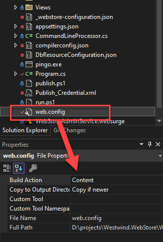

# Removing the IIS Server Request Header from ASP.NET Core Apps (any version)


If you're running an ASP.NET Core application on IIS, you have probably noticed that IIS injects a `Server` header into your HTTP headers that advertises the server platform, which is not always welcome.

Here's what that header looks like:


Now you might think it's easy: Slap on a `Response.Headers.Remove("Server")` and you're done, right? But no, that doesn't work with the IIS Server header because... well, it's different than other headers.

If you're running ASP.NET Core with  Kestrel you also get a `Server` header, but it's a little different with Kestrel in that it generates its own Http header as part of the ASP.NET framework processing, while the IIS setting is generated by **IIS's internal pipeline processing**.

## Why is the Server Header different?
Adding and removing headers in ASP.NET Core is kind of a hornet's nest, because there's no direct built-in way to do it globally for all requests in ASP.NET Core. I talked about how to do this using some custom middleware [in a previous post](https://weblog.west-wind.com/posts/2022/Jul/07/Back-to-Basics-Custom-HTTP-Response-Header-Manipulation-in-ASPNET-Core), and one of the options of the middleware I discussed was the ability to **remove headers** from an outgoing HttpRepsonse request.

That's all fine and good for framework generated headers which you can add and remove programmatically on a per request basis or via generic middleware.

##AD##

But the **IIS** `Server` header is different: It's not actually generated as part of the ASP.NET Core framework processing, but rather by IIS's internal pipeline and is **injected by IIS** very late in the Response processing.

## Removing the IIS Server Header - in web.config
For this reason the reliable and most effective way to remove the `Server` header is **to do it as part of the IIS processing configuration**, in this case by using `web.config` and setting one of the `requestFiltering` options:

```xml
<system.webServer>
 <security>
    <requestFiltering removeServerHeader="true" />
 </security>
</system.webServer>
```

> This feature only works in IIS 10 which was introduced with Windows 10 and Windows Server 2016.

This works great and it requires no other changes in your application. You'll just have to ensure that you publish your custom `web.config` that includes the above `<security>` section with your application.

> Remember, if you publish an ASP.NET Core project it either uses the `web.config` that **you provide as part of your project** in the root folder or it **creates one for you when you publish**. 
>
> It's best to provide a `web.config` in your project:
>
> 
>
> Note that `web.config` is overwritten on any publish operation regardless of whether you provide one in your project or not, so be sure not to change the copy in the deployed application folder as it gets overwritten.

## Overwrite the Server Header
Another option if you're willing to leave a server header in there but use misdirection - like show a version of Apache or nginx or BleatingSheepServer instead of IIS - you can overwrite the server header with a new value.

So for example using the middleware I described in the previous post you can do:

```cs
app.UseCustomHeaders((opt) =>
{
    // ...
    opt.HeadersToAdd.Add("Server", "nginx");
    opt.HeadersToRemove.Add("X-Powered-By");
    opt.HeadersToRemove.Add("x-aspnet-version");
});
```

This produces:


Apparently IIS won't inject its own `Server` header, **if your application already has set it**. This means you can use your own header and add some misdirection for potential attacks against your server.

Enjoy all the Linux and WordPress attack links in your IIS logs after this... :smile:

## What doesn't work
I don't want to belabor the point, but since this issue has gone through a number of changes since earlier versions of ASP.NET Core, I want to take a moment and discuss some other approaches that don't work and why.

* **Removing header via code in Middleware**  
Although you can use `Response.Headers` or the generic middleware to add and remove headers, the `Server` header can't be removed this way because it's added by IIS itself very late in the IIS request processing pipeline. Therefore you can't remove it from ASP.NET code as far as I know.

* **Kestrel Hosting Configuration Options**  
Several older Posts and StackOverflow posts point at using Kestrel configuration options to remove the `Server` header via the `Builder` configuration. While that works for Kestrel's Server header, it has no effect on when hosted in IIS. 
    ```cs
    var builder = WebApplication.CreateBuilder(args);
    builder.WebHost
       .UseKestrel(option => option.AddServerHeader = false);
       .UseIIS();
    ```
    This does not work for the IIS header! It only works for the Kestrel header.

* **Using the web.config `<customHeaders>` Section**  
Like the other approaches mentioned above you can't use the IIS `<customHeaders>` configuration section to `<remove value="server">` either.

##AD##

## Summary
The moral of the story is: This is an IIS setting and you should use IIS to override it, so use the `web.config` setting...

## Resources

* [Back to Basics: Custom HTTP Response Header Manipulation in ASP.NET Core](https://weblog.west-wind.com/posts/2022/Jul/07/Back-to-Basics-Custom-HTTP-Response-Header-Manipulation-in-ASPNET-Core)

<div style="margin-top: 30px;font-size: 0.8em;
            border-top: 1px solid #eee;padding-top: 8px;">
    
    this post created and published with the 
    <a href="https://markdownmonster.west-wind.com" 
       target="top">Markdown Monster Editor</a> 
</div>