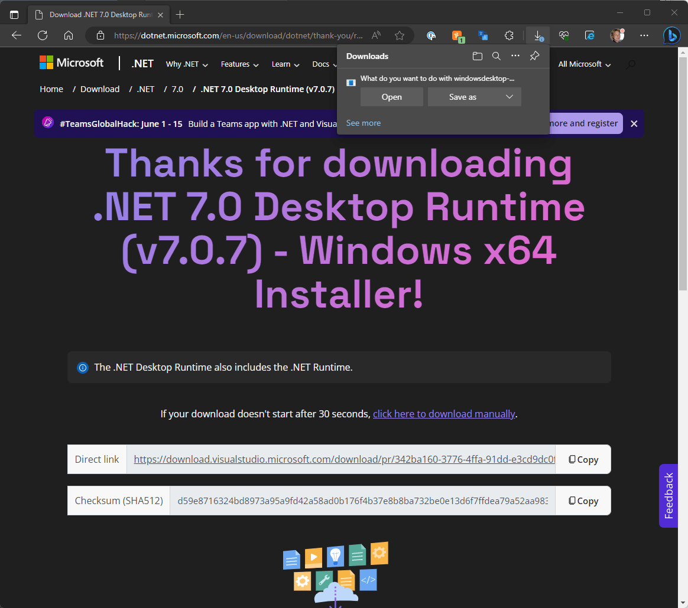

# Getting the .NET Desktop Runtime Installed with a Custom Runtime Checker and Installer

 

I'm in the process of updating the next version of [Markdown Monster](https://markdownmonster.west-wind.com) to run under .NET Core using .NET 7.0.

Although Markdown Monster has supported .NET Core for some time I've kept it running on .NET Framework for the time being. However, I've gradually moved various parts that needed updates to .NET Core over the last couple of years and recently I've got the final libraries moved over so that all existing features are not working on Core.

The technical aspects of the migration were never a big deal - the move from .NET Framework to .NET Core was surprisingly painless even though MM has a boatload of oddball integrations. For the most part it all just worked or could be fixed with relatively minor updates, although there were a few library dependencies that needed customizations or re-packaging along the way.

What has been mostly holding me back was how to distribute the application without undue bloating of the download installer sizes or effectively getting the shared .NET Core runtimes installed. And this latter point is the focus of this post:

* Discussion of Runtime Distribution modes for Desktop Applications
* Comparison of distribution modes and sizes
* How to get the Shared Runtime installed
* Describe what I'm doing with Markdown Monster's Installer
* Discussion of a support tool that you can use to install the Desktop Runtime

* [Related GitHub Repository for the Desktop Runtime Installer](https://github.com/RickStrahl/DotnetDesktopRuntimeInstaller)

Let's dive in...

## Bennies!
Moving to .NET Core isn't a major change in terms of product features, but it is one that I had to make at some point as .NET Framework code - while it still works - is slowly but surely falling behind in functionality and features compared to .NET Core.  Most of the improvements for Desktop applications are more developer focused, but nevertheless it seems prudent to move forward to the currently recommended platform rather than holding out. 

Technically I could have moved to Core quite a while ago as I've long ported the application to run (with a few, very recent holdouts), but my biggest issue has  been balancing the pros of improved tooling, performance and being *'up to date'* vs the increased complexity of runtime distribution.

**Benefits**

* Support for latest language and perf features in .NET Core
* Some updated UI framework features
* Support for running on Windows ARM devices
* Forward looking feature support in .NET
* Many development improvements 
   * New Language Features
   * Build time features
   * Build Performance etc.

**Drawbacks** 

* No built-in Runtime Support
* How to get the Runtime Installed
* Large Distribution size if not using the shared Runtime

##AD##

## Runtime Distribution
For me the big sticking point has always been runtime distribution and trying to keep down distribution size and keeping the install process simple.

### .NET Framework Runtime - Come as you are!
The existing version of Markdown Monster 2.x runs on .NET Framework (NetFX) and as such takes advantage of the fact that **the .NET Framework is always available and pre-installed on Windows**. This means I can just ship my binaries and not worry about additional installers, huge install size or making sure that a particular runtime is installed and stays installed. The Runtime is just there.

It's been easy peasy.

### .NET Core Runtimes require More Effort
For MM v3.x running on .NET Core runtimes are now transient and **constantly changing**. Applications have to somehow provide a runtime as part of their setup by either:

* Using a shared globally installed System Runtime
* Shipping the required runtime files with your app

With .NET Core it's back to the world of having to ship runtimes or including the runtimes with each installed application instance. 

.NET Core supports several options to deploy from self-contained (ie. ship all the runtime files as part of the app) to using an installed shared framework, to a trimmed down version that attempts to ship only what it uses (very limited) or can even create self-contained executables. 

### Running an Application with a Missing Shared Runtime
If you build an application that targets the shared runtime and the Runtime version required is not available, you'll get a startup error in the application:

  
<small>**Figure 1** - The native .NET Runtime check links to the .NET Runtime download</small>

The good news is that in recent versions of .NET Core (6.0+) when you click on the **Yes** button you're taken directly to the download page of the appropriate version:


<small>**Figure 2** - The .NET Desktop Runtime download page takes you right to the latest installer </small>

You can click the download link and then manually install the .NET Core framework, and you're on your way.

While the launcher check and manual install works in a pinch and as a fallback mechanism in case a Runtime gets uninstalled or corrupted, it's not the best install experience for a commercial application. You don't want your users to have to manually install something *after you've already installed your application* :smile:. It works in a pinch but... ugly. 

> #### @icon-info-circle How does the EXE detection work?
> The EXE in a .NET Core Windows project is not a .NET executable. Rather it's a smallish native  executable that acts as a launcher similar to `dotnet run` that launches your app's main `.dll` file.   
>
> The launcher is generated as part of the project's build output and embeds resource information that determines which DLL to launch as the actual startup program.

### Shared Runtime
So as you can see by the error message in **Figure 1**, the shared runtime requires that the  Runtime version that is required for your application to run is installed on the machine. The runtime is installed in a global location (`%programFiles%\dotnet\shared`) and shared by any application that uses the same runtime version. 

Remove the runtime and the application won't run and you have to reinstall.

### Shared Runtime Versions and RollForward
Shared runtime versions don't have to match exactly to what your app expects, but they have to follow a prescribed compatibility model which can be applied via the [RollForward](https://learn.microsoft.com/en-us/dotnet/core/project-sdk/msbuild-props) PropertyGroup value.

```xml
<Project Sdk="Microsoft.NET.Sdk">
  <PropertyGroup>
    <Version>3.0.0.14</Version>
    <TargetFramework>net7.0-windows</TargetFramework>
    
    <!--- this -->
    <RollForward>LatestPatch</RollForward>
    ...
  </PropertyGroup>    
</Project>  
```

This allows your application to run on higher patch versions than what is specified for the application's runtime in `yourapp.runtime.json`. So if you built your application for a runtime of `7.0.3`  you can run on `7.0.7`, but you can't run on `7.0.2` (lower patch) or `7.1.0` (because the minor version changed). You could make the latter work by using `LastestMinor` but you might run into problems with breaking changes in that scenario as Patch releases are generally bug fixes while minor releases include updated and changed functionality and possibly breaking APIs.

### Installing a Shared Runtime
If you're planning on using the shared runtime, something needs to check and see if the runtime is already installed and if not install it.

There are ways to do this by:

* Using a package manager like Chocolatey or WinGet which can install dependencies
* Relying on the EXE launcher and manually installing
* Including a separate custom runtime installer
* Manual Installation Prerequisite
* Let the Launcher Exe point to manual installation

For a custom runtime installer, I'll discuss a small tool that you can call from your installer to check for and optionally install the .NET Desktop Runtime if not installed. The tool waits for completion of the runtime install so that you can continue with the remainder of the install or launch of the application as you would expect.

The advantage of the Shared Runtime is that **your installation and download files** are relatively small - it's basically your .NET code and any libraries you import and use.

For Markdown Monster the distributed application with the shared runtime sizes look like this:

  
<small>**Figure 3** - Shared Runtime installation total folder size </small>

And the installer sizes look like this:

  
<small>**Figure 4** - Installer file sizes for Shared Runtime Distribution</small>


### Self-Contained
Self contained - as the name implies - creates a self contained installation as part of your application's output. Self-contained allows your app to run regardless of what else is installed on the machine. No external dependencies required.

A self-contained Windows Desktop Application contains the entire .NET Core Runtime and the Desktop runtime files, which are included as part of the publish output from the project. 

As you might imagine this drastically bloats the size of the original application. Here's Markdown Monster installed with the self-contained runtime:

The distributed application with self-contained looks like this:

  
<small>**Figure 5** - Self-contained Runtime installation total folder size</small>

and the installer sizes look like this:

  
<small>**Figure 6** - Installer file sizes for self-contained Runtime Distribution</small>

### Distribution Summary
To summarize here are the installer and folder sizes:

| Install Mode                      | Size  |
|-----------------------------------|------:|
| Shared Runtime, Distribution Size | 79mb  |
| Shared Runtime, Installer         | 22mb  |
| Shared Runtime, Zipped            | 29mb  |
| Self-contained, Distribution Size | 229mb |
| Self-contained, Installer         | 68mb  |
| Self-contained, Zipped            | 88mb  |

The self-contained install is roughly 3x the size of both the installer and the actual installed footprint on disk. That's not insignificant.

I know some people are bound to say, *Quit bitching, disk space is cheap*, blah blah blah... Call me old school, but a 1/4 gigabyte for an editor tool install size - seems excessive, no? Heck 79mb seems like a lot :smile: 

Download size too matters. Although most of us as developers have high speed connections, it seems nuts to have to download 68mb for a single tool application.

I know lots of apps do this today (looking at you Electron and now many .NET apps too), *but really should we*? Storage is cheap, but not that cheap once you're getting low on it - and we all do just that before we decide we need a bigger drive!

Then there's also online storage and download bandwidth. Up to this point I've been storing my download archives on GitHub which are used for Chocolatey and WinGet downloads and archival purposes. Git and GitHub start complaining (but not cutting off) files that exceed 50mb. Somewhere in the 75mb range I've had problems where files wouldn't upload anymore although the limit AFIK is supposed to be 100mb. The size limits are understandable, but the larger distribution files are the higher the storage load and potential you'll overrun the Git limits at some point. 

I serve my current installer from my own site to preserve same site status for the download links. Most of my bandwidth usage on all of my sites comes from product downloads - and 3x that increases costs.

Everything also takes longer at 3x the size from build time to packaging, to uploading, pushing to Git etc. So it definitely comes at a cost.

But... you get piece of mind. You don't have to worry about discontinued runtimes, abandoned runtime downloads and who knows what else. Your code can always install as it's self-contained.

Choices. Size vs. Convenience. Except the choice doesn't affect you, but mainly your users :smile:.

### Shared Runtime is for me!
After a bunch of back and forth indecision, I've decided for now I'm going with the shared runtime install for Markdown Monster.

I've already been down this path with [West Wind WebSurge](https://websurge.west-wind.com) which was also updated from .NET Framework to .NET Core a couple of years ago. It's a much more developer centric tool, so the shared runtime install requirement and semi-automated built-in process that prompts to install the runtime is less of an issue.

There's no special installer support so WebSurge relies on the runtime install dialog which as I mentioned is not the greatest way for end users. I will probably update that installer with the launcher I'll describe below in future updates.

##AD##

## Building an Invokable Runtime Installer
So if you've decided you're going to go with a Shared Runtime install you have a few options. I mentioned these earlier:

* **Install with a Package Manager (Chocolatey WinGet etc.)**  
These tools have support for installing dependencies so you can set them up to install the required desktop runtimes for you. The downside I found is that these tools will install whatever version you choose to reference, even if a newer compatible version is already installed causing more wasted space.

* **Manual Installation Prerequisite**  
This is what I described with WebSurge: Application has a pre-requisite for the runtime, and if it's not present the EXE launcher dialog then can direct for download and installation of the runtime. The downside is that it's not very nice UI for end users having to download and install a runtime manually, and then explicitly restart.

* **Using a Custom Runtime Installer**   
I've created a custom Runtime Installer that can be launched from an Installer or interactively from the command line that checks for the installed runtime and if not found, optionally downloads and installs it. 

The focus for the rest of the article is on this custom runtime installer which you can find here on GitHub:

* [DotnetDesktopRuntime Installer GitHub Repo](https://github.com/RickStrahl/DotnetDesktopRuntimeInstaller)  


### A Windows Desktop Runtime Checker and Installer
So the idea for this custom installer/checker is to perform the following tasks:

* Check to see if the required runtime or later is installed
* If runtime is installed, exit
* Download the runtime installer if not found
* Install the runtime
* Is using a small NetFx 4.72 Console EXE (no dependencies)

Here's what the non-silent version of this installer looks like:

  
<small>**Figure 7** - A customized .NET Desktop Runtime installer</small>

The non-silent version prompts first for download, then install and then also for the actual .NET Core Desktop Runtime installer.

In `-silent` mode, the code runs without all the prompts and runs the actual runtime installer invisibly.

##AD##

### Small Console Project
The project is a small .NET 4.72 Console project that produces a small EXE file (~30k). I'm using .NET 4.72 since it's available on any Windows 10+ platform (and likely on anything Windows 7+).

You can use the project as is to create the EXE, but you'll probably want to rename the executable to something that matches your application like `myAppLauncher` or `myAppInstaller` etc.

All of the code (short of the Shell Utilities) is contained in a single class file you can find here:

* [DotnetRuntimeInstaller.cs](https://github.com/RickStrahl/DotnetDesktopRuntimeInstaller/blob/master/DesktopRuntimeInstaller.cs)

### Configuration For your Setup
This project is meant to be customized. At minimum you need to specify the configuration for which runtime version is required, which version to download and also an optional manual link and SHA512 hash.

Configuration is handled with a class of static properties:

```cs
internal class RuntimeConfiguration
{
    internal static string ApplicationName = "Markdown Monster";
    
    internal static string MinDotnetRuntimeVersion { get; } = "7.0.3";

    internal static string DesktopRuntimeDownloadUrl { get; } =
        "https://download.visualstudio.microsoft.com/download/pr/342ba160-3776-4ffa-91dd-e3cd9dc0f817/ba649d6b80b27ca164d80bd488cdb51f/windowsdesktop-runtime-7.0.7-win-x64.exe";

    internal static string DownloadExeSha512 { get; } = "d59e8716324bd8973a95a9fd42a58ad0b176f4b37e8b8ba732be0e13d6f7ffdea79a52aa98363ec86860d551e124bdfaf71ac979b8f41f398e668fd12aa8483e";

    internal static string ManualDownloadPage { get; } = "https://dotnet.microsoft.com/download/dotnet/7.0/runtime?cid=getdotnetcore&runtime=desktop&os=windows&arch=x64";
}
```    

You can grab the `DesktopRuntimeDownloadUrl` from the Microsoft download page for the version you need.

That page shows a download link as well as the `SHA512. 

The manual download page link is a generic link that goes to the latest runtime version available and is likely what you want to send people to when they decide they'd rather install directly from the binaries at Microsoft.

> #### @icon-info-circle Minimize Unnecessary Runtime Installs
> In order to avoid unnecessary runtime installs it's recommended you specify the **lowest version that your application can run with** for `MinDotnetRuntimeVersion`, but specify **the latest version available for the download link** if the runtime is not installed or out of date. 
>
> This is so that if users already have a compatible version installed, you don't force them to install another version that they may not need. 

### How does this work?
The configuration values probably give you good hint how this works.

#### Checking for the installed Desktop Runtime Version
To check for the latest version the recommended approach is looking at the install folders in `program files\dotnet\shared\Microsoft.WindowsDesktop.App`.

```csharp
private static bool RuntimeVersionCheck()
{
    var desktopRuntimePath = Path.Combine(
        Environment.GetFolderPath(Environment.SpecialFolder.ProgramFiles),
        @"dotnet\shared\Microsoft.WindowsDesktop.App"
    );

    if (!Directory.Exists(desktopRuntimePath))
    {
        return false;
    }

    bool found = Directory.GetDirectories(desktopRuntimePath)
        .OrderByDescending(d => d)
        .Any(d =>
        {
            try
            {
                var dirName = Path.GetFileName(d);
                var res = dirName.StartsWith(RuntimeConfiguration.MinDotnetRuntimeVersion.Substring(0, 2)) &&
                          new Version(dirName) >= new Version(RuntimeConfiguration.MinDotnetRuntimeVersion);
                return res;
            }
            catch
            {
                return false;
            }
        });
    return found;
}
```

You're looking for the matching version or a higher version that has a higher patch number with the same minor version (ie. `7.0.xxx`)

### Download the Runtime
Assuming the user chooses to proceed the Runtime is downloaded into the `Downloads` folder. This simply does a raw download using good old `WebClient.DownloadToFile()` since we're on full framework and well there's no contention.

```csharp
Console.WriteLine("Please wait while we download...");
try
{
    var client = new WebClient();
    client.DownloadFile(url, dlPath);
}
catch (Exception ex)
{
    ConsoleWrite("Download failed: " + ex.GetBaseException().Message, ConsoleColor.Red);
    return false;
}
```

The downloaded file is an executable you can run. For silent mode you can use the `/quiet` command line parameter. Windows desktop runtime download files look like this:

```
windowsdesktop-runtime-7.0.7-win-x64.exe
```

and they are downloaded into the `Downloads` folder before execution.

That folder is not one of the standard ones that is supported from `Environment.SpecialFolders` so you have to grab the path from the registry:

```cs
var dlFolder =
    Registry.GetValue(
      @"HKEY_CURRENT_USER\Software\Microsoft\Windows\CurrentVersion\Explorer\Shell Folders",
      "{374DE290-123F-4565-9164-39C4925E467B}", String.Empty).ToString();
      
var dlPath = Path.Combine(dlFolder, filename);
```

Before installing the app also checks the hash code to match the value from the Microsoft site - if it was provided in the configuration.

### Install the Runtime
Installation then basically shell executes the downloaded installer. Depending on whether we're running in interactive or silent mode the installer is launched with a command line. 

Importantly, we need to wait for completion here , since this installer might run from a parent installer (Inno Setup in my case) and we need to make sure that executed commands run in sequence and not just run in asynchronously in the background. We also need to run the installer as Administrator and auto-elevate using `RunAs` verb.

For this I pulled in my `ShellUtils` class and the [ShellUtls.ExecuteCommandLine()](https://github.com/RickStrahl/Westwind.Utilities/blob/47fb2a2b030dcc468cd42fcf87da9098d3277796/Westwind.Utilities/Utilities/ShellUtils.cs#L452) which is also included in the project.

```csharp
try
{
    ShellUtils.ExecuteCommandLine(dlPath + (isSilent ? " /quiet" : null), null, 
                                  verb: "RunAs", waitForExitMs: 180000);
}
catch (Exception ex)
{
    ConsoleWrite("Runtime Installation failed: " + ex.GetBaseException().Message, ConsoleColor.Red);
    return false;
}
```

And we're done!

### How I'm using this Launcher
The launcher can be used interactively from the command line or you can launch it from an installer.

In Markdown Monster I already am using an optional launcher program to provide shortcut access to the main executable  named `mm.exe`. For the most part it simply forwards the command line to the larger main executable. 

> In .NET Core because the main EXE  is not actually your code and therefore very small, you can now simply rename the main exe to the shortcut. But alas since I need a launcher, I continue to use the old `mm.exe` file, leave it as a Net472 executable and add support for the `-runtimeinstall` switch to handle the installation tasks.

The main use case for the runtime install however, launches `mm.exe -runtimeinstall -silent` from my **Inno Setup** installer script:

```text
; check and install the Desktop Runtime
Filename: "{app}\mm.exe"; Parameters: "-runtimeinstall -silent";
   
; run the main application
Filename: "{app}\{#MyAppExeName}";  Flags: nowait postinstall skipifsilent
```

This now fires the Dotnet Desktop Runtime installer logic described above. 

If the runtime is already installed, the script runs very quickly and immediately returns. If an install is needed the console window pops up although you can use the installer options to hide the window. 

Another usage scenario for Markdown Monster is the Portable install which doesn't have an installer. In that case users can then unpack MM and then run `.\mm -runtimeinstall` to get the runtime installed quickly. 

Worst case scenario the Runtime install fails or isn't performed at all with the Portable install, in which case the native .NET launcher dialog gets you there as well.

If you want to see this all in action you can [download the latest Markdown Monster 3.0 Preview version](https://markdownmonster.west-wind.com/download) . However, you're only going to see the installer actually if .NET 7.0 is not already installed.

I'd be curious to hear if there are [any issues](https://github.com/RickStrahl/MarkdownMonster/issues).

## Wouldn't it be nice...
... if the EXE Desktop launcher had this functionality built into it? Instead of sending users to the download directory the launcher could provide the download and install functionality and then launch the EXE afterwards.

But... for now this installer + custom launcher provides similar functionality albeit recreating a bunch of functionality that already exists in the native launcher :smile:

## Summary
When deploying .NET Core Desktop applications on Windows you have a choice to make: Deploy with a large self-contained install, or use the shared runtime and deal with making sure the runtime is installed.

The latter has a number of options from just letting the EXE launcher on Windows handle detecting a missing runtime and offering a link to download and install. Alternately using a package manager like Chocolatey or WinGet exclusively can also work as you can specify a Runtime dependency to check and install for.

Finally I've shown another Shared Runtime alternative by providing your own checker and installer wrapper that makes sure the runtime is installed and if not downloading and installing it.

So - you have options, which is good. I hope this post has outlined some of the scenarios and how they apply, so that you can make the right choice for your .NET Core desktop applications.

## Resources

* [Markdown Monster 3.x .NET Core Download](https://markdownmonster.west-wind.com/download)
* [Microsoft .NET Download Page (.NET Desktop Rutime)](https://dotnet.microsoft.com/en-us/download/dotnet/7.0)
* [DotnetDesktopRuntime Installer GitHub Repo for this article](https://github.com/RickStrahl/DotnetDesktopRuntimeInstaller)
* [DotnetRuntimeInstaller.cs](https://github.com/RickStrahl/DotnetDesktopRuntimeInstaller/blob/master/DesktopRuntimeInstaller.cs)

<div style="margin-top: 30px;font-size: 0.8em;
            border-top: 1px solid #eee;padding-top: 8px;">
    
    this post created and published with the 
    <a href="https://markdownmonster.west-wind.com" 
       target="top">Markdown Monster Editor</a> 
</div>