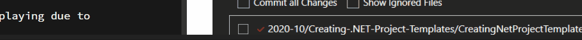
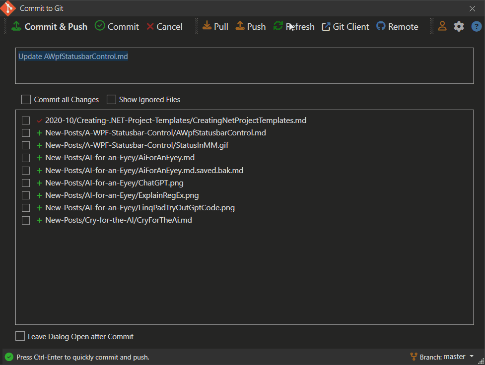

# A WPF Statusbar Control




In my desktop applications I've been using a reusable Status bar control that makes it easy to display status information on the status bar. Statusbar controls seem super simple, but reality is there are always a few sticking points to contend with:

* Updates not immediately displaying due to Dispatching issues
* Resetting the status bar after some expiration time
* Providing some visual clues to draw the eye to the status bar

In the past I used to create this functionality for each app then copy it around. I finally took the time to separate this out into a reusable control and helper that can be easily reused. 

In this post I'll discuss this status control and helper for WPF that addresses the concerns providing a real easy way to add common status bar functionality to your Windows, Dialogs and Controls.

You can find the result on GitHub and Nuget:

* [Westwind.Wpf.Statusbar on GitHub](https://github.com/RickStrahl/Westwind.Wpf.Statusbar)
* [Westwind.Wpf.Statusbar on NuGet](https://www.nuget.org/packages/Westwind.Wpf.Statusbar/)

Here's an example in a live application that demonstrates some of the features that I'd expect to see with status bar updates. 

The following is a Git Commit dialog that uses this control in [Markdown Monster](https://markdownmonster.west-wind.com) to perform a remote update check and operation where status is progressing and completed.



This demonstrates most of the features that it provides:

* Shows a status icon image
* Sets the status text as needed
* Icon changes based on display mode
* Icon 'flashes' when initially rendered to help draw attention
* Status messages 'expire' and reset to a default icon and message
* Handles dispatching so status updates immediately even in sync code

Here's another example that demonstrates a few more features of the control and/or helper more generically ([GitHub repo](https://github.com/RickStrahl/Westwind.Wpf.Statusbar/blob/master/SampleApp/MainWindow.xaml.cs))


## Simple Statusbar Operation
This library consists of two separate components:

* **[Simple Status Bar Control](#statusbar-control)**  
A basic status bar control that has an icon plus 3 status panels that can be individually accessed and managed. Control wraps a Statusbar instance that you can optionally customize with additional panels and custom panel content. Various `ShowStatusXXX()` methods update the main panel's icon and text.

* **[A Status Bar Helper](#statusbar-helper)**  
If you prefer to use your own layout for the Statusbar, you can instead use the `StatusbarHelper` to add the status bar update functionality to your own instances. Requires that your Statusbar has an icon `Image` control and a main `TextBlock` area to update which is handled via the helper's `ShowStausXXX()` methods.

Personally I've been using the `StatusbarHelper` version with custom StatusBar instances, because that's where I traditionally have started with. I create a status bar, add my text control and off I go. Then decide to add an icon and update that too.

Eventually all that morphed into the StatusHelper which automates some of that operation.

The idea is that you can basically make very simple calls to update the status bar immediately (not after the Dispatch cycle) and also provide some visual indication of what's going on (an icon) and that the there's something happening (flashing of the icon).


To set this up with the StatusHelper looks like this:

* Create your StatusBar control
* Make sure you have an `Image` and `TextBlock` you can provide
* Instantiate the helper and pass in the Image and TextBlock
* Call the Status methods

So you start out with a StatusBar in a Window:

```xml
<!-- if you use default icon resources you have to add the resources -->
<Window x:Class="SampleApp.MainWindow" ...
        xmlns:statusbar="clr-namespace:Westwind.Wpf.Statusbar;assembly=Westwind.Wpf.Statusbar"
>
<Window.Resources>
 <!-- local - or put this in App.xaml -->
 <ResourceDictionary Source="pack://application:,,,/Westwind.Wpf.Statusbar;component/Assets/icons.xaml" />
</Window.Resources>
...
<!-- use your own StatusBar control. Use Fixed Height! -->   
<StatusBar  
    Height="30"  
    VerticalAlignment="Bottom" HorizontalAlignment="Stretch">
    <StatusBar.ItemsPanel>
        <ItemsPanelTemplate>
            <Grid>
                <Grid.ColumnDefinitions>
                    <ColumnDefinition Width="Auto" />
                    <ColumnDefinition Width="*" />
                    <ColumnDefinition Width="Auto" />
                    <ColumnDefinition Width="Auto"  />
                </Grid.ColumnDefinitions>
            </Grid>
        </ItemsPanelTemplate>
    </StatusBar.ItemsPanel>
 
    <!-- REQUIRED: initial image resource from built in resources
         has to be named and passed into helper.
         Set a fixed height
    -->
    <StatusBarItem Grid.Column="0" Margin="2,1,0,0">
        <Image x:Name="StatusIcon" Source="{StaticResource circle_greenDrawingImage}" Height="14" />
    </StatusBarItem>
    
    <!-- REQUIRED: Main panel text block - has to be named and passed into the helper -->
    <StatusBarItem Grid.Column="1">
        <TextBlock Name="StatusText">Ready</TextBlock>
    </StatusBarItem>
    
    <!-- other custom layout that you can do whatever you want with -->
    <StatusBarItem Grid.Column="2">
        <ContentControl Name="StatusCenter" 
                   Margin="10 0"
                   x:FieldModifier="public" HorizontalAlignment="Left" />
    </StatusBarItem>
    <StatusBarItem Grid.Column="3">
        <ContentControl x:Name="StatusRight" x:FieldModifier="public" HorizontalAlignment="Right" Margin="0 0 5 0" />
    </StatusBarItem>
</StatusBar>
```

Note that if you want to use a default icon from the provided internal resources you'll have to add the resource to the Window or App.xaml:

```xml
<Window.Resources>
   <!-- local - or put this in App.xaml -->
  <ResourceDictionary Source="pack://application:,,,/Westwind.Wpf.Statusbar;component/Assets/icons.xaml" />
</Window.Resources>
```

and then you can reference the embedded resource like this:

```xml
<StatusBarItem>
    <Image x:Name="StatusIcon" Source="{StaticResource circle_greenDrawingImage}" Height="14" />
</StatusBarItem>
```

Preferrably you'll also want to provide an explicit `Height` for the icon and a fixed `Height` for the status bar to allow for the flashing to fit. I tend to use `30` for the Statusbar and `14` or `15` for the icon typically.


To initialize the status helper you can then:

```csharp
public partial class MainWindow : Window
{
    public StatusbarHelper Status { get;  }
    
    public MainWindow()
    {
        InitializeComponent();
          
        // Create the helper with text and icon passed in    
        Status = new StatusbarHelper(StatusText, StatusIcon);
        
        ...
    } 
}        
```

Once that's in place you can now use the `Status` property to update status easily:

```csharp
// shows status and resets to default after default timeout
Status.ShowStatusSuccess("Yay. The operation was successful!");
```

```csharp
// shows status and resets to default  after 2 secs
Status.ShowStatusError("Ooops. Something went wrong!",2000);
```

```csharp
// shows status and resets to default  after 2 secs
Status.ShowStatusWarning("Careful... this might go sideways.", 2000);
```

```csharp
// shows spinning icon indefinitely
Status.ShowStatusProgress("This may take a minute...");
```

If you'd rather use the Status control, things are even easier as you can just drop the control on a page. Here's what that looks like:

```xml
<Window x:Class="SampleApp.MainWindow"
        xmlns="http://schemas.microsoft.com/winfx/2006/xaml/presentation"
        xmlns:x="http://schemas.microsoft.com/winfx/2006/xaml"
        
        xmlns:statusbar="clr-namespace:Westwind.Wpf.Statusbar;assembly=Westwind.Wpf.Statusbar"
        
        Title="MainWindow" 
        Height="400" Width="450">


    <Grid>
        <Grid.RowDefinitions>
            <RowDefinition Height="*"/>
            <RowDefinition Height ="Auto"/>
        </Grid.RowDefinitions>

        <StackPanel Width="200" Margin="20">
        ... Content here
        </StackPanel>

        <statusbar:StatusbarControl Grid.Row="1" Name="Statusbar" />
    </Grid>
</Window>
```

Note that here you only need to add the namespace:

```xml
xmlns:statusbar="clr-namespace:Westwind.Wpf.Statusbar;assembly=Westwind.Wpf.Statusbar"
```

and the control:

```xml
<statusbar:StatusbarControl Grid.Row="1" Name="Statusbar" />
```

The control will take care of the default icon and resource loading in that case. The control is just a wrapper around the `StatusbarHelper` which is attached as a `Status` property. You can also access the raw WPF Statusbar as `StatusbarInstance` to modify the layout in code.

The control forwards the high level `ShowStatusXXX()` methods, so you can directly call them on the control:

```csharp
private async void BtnProgress_OnClick(object sender, RoutedEventArgs e)
{
    Statusbar.ShowStatusProgress("This may take a minute...");

    await Task.Delay(2000);

    Statusbar.ShowStatusProgress("Still working...");

    await Task.Delay(2000);

    Statusbar.ShowStatusProgress("Getting close...");

    await Task.Delay(2000);

    // or use the StatusHelper instance
    Statusbar.Status.ShowStatusSuccess("Yay. All done with success! ");
}
```

The idea behind all of this is that you have a few very simple method calls that can handle the most common operations and provide rich display functionality with ease.

You can find out much more about syntax and some of the additional lower level features from the [GitHub documentation page](https://github.com/RickStrahl/Westwind.Wpf.Statusbar#installation).

### Icon Customization
As I mentioned you can customize the control itself by providing your own `StatusBar` control and then using StatusHelper and have complete control over the layout.

Beyond that you can also customize the icons used for the status display. The library ships with its own default icon resources in `icons.xaml` which you can add to your pages via a resource include in your `Window.Resources` or `App.Resources`.

It's possible to override icons globally by overriding the `StatusIcons.Default` collection, per control by creating a new `StatusIcons` instance and replacing the various `ImageSource` properties, or passing an `ImageSource` as a parameter to any of the `ShowStatusXXX()` methods.

Here's an example of how you can replace the per instance icons using [FontAwesome6 icons](https://github.com/MartinTopfstedt/FontAwesome6) by [Martin Topfsted](https://github.com/MartinTopfstedt) for example.

The following toggles between a FontAwesome6 icon set and the default icon set.

```csharp
private void BtnToggleIcons_OnChecked(object sender, RoutedEventArgs e)
{
    ToggleState = !ToggleState;

    if (ToggleState)
    {
        ActiveIconSet = "FontAwesome 6 Icons";
        
        var icons = new StatusIcons();

        var image = new ImageAwesome()
        {
            PrimaryColor = Brushes.Green,
            Height = 15,
            Icon = EFontAwesomeIcon.Solid_House
        };
        icons.DefaultIcon = image.Source;

        image = new ImageAwesome()
        {
            PrimaryColor = Brushes.ForestGreen,
            Height = 15,
            Icon = EFontAwesomeIcon.Solid_SquareCheck
        };
        icons.SuccessIcon = image.Source;

        image = new ImageAwesome()
        {
            PrimaryColor = Brushes.DarkGoldenrod,
            Height = 15,
            Icon = EFontAwesomeIcon.Solid_CircleRadiation
        };
        icons.WarningIcon = image.Source;

        image = new ImageAwesome()
        {
            PrimaryColor = Brushes.Firebrick,
            Height = 15,
            Icon = EFontAwesomeIcon.Solid_CircleExclamation
        };
        icons.ErrorIcon = image.Source;

        image = new ImageAwesome()
        {
            PrimaryColor = Brushes.SteelBlue,
            Height = 15,
            Icon = EFontAwesomeIcon.Solid_Spinner
        };
        icons.ProgressIcon = image.Source;

        Status.StatusIcons = icons;
    }
    else
    {
        ActiveIconSet = "Default Xaml Icons";
        Status.StatusIcons = StatusIcons.Default;
    }

    btnToggleIcons.Content = ActiveIconSet;
    Status.SetStatusIcon();  // refresh default icon on page
}
```

If you want to globally override one or all icons you can also do this by assigning new icons ot the `StatusIcons.Default` icon set:

```csharp
var image = new ImageAwesome()
{
    PrimaryColor = Brushes.ForestGreen,
    Height = 15,
    Icon = EFontAwesomeIcon.Solid_CircleCheck
};
StatusbarIcons.DefaultIcon = image.Source;  // overrides anywhere the default is used
```

## Behind the Scenes
The core functionality of the `StatusHelper` is really what drives this library so a quick look behind the scenes gives you an idea how this works. 

While the display updates are pretty straight forward, making sure that the UI is immediately updated and that timeout resets work correctly is a little bit more involved, requiring some message debouncing to ensure that timers and events don't step on each other.

### Displaying Status
Behind all the `ShowStatusXXX()` methods is the base `ShowStatus()`  method that exposes all the functionality with all of the options available. Each of the `ShowStatusXXX()` methods are very shor and simply call into `ShowStatus()` presetting the various parameters with defaults if not provided. 

```csharp
public void ShowStatus(string message = null, 
    int timeoutMs = 0,
    ImageSource imageSource = null,
    bool spin = false, 
    bool flashIcon = false, 
    bool noDispatcher = false)
{
    // check for disabled dispatcher which will throw exceptions
    if (!noDispatcher) // && !WindowUtilities.IsDispatcherDisabled())
        // run in a dispatcher here to force the UI to be updated before render cycle
        Dispatcher.CurrentDispatcher.Invoke((Action)(() =>
            ShowStatusInternal(message, timeoutMs, imageSource, spin, flashIcon: flashIcon)));
    else
        // dispatcher blocked - just assign and let Render handle
        ShowStatusInternal(message, timeoutMs, imageSource, spin, flashIcon: flashIcon);
}
```


For example, `ShowStatusSucess()` looks like this:

```csharp
public void ShowStatusSuccess(string message, int timeout = -1, 
                              ImageSource imageSource = null, bool flashIcon = true)
{
    if (timeout == -1)
        timeout = StatusMessageTimeoutMs;

    if (imageSource == null)
    {
        imageSource = StatusIcons.SuccessIcon;
    }

    ShowStatus(message, timeout, imageSource, flashIcon: flashIcon);
}
```

### Making sure the UI Updates
The key thing that `ShowStatus()` provides is the `Dispatcher` invocation to ensure that the status update happens immediately in the UI. Without this the UI is not updated until the current method call completes which can be problematic if you have multiple status calls in a single logic UI operation. This is most common with progress updates where you potentially have multiple operations strung together with status updates in between. The Dispatcher ensures that the status messages are immediately updated.

All the real update work however is handled in `ShowStatusInternal()` 

```csharp
private void ShowStatusInternal(string message = null, 
    int milliSeconds = 0,
    ImageSource imageSource = null,
    bool spin = false, bool noDispatcher = false, 
    bool flashIcon = false)
{

    if (imageSource == null)
    {
        imageSource = StatusIcons.DefaultIcon;
    }
    SetStatusIcon(imageSource, spin);

    if (message == null)
    {
        message = DefaultStatusText;
        SetStatusIcon();
    }

    StatusText.Text = message;

    if (milliSeconds > 0)
    {
        dontResetToDefault = false;

        // debounce rather than delay so if something else displays
        // a message the delay timer is 'reset'
        debounce.Debounce(milliSeconds, (p) =>
        {
            if (!dontResetToDefault)
                ShowStatus(null, 0);
        }, null);
    }
    else
    {
        dontResetToDefault = true;
    }

    if (flashIcon)
        FlashIcon();
}
```

The key feature in this method is the reset operation that indicated by the milliseconds to wait before reverting to the default icon and message:

```csharp
debounce.Debounce(milliSeconds, (p) =>
{
    if (!dontResetToDefault)
        ShowStatus(null, 0);
}, null);
```

The **debounce operation** ensures that only the latest status operation is applied and that any previously set timers are reset to only respect the last one applied. This functionality uses a [DebouceDispatcher](https://github.com/RickStrahl/Westwind.Wpf.Statusbar/blob/master/Westwind.WPF.Statusbar/Utilities/DebounceDispatcher.cs) that I discussed in a [previous post](https://weblog.west-wind.com/posts/2017/Jul/02/Debouncing-and-Throttling-Dispatcher-Events) and that is included as an internal helper in the library.

### Icon Animations and Timing

The final bits of interest are the `SetStatusIcon()` and `FlashIcon()` animations. 

The Status icon has a couple of optional parameters that allow spinning of the icon, which is a useful feature for progress operations and is used in `ShowStatusProgress()` by default. 

The spinning is handled by an animation that is applied to the icon and have it spin around its axis.

```csharp
public void SetStatusIcon(ImageSource imageSource, bool spin = false)
{
    StatusImage.Source = imageSource;

    if (spin)
    {
        var animation = new DoubleAnimation(0, 360, TimeSpan.FromMilliseconds(2000));
        animation.RepeatBehavior = RepeatBehavior.Forever;

        var rotateTransform = new RotateTransform();
        rotateTransform.Angle = 360;
        rotateTransform.CenterX = StatusImage.Width / 2;
        rotateTransform.CenterY = StatusImage.Height / 2;

        StatusImage.RenderTransform = rotateTransform;
        rotateTransform.BeginAnimation(RotateTransform.AngleProperty, animation);
    }
    else
    {
        StatusImage.RenderTransform = null;
    }
}
```

Incidentally this implementation has a bug that I haven't been able to quite work around yet:

If you have an icon that is in Flashing mode and not its default size, the icon size is captured not correct and the spinning operation then rotates around a much larger center resulting in a funny wobble rather than a spin around the axis. However, this is an unlikely scenario as you're likely to spin only progress operations which are unlikely to be immediately triggered after some other static status operation.


The flash behavior in question looks like this using another type of animation:

```csharp
public void FlashIcon(Image icon = null)
{
    if (icon == null)
        icon = StatusImage;

    var origSize = OriginalIconHeight;
    DoubleAnimation animation = new DoubleAnimation(origSize* 1.5, TimeSpan.FromMilliseconds(700));
    
    void OnAnimationOnCompleted(object s, EventArgs e)
    {
        var animation2 = new DoubleAnimation(origSize, TimeSpan.FromMilliseconds(500));
        icon.BeginAnimation(Image.WidthProperty, animation2);
        icon.BeginAnimation(Image.HeightProperty, animation2);

        animation.Completed -= OnAnimationOnCompleted;
    }
    animation.Completed += OnAnimationOnCompleted;

    icon.BeginAnimation(Image.WidthProperty, animation);
    icon.BeginAnimation(Image.HeightProperty, animation);
}
```

The key here is that we need to know what the original image size is to reset the image back to its original state. This is why it's best to specify a fixed image size for the icon in the StatusBar `Image` control, or explicitly set the `OriginalIconHeight` in the `StatusHelper`. This ensures that the animation always stays on the correct size rather than relying on the potentially non default size (if already in another Flash operation). This ensures that if multiple flash operations are staggered for some reason, that the final icon always returns to its original size.

Funny note: Before I implemented the OriginalSize tracking in Markdown Monster you would occasionally end up with this monstrously large status icons that were 5-10 the size of the original.  As funny as that was, it was **not a cool feature** :smile:

## Summary
A Statusbar control sounds simple and boring, but once you consider the various support operations required for timing out status messages, flashing icons for attention and dealing with a host of different icons, as well as supporting different icon types, it turns out having a reusable component is big time saver. 


I know because I've worked with various different implementations of this basic concept with various different types of image sources (different versions of FontAwesome Icons, raw images etc.) and having to adjust to each type of icon and image source for each project was a pain. In fact, I've been sitting on this library for some time, but I had been fretting on what I should do for the icon distribution. Most of my apps these days use FontAwesome icons and my first take was to just reference one of those libraries. I thankfully decided against that to avoid pulling in a big dependency and instead used stock icons converted into XAML and embedded as resources.

Having a default set of Icons that's built-in with the ability to easily override with custom icons which I now customize with FontAwesome icons, and have all the render details taken care of is a big time saver.

Hopefully a few of you will find this library as useful as I have. Enjoy.

<div style="margin-top: 30px;font-size: 0.8em;
            border-top: 1px solid #eee;padding-top: 8px;">
    
    this post created and published with the 
    <a href="https://markdownmonster.west-wind.com" 
       target="top">Markdown Monster Editor</a> 
</div>