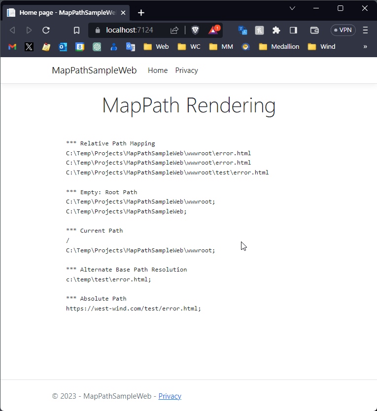

# Map Physical Paths with an HttpContext.MapPath() Extension Method in ASP.NET


In classic ASP.NET - and even class ASP before it - there used to be a handy function called `Server.MapPath()` to map a virtual Web path to a physical path in the Web site.

This can be useful if you need to access a local file, or need to map a folder during configuration for example. I find myself needing this functionality frequently in middleware for various folder mapping operations or when I write out/read local files for logging or configuration tasks.

It's not a very common need but when it happens I always end up digging for the right settings to retrieve in order to retrieve the base folder, and then combine paths etc. To make this a little easier I created a small helper extension method called `HttpContext.MapPath()` to  *just get 'er done*.

## ASP.NET Core and Physical Paths
In classic ASP.NET startup paths were pretty cut and dried: A Web site was bound to a physical folder and IIS actually provided an internal ISAPI function that ASP.NET called into to resolve the base folder. The root server was both the application and web root with both binary and content files in the same location.

In .NET Core we can't rely on a specific Web server or its APIs to retrieve these values, so another mechanism is needed. Additionally what's actually the **Root Folder** isn't quite so obvious, because ASP.NET Core separates out two root folder types:

* **ContentRootPath - The Application's Startup Folder**  
The folder from which the application is started. This is the folder with the startup binaries and configuration files required to run the app.

* **WebRootPath - The Web Content (wwwroot typically) Folder**  
This is the Web content folder - typically the `wwwroot` folder - where static Web assets that the application needs are stored. Anything static that is directly accessed from the Web via URL referencing should be located here. By default static HTML and scripts, styles, images etc. go here. For `MapPath()` functionality this is the most likely folder location you are interested in to find files to access.

ASP.NET Core has support for identitfying these two folders through ASP.NET Core hosting infrastructure, although they are buried behind a service you have to retrieve to get the values from.

##AD##

Assuming you have a `HttpContext` instance that process looks like this:

```cs
var host = context.RequestServices.GetService(typeof(IWebHostEnvironment)) as IWebHostEnvironment;
WebRootPath = host.WebRootPath;
ContentRoot = host.ContentRootPath;
```

The `ContentRoot` path is always the path the actual application binaries are starting from. By default ASP.NET Core applications have a `wwwroot` folder for it's actual Web Root that contains the Web related assets like static HTML files, images, CSS, JS etc. However, you shouldn't assume that the `wwwroot` folder is always the location for the Web root as the Web root can moved as part of server code. For this reason there's a second explicit `WebRootPath` property on the `IWebHostEnvironment` instance that points at the home location for the Web content path.

These names aren't super obvious in their functionality. In fact it feels if you reversed the functionality and names you wouldn't be any the wiser guessing functionality. But alas - naming is hard. I guess :smile:

In order to get at these two values you need an instance of `IWebHostEnvironment` which is one of the default DI services that ASP.NET adds on startup when the site is created.

> In ASP.NET Core versions prior to 3.0, there was no `IWebHostEnvironment`. Instead you had to use  `IHostingEnvironment` to access `ContentRootPath` and `WebRootPath`. The syntax otherwise was the same.

## Resolving Relative Paths
To make root path retrieval and mapping a relative path onto it easier, here's a `MapPath` extension method for the `HttpContext` object:

```csharp
public static class HttpContextExtensions
{
    static string WebRootPath { get; set; }
    static string ContentRootPath { get; set; }

    /// <summary>
    /// Maps a virtual or relative path to a physical path in a Web site,
    /// using the WebRootPath as the base path (ie. the `wwwroot` folder)
    /// </summary>
    /// <param name="context">HttpContext instance</param>
    /// <param name="relativePath">Site relative path using either `~` or `/` as root indicator</param>
    /// <param name="host">Optional - IHostingEnvironment instance. If not passed retrieved from RequestServices DI</param>
    /// <param name="basePath">Optional - Optional physical base path. By default host.WebRootPath</param>
    /// <param name="useAppBasePath">Optional - if true returns the launch folder rather than the wwwroot folder</param>
    /// <returns>physical path of the relative path</returns>
    public static string MapPath(this HttpContext context, 
        string relativePath = null, 
        IWebHostEnvironment host = null, 
        string basePath = null, 
        bool useAppBasePath = false)
    {
        if (string.IsNullOrEmpty(relativePath))
            relativePath = "/";

        // Ignore absolute paths
        if (relativePath.StartsWith("https://", StringComparison.OrdinalIgnoreCase) ||
            relativePath.StartsWith("http://", StringComparison.OrdinalIgnoreCase))
            return relativePath;

        if (string.IsNullOrEmpty(basePath))
        {
            if(string.IsNullOrEmpty(WebRootPath) || string.IsNullOrEmpty(ContentRootPath))
            {
                host ??= context.RequestServices.GetService(typeof(IWebHostEnvironment)) as IWebHostEnvironment;
                WebRootPath = host.WebRootPath;
                ContentRootPath = host.ContentRootPath;
            }
            basePath = useAppBasePath ? ContentRootPath.TrimEnd('/', '\\') : WebRootPath;
        }

        relativePath = relativePath.TrimStart('~', '/', '\\');

        string path = Path.Combine(basePath, relativePath);

        string slash = Path.DirectorySeparatorChar.ToString();
        return path
            .Replace("/", slash)
            .Replace("\\", slash)
            .Replace(slash + slash, slash);
    }
}
```

Here are a few examples of how to use this function:

```html
<pre>
    *** Relative Path Mapping
    @HttpContext.MapPath("/error.html")
    @HttpContext.MapPath("~/error.html")
    @HttpContext.MapPath("~/test/error.html")

    *** Empty: Root Path
    @HttpContext.MapPath(null);
    @HttpContext.MapPath(null, useAppBasePath: true);
     
    *** Current Path
    @Request.Path
    @HttpContext.MapPath(Request.Path.Value);
    
    *** Alternate Base Path Resolution
    @HttpContext.MapPath("~/test/error.html", basePath: @"c:\temp");

    *** Absolute Path
    @HttpContext.MapPath("https://west-wind.com/test/error.html");
</pre>
```

which produces:



Note that the helper can return either the `WebRootPath` by default, or the `ContentRootPath` if you specify the `useAppBasePath` parameter. Additionally you can also pass in a different `basePath` to resolve paths from. I've found the latter actually handy if I have multiple Web content folders mapped and you need to switch between them.

##AD##

Resolving paths and ensuring *the paths are clean* is always a pain in the ass, and for that alone a helper function is worth it. As a bonus it helps to encapsulate the Host access so that I don't have to remember where to find the IWebHostEnvironment and its properties and try to remember which is which.

## Summary
Short and simple. Nothing too exciting but some of you might find this useful to easily pick up physical paths from virtual, web relative paths in your sites.

If you don't want to add this code to your project you can also find it as part of the [Westwind.AspNetCore  NuGet package](https://www.nuget.org/packages/Westwind.AspNetCore) or on [GitHub](https://github.com/RickStrahl/Westwind.AspNetCore/blob/master/Westwind.AspNetCore). The package includes a host of ASP.NET related helpers and extensions to make it easier to work with the intrinsic objects and binders. 

Rock on!

## Resources

* [Westwind.AspNetCore Library on GitHub](https://github.com/RickStrahl/Westwind.AspNetCore/blob/master/Westwind.AspNetCore)

* [HttpContextHelper.cs](https://github.com/RickStrahl/Westwind.AspNetCore/blob/master/Westwind.AspNetCore/Extensions/HttpContextExtensions.cs#L24)

<div style="margin-top: 30px;font-size: 0.8em;
            border-top: 1px solid #eee;padding-top: 8px;">
    
    this post created and published with the 
    <a href="https://markdownmonster.west-wind.com" 
       target="top">Markdown Monster Editor</a> 
</div>