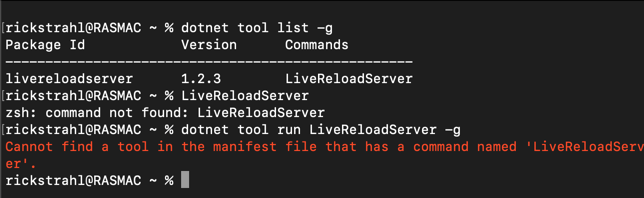
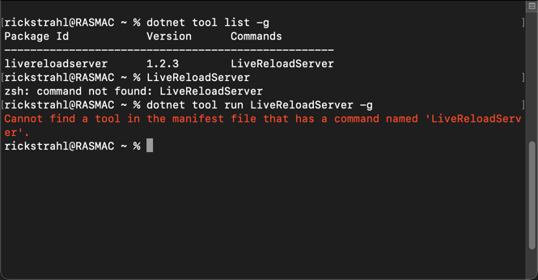
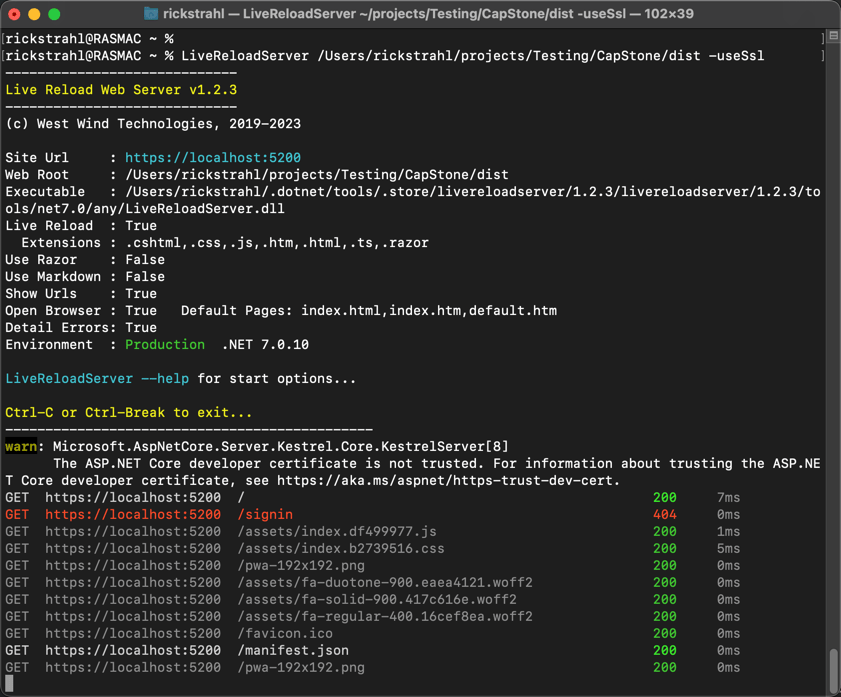

# Dotnet Tool not found on the Mac


This is a very short note to self in regards to installing and then running a global **DotNet Tool** on a Mac, which apparently after a default install of the .NET SDK, doesn't work *out of the box*.

One of the reasons I like using `dotnet tool` is that it's one very easy way to create tools/console apps that can run on any platform that support the .NET SDK **without having to explicit target a specific platform**. .NET Tools handles creating the correct proxy file to launch the tool on each platform that the tool is installed.

So here's the scenario: I installed the .NET SDK on a brand new M2 Mac, using the Mac installer from the [.NET download page](https://dotnet.microsoft.com/en-us/download), which is easy enough as it's now a one-click install.

After installing the .NET SDK, I went ahead and installed one of my tools on a Mac using the `dotnet tool install -g` command from the default (ZSH) Mac Terminal:

```bash
dotnet tool install -g LiveReloadServer
```

Once installed I can list it:

```bash
dotnet tool list -g
```

and that shows my tool as installed. Great! 

Tools install to `~/.dotnet/tools` and the .NET SDK is supposed to make that folder available so that any commands can be executed.

Unfortunately when I try to now execute the tool with this default configuration, it doesn't work:

```bash
LiveReloadServer

#also no luck with this
dotnet tool run LiveReloadServer
```

Here's what I get:



I sort of understand the issue with the stand-alone command which is likely paths not being found. But the direct access to the command - which is listed in the `dotnet tool list` command is rather baffling!

##AD##

## The Problem: Paths!
As you might expect the problem here is path resolution. Well at least for the direct access command - the `dotnet tool run` command may have other reasons for failing.

How do I know that? I can run the dotnet tools installed proxy loader from `~/.dotnet/tools/LiveReloadServer` and that works just fine launching either from Finder or directly from the Terminal.

So paths are the problem...

### Restart the Terminal after Installing SDK
If you installed the SDK before the terminal was opened the first thing that needs to happen is to restart the terminal so that it can find both the .NET SDK and `dotnet tool` command as well as the tools folder.

The initial terminal restart after SDK installs is meant to ensure that:

* The base `dotnet` commands can be accessed
* You can run `dotnet tool` commands and use tool commands directly  
  *(well, not really but it's supo'sta :smile:)*

### Fix the Global Folder Path
Unfortunately, if you're using the default ZSH shell on the Mac, the generated path value is not valid and doesn't work. 

The path to the dotnet tools folder is supposed to be set in  `/private/etc/paths.d/dotnet-cli-tools` and the SDK links to this path using the following path in Path environment file by default:

```bash
# /private/etc/paths.d/dotnet-cli-tools
$HOME/.dotnet/tools
```

As mentioned - this path as set here doesn't work on ZSH (AFAIK anyway). So you have to expand out the path **explicitly**. FWIW, `~/.dotnet/tools` also doesn't work.

> Note that if you use the Bash shell, the profile settings above work just fine. It's only in the default ZSH shell that the path expansion is not occurring.

The only way I could get this to work is with explicit expanding my full user path, which is fine since it's a local profile anyway:

```bash
# /private/etc/paths.d/dotnet-cli-tools
/Users/RickStrahl/.dotnet/tools

# These don't work on ZSH
#$HOME/.dotnet/tools
#~/.dotnet/tools
```

> Note that the folder is protected so you have to edit with `SUDO` or if you're using VS Code as I do, you'll be prompted to save using `SUDO` for the save operation or use `SUDO nano /private/etc/paths.d/dotnet-cli-tools`.

Remember to restart the terminal to force a reload the path environment settings.

With the explicit path in place, my `dotnet tool` component is now working:



Yay!

So this works, but it's a pain in the ass to remember and change the path value every time you install the .NET SDK.

## Summary
Nothing really new here as this has been a known issue for a long time, but you have to wonder why the .NET SDK install doesn't generate a **working path entry** on a Mac. This seems like a common problem - I've hit this at least 3 times now. As a casual Mac user this has tripped me up several times over the years and I always struggle to find the right place to add the correct environment path values. 

This post hopefully reminds me and perhaps a few of you as well, to do the right thing a little bit quicker next time...

## Resources

* [LiveReloadServer self-contained Web Server](https://github.com/RickStrahl/LiveReloadServer)
* [dotnet tool install Command](https://learn.microsoft.com/en-us/dotnet/core/tools/dotnet-tool-install)


<div style="margin-top: 30px;font-size: 0.8em;
            border-top: 1px solid #eee;padding-top: 8px;">
    
    this post created and published with the 
    <a href="https://markdownmonster.west-wind.com" 
       target="top">Markdown Monster Editor</a> 
</div>