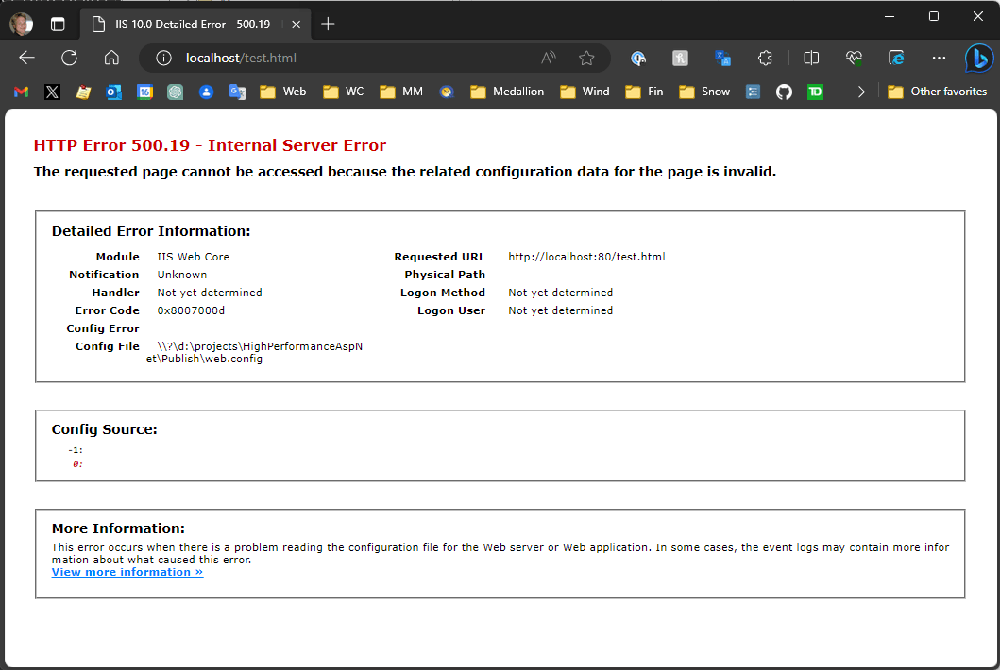

# IIS Error 500.19 with ASP.NET Core Application


Ah yes, IIS. It's been a while. But, if for some reason you need to run IIS - especially on a local dev machine for testing - and you've run into an **500.19** error in IIS like this:



while trying to run an ASP.NET Core application, make sure to:

* **Remember to install the Windows Hosting Bundle on your machine**

The ASP.NET Core Hosting Module (ANCM) is not installed by default with the .NET SDK, even though the ASP.NET Runtime is installed. 

> The only way to get the ASP.NET Core Hosting Module onto your machine is by installing the [Windows Hosting Bundle](https://dotnet.microsoft.com/en-us/download/dotnet) from the .NET Download site.

##AD##

## What's in an Error?
The **500.19** error refers to a `web.config` error condition which can take a few different forms:

* Missing `web.config` read permissions for the Application Pool User
* Invalid formatting in `web.config`
* A missing, referenced Module in `web.config`

It's a pretty broad error, but in the case of an ASP.NET Core application not working, the missing ASP.NET Core Module is the problem.

When you build your ASP.NET Core application on Windows, the publish process automatically builds a `web.config` file which includes a reference to the ANCM in the `<handlers>` section of the Web Server configuration (modules=`AspNetCoreModuleV2`):

```xml
<system.webServer>
  <handlers>
    <!-- ASP.NET Core Hosting Module for ASP.NET Core missing -->
    <add name="aspNetCore" path="*" verb="*" modules="AspNetCoreModuleV2" resourceType="Unspecified" />
  </handlers>
  
   <aspNetCore processPath="dotnet" arguments=".\HighPerformanceAspNet.dll"  hostingModel="inprocess" />
</system.webServer>
```

Once you install the ASP.NET Hosting installer the `AspNetCoreModuleV2` becomes available and - voila - your application now starts running. If it's not installed, the dreaded **500.19** error page shows up instead.

> **Note:**<br/>
> The Hosting Bundle will only install the ASP.NET Core Hosting Module if IIS is already installed. So if you're doing a new system install make sure you do the ASP.NET Hosting Module install **after** you've installed IIS. Remember this may have to be done **in addition to**  the .NET SDK installation.
> 
> If you install IIS after the module install, you'll have to reinstall or repair the Hosting Bundle to ensure the module is registered in the default IIS handler list.

## Not Obvious on a Dev Machine!
On a production machine installing the Hosting Bundle makes sense: You need to install the .NET and ASP.NET Runtimes and the Hosting Bundle is the recommended way to do that: It installs everything you need to run ASP.NET Apps either with Kestrel or IIS. It installs all runtimes both for 32 and 64 bit.

On a Dev machine however it's easy to overlook the Hosting Bundle requirement because 99% of the time you don't actually test your application against IIS. I typically run locally with Kestrel, using a local port for development and testing. So if you run into a problem with this, the problem doesn't show up until you test in IIS.  

This really only comes up when you need to run IIS locally on your dev box which should be exceedingly rare. Usual scenarios for have been checking various security scenarios with Windows Authentication or Active Directory, and the occasional performance checking. Even though I run many of my applications on a self-hosted Windows Server, I rarely ever run IIS locally. Today's episode for me had to do with some performance comparisons between running Kestrel and IIS locally. 

##AD## 

Note that most ASP.NET Core **hosting errors show up in the Event Viewer in Windows**, but since the module is not yet installed it obviously can't log into the Event log, duh. Yeah obvious in hindsight but that didn't prevent me from scratching my head why nothing showed up in the event log. Unfortunately IIS is also too dumb to give you more detailed error information besides the vague 500.19 which points at a problem with `web.config`. It would be nice if it could either put the missing module name into the local error message or write out an event log entry, but... 

So, this is another note to self from myself, since I've run into this issue a few times and I've actually forgotten what the problem was. In the future, I might actually find the culprit based on the title of this post, and maybe you will too if you ever need to run ASP.NET Core locally on IIS...

## Resources

* [ASP.NET Core IIS InProcess Hosting Issue in .NET Core 3.1](https://weblog.west-wind.com/posts/2020/Jan/14/ASPNET-Core-IIS-InProcess-Hosting-Issues-in-NET-Core-31)
* [ASP.NET InProcess Hosting on IIS](https://weblog.west-wind.com/posts/2019/Mar/16/ASPNET-Core-Hosting-on-IIS-with-ASPNET-Core-22)
* [.NET Downloads - download the Windows *Hosting Bundle*](https://dotnet.microsoft.com/en-us/download/dotnet)


<div style="margin-top: 30px;font-size: 0.8em;
            border-top: 1px solid #eee;padding-top: 8px;">
    
    this post created and published with the 
    <a href="https://markdownmonster.west-wind.com" 
       target="top">Markdown Monster Editor</a> 
</div>