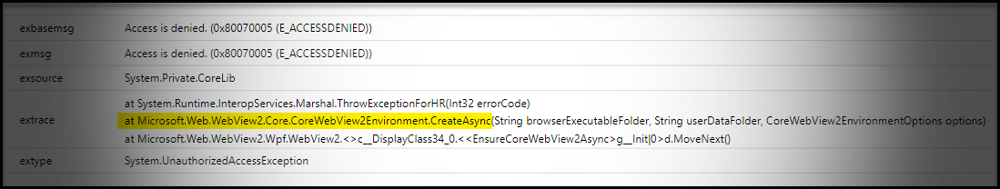
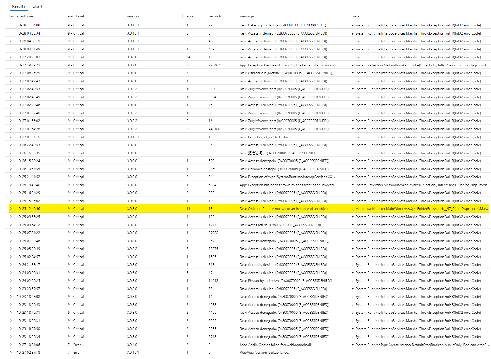
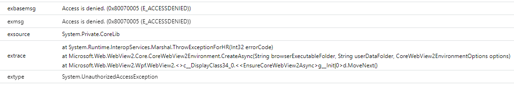

# Fix WebView Environment CreateAsync() Errors: Use a Shared WebView Environment for multiple Usages



I've been struggling with some WebView initialization issues that are showing up in my application logs from a deployed application. Personally I've never run into these issues myself, however my customers of [Markdown Monster](https://markdownmonster.west-wind.com) are running into `UnauthorizedException` errors occasionally, that occur deep in the innards of the WebView control. It's relatively rare - maybe a couple per 1000 application runs, but it's not zero.

With a fair number of active users that adds up and makes for really messy logs that hide other information in the noise. To give you an idea what this looks like in [Markdown Monster](https://markdownmonster.west-wind.com), here are my Analytics logs for the last 5 days showing critical (ie. Stop) errors:

  
<small>**Figure 1** - Azure logs showing almost exclusively WebView2 Initialization Errors </small>

All but one of the critical errors you see in **Figure 1** are related to WebView initialization failing. The actual error is always inside of the WebView's innards, but it's always inside of the `CreateAsync()` method:

  
<small>**Figure 2** - An individual WebView error in the Analytics log </small>

Note that this **is not my call** from the application to this method - no, it's an internal call that the control makes as indicated by the call stack. It's out of band from the application presumably off a different task/event context. More on that in a minute.

## CreateAsync Errors
A few things to note about the errors:

* The exceptions always occur in `CoreWebView2Environment.CreateAsync()`
* Errors occur on their own Task context outside of the App task context (`Task:` prefix)
* The exception can be different and on different code areas
* The most common error is `UnauthorizedException` with **Access is denied**
* Other errors creep in like **Expecting object to be local** and **Target invocation Error**  but still they are always in the `CreateAsync()` call.
* The errors do not occur on the first instantiation of a WebView - always
  sometime later in the application so likely when secondary instances are created
  later on. 

Unfortunately the errors in the log **never have a complete call stack or any type of context**, meaning that the WebView starts up its own Async call chain or off some custom event rather than passing forward the existing async context that is called when making the actual call from the application.

##AD##

### Error Weirdness
The exception in **Figure 2** suggests this code is running in a separate `async` context from my application (ie. - no call stack), so the call the `CreateAsync()` is not directly rooted off the call that my code actually makes into this API. 

My application explicitly calls a `CoreWebView2Environment.CreateAsync()` as part of the WebView initialize sequence so I can control the environment. But the stack trace which fails in `CreateAsync()` doesn't reflect that call stack and instead shows a Microsoft internal call stack which suggests a separate async context.

My code to initialize looks like this:

```cs
try
{
    if (environment == null)
    {
        if (string.IsNullOrEmpty(Current.EnvironmentFolderName))
            Current.EnvironmentFolderName = Path.Combine(Path.GetTempPath(), 
                Path.GetFileNameWithoutExtension(Assembly.GetEntryAssembly().Location) + "_WebView");

        // must create a data folder if running out of a secured folder that can't write like Program Files
        environment = await CoreWebView2Environment.CreateAsync(userDataFolder: EnvironmentFolderName, options: EnvironmentOptions);

        Environment = environment;
    }
    await webBrowser.EnsureCoreWebView2Async(environment);
}
catch (Exception ex)
{
    throw new WebViewInitializationException($"WebView EnsureCoreWebView2AsyncCall failed.\nFolder: {EnvironmentFolderName}", ex);
}
```

I've have gone through my app multiple times to ensure that all code that initializes a WebView goes through this code - IOW, I'm pretty sure there's no accidentally 'missed' un-configured WebView that gets loaded.

Notice the `try/catch` which should capture any exceptions that occur in `CreateAsync()` or `EnsureCoreWebView2Async()`. But these exceptions never get triggered - I don't see any log entries for this error or exception type.

Instead I get exceptions that are caught at the application level  `TaskScheduler.UnobservedTaskException` handler which accounts for the `Task:` prefix in the error log.

This thing:

```cs
TaskScheduler.UnobservedTaskException += (object sender, UnobservedTaskExceptionEventArgs e)=>
{
   mmApp.HandleApplicationException(e.Exception?.GetBaseException(), ApplicationErrorModes.TaskExecution);
   e.SetObserved();
}
```

### No Call Stack, No Context
In other words: The WebView's internal `CreateAsync()` call loses the application level async context that is passed in via the app level `await CoreWebView2Environment.CreateAsync()` call, so when it fails it doesn't preserve my call stack nor does it trigger the `try/catch` exception handler. 

What this means is that when I get a generic `UnauthorizedException` I can't trace it back to my own code, nor is there any information about **which instance caused this error**. 

> #### @icon-info-circle What I would like to see?
> I would like WebViewExceptions on creation be captured in a custom exception (ie. `WebViewInitializeException`)  which has an InnerException of the initial error. The main exception should contain some unique ID that identifies the WebView instance, plus the current URL, the current Environment settings or at least the environment path.


As far as the exception goes I have some ideas, namely that the environment folder might be created in a protected file location due to a default setting or a setting being overridden. The other potential issue could be that AccessDenied occurs because the EnvironmentOptions are different or the environment path is omitted.

But... all of those are **guesses**, which is all I can do at this point!

After these errors showed up in the application, I went through and meticulously checked all WebView instance creation code and made 100% sure they are all:

* Loading the Environment into the same `%localappdata%\Markdown Monster` folder
* That there are no Environment options
* All calls are wrapped in a try/catch block to provide context on failure

But none of that helped initially. So even though I was creating the same Browser Environment repeatedly (new instances but always with the **exact same settings**), I still saw these failures.

According to the documentation this is supposed to work - you can either use a single environment and reuse it, or create the same environment and use a new one each time.

> What's not supported is creating multiple environments with **different settings**. Basically there's only one controlling WebView manager process and it determines the options used for the new WebView instances that are created. You can think of this like the a Web Browser, where we have a top level application (ie. Brave, Edge, Chrome, Vivaldi etc.) that can take command line options and environment settings (`chrome://settings/xxxx`) but all of the individual tabs use that single top level environment.
>
> The question then becomes: Why does the WebView control even allow you to create a per instance environment when in effect you can't create a customized environment for each? Shouldn't this be a static call that can only be made once?

## Refactoring: Consolidating to a single CoreWebView2Environment
At this point I had tried everything except one thing:

**Using a single, shared Browser Environment.**

This isn't obvious from samples or the documentation, but you can **reuse a single WebView Environment instance** for many instantiations when calling `EnsureCoreWebView2Async()`:

```cs
// Initialize with a cached environment instance
await webBrowser.EnsureCoreWebView2Async(CachedEnvironment.Current.Environment);
```

I started playing around with the idea of a cached WebView Environment that gets created once and then reused for every instantiation. Initially I created a couple of static properties in my application to hold the cached environment plus the base folder and environment options that are used to create the initial instance, so that it can be auto-configured on the first instantiation with the Environment then being cached for subsequent instantiations.

That worked, but it was very application centric and was causing issues due to the fact that I had a couple of generic components that don't have direct access to the application's model data.

### A Cached WebView Environment Class

Instead I created a generic class added to my small [Westwind.WebView library](https://github.com/RickStrahl/Westwind.WebView) which is basically a utility library. 
The `CachedWebViewEnvironment` class includes options for the base path and an WebViewOptions instance that can be set globally for the application, and also contains a cached instance of a WebView environment. It also contains a method that **acts as a wrapper for the initialization process**, so that the instantiation can generically minimized to a single line of code (plus the initial base path and options assignment if desired).

Here's the class that's the end reusable end-result of several iterations:

```csharp
public class CachedWebViewEnvironment
{

    public static CachedWebViewEnvironment Current { get; set; } = new CachedWebViewEnvironment();

    public CoreWebView2Environment Environment { get; set; }

    public string EnvironmentFolderName { get; set; }

    public CoreWebView2EnvironmentOptions EnvironmentOptions { get; set; }

    
    public async Task InitializeWebViewEnvironment(WebView2 webBrowser, CoreWebView2Environment environment = null)
    {
        try
        {
            if (environment == null)
                environment = Environment;
            
            if (environment == null)
            {
                if (string.IsNullOrEmpty(Current.EnvironmentFolderName))
                    Current.EnvironmentFolderName = Path.Combine(Path.GetTempPath(), 
                        Path.GetFileNameWithoutExtension(Assembly.GetEntryAssembly().Location) + "_WebView");

                environment = await CoreWebView2Environment.CreateAsync(userDataFolder: EnvironmentFolderName, options: EnvironmentOptions);

                Environment = environment;
            }
            await webBrowser.EnsureCoreWebView2Async(environment);
        }
        catch (Exception ex)
        {
            throw new WebViewInitializationException(
              $"WebView EnsureCoreWebView2AsyncCall failed.\nFolder: {EnvironmentFolderName}",
              ex);
        }
    }
}
```
*<small>full commented [code on GitHub](https://github.com/RickStrahl/Westwind.WebView/blob/master/Westwind.WebView/Wpf/CachedWebViewEnvironment.cs)</small>*

### Usage
To use this is a two step process:

* At minimum configure the Environment Path where the environment is created on disk
* Optionally configure the Environment options
* Call `CachedWebViewEnvironment.Current.InitializeWebViewEnvironment()` for any new instances

The initialization can be done before the first WebView gets instantiated. It can be done during app startup, or on the main forms initialization when it first happens.

In Markdown Monster I do the initial configuration as part of the launch configuration in `App.xaml.cs` in my `OnStartup()` handler:

```cs
protected override void OnStartup(StartupEventArgs e)
{

    // initialize single environment folder for all WebViews
    CachedWebViewEnvironment.Current.EnvironmentFolderName = Path.Combine(
       mmApp.Configuration.LocalAppDataFolder,
       mmApp.Constants.WebViewEnvironmentFolderName);
    // CachedWebViewEnvironment.Current.EnvironmentOptions = null;

    ...
}
```

The initialization sets the base values that are assigned when the one time instantiation of the WebView environment occurs. Those two values are the parameters that get passed to the WebViews internal method that creates the environment. The environment is created on the first instantiation and then reused for all other instantiations - assuming they use the `InitializeWebViewEnvironment(WebBrowser)` method to initialize.

> #### @icon-warning Use the Shared Environment
> It's important to understand that in order for this environment reuse to work, you **have to** use the `InitializeWebViewEnvironment()` method, or otherwise re-use the cached environemnt from `CachedWebViewEnvironment.Current.Environment` in order to end up using this single shared environment. 
>
> If you use a WebView without explicit configuration it will create and use its own custom environment instance, which may or may not work. This is what is likely to cause problems depending from where the WebView is loaded. For this reason, we recommend to be consistent and **always use the cached instance** in your application.

I can now initialize any use of the WebView control in an `InitializeAsync()` call using something similar to this:

```cs
    public WebViewPreviewHandler(WebView2 webViewBrowser)
    {
        // Out of band invocation
        WebBrowser.Dispatcher.Invoke(() => InitializeAsync().FireAndForget(),DispatcherPriority.Normal);
    }
     
    private async Task InitializeAsync()
    {
        // Initialize Environment and wait for WebView to initialize internally            
        await CachedWebViewEnvironment.Current.InitializeWebViewEnvironment(WebBrowser);

        ...
    }

```

So far, with 4 days of testing I have not seen any new errors with `UnauthorizedAccess` exception or other WebView initialization errors which is awesome. For previous release, new errors would show up pretty quickly and to go this many days without is unlikely - so it looks like the single shared environment is doing the trick!

##AD##

## Summary
While this approach works it really shouldn't be this hard! The fact that the WebView API allows you to create multiple environments, when it really only supports a single environment for all instances, is a major API Fail IMHO. This was almost certainly the problem with the errors in my logs, and that even though I was meticulous about ensuring that all instances were explicitly using the same loaded environment settings.

As it stands using the shared WebView environment has fixed my application. Having a single instance is more efficient and effectively avoids accidentally causing a problem with incompatible settings of a different instance, causing a failed load. 

Bottom line: If you are create many WebView instances - even if it's the same instance for multiple separate instantiations -  it's probably a good idea to create a single WebView environment and share it.

The downside of this approach is: You have to be consistent and **always** use the cached environment, or at least call the specific `InitializeWebViewEnvironment()` method instead of the individual `CoreWebView2Environment.CreateAsync()` and `browser.EnsureCoreWebView2Async(environment)` calls. 

But I think if you've read this far and have run into problems to arrive here in the first place, you're probably well down the path of being disciplined :smile:


## Resources

* [WebViewEnvironment.cs on GitHub](https://github.com/RickStrahl/Westwind.WebView/blob/master/Westwind.WebView/Wpf/CachedWebViewEnvironment.cs)

<div style="margin-top: 30px;font-size: 0.8em;
            border-top: 1px solid #eee;padding-top: 8px;">
    
    this post created and published with the 
    <a href="https://markdownmonster.west-wind.com" 
       target="top">Markdown Monster Editor</a> 
</div>