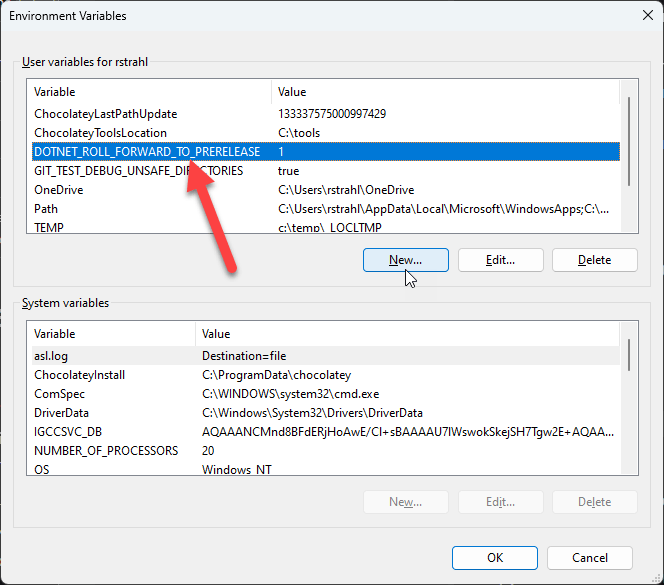
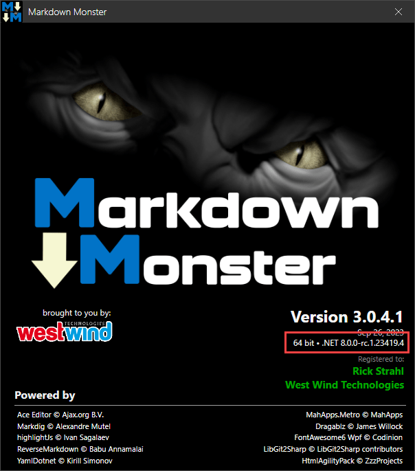

# Rolling Forward to Major Versions in .NET


I'm currently playing around with .NET 8 RC Preview release and upgrading several of my applications to run under .NET 8 both Web server and Desktop based. In my early testing, moving those applications to .NET 8 has been very much a painless operation with **zero** required changes and only a few warnings/obsolescence related issues that had to be addressed. Nice!

But - especially for my desktop applications - I wanted to start running the existing .NET 7 targeted applications under the .NET 8.0 preview to see if I'd run into any issues in day to day operations **without fully converting or re-targeting** the applications to .NET 8.0.

Turns out .NET has the ability to define a `RollForward` policy that lets you move an application to a newer version than it was compiled under. You can specify this value in the `.csproj` file using a `<RollForward>Minor</RollForward>` key in the `<PropertyGroup>` section.

```xml
<Project Sdk="Microsoft.NET.Sdk">
  <PropertyGroup>    
    <TargetFramework>net7.0-windows</TargetFramework>
    <RollForward>LatestMajor</RollForward>
  <PropertyGroup>    
</Project>  
``` 

Here are the options you can specify for `RollForward` ([from Microsoft](https://learn.microsoft.com/en-us/dotnet/core/project-sdk/msbuild-props#rollforward)):

| Value         | Description                                                                                                                                                                                                            |
|---------------|------------------------------------------------------------------------------------------------------------------------------------------------------------------------------------------------------------------------|
| `Minor`       | **Default** if not specified.<br>Roll-forward to the lowest higher minor version, if requested minor version is missing. If the requested minor version is present, then the `LatestPatch` policy is used.             |
| `Major`       | Roll-forward to the next available higher major version, and lowest minor version, if requested major version is missing. If the requested major version is present, then the `Minor` policy is used.                  |
| `LatestPatch` | Roll-forward to the highest patch version. This value disables minor version roll-forward.                                                                                                                             |
| `LatestMinor` | Roll-forward to highest minor version, even if requested minor version is present.                                                                                                                                     |
| `LatestMajor` | Roll-forward to highest major and highest minor version, even if requested major is present.                                                                                                                           |
| `Disable`     | Don't roll-forward, only bind to the specified version. This policy isn't recommended for general use since it disables the ability to roll-forward to the latest patches. This value is only recommended for testing. |

The `Minor` default is sensible - it basically tries to find the next higher minor version installed, if any. `LastestMinor` on the other hand will find the latest higher minor version installed.

##Ad##

In my scenario however, I want to roll forward the lastest major version, so for my scenario I'd want to use `LatestMajor`, which effectively says - use the latest version of the .NET Core runtime available.

So my app is compiled to .NET 7.0 but I would like to run on the .NET 8.0 RC, so I expected the following to work:

```xml
<Project Sdk="Microsoft.NET.Sdk">
  <PropertyGroup>    
    <Title>Markdown Monster</Title>
    <Version>3.0.4.1</Version>
    
    <TargetFramework>net7.0-windows</TargetFramework>
    <RollForward>LatestMajor</RollForward>
    ...
  <PropertyGroup>    
  ...
</Project>  
``` 

> You can also use the `--roll-forward` [command line option](https://learn.microsoft.com/en-us/dotnet/core/tools/dotnet#options-for-running-an-application) to specify the roll forward mode at runtime or set these modes in an optional `global.json` of your project. [More info here](https://learn.microsoft.com/en-us/dotnet/core/tools/global-json))


It turns out that **does not work**. The above **does not roll forward** to the **.NET 8.0 RC Preview** and the application continues to run under .NET 7.0.

The problem is that the current release is `net8.0.0-rc-123419.4` which is a **pre-release** version, and preview releases are excluded from automatic roll forward operations. 

To make `RollForward` work with a pre-release version an additional step is needed: It involves creating an **Environment variable** that enables the functionality:


```powershell
$env:DOTNET_ROLL_FORWARD_TO_PRERELEASE=1
#Run MM
MarkdownMonster
# or mm
```

Alternately you can add the environment variable to your machine's environment settings.



Now with that in place you can launch the pre-release version of .NET 8.0 RC even though the application is compiled for .NET 7.0.



Yay!


> Unlike the `<RollForward>` project option which is project specific and can be compiled in, the `DOTNET_ROLL_FORWARD_TO_PRERELEASE` is an add-on to the `<RollForward>` project flag that is externally applied. The environment variable has no effect unless `<RollForward>` behavior is enabled in the first place, so it doesn't all of a sudden roll forward any .NET Core application to .NET 8.0.

## Running a Preview Rollforward Release? Is this a good idea?
For a production application this obviously not a great idea. But since you can only enable roll forward to a pre-release version with an environment variable, users who want to try this would have to be pretty explicit in doing this.

That said, I've found that the last few .NET Core releases have been very good about **not breaking existing functionality**, so I've felt pretty comfortable running applications using preview releases, at least locally for myself. 

And true to form .NET 8.0 RC doesn't disappoint!

I have 3 separate desktop applications that are in production and all of those are running fine on .NET 8.0 with RollForward. I've also ported 2 production server apps (actual port to net8.0 rather than RollForward) also with no changes required and no apparent issues. All apps informally show some light perceived performance improvements.

However, one of my desktop/cli apps that is performance centric - [West Wind WebSurge](https://websurge.west-wind.com) - is seeing a robust performance boost and resource reduction running under .NET 8.0. Because this application is using a lot of resources and running many operations in parallel for stress testing, the perf improvements in the framework are more pronounced.

## Side Effects

*updated a while after*

I did *run into one problem with Roll Forward behavior* at least with the current RC preview:

I noticed that running the app with the debugger attached, any call to `Process.Start()` was hard crashing the application with a `ExecuteEngineException`. Turns out I ran into a [bug in .NET 8.0 RC1](https://github.com/dotnet/runtime/issues/92046).

And that neatly describes the possibility of problems you can run into, especially with pre-release builds. In this case it was an outright bug, but in other cases it can simply be a slight change to an API interface (new or changed overloads for example) or a slightly different implementation. That's always a risk you take when running previews.

But the advantage of running this way is that you get a crack at front-running any potential issues, and if you find a bug or issue in your very specific application scenarios, being able to report it before an RTM release goes out the door. 

In this case, the bug is already fixed for RC2 so somebody else was way ahead of me :smile:

## Doing it right: Migrate to .NET 8.0 proper
The right way to do this is to actually take the applications and properly target them to `net8.0` for each project. 

As a matter of fact, I did that with Markdown Monster first, to ensure that there weren't any obvious API difference in the framework libraries. Just be forewarned, that you may end up having to re-target multiple projects. At minimum all top level projects, and if you want to do it right probably also your child projects. In Markdown Monster's case this involves:

* The main EXE project
* 3 Addin Projects
* 2 Test Projects
* 2 CLI Projects
* 2 Support libraries that are compiled in

So, to do this right is not a 5 minute affair. But if you stick to the top level project(s) you can get this done fairly quickly.

The re-targeting allows the compiler to find actual runtime call changes, but neither Markdown Monster or WebSurge including their compiled dependencies showed any hard API breaks, although there were a few additional warnings related to crypto APIs and deprecated old Http clients that were not flagged in previous versions.

Once compiled I can easily run the application under .NET 8.0 preview and that works fine without any `RollForward` semantics at all. Prim and proper and all!

##AD##

## So, why use RollForward?
So why not compile for .NET 8.0 and ship that in the first place? 

Well, I didn't want to wait until November when .NET 8.0 officially ships - until then the runtimes are in Preview, and for commercial software installation, it wouldn't be appropriate to install a preview version of the runtime. 

By using the above `RollForward` plus an Environment variable, I can set up my environment locally to run on .NET 8.0, while leaving all the old .NET 7.0 runtime compilation and behavior for the release version in place. It gives me a chance to test, and also some of my more enthusiastic users to do the same and report any issues they might be running into. I can point them at directions on how to run on a preview version of .NET [as described in the MM documentation](https://markdownmonster.west-wind.com/docs/_6q00mlyqb.htm).

When .NET 8.0 ships RTM, the `RollForward` directive automatically kicks in and so if .NET 8.0 (released) is installed on the machine it'll automatically be used. 

By then however I would also have a newer version of the software that's explicitly compiled for .NET 8.0, so this would only apply to users who haven't upgraded, but then could still take advantage of the improved features of a new runtime.

## Summary
You have to appreciate that .NET supports the ability to specify how applications roll forward with so many options. And also appreciate that understanding all the different combinations are going to take a minute to figure out and which one is appropriate for your specific scenario. 

But I'm very happy that I'm able to keep creating **releaseable builds** for .NET 7.0 that I can **also run on the latest unreleased version of .NET**, without having to manage to separate compilation targets, until I'm ready for it when .NET 8.0 goes RTM.

When .NET 8.0 gets closer to release I'll switch over all projects to .NET 8.0 and update libraries etc. for a complete upgrade. But for now I can use my tools as is on the new version of .NET...

## Resources

* [MS Build Project RollForward Properties](https://learn.microsoft.com/en-us/dotnet/core/project-sdk/msbuild-props#rollforward)
* [--roll-forward Command Line Option](https://learn.microsoft.com/en-us/dotnet/core/tools/dotnet#options-for-running-an-application)
* [global.json and roll-forward](https://learn.microsoft.com/en-us/dotnet/core/tools/global-json)
* [Run Markdown Monster with .NET 8.0 Preview](https://markdownmonster.west-wind.com/docs/_6q00mlyqb.htm)

<div style="margin-top: 30px;font-size: 0.8em;
            border-top: 1px solid #eee;padding-top: 8px;">
    
    this post created and published with the 
    <a href="https://markdownmonster.west-wind.com" 
       target="top">Markdown Monster Editor</a> 
</div>