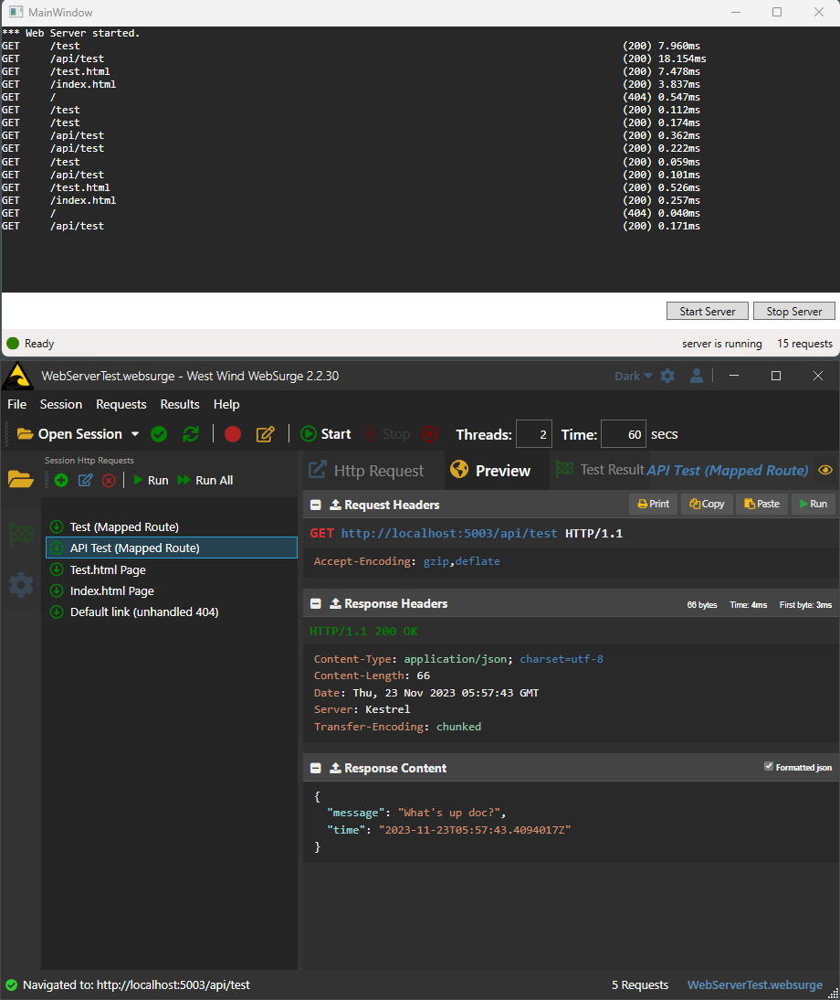

# Create a minimal, embeddable ASP.NET Web Server you can embed into a Desktop Application

Have you ever wanted to embed a Web Server into another application? It's not a common scenario but I've had a number of occasions where I've had a need for this:

* **Markdown Monster Markdown Editor**  
Provide an application server REST API that can be used for Web and other desktop applications to communicate with the running app. 

* **Help Builder (Documentation)**  
Run a background Web Server to display rendered content for live previews.

* **Inhouse Templates Generator**  
Similar to the documentation app - run a Web Server to generate Razor templated content to static files.

Unusual requirements for sure, but it does come up from time to time. And I would argue that **many applications** could actually benefit from exposing some of their functionality via a Web automation interface.

There are a lot of ways to skin this cat too, depending on how much complexity you need in your server. If you are just after very simple static file hosting, or a few very simple commands that you need to handle (like in Markdown Monster's automation for example), it's pretty easy to hand roll a TCP/IP server, or use one of several .NET packages that allow you to embed a small Web Server into your applications.

In this post I'll show you how you can use host an ASP.NET Web server inside of another application - I'll use a desktop application as an example here. I'll provide a sample and a tiny and self-contained class wrapper that makes adding an ASP.NET Web server a little easier for many scenarios and easily lets you extend customize what ASP.NET features you want to support with your own additions.

The sample WPF app and library described here are available on GitHub if you want to play around with what's described in this post:

* [Westwind.AspNetCore.HostedWebServer Library and Sample on GitHub]()

## Using ASP.NET inside of another Appplication to host a Web Server
In this post I talk directly embedding an ASP.NET (Kestrel) Web server into your application. Although it's not really obvious how to do, setting an ASP.NET Server in the scope of a non mainline application is very simple and is not that different from a proper Web application.

### Caveat: Requires the ASP.NET Runtime
Before I jump into the why and how, there's a big disclaimer that's a potentially important  consideration on whether using ASP.NET inside of a non-Web application is the right choice for you. 

Specifically you need make sure the **the ASP.NET Runtime is available**. ASP.NET is a .NET Core framework and as such is not part of the core .NET Runtime so like the Desktop Runtime, there's a separate framework reference that's required to use the ASP.NET related libraries needed for hosting and most other ASP.NET features.

> Although it's possible to use individual libraries to perhaps whittle down the requirements considerably by using individual NuGet packages, this is a difficult to maintain solution. You first need to figure out what packages are required and you need to keep them in sync with the versions of other dependent libraries. Not recommended.

If you use the standard ASP.NET Framework reference you'll have to add the following to your non-ASP.NET project:

```xml
<FrameworkReference Include="Microsoft.AspNetCore.App" />
```

and insure that either the ASP.NET Runtime is pre-installed (shared mode), or alternately published a self-contained installation that dumps all the files in your output folder (self-contained mode) along with the other base frameworks. In both cases it'll add quite a bit of bulk to your application's distribution size.

So make sure this is acceptable before going down this path.

### The simplest Thing
So if you want to do the absolute simplest thing you can do to host ASP.NET in another app you can create your server and run it like this:

```csharp
var startupPath = Path.GetDirectoryName(typeof(WebServerTests).Assembly.Location);
var options = new WebApplicationOptions
{
    ContentRootPath = startupPath,
    WebRootPath = startupPath,
};
var webBuilder = WebApplication.CreateBuilder(options);
webBuilder.WebHost.UseUrls("http://localhost:5003");
var app = webBuilder.Build();

app.MapGet("/test", async ctx =>
{
    ctx.Response.StatusCode = 200;
    ctx.Response.ContentType = "text/html";
    await ctx.Response.WriteAsync(
        $"<html><body><h1>Hello Test Request! {DateTime.Now.ToString()}</h1></body></html>");
    await ctx.Response.CompleteAsync();
});

app.MapGet("/api/test", async ctx =>
{
    ctx.Response.StatusCode = 200;
    ctx.Response.ContentType = "application/json";
    await ctx.Response.WriteAsJsonAsync(new { Message = "What's up doc?", Time = DateTime.UtcNow });
    await ctx.Response.CompleteAsync();
});
app.UseStaticFiles();

// _ = app.RunAsync();  // fire and forget

// run for 15 secs
Task.WaitAll(new [] { app.RunAsync()  }, 15000);

// shut down
await app.StopAsync();

Assert.Pass();
```

So it's pretty simple since in recent versions with minimal API has been introduced most of the settings you want are preset for you. If you just want basic services, for integration of a few requests you'll probably don't need much more than this.

However, you do have access to all of ASP.NET features at this point so you can add additional services via `AddXXXX()` during configuration or add/configure additional middleware (like the optional `app .UseStaticFiles()` handler).

You can use the `app.MapXXX()` delegates to add your handlers which makes it super easy to create a small REST API that can integrate with the rest of your application.

> #### @icon-warning Watch Thread Synchronization
> You need to be aware that any Web request will hit your app on a background thread not your UI thread, so any UI or other operations that require running on the main thread will have to be dispatched explicitly. So if you pull data from your application or output or manipulate anything in the UI you'll need to ensure you'll use the `Dispatcher` or other Synchronization Context mechanism.

### Creating a Small Reusable Library
Although the above is pretty easy, it's a little painful in that you have to explicitly add the runtime reference and ensure that the right namespaces are used which is not always easy due to a lot of the ASP.NET configuration functionality living in extension methods that aren't directly referenced - you don't notice this in ASP.NET projects because the namespaces are automatically imported but in a non-Web project you have to manually pull everything in. 

IAC, to facilitate this process and also provide a few additional small features like the ability to capture request start and completion here's a small wrapper library. The steps for this are the same as before:

* Create an instance
* Set up route mappings (maps or generic)
* Optionally set up started and completed handlers
* Start the Web Server

In the context of an WPF application here's what that looks like:

```cs
public MainWindow()
{
    InitializeComponent();

    InitializeWebServer();
    ... 
}

private void InitializeWebServer()
{         
    Server = new HostedAspNetWebServer();

    // set up routes/mappings or generic handling (fallback)
    Server.OnMapRequests = (app) =>
    {
        app.MapGet("/test", async ctx =>
        {
            ctx.Response.StatusCode = 200;
            ctx.Response.ContentType = "text/html";
            await ctx.Response.WriteAsync($"<html><body><h1>Hello Test Request! {DateTime.Now.ToString()}</h1></body></html>");
            await ctx.Response.CompleteAsync();
        });

        app.MapGet("/api/test", async ctx =>
        {
            ctx.Response.StatusCode = 200;
            ctx.Response.ContentType = "application/json";
            await ctx.Response.WriteAsJsonAsync(new { Message = "What's up doc?", Time = DateTime.UtcNow });
            await ctx.Response.CompleteAsync();
        });

        app.MapFallback(async ctx =>
        {
            // You can also use this fallback to generically handle requests
            // based on the incoming ctx.Request.Path
            string path = ctx.Request.Path;
            string verb = ctx.Request.Method;

            // In this case I just return a 404 error
            ctx.Response.StatusCode = 404;
            ctx.Response.ContentType = "text/html";
            await ctx.Response.WriteAsync($"<html><body><h1>Invalid Resource - Try again, Punk!</h1></body></html>");
            await ctx.Response.CompleteAsync();
        });
    };

    // Optionally Intercept to display completed requests in the UI UI 
    Server.OnRequestCompleted = (ctx, ts) =>
    {
        // Important: Request comes in on non-ui thread!
        Dispatcher.Invoke(() =>
        {
            var method = ctx.Request.Method.PadRight(8);
            var path = ctx.Request.Path.ToString();
            var query = ctx.Request.QueryString.ToString();
            if (!string.IsNullOrEmpty(query))
                path += query;
            var status = ctx.Response.StatusCode;


            var text = method + path.PadRight(94) +
                       " (" + status + ") " +
                       ts.TotalMilliseconds.ToString("n3") + "ms";

            Model.AddRequestLine(text);
            Model.RequestCount++;
        });
    };
}
```

The first step is mapping 'routes' which exposes the ASP.NET WebApplication object to allow you to add additional routes via the various `Map()` commands. These are the same methods you'd use in a standalone application using minimal APIs to route requests so you can use `app.MapGet()`, `app.MapPoste()` etc. to map specific routes and from there handle the actual ASP.NET requests.

Yes - you're getting actual ASP.NET requests surfaced in your application code which surely breaks encapsulation, but lets face it if you are

### Start and Stop the Server
The above code creates the Server instance, but it doesn't start it yet. You want to make sure you start the server asynchronously `LaunchAsync()` in the background which amounts to a `FireAndForget()` operation. 

To start remember to not wait (or `await`) completion, but let it continue to run in the background so your main thread can continue:

```csharp
private async void Button_Start_Click(object sender, RoutedEventArgs e)
{
    Statusbar.ShowStatusSuccess("Server started.");
    Server.LaunchAsync(
        "http://localhost:5003", 
        System.IO.Path.GetFullPath("./wwwroot")
        ).FireAndForget();    // or just _ = Server.LaunchAsync()

    Model.RequestText = "*** Web Server started.";
    Model.ServerStatus = "server is running";
}
```

Note there's also a sync version of `Server.Launch()` but I don't think there's a use case for it, unless you want to wrap the task or thread operation yourself.

To stop you can just `await Server.Stop()`:

```csharp
private async void Button_Stop_Click(object sender, RoutedEventArgs e)
{
    await Server.Stop();
    Statusbar.ShowStatusSuccess("Server stopped.");
    Model.ServerStatus = "server is stopped";
    Model.RequestText = "*** Web Server is stopped. Click Start Server to run.";
}
```

I created a sample form and project which you can pick up on GitHub:

* [GitHub Westwind.AspNetCore.HostedWebServer](https://github.com/RickStrahl/Westwind.AspNetCore.HostedWebServer)

There's a WPF sample that you can run, along with some HTTP request in both West Wind WebSurge and Visual Studio `.http` files...

Here's what that sample looks like:

