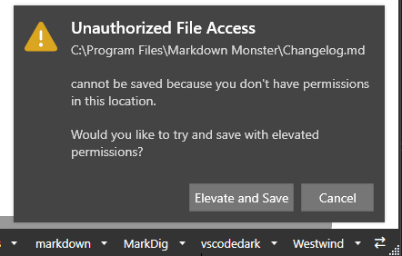

# Save Files With Elevated Permissions on UnauthorizedAccessException


When building Desktop Applications that are document centric and that allow users to save files **in any location** - like an editor for example - you can run into a situation where on rare occasions a file needs to be saved in a location that doesn't have permissions to do so for the current user.

This should be fairly rare, but I've seen a number of instances in my logs of users trying to save files in [Markdown Monster](https://markdownmonster.west-wind.com/) and failing with an `UnauthorizedAccessException` due to a file location that is inaccessible, so it's not like this doesn't happen especially in a generic document centric application.

Previously MM would fail if the permissions weren't available and treat the file write like any other invalid location, which... well, it sucks!

It sucks because if you really need to save a file in a protected location the process then becomes an exercise in Yak shaving:

* Make your edits
* Save to a temporary location
* Exit out to Explorer or Command Line using RunAs
* Copy the file from temp location to actual manually
* Delete the temp file

No fun, all that.

## Giving the Option to Save with Elevated Rights
So, rather than outright failing the Save operation in MM, I want to show a notification and  **give the user the option to save the file with elevated rights**. If the user chooses to do so, this amounts to popping up the UAC dialog to elevate the user to Admin in order to save and **then** externally copying/saving the file assuming the user has the permissions.

I originally saw behavior in VS Code and thought this came in quite handy, and I've now implemented something similar in Markdown Monster:

  
<small>**Figure 1** - Popping up an elevation notification for saving protected files. </small>

In this (contrived) example, I'm opening and saving a file in the `Program Files` folder, which usually *doesn't have write permissions* for saving a file. When the call to write the file fails, a notification dialog is popped up with an option to **Elevate and Save** and then save the file using the elevated account.

> #### @icon-info-circle UAC Elevation
> User Account Configuration (UAC) account elevation only works if the user is marked as an Administrator user, **or** the user can log on as Administrator on the machine.
>
> To be clear: With UAC enabled, by default even though a user may be set up as an 'Admin' user, the account  still runs as a non-Admin user (unless you disable UAC) and can't save in `Program Files`. But the user can elevate to its Admin status when the OS requests it with protected operations by way of `Verb="RunAs"` execution or executing a program that requires Admin use in its manifest.
>
> Failing those security criteria the write operation will fail.


##AD##

## How to Copy a File with Elevation
So lets consider the scenario. 

Let's start with the initial failure:

* You're running an application with limited rights
* Now you want to save a file in a protected area
* A write operation fails with `UnauthorizedAccessException`

Now, in order to save the file you'd have to:

* Elevate the user account
* Use some other executable than the current one, in that elevated account context
* Perform the write or copy operation in the elevated process

When I started on this I played around with a few different ways to do this and I'll touch on a few of those at the end. 

But for now here's what I did inside of my code:

* Try to save
* Capture the `UnauthorizedAccessException`
* Prompt the user for elevation and save
* Copy original file to a temporary location
* Execute the `xcopy` command and execute via `Verb="RunAs"`
* Delete the temp file

### Other Copy Options
There are other options than using `xcopy` to copy the file.

Initially I had used my own Markdown Monster CLI (`mmcli.exe`) and I was planning to pass the file as a command line parameter via BinHex encoded string. Alas, it turns out that **command line parameters are limited to 4000 characters**, so that wasn't going to work 😄

I then switched the code in `mmcli.exe` to do a file copy and creating the file from the saved file target content in a temporary location. At this point I realized: *Why am I calling mmcli.exe  when I can use a built in command/program to perform the copy?*

So I switched to using `xcopy.exe` instead of my own version of copy inside of `mmcli.exe`.

One reason you might want to use your own executable (ie. `mmcli.exe`) rather than a built-in, Microsoft provided one is that the copyright and program name (if the exe is signed) on the UAC Launch Dialog shows your company instead of Microsoft's. Not sure which is better for trust concerns (leave a comment if you feel one way or another).

### Code Implementation
Let's take a look what this looks like in an application implementation - specifically in Markdown Monster.

We start off with the save operation. This is inside of the UI's `SaveDocument()` operation which calls into the document's `SaveAsync()` method, which when it's all said and done does a `File.WriteAllTextAsync()` operation which ultimately fails in the protected file location:

```csharp
try
{
    if (!await MarkdownDocument.SaveAsync())
        return false;
}
// we throw this from SaveAsync() explicitly to forward and report error here
// to allow for elevated save operation with external copy command
catch (UnauthorizedAccessException)
{ ... } 
```

This code **specifically** catches the `UnauthorizedAccessException` and handles it. Inside of the exception I now need to display a notification for which I use a customized version of [Notifications.Wpf](https://github.com/Federerer/Notifications.Wpf):

*(FWIW my modifications were to make notifications show ontop of WebView controls. so that notifications display as top level windows ontop of the main window and stay in sync as WebView2 controls won't allow z-index airspace to overlay the notifications)*</small>

  
<small>**Figure 2** - Notifying users that elevation is required for saving.</small>

Here's the code that triggers this operation:

```csharp
catch (UnauthorizedAccessException)
            {
                var msg = $"""
{MarkdownDocument.Filename}

cannot be saved because you don't have permissions in this location.

Would you like to try and save with elevated permissions?
""";

    var content = new TextBlock();
    content.Inlines.Add(new Run { Text = MarkdownDocument.Filename + "\n", FontWeight = FontWeights.SemiBold });
    content.Inlines.Add(new TextBlock { Text = msg, Margin = new Thickness(0,10, 0, 0) });

    // using a customized verrsion of `Notifications.Wpf`
    var nfc = new NotificationContent
    {
        Title = "Unauthorized File Access",
        Message = msg,
        LeftButtonContent = "Elevate and Save",
        RightButtonContent = "Cancel",                   
        LeftButtonAction = async () =>
        {
            // This is our elevated copy operation!
            if (!await MarkdownDocument.SaveAsyncElevated())
            {
                Window.ShowStatusError("Unable to save file with elevated permissions.");
            }
            else
            {
                Window.ShowStatusSuccess(msg);
            }
        },
        RightButtonAction = () => { },
        ...
    };
    
    Window.NotificationManager.Show(nfc, 
        expirationTime: TimeSpan.FromSeconds(15), 
        ShowXbtn: false);
    
    return true;
}    
```

If there's no `UnauthorizedAccessException` the code continues on in with its save operation which performs a number of additional fixups, handling backup files and a few other things.

If the exception is triggered and the user chooses to elevate we call `MarkdownDocument.SaveAsyncElevated()`.

This method does the following:

* Copies the content to save to a temporary file
* Uses xcopy to try and copy the file from temp to the actual location
  using elevated rights
* Deletes the temporary file

The UAC dialog that is triggered looks like this:

  
<small>**Figure 3** - The UAC dialog that actually asks for elevation, in this case for `xcopy.exe`.</small>

And here's what the implementation looks like (with some additional application logic embedded):

```csharp
private static SemaphoreSlim _SaveLock = new SemaphoreSlim(1, 1);
private bool _IsSaving = false;     

public async Task<bool> SaveAsyncElevated(string filename = null,
            bool noBackupFileCleanup = false,
            SecureString password = null, bool isAsync = true)
{
    if (string.IsNullOrEmpty(filename))
        filename = Filename;

    if (string.IsNullOrEmpty(filename) || IsUntitled)
        return false;

    await _SaveLock.WaitAsync(); // lock(_SaveLock)
    try
    {
        _IsSaving = true;
        string fileText = CurrentText;

       // save to temp filename and write out
        var ext = Path.GetExtension(filename);
        var tfile = Path.Combine(Path.GetTempPath(), DataUtils.GenerateUniqueId(8) + ext);
        if (!isAsync)
            File.WriteAllText(tfile, fileText, Encoding);
        else
            await mmFileUtils.WriteAllTextAsync(tfile, fileText, Encoding);

        // Run XCOPY.EXE
        // /Y - Overwrite without prompting 
        // /-I - always assume destination is a file not a folder (REQUIRED?)
        var arguments = $"""
/Y /-I "{tfile}" "{filename}"
""";
        var si = new ProcessStartInfo
        {
            FileName ="xcopy.exe",
            Arguments = arguments,
            Verb = "RunAs",          // Elevate!
            UseShellExecute = true   // Important for elevation to work
        };
        try
        {
            var res = Process.Start(si);
            if (!res.WaitForExit(2000) || res.ExitCode != 0)
                return false;
        }
        catch (Exception ex)
        {
            mmApp.Log($"Elevated Document Save failed: {filename} - {Encoding?.EncodingName}",
                ex, false, LogLevels.Warning);
            return false;
        }
        finally
        {
            File.Delete(tfile);
        }

        OriginalText = CurrentText;
        IsDirty = false;

        UpdateCrc(filename);
        LastSaveTime = DateTime.UtcNow;
    }          
    catch (Exception ex)
    {
        mmApp.Log($"Document Save failed: {filename} - {Encoding?.EncodingName}",
            ex, false, LogLevels.Warning);
        return false;
    }
    finally
    {
        _SaveLock.Release();
        _IsSaving = false;
    }

    return true;
}
```

Note that I'm using a `_SaveLock` to prevent accidentally running multiple save operations on top of each other at the same time - we need to be sure only one save operation is in process at any time (that's a story for another day). This applies both here in the `xcopy` scenario as well as in the plain file save operation.

So I use `Process.Start()` using `ShellExecute` operation and with a Verb of `RunAs` to run the file copy in elevated mode. The key code is:

```csharp
var arguments = $"""
/Y /-I "{tfile}" "{filename}"
""";

var si = new ProcessStartInfo
 {
     FileName ="xcopy.exe",
     Arguments = arguments,
     Verb = "RunAs",          // Elevate!
     UseShellExecute = true   // Important for elevation to work
 };
 
var res = Process.Start(si);
if (!res.WaitForExit(2000) || res.ExitCode != 0)
    return false;
```

> Note that the command line parameters should include `/Y /-I` to allow overwriting of files without prompting (`/Y`) and get around the odd error that a target file is considered a folder (`/-I`). The latter is a weird one, but I saw that error on a number of file copy operations even though the filenames clearly were not folders :man_shrugging:

If the elevation fails, an error occurs and the calling UI code in `SaveDocument()` can then display an error message to that effect.

And that's pretty much it. If the file copy works we just exit out, otherwise the calling UI can display an error message, which in this case is displayed on the status bar.

##AD##

## Summary
Saving files in protected locations is usually not a great idea, but it's something that might be required in generic, document centric applications that can save files anywhere on disk. It should be rare but I know when I need to write a file somewhere where I'm not permitted, I really hate having to save the file in a safew location first and then manually copy the file, or use another tool to do the job.

Using the approach I showed in this post allows your application to provide this functionality natively and simplify your user's lives rare as it maybe which is always a win...

## Resources

* [Notifications.Wpf](https://github.com/Federerer/Notifications.Wpf)
* [Markdown Monster](https://markdownmonster.west-wind.com)

<div style="margin-top: 30px;font-size: 0.8em;
            border-top: 1px solid #eee;padding-top: 8px;">
    
    this post created and published with the 
    <a href="https://markdownmonster.west-wind.com" 
       target="top">Markdown Monster Editor</a> 
</div>