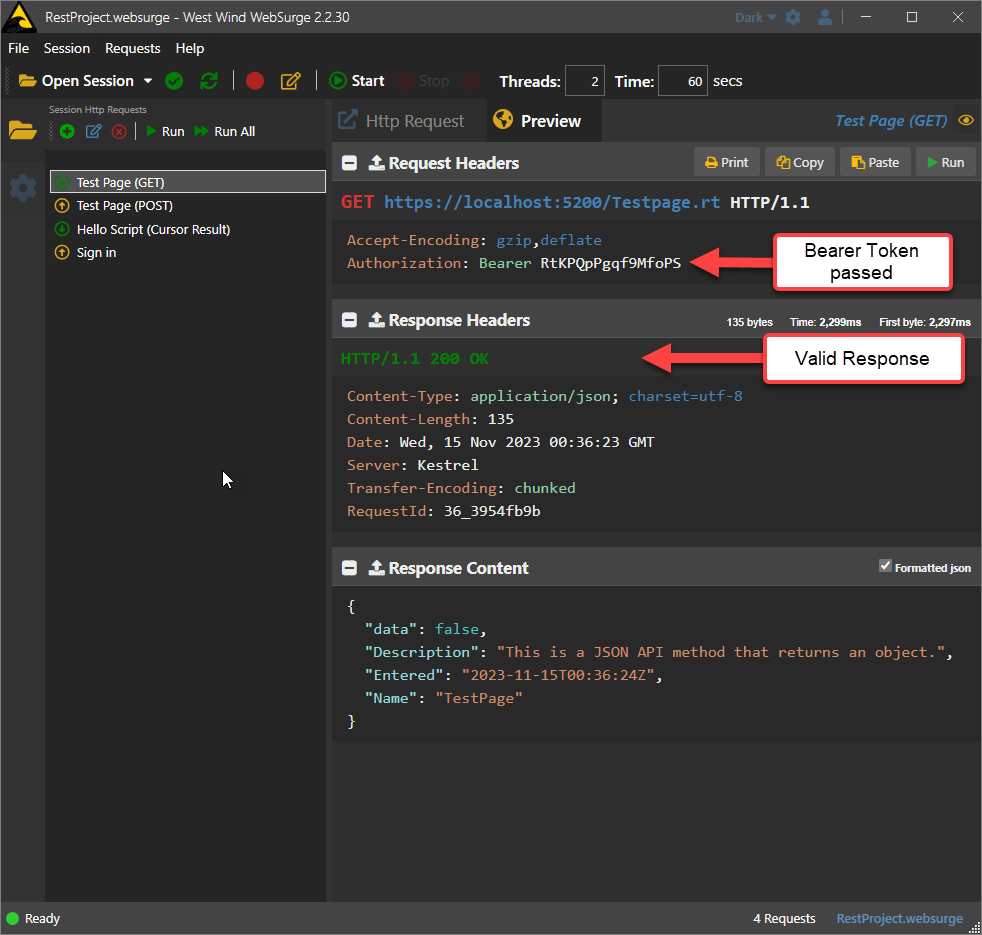

# Web Connection 7.35 released


A new release of West Wind Web Connection is available. v7.35 is a relatively small maintenance release that features a few small bug fixes, a few small feature updates and a couple of fairly large improvements to REST Service servers and clients.

## Download Web Connection
You can download the latest version from the Web Connection Web Site:

* [Web Connection Downloads][https://webconnection.west-wind.com/download.aspx]
* [Overview on what's new](https://webconnection.west-wind.com/docs/_s8104dggl.htm)

For a more detailed version of what's new and improved, read on...

## Version 7.35

Let's take a look at the [West Wind User Security Manager](https://webconnection.west-wind.com/UserSecurityManager/) which is meant to provide a more full featured experience around HTML based authentication including things like password resets and recovery, validating email addresses, and basic user management.

This has all been working for years of course and nothing is changing with that.


### Authentication in HTML based Web Applications
For regular HTML page Web applications using MVC or raw HTML output Web Connection has support for some basic Authentication functionality via the `wwUserSecurity` class, which is based on HTTP Cookies tied to a `wwSession` record, which in turn maps to a user record in `wwUserSecurity`.  If your needs are simple, you can just use the user table and user access as is, or you can customize both the structure and the logic by subclassing `wwUserSecurity` to handle how users are authenticated.


This is great for HTML based Web applications that can use cookies: You have a login form, you sign in, get assigned a cookie and the cookie then follows you around in subsequent requests in the browser, and the server can grab the cookie and map it to a session and/or a User record.


If you want more features you can also look at the [West Wind User Security Manager](https://webconnection.west-wind.com/usersecuritymanager/) which provides additional features for user signup, email validation, password recovery, and user management.

## REST Service Authentication
REST Services however have other requirements in order to do security. Typically services can't use Cookies because clients often aren't browsers, or even if they are they might be connecting across different domains that can't persist a cookie.

REST applications tend to use Bearer Tokens which is basically an **HTTP Header** in a sepecific format that looks like this:

```http
Authorization: Bearer <token>
```

Bearer tokens are **issued** by some sort of authentication process which can either be something simple as another API call to `Signin` with username and password (or some other combination), or something more complicated like an oAuth service that provides the token externally.

In order to provide some base functionality for REST Service Authentication v7.35 introduces a couple of new `wwRestProcess` class methods that can be used to provide `Bearer Token` based Authentication:

* **InitTokenSession()**  
This method is the core feature that ties a generated token to a Web Conenction `wwSession` object via its `cSessionId` parameter. `InitTokenSession()` either retrieves an existing session from a provided `Bearer` token, or if one isn't provided or matched provides an empty session. To create a new Token you can have a custom sign in method and call `NewSession()` to map your custom user/customer/etc. to a session with a session holding any additional data.

* **Authenticate()**  
If you want basic mapping of the session to a user in a similar way to the way HTML authentication works with cookies you can use the `Authenticate()` method which serves a dual purpose for:
  * Validating a wwSession Token and Loading a User
  * Authenticating user credentials
  

You can think of `InitTokenSession()` as a low level implementation. If you simply want to generate a token and provide a simple mapping to a user id or other reference, then all you need is `wwRestProcess::InitTokenSession()`.

If you want to map a user record that can work with `wwUserSecurity` then you can use `wwRestProcess::Authenticate()`, which uses the existing `wwUserSecurity` infrastructure to map tokens to users and provides both the `wwSession` and `wwUserSecurity` and user to your process methods.

The `Authenticate()` call builds ontop of the `InitTokenSession()` functionality so both are needed in order to use `Authenticate()` just like `InitSession()` is required for Authenticate in HTML `wwProcess` authentication.

### Implementation: InitTokenSession()
You can use pure `InitTokenSession()` session based authentication if your needs are very simple and you simply need to validate a user, and then only need to know if the user is logged in or not. If you don't need access to a user record or anything more complex than a mapping ID that you can use to map to your own business objects, using this approach is easiest and most light weight as it uses only a Session object and table.


`InitTokenSession()` is used to initialize the `wwSession` instance and guarantees that a session is loaded. 

* If a Bearer Token is found and can be mapped to a session that session becomes available in `THIS.oSession`. 

* If there's no match an empty session that doesn't have any backing on disk yet is returned.

There are two steps to this process:

* Call `InitTokenSession()` in `OnProcessInit()`
* Create some a `Signin` method to create and return the Bearer Token to the client

The first step to use token handling via wwSession is to call `InitTokenSession()` in `OnProcessInit()` so it fires for **every request**:

```foxpro
FUNCTION OnProcessInit

Response.Encoding = "UTF8"
Request.lUtf8Encoding = .T.

...

*** Pick up existing token or create a new token
*** and set on the oSession object
THIS.InitTokenSession()

*** Define anonymous requests that don't need validation
lcScriptName = LOWER(JUSTFNAME(Request.GetPhysicalPath()))
llIgnoreLoginRequest = INLIST(lcScriptName,"testpage","signin")

*** Fail if not authorized (ie. a new session has no or failed bearer token)
IF !llIgnoreLoginRequest AND this.oSession.lIsNewSession
   THIS.ErrorResponse("Access Denied. Please sign in first.","401 Unauthorized")
   RETURN .F.
ENDIF

RETURN .T.
```

After `InitTokenSession()` returns, the `THIS.oSession` (or `Session` inside of your Process methods) is available with either a matched session instance, or a new empty session.

You can check whether a session is valid by looking at `THIS.oSession.lIsNewSession`. If `.T.` the session is not mapped to an existing token, but a new empty session. If the session is empty you likely don't want to allow access to the application **except to some specific requests** that have to be anonymous - like the `sigin` for example since you can't require an authorized user, before you have chance to sign in. :smile:

The code above shows how exclude certain requests based on the page names.

If this simple validation fails, you can use `THIS.ErrorResponse()` to return an error message and status code, which is returned as a JSON object response with the specified status code. This method directly writes a JSON message into the Response output.

### Signing in
Before you can have a valid Bearer Token to check, you of course need some mechanism to sign in. If you use pure Token authentication, rather than user security, you can use any logic to validate your user.

Here's what this might look like using an arbitrary business object:

```foxpro
*** A simple REST Process Method  POST Signin.tp  - { username: "email@test.com", password: "superSeekrit" }
FUNCTION Signin
LPARAMETER loCredentials

*** Load some business object that can authorize
loBus = CREATEOBJECT("cUser")

*** Use whatever custom Authorization you need to assign a token
IF !loBus.AuthorizeUser(loCredentials.UserName, loCredentials.Password)
   RETURN THIS.ErrorResponse(loBus.cErrorMsg,"401 Unauthorized")
ENDIF

*** Create a new Session and optionally assign a mapping user id
*** that links back to a user/customer record in the Application
lcToken = THIS.oSession.NewSession(loBus.oData.UserId)
THIS.oSession.SetSessionVar("tenant",loBus.oData.TenantId)
THIS.oSession.SetSessionVar("displayname",loBus.oData.dispName)
THIS.oSession.Save()  && Must explicitly save to Db


*** Return the token and expiration (or whatever you choose)
loToken = CREATEOBJECT("EMPTY")
ADDPROPERTY(loToken,"token", lcToken)
ADDPROPERTY(loToken,"expires", DATETIME() + 3600 * 24)

RETURN loToken  
* Returns JSON: { token: "<token>", expires: "2023-10-23T07:00:00Z" }
ENDFUNC
```

The `AuthorizeUser()` call could be any application logic of your choice that returns true or false. 


If a user is validated we can create a new Session, and provide a mapping user id (optional). At this point you can also write additional values into the Session object that you can later retrieve if needed.

For rich client JavaScript applications you might also want to return additional information like more user information (display name, initials, sub-ids etc. as well as user settings that are applied to the user interface). You control what the return object looks like, so return whatever you need in addition to the token.

For example:

```json
{
    "token": "dre143adxq435o0",
    "expires": "2023-10-23T07:00:00Z",
    "user": {
        "displayName": "jan doe",
        "initials": "jd",
        "employeeId": "4rwesi4s22om2"
    },
    "settings": {
        "displayTimeout": 8000,
        "useInjuryPrompt": false,
        "useUserManager": false
    }
}
```
### REST Request Walk Through

Here's what all that looks like in a series of REST requests using [West Wind WebSurge](https://websurge.west-wind.com/) (but you can use any other tool like [Postman](https://www.postman.com/)):

**Signing in to retrieve a Token**


Once you have a valid token you can add it to a request in the `Authorization` header (in WebSurge you can add an empty header (`Authorization Bearer `) and  it will auto-fill from the saved token).

**Accessing a request with a valid Bearer Token**



**Accessing a request with invalid or missing Bearer Token** 


The above provides the **core functionality** of mapping a Bearer Token to a session record which works for simple authentication where you don't need to track a user, only if a user is signed in. If you want to also map to a `wwUserSecurity` user record so you can access user information that is mapped between `wwSession` and a user record, then you can add `Authenticate()`.

> Once we add `Authenticate()` to the above flow, the HTTP operations will look identical. The only difference is how the token, session and user are mapped on the server.

### Adding User Authentication()
The basis for `Authenticate()` is pretty similar to what I showed above. The difference is rather than checking for validity of a token, and creating a new token directly on the `wwSession` instance, you defer that to the `Authenticate()` method.

> Note: In order to use `Authenticate()`, `InitTokenSession()` is still required and we recommend you call it just as in the code above in OnProcessInit() as you can customize the behavior via its parameters. If you don't call it explicitly, it will be called in `Authenticate()` but always without any parameters.

The `Authenticate()` method has three different modes:

* **Authenticate() - Validate a token from wwSession**  
This methods looks at `wwSession` and looks for a non-empty session and if it find one uses the Authentication Session value to try and map the user id to a `wwUserSecurity` user record. If there is no session or the session's user entry can't be mapped a `401` result is returned.

* **Authenticate(lcUsername, lcPassword) - Authorize a user**   
This version of the method can be used to validate a user agains the `wwUserSecurity` and it's underlying data store by validing a username and password. Username can be anything but typically will be an email address.

* **Authenticate("LOGOUT") - Clear Session and Token Association**  
This operation logs out a user, removes the token to effectively sign out the user. Subsequent requests to use the existing token will then no longer succeed.

To implement then is again a 3 step process:

#### Initialize and Authenticate Token
This code is very similar to what I showed earlier for `InitSessionToken()` but this time we use `Authenticate()` to validate whether the token is valid and maps to a user:

```foxpro
FUNCTION OnProcessInit

...

*** IMPORTANT: InitTokenSession is required to pick up the Bearer token
***            and load or create a new session
THIS.InitTokenSession()

*** Check for pages that should bypass auth - signin always (not signout though!)
lcScriptName = LOWER(JUSTFNAME(Request.GetPhysicalPath()))
llIgnoreLoginRequest = INLIST(lcScriptName,"testage","signin")

IF !llIgnoreLoginRequest
   *** Check for Authentication here based on the token (note no parameters)
   IF !this.Authenticate()   
	   THIS.ErrorResponse("Access Denied. Please sign in first.","401 Unauthorized")
	   RETURN .F. && Response is handled
   ENDIF
ENDIF

RETURN .T.
ENDFUNC
```

If a user is signed in, `THIS.oSession`, `THIS.oUserSecurity` and `THIS.oUser` properties will all be set and ready to use.

#### Signing in
Next the sign in process again is very similar except this time we can use the `Authenticate()` method with user name and password to parameters to directly map to a user record:

```foxpro
FUNCTION SignIn(loCredentials)
LOCAL loToken, llError, lcErrorMsg, lcToken, ltExpires

lcErrorMsg = ""
lcToken = ""

*** Sign in: If successful sets oUserSecurity, lIsAuthenticated, cAuthenticatedUser etc.
IF this.Authenticate(loCredentials.Username, loCredentials.Password)
	lcToken = Session.cSessionId 
	ltExpires = Session.oData.FirstOn + Session.nSessionTimeout
	
	*** Add any custom values you might need to store and retrieve
	Session.SetSessionVar("tenant","TENANT_ID")
	
	Session.Save() && Explicit save: Session on REST Services don't save by default		
ELSE
   RETURN THIS.ErrorResponse(lcErrorMsg,"401 Not Authorized")
ENDIF


*** Response
loToken = CREATEOBJECT("EMPTY")
ADDPROPERTY(loToken,"token", lcToken)
ADDPROPERTY(loToken,"expires", ltExpires)

** Add other client cachable user data here as properties if you need

RETURN loToken
ENDFUNC
```

This is very similar to the previous code but a little simpler as `Authenticate()` abstracts away both the actual user authorization as well as creating the new session and storing the standard session variables.

### Accessing Authentication Properties 
Once this call completes successfully or when a Bearer token is successfully validated, all the `wwprocess` authentication properties are available and you can access them in your REST service Process methods:

```foxpro
FUNCTION RestMethod(lvParm)

*** This should not be necessary if you called `Authenticate()`
*** and filtered out non-authenticated requests
IF !THIS.lIsAuthenticated
    RETURN THIS.ErrorREsponse("Access denied: Make sure you are logged in.", "401 Unauthorized")
ENDIF

*** Capture common Auth Properties you can access
lcUsername = THIS.cAuthenticatedUser
lcDisplayName = THIS.AuthenticatedName
loUser = THIS.oUser   && wwUserSecurity user instance

...

RETURN loResult  
ENDFUNC
```

### Signing out
The final piece is signing out which requires that you call a specific process method with a Bearer token (ie. authenticated) for the user to log out.

Sign out is pretty simple with authentication:

```foxpro
FUNCTION Signout()
THIS.Authenticate("LOGOUT")
JsonService.IsRawResponse = .T.
Response.Write( [{ message: "Successfully logged out." }])   
ENDFUNC
```

### REST Service Authentication Summary
As you can see Auth is always a bit more involved than it might seem at a glance, but the process of implementing it in a REST service got a lot easier by reusing functionality in the wwSession class, and optionally mapping Bearer tokens to wwUserSecurity users.

## wwDotnetBridge Improvements
One of the most used features these days in West Wind Tools is the `wwDotnetBridge` library which provides an interfact to call .NET code from FoxPro. v7.35 has a few improvements in this regard:

### Better support for Task Exception Handling
Modern .NET relies heavily on asynchronous code via `Tasks` which is .NET's version of Promises, or in even more abstract terms function as an object. Tasks wrap an action - a block of code - that is asynchronously executed and in .NET can be awaited for completion. While the calling block is waiting, any following code can continue. Tasks are continuations of code and essentially provide a mechanism for client code to wait for code while something else is running.

There's no direct translation for tasks into FoxPro code. The closest thing we have in FoxPro are events or function callbacks. wwDotnetBridge has a few methods that deal with Tasks:

* [InvokeMethodAsync()](https://webconnection.west-wind.com/docs/_4iu0wxvi1.htm)
* [InvokeStaticMethodAsync()](https://webconnection.west-wind.com/docs/_4iu1dlb2c.htm)
* [InvokeTaskMethodAsync()](https://webconnection.west-wind.com/docs/_5pj0xl2yp.htm)

The first two methods basically take **any .NET method** and calls it asynchronously. The last one calls a method that returns a .NET `Task` or `Task<T>` result. All of these methods work by accepting an object parameter, where the object passed should have `OnSuccess()` and `OnError()` handler methods that are called when the async call completes.

v7.35 has a few improvements in these 3 methods in how they are handled when exceptions occur. Specifically prior to this release `Task` based exceptions were not reporting the correct error stack. In the new version the `Task` exception is properly handled and any exception now correctly returns the error message that occurs inside of the actual Task operation, not the wrapper method as before.

Likewise the other 2 methods also use special exception handlers that can deal with thread based exceptions better, ensuring exceptions are always marshalled back to the calling FoxPro UI thread.

## Json Serializer Improvements
The `wwJsonSerializer` class is used heavily for REST services, but also for other application level JSON conversion tasks. There are a few improvements:

### wwJsonServiceClient and wwJsonService in their own PRG file
We've moved these classes into its own dedicated PRG file from `wwJsonSerializer` to reduce dependencies of the wwJsonSerializer PRG file (ie. `do wwJsonSerializer`). Doing so removes a number of large dependencies if you don't use `wwJsonServiceClient` to make it leaner to integrate the serializer into other applications and make the code more easily discoverable.  
** Remember if you use this class you'll have to add the `SET PROCEDURE TO` (or `DO wwJsonServiceClient`) explicitly now.

### Optionally capture Request and Response Data in wwJsonServiceClient
To improve debuggability there's now a new `lSaveRequestData` flag on the `wwJsonServiceClient` class which when enabled captures both any data sent to the server, and the response returned back from the server in `cRequestData` and `cResponseData` properties.

### Updated to latest Newtonsoft.Json Library
It's been a while since the last update of the .NET JSON library used to handle deserialization, and we've now updated to the latest version which is `13.0.1`. This release has been out for some time so it's stable and in wide use.

Updating this library is somewhat important in order to ensure that the library is in sync with other third party libraries that use different versions. By having the latest version we can force rolling forward to our version [via assembly redirects](https://west-wind.com/wconnect/weblog/ShowEntry.blog?id=927). In many cases using the latest version can reduce the need to use Assembly redirects - although that does depend on what other versions third parties might be using.

## Summary
As always, not a lot of new stuff, but if you dig under the hood you can certainly find improvements. If you're using REST services you are likely to be able to take advantage of the new Authentication features as they greatly simplify adding it to your own apps. By having this mechanism, the help topics demonstrate the basic workflow needed to authenticate users, even if you end up rolling your own version.

In any case, have it at it and as always, please report any issues you run into on the message board in the **Web Connection** forum.

Aloha.