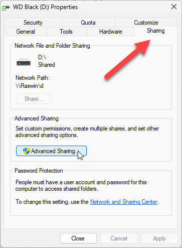
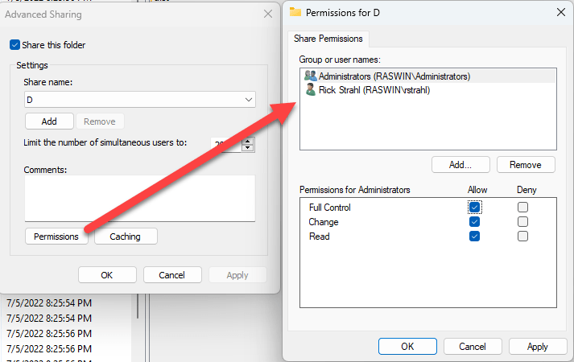
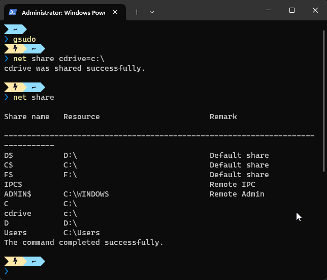
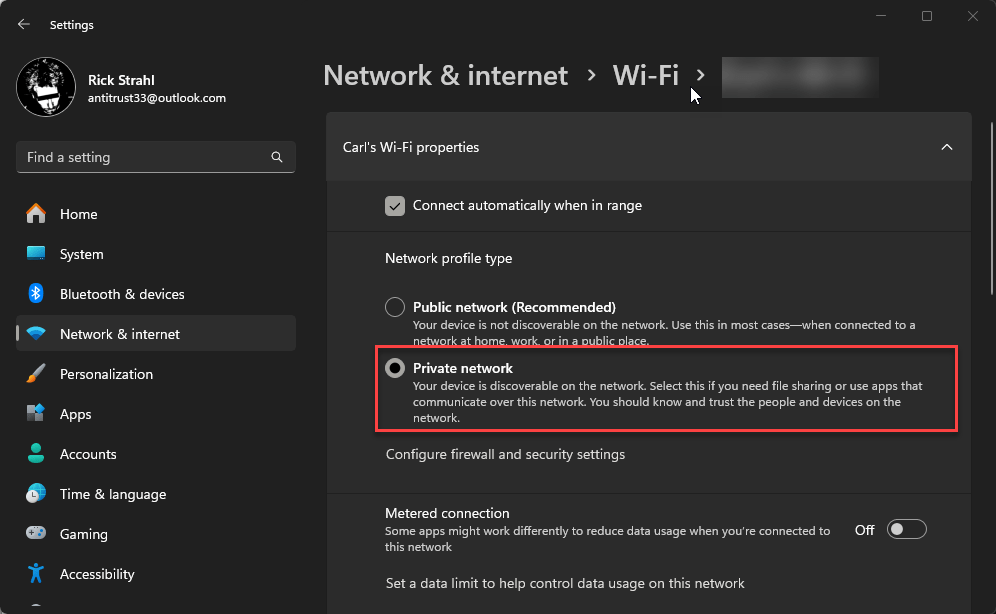
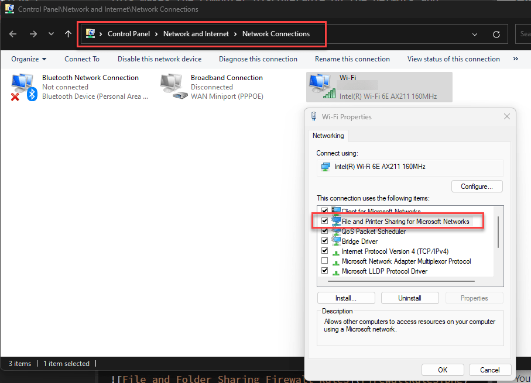

# Sharing Tab Missing in Windows Folder Properties

For unfathomable reasons, Windows 11 is actively discouraging the Sharing Tab on the Explorer `Properties` Context Menu, where it used to sit by default.

I'm talking about this tab when you select a drive or folder:

From which you can then create a shared folder/drive and set permissions:

This tab by default is not visible, and without it it's not exactly easy UI mechanism to create a shared folder/drive that you can access over the network which is just... weird.

There are ways you can do this via the command line using `net share`, but AFAIK there's no other UI based way to share a folder.

Here's what using the `net share` command looks like:

> **Note:** Make sure you run this command **as Administrator**.  
*(I'm using [gsudo](https://github.com/gerardog/gsudo) to elevate  within the prompt)*

Command line is easy enough but using a rarely used command like this is easy to forget. 

So, how do we get the Sharing Tab back?

## Enabling Folder/Drive Sharing in the Registry
If this Tab is not showing in your Explorer Properties the easiest way is via a registry update:

* `HKEY_LOCAL_MACHINE\SOFTWARE\Microsoft\Windows\CurrentVersion\Shell Extensions\Blocked`
* Check for `{f81e9010-6ea4-11ce-a7ff-00aa003ca9f6}`
* Remove if present
* Reboot or Kill and Restart Explorer

As the registry key name suggests the Sharing Tab feature is **actively blocked** by this key and it appears that this is the new default in Windows 11. Removing that key brings back the Sharing Tab.

##AD## 

## Ensuring File Sharing works
Enabling the Sharing Tab alone may not be enough though to actually share a folder or drive and allow remote access: You need to make sure that Windows **File and Printer Sharing** is enabled and potentially make sure that you don't have additional **Firewall Rules** that might be blocking access.

There are a few things that should be set:

### Set Network Adapter Network Profile to **Private**
This setting acts as a **high level setting** that combines multiple sub settings under its banner. It makes the network **adapter connection discoverable** on the network and **enables File and Printer Sharing**. 

  
<small>**Figure 1** - Setting your network to Private enables File and Printer sharing and makes your computer discoverable. </small>

Essentially the **Private network** is  meant to be the 'all in one' setting that enables file sharing and the firewall rules that allow access.

In most cases this is all you need to set to share a network drive **except** the Sharing Tab which still has to be manually enabled.

### Set Advanced Network Adapter Settings  
Alternately you can go to **Advanced Network Adapter settings** -> **Advanced Settings**  and turn on Network discovery and File and Printer Sharing explicitly for the specific network adapter.

  
<small>**Figure 2** - You can also explicitly enable file and printer sharing on a specific adapter.</small>

The key here is that all of these settings - File and Printer Sharing, Private/Public Networks - are all applied **per network adapter** so if you use multiple adapters (like WiFi and Wired), you have to make sure you set this up for both.

### Firewall
The **Private network** setting usually is enough to get file sharing to work, but if you have custom Firewall Rules it's still possible that the firewall is blocking you. If you think that's the case, you might want to briefly turn off the firewall, try to connect and see if that works. If it does, you can turn the firewall back on and see if you're blocked again and then look through your settings to find the culprit entry.

You can find a big block of Firewall rules in the Advanced Firewall Settings and that's a good place to start:

  
<small>**Figure 3** - Firewall rules related to file and printer sharing - there are a lot of them. `Private` as in `Private network` disables many of the restrictions.</small>

##AD##

## Remember, Remember - Security
Folder/drive sharing is useful when you need it, but make sure you don't allow access to your machine if you're not using trusted networks. If you open up your machine to allow sharing access, you potentially open up an attack surface for your machine. This is likely why the Sharing

By default any new network connection you connect is set to **Public network** for this reason, and other than your home network, or very specific circumstances you should probably always leave that default setting intact. This one setting pretty much prevents remote access via OS both through the network stack and the firewall.

## Summary
The reason for this post is that if you're like me and not directly involved in network management and security, all of these overlapping features and settings can be confusing and easy to forget even if you've figured it all out once and then don't get back to it for another few years. It doesn't help that Microsoft has been moving these settings around multiple times for the last few years.

Most settings are not easy to discover unless you know what you're looking for in the first place. They are referenced from the new Windows Settings UI, but they are often buried with real small headings that don't use the old and familiar names, so they are easy to miss or if you used them in earlier versions of Windows, have moved to some obscure, buried sub-menu.

Which is the reason I'm writing this basic stuff down in a post here, so that I have a reference in one place.

    
    this post created and published with the 
    <a href="https://markdownmonster.west-wind.com" 
       target="top">Markdown Monster Editor</a> 

