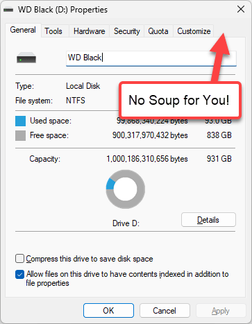
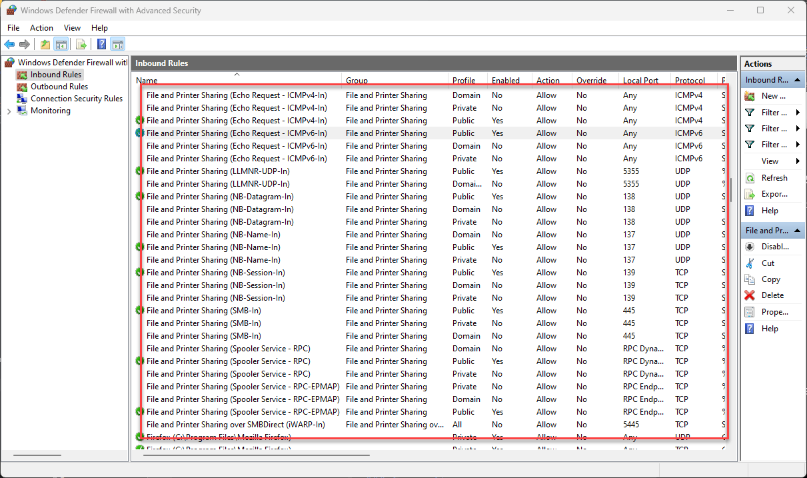

# Sharing Tab Missing in Windows 11 Folder Properties

For unfathomable reasons, Windows 11 is actively discouraging the Sharing Tab on the Windows Explorer `Properties` Context Menu, where it used to sit by default.

> The new sharing UI in Windows uses the `Give Access to` in the Explorer context menu.

I'm talking about this tab when you select a drive or folder:

  
<small>**Figure 1** - The Windows Explorer Properties dialog, when the Sharing Tab is enabled.</small>

From which you can then create a shared folder/drive and set permissions:

  
<small>**Figure 2** - The Share Folder dialog lets you assign a name and set access permissions</small>

In Windows 11 this tab is not visible by default, and without it there's no easy UI mechanism to create a shared folder/drive that you can access over the network which is just... weird. 

Here's what the Explorer Properties dialog looks like without the tab :

  
<small>**Figure 3** - The Properties dialog when the Sharing Tab is missing.</small>

## Command Line Workarounds
There are ways you can create shared drives and folders using command line tools using the built-in Command Shell's `net share` or the Powershell `New-SMBShare` commands, but AFAIK there's no UI based way to share a folder when the Sharing Tab is not available.

### net share to Share a Drive or Folder
The `net` command is a built in Windows tool that you can run from the command prompt or Powershell. The `net` command has a number of sub settings and `share` is what's used to manage shared drives and folders. 

Here's what using the `net share` command looks like:

  
<small>**Figure 4** - Using the `net share` command to add a Folder/Drive Share.</small>

### New-SMBShare to Share a Drive or Folder
Powershell has a specific command for managaging shares in use `SMBShare` group of commands. Using PowerShell you can use `New-SMBShare` and friends to manage shared drives and folders:

  
<small>**Figure 5** - Using the `New-SMBShare` Powershell command to add a Folder/Drive Share.</small>

> **Note:** Make sure you run these commands **as Administrator** using an Admin shell or using a tool like [gsudo](https://github.com/gerardog/gsudo) to elevate  within the prompt.

## Enabling the Sharing Tab in the Registry
Command line is easy enough, but if you want to bring back the Sharing Tab so you don't have to remember a command that you use once every 5 years, here's how to do it.

The easiest way is via a registry update:

* `HKEY_LOCAL_MACHINE\SOFTWARE\Microsoft\Windows\CurrentVersion\Shell Extensions\Blocked`
* Check for `{f81e9010-6ea4-11ce-a7ff-00aa003ca9f6}`
* Remove if present
* Restart Windows Explorer or other Shell browser application

  
<small>**Figure 6** - Removing the blocked id from the Registry re-enables the Sharing Tab.</small>

As the registry key name suggests, the Sharing Tab feature is **actively blocked** by this key and it appears that this is the new default in Windows 11. 

Removing that key brings back the Sharing Tab to your Properties Dialog. Yay!

##AD## 

## Ensuring File Sharing works
But... you may not be done yet! The Sharing Tab or the command line equivalents enable creating a Folder/Drive Share, but **it doesn't guarantee that you can actually access the Shared Drive from a remote machine**, so let's take a look at that.

You need to also make sure that Windows **File and Printer Sharing** is enabled and ensure that you don't have **Firewall Rules** that block access.

### Enabling Sharing UI in Explorer
By default Explorer is set to use the Sharing Wizard (recommended). I'm not even sure what the sharing Wizard is - I've never seen it, but I know you **don't want it**!

To disable it open Explorer and click on the options, the find the 

  
<small>**Figure 7** - Disable the Sharing Wizard in the Explorer Options which enable the Sharing UI</small>

### Set Network Adapter Network Profile to **Private**
The first setting you should set is the network adapter's **Network Profile** and set it to **Private network**.

  
<small>**Figure 7.5** - Setting your network to Private enables File and Printer sharing and makes your computer discoverable. </small>

This setting acts as a **high level setting** that sets multiple sub settings. It makes the network **adapter connection discoverable** on the network and **enables File and Printer Sharing**. 

Essentially the **Private network** is  meant to be the 'all in one' setting that enables file sharing and the firewall rules that allow access.

In most cases this is all you need to set to share a network drive **except** the Sharing Tab which still has to be manually enabled via the Registry hack or the command line operations.

### Set Advanced Network Adapter Settings  
Alternately you can go to **Advanced Network Adapter settings** -> **Advanced Settings**  and turn on **Network discovery** and **File and Printer Sharing** explicitly for the specific network adapter.

  
<small>**Figure 8** - You can also explicitly enable file and printer sharing on a specific adapter.</small>

The key here is that all of these settings - File and Printer Sharing, Private/Public Networks - are all applied **per network adapter** so if you use multiple adapters (like WiFi and Wired Ethernet), you have to make sure you set this up for each of them.

### Firewall
The **Private network** setting usually is enough to get file sharing to work, but if you have custom Firewall Rules it's still possible that the firewall is blocking you. If you think that's the case, you might want to briefly turn off the firewall, try to connect and see if that works. If it does, you can turn the firewall back on and see if you're blocked again and then look through your settings to find the culprit entry.

You can find a big block of Firewall rules in the **Advanced Firewall Settings** and that's a good place to start:

  
<small>**Figure 9** - Firewall rules related to file and printer sharing - there are a lot of them. `Private` as in `Private network` disables many of the restrictions.</small>

##AD##

## Remember Security
Folder/drive sharing is useful when you need it, but make sure you don't allow access to your machine if you're not using a trusted network. If you open up your machine to allow sharing access, File and Printer Sharing and Network discovery, you potentially open up an attack surface for your machine. This is likely why the Sharing Tab is not available by default.

By default any new network connection you connect is set to **Public network** for this reason, and other than on your home or work networks, or very specific circumstances you should probably always leave that default setting intact. 

This one setting pretty much prevents remote access via OS both through the network stack and the firewall.

## Summary
The reason for this post is that if you're like me and not directly involved in network management and security, all of these overlapping features and settings can be confusing and easy to forget even if you've figured it all out once and then don't get back to it for another few years. It doesn't help that Microsoft has been moving the location for these settings around constantly in the latest updates of Windows. 

Most settings are not easy to discover to begin with, and unless you know what you're looking it's a struggle to find specific settings. It doesn't get more unintuitive than that. Settings are referenced from the new Windows Settings UI, but they are often buried with real small headings that don't use old and familiar names, so they are easy to miss or if you used them in earlier versions of Windows, have moved to some obscure, buried sub-menu.

Which is the reason I'm writing this stuff down in a post here, so that I have a reference in one place and my future self can jog his aging memory... hopefully it'll be useful to few of you as well...

    
    this post created and published with the 
    <a href="https://markdownmonster.west-wind.com" 
       target="top">Markdown Monster Editor</a> 

