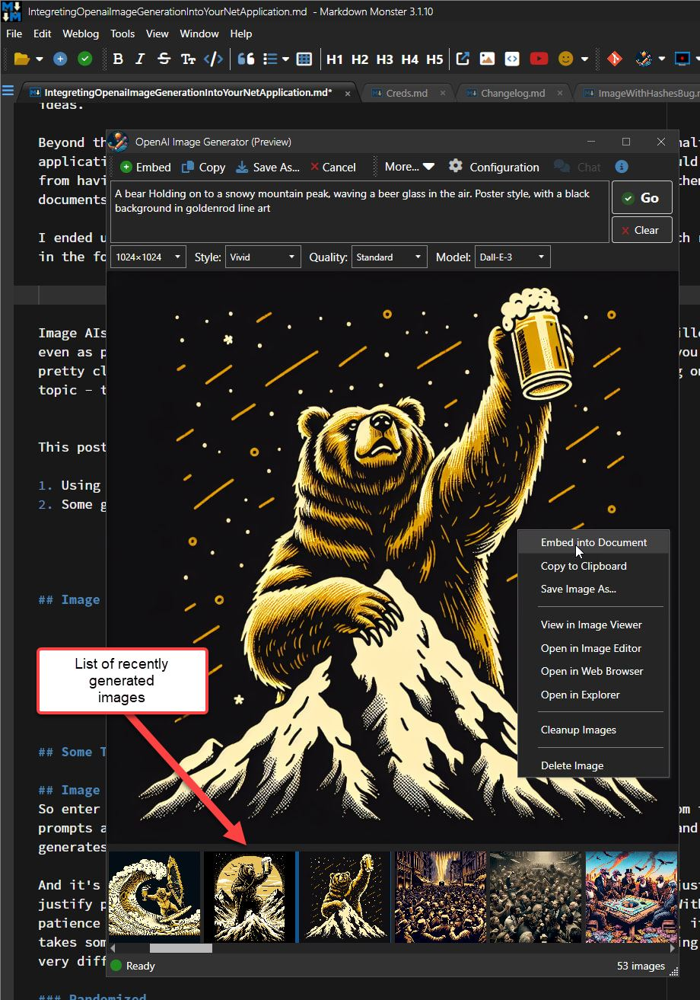

# Working around the WPF Image Control Blues


While working on the OpenAI Image Generator Addin from my previous post I ran into several behind the scenes issues related to the **blasted Image control in WPF**.

Specifically I ran into two issues with a list of many images:

* A ginormous memory leak
* Blocking UI while loading many images

Images in WPF have always been a nightmare due to the `Image` control and the damned `ImageSource` property that provides a very high level abstraction on top of various image semantics. On the one hand ImageSource is nice because it allows for an abstracted way to bind various sources of images, be it bitmaps, vector images, fonts or font images (like [FontAwesome6](https://github.com/MartinTopfstedt/FontAwesome6)) etc. from various sources (files, uris, streams etc.). For simple scenarios the control is easy to use, because you can simply point at an image on disk, online via url including a variety of image formats or some custom image format like a FontAwesome `ItemSource` and the `ImageSource` goes ahead and loads up the data regardless of where it comes from.

Unfortunately the control has very little control of **how** it does the image loading - and unloading - especially when loading images from local file system files, as I found out once again in my Image Generator Addin.

The two problems I ran into were related to the image strip on the bottom of the following WPF Window that displays recently generated images:

    
<b>*Figure 1*</b> - A list box of images in an Image Strip for generated AI images.

The list of images is displayed in a `ListBox` with `Image` controls inside the list's `DataTemplate`, with each image bound to an `ImageSource` property in the item's model.

The initial 'just get it working' setup had a couple of serious issues:

* **A ginormous Memory Leak**  
When loading the window multiple times, memory usage just spikes upwards. Images use tons of memory and when images don't unload properly, it's very quick to run up a huge memory tab.

* **Blocking the UI Thread during Load**  
When the window loads and there are a lot of images in the image strip, the UI blocks while the images are loading from disk. This manifests as a complete UI lockup where you can can't move the Window, the loading indicator (a FontAwesome spinning icon) that doesn't spin as it should, and an unresponsive UI.

##AD##

## Memory Leak
The memory leak is pretty egregious. In my use I have 60+ images in the recent list, and if I repeatedly load the form, I easily ended up with nearly 3gb of memory usage after 5 loads of the form - Yikes!!! Basically memory would get used and never get released again.

Luckily the solution is a relatively simple matter of **explicitly** clearing the ItemsSource on the ImageList which releases all the images and ensures they are (eventually) garbage collected:

```cs
protected override void OnClosing(CancelEventArgs e)
{
    SaveSettings();

    ImageList.ItemsSource = null;
    ImageList.Items.Clear();
    
    IsOpen = false;
}
```

I'm not sure why this doesn't happen **automatically** when the window closes, but removing those two lines of code causes the code to go right back to **never** releasing the memory used by the images until the app is closed.

Note that memory doesn't appear to be immediately released even with this approach. However, when I load the window for a subsequent time, Private Bytes memory usage drops briefly, then goes back to roughly the same level as the previous window/image rendering. This seems to suggest that the memory is available but not immediately freed until another operation needs it. If you hook up a Task Manager and watch you can see the jo-jo effect on subsequent form loads where memory drops by a huge chunk and then goes back to the previous level - presumably the amount of memory used by the image content. 

This still feels like weird behavior, but it's much preferred to the original behavior that only increased memory usage and caused massive memory usage after multiple loads of the entire image list. 

## Blocking UI while Loading
The UI blocking for the image list is partially due to how the **initial version** of the  image list was loaded using the combo of Property Getter and using a FileStream.

The way I had this set up is in a `ListBox` control a list of `ImagePrompt` instances, with the `ImagePrompt.FirstImageSource` providing an image source from the dynamically retrieved store image file:

```csharp
[JsonIgnore]
public ImageSource FirstImageSource
{
    get
    {
        if (_firstImageSource != null)
            return _firstImageSource;

        if (!string.IsNullOrEmpty(ImageFileName))
        {                
            var fname = GetImageFilename();
            if (File.Exists(fname))
            {
                using (var fileStream = new FileStream(fname, FileMode.Open, FileAccess.Read))
                {
                    var imageSource = new BitmapImage();
                    imageSource.BeginInit();
                    imageSource.StreamSource = fileStream;
                    imageSource.CacheOption = BitmapCacheOption.OnLoad;
                    imageSource.EndInit();
                    imageSource.Freeze();

                    _firstImageSource = imageSource;
                    return _firstImageSource;
                }
            }
        }
        return null;
    }
}
private ImageSource _firstImageSource = null;
```

Using this in the `ListBox` setup:

```xml
<ListBox 
         ScrollViewer.HorizontalScrollBarVisibility="Auto" 
         Grid.Row="3" x:Name="ImageList"
         ItemsSource="{Binding Configuration.RecentImagePrompts}">
    <ListBox.ItemTemplate>
        <DataTemplate>
            <Grid MouseUp="StackPanel_MouseUp" Width="120" Height="120"
                  ContextMenu= "{StaticResource ImagePromptContextMenu}"   >
                <Image Height="120" 
                       Source="{Binding FirstImageSource}" />
            </Grid>
        </DataTemplate>
    </ListBox.ItemTemplate>
</ListBox>
```

**This code and XAML results in the UI lockup.** 

The reason for this is that loading the file in the Property Getter is and has to be **synchronous** and therefore is blocking. One would think the Image control itself would mitigate this with some internal yielding between loading individual image source items, but apparently it just hammers one image after the other without yielding, resulting in the locked up UI thread. 

When the list gets sufficiently big to not load immediately this manifests as the window (and entire app) not being UI responsive in any way during image load. Even the progress spinner using a FontAwesome Icon animation is frozen for the duration. It's a terrible UI experience!

The problem with the code above is that **a Property Getter cannot be asynchronous**, and in the code that the `BitmapImage` class uses, the `FileStream` assignment to the `StreamSource` is synchronous - no way to specify the file should be retrieved asynchronously. So although this code is using recommended model binding, it's hampered by the sync load StreamSource of the ImageSource.

I experimented a bit and there are a few different workarounds:

* [Using `UriSource`](#quick-fix-using-urisource)
* [Pre-loading ImageSource for the entire list](#pre-loading-all-imagesources)
* [Async ImageSource Binding](#async-imagesource-property)

### Quick Fix: Using UriSource
One quick fix is to not use a `StreamSource` which apparently can only load synchronously. Instead, you can use `UriSource` with a file Url! 

The difference is that `UriSource` loads in the background *and* also caches the underlying image source, so as a bonus if your app reloads the same image multiple times, it'll load very fast on subsequent loads. This can be either good or bad, depending on your desired behavior. Caching can be a problem if you need to re-render images after changes for example.

To use UriSource you can change the code to this:

```csharp
[JsonIgnore]
public ImageSource FirstImageSource
{
    get
    {
        if (_firstImageSource != null)
            return _firstImageSource;

        if (!string.IsNullOrEmpty(ImageFileName))
        {                
            var fname = GetImageFilename(); // full filename
            if (File.Exists(fname))
            {
                var imageSource = new BitmapImage();
                imageSource.BeginInit();
                
                imageSource.UriSource = new Uri(fname);
                imageSource.CacheOption = BitmapCacheOption.OnLoad;                        
                imageSource.EndInit();
                imageSource.Freeze(); 

                _firstImageSource = imageSource;
                return _firstImageSource;
            }
        }
        return null;
    }
}
private ImageSource _firstImageSource = null;
```

Now the code doesn't block and it also appears to load images a lot faster as they are being loaded asynchronously in the background.

However, you still don't have full control over this behavior as the image load now completely happens in the background. And although the background operation now goes through immediately it blocks the UI briefly while the image sources are initialized. It's much quicker than a full load though and loading this way is much, much faster so the UI freeze is **very brief**.

As a bonus subsequent load operations can result in even faster subsequent loads as the file URLs are cached making the form pop nearly instantly even with many images.

The downside is that caching can cause problems if you need to update images and effectively reload them. Because URLs and content can become cached updates often won't re-display with new content. You'll have to resort to adding cache busters to Uris which is not exactly obvious especially in a Desktop application.

### Pre-loading all ImageSources
To completely eliminate blocking UI takes a little more work.

The idea is that you can pre-load the ImageSource objects using a custom loader that can run asynchronously. Doing this allows you to control the process while still keeping a responsive UI. In my situation I wanted the following to happen:

* Open the form
* Bind the Model **without** the image list
* Make the main UI live
* Let images load in the background
* Display a loading indicator while images are loading
* On completion clear the loading indicator

So rather than using the original code, binding the model all at once like this:

```csharp
Dispatcher.InvokeAsync(async () =>
{
    Status.ShowStatusProgress("Loading previous images...");
    DataContext = Model;
    Status.ShowStatus();
}, System.Windows.Threading.DispatcherPriority.Background).Task.FireAndForget();
```

I now do the following:

* Remove the ImagePrompt Collection the renders the Image List briefly
* Bind the Rest of the Model
* Load all the images into the ImagePrompt list asynchronously
* Re-attach the Prompt list back to the Model


```csharp
Dispatcher.InvokeAsync(async () =>
{
    Status.ShowStatusProgress("Loading previous images...");

    // load images in background by remoing the image prompts from config
    // updating and then re-applying so the model is updated immediately
    // and the images can load later
    var prompts = Model.Configuration.RecentImagePrompts;
    Model.Configuration.RecentImagePrompts = null;

    DataContext = Model;  // bind the Model without images

    // load images async
    await Model.LoadAllImagesAsync(prompts);

    // rebind images (bound to the image list)
    Model.Configuration.RecentImagePrompts = prompts;
                    
    Status.ShowStatus();
}, System.Windows.Threading.DispatcherPriority.Background).Task.FireAndForget();
```

This produces the desired result where all the Model properties including prompt for interaction show up immediately, and the UI remains responsive. Images are not immediately visible - they show once all of them have been loaded asynchronously, which happens much more quickly than the original sync load as multiple images are loaded simultaneously.

`ImagePrompt.LoadAllImageAsync()` explicitly pre-loads all the image sources, but it does so asynchronously, which couldn't be done in the Getter because it's a sync method that has to return a value.

The pre-loading `LoadAllImagesAsync()`  code looks like this:

```csharp
public async Task LoadAllImagesAsync(ObservableCollection<ImagePrompt> prompts = null)            
{
    if (prompts == null)
        prompts = Configuration.RecentImagePrompts;

    foreach (var image in prompts)
    {
        await image.GetImageSourceAsync();
    }            
}

public async Task<ImageSource> GetImageSourceAsync()
{
    if (!string.IsNullOrEmpty(ImageFileName))
    {
        var fname = GetImageFilename();

        // load file asynchronously
        using (var stream = new MemoryStream(await File.ReadAllBytesAsync(fname)))
        using (var bitmap = new System.Drawing.Bitmap(stream))
        {
           _firstImageSource = BitmapToBitmapSource(bitmap);
            _firstImageSource.Freeze();
            return _firstImageSource;
        }
    }
    return null;
}

/// https://stackoverflow.com/a/30729291
public static BitmapSource BitmapToBitmapSource(Bitmap bmp)
{
  var bitmapData = bmp.LockBits(
         new Rectangle(0, 0, bmp.Width, bmp.Height),
         ImageLockMode.ReadOnly, bmp.PixelFormat);

  var bitmapSource = BitmapSource.Create(
      bitmapData.Width, bitmapData.Height,
      bmp.HorizontalResolution, bmp.VerticalResolution,
      PixelFormats.Bgr24, null,
      bitmapData.Scan0, bitmapData.Stride * bitmapData.Height, bitmapData.Stride);

  bmp.UnlockBits(bitmapData);

  return bitmapSource;
}
```

And that works! Hooking up this code, the form now loads with a proper loading indicator that spins and a UI that is fully responsive immediately, and while images in the list don't display immediately as they are loaded, they load quickly.

##AD##

This code obviously is a bit more cumbersome as you have to manually create a bitmap and then convert it to a `BitmapSource` bypassing automatic stream/uri reading that `ImageSource` supports. But it gives you full control over the loading process.

### Async ImageSource Property
Property Getters natively can't be async - but you can **fake async behavior** if you implement `INotifyPropertyChanged` and you're binding the image source. When I initially posted this article, [@dotMorten](https://x.com/dotMorten/status/1742933664399511697?s=20) pointed out that you can asynchronously load a property value initially as a `null` value, then run an async task, load the image source and then call `OnPropertyChanged()` to notify the control binding to update.

The following code does this:

```csharp
[JsonIgnore]
public ImageSource FirstImageSource
{
    get
    {
        if (_firstImageSource != null)
            return _firstImageSource;

        if (!string.IsNullOrEmpty(ImageFileName))
        {
            Task.Run(action: async () =>
            {
                // code for GetImageSourceAsync() is above
                _firstImageSource = await GetImageSourceAsync();
                OnPropertyChanged(nameof(FirstImageSource));
            }).FireAndForget();
        }
        return null;
    }
}
private ImageSource _firstImageSource = null;
```

Out of all the solutions this is likely the best, as it appears to load images seamlessly without even requiring a Loading indicator, because the first images that are visible **pop in almost immediately**. The rest likely trickle in, but since they are not visible it doesn't affect the UI. Because loading is completely async in the background, the main UI is active and available and you can go ahead and start using the form immediately. IOW: Both responsive UI **and** images are immediately visible.

This code does little more than putting the ImageSource loading into an async task operation. I suppose the direct loading ImageSource load code that uses `BeginInit()/EndInit()` would also work within the `Task.Run()` code, but using the explicit async load is likely more efficient for UI responsiveness.

> #### @icon-info-circle Is Task.Run required?
> Several people commented on my use of an explicit `Task.Run()` to wrap the operation, rather than directly using a `Task.ContinueWith()` to process the ImageSource loading code. Both work, but the `Task.Run()` operation appears to load much faster (nearly instant for the displayed images) while keeping the UI responsive at all times.
>
> I found that unless I use `Task.Run()` explicitly, the list doesn't display items **until all images are loaded**. Using `Task.Run()` however gives the expected behavior of making images trickle in. The list also appears to **load near instantly** as only the first few images are visible and those images are loaded first.
>
> In my experience, when you need to transition from sync to async code, using an explicit `Task.Run()` to fire off the async code - especially in WPF - is often the only way to produce the expected behavior of true background operation, where direct calls out of sync code with `.ContinueWith()` or `FireAndForget()` or `Dispatcher.InvokeAsync()` often do not.

## Summary
This isn't the first time I've run into issues with the `Image` control and `ImageSource` property. It's one of those problems that sneaks up on you, and doesn't bite you until you get to a tipping point. Even with 60 unoptimized PNG images pre-loading load time is only a couple of seconds - but it's enough for a frozen UI to bug the shit out of me. It works fine up to a point, and then very drastically becomes annoying, which in my case was somewhere around 45 images or so. Up to that point I didn't notice.

Manual ImageSoure loading in general is a popular topic on StackOverflow with many, many questions around awkward loading interface and the totally non-obvious `BeginInit()` and `EndInit()` blocks, plus weird caching behaviors, unload issues, and different behaviors for streams and Uris. There's so much inside knowledge needed to use ImageSource and there's nothing intuitive about any of it.

At the end of the day, three work arounds can be used to get better image load behavior for large lists:

* **Uri Source which loads in the background**
* **Preloading the ImageSources bound before binding**
* **Using a simulated async ImageSource Property**

`UriSource` is easy if not really obvious with files from disk, but has caching behavior that may not work in all scenarios. It's probably the first thing to try before doing anything else and it might be good enough in many cases.

Preloading offers more flexibility during loading, but it delays image display until loading of the entire list is complete, unless you add even more complexity by adding a partial list initially and then updating when loading is complete. 

By using an explicit `Task.Run()` operation inside of a Property Getter you can still use file loading that's under your control as well as get the async trickle in behavior that `UriSource` offers, resulting in the quickest and most responsive solution.

Choices are good and for different scenarios, each one of these might work better than another. In this case it was the 'async Property Getter' simulation that won out for me.

<div style="margin-top: 30px;font-size: 0.8em;
            border-top: 1px solid #eee;padding-top: 8px;">
    
    this post created and published with the 
    <a href="https://markdownmonster.west-wind.com" 
       target="top">Markdown Monster Editor</a> 
</div>