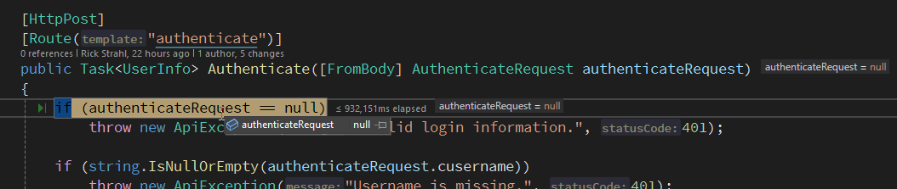
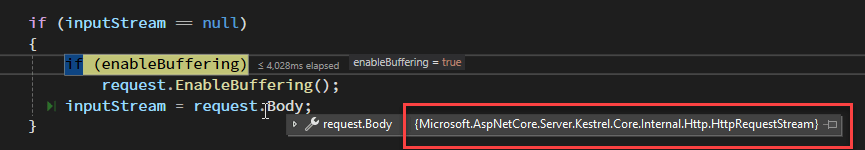
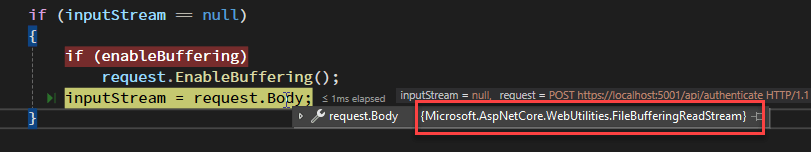
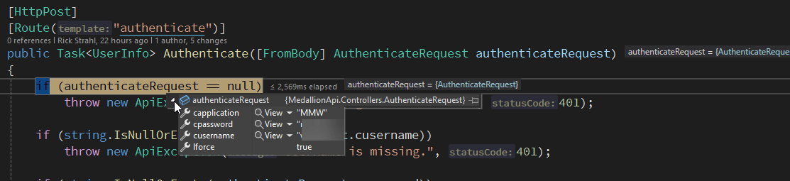

# Reading Raw ASP.NET Request.Body Multiple Times


Some time ago I wrote about [retrieving raw HTTP request content from an incoming request](https://weblog.west-wind.com/posts/2017/sep/14/accepting-raw-request-body-content-in-aspnet-core-api-controllers) and - surprisingly - it's one of the most popular posts on this blog. The post discusses a few ways how you can capture raw request content in ASP.NET Core applications in situations when traditional model binding/mapping doesn't work and you need to access the underlying raw request data.

You can directly read the `Request.Body` stream to access content in raw form which is reading the request data explicitly, or if you're using Model Binding you implicitly get the data bound to objects in `[FromBody]` either from JSON and or HTML form content. 

This all works fine if you're doing typical request operations, but in that post I left out one bit of important information: The `Request.Body` request stream is read-once by default, meaning you can **read the request data only once**. If you repeatedly access the stream you'll get an empty stream and by extension, empty data. 

While it's not common that you need to read request data multiple times it comes up occasionally, especially in scenarios where you need to track the request data for auditing or custom logging.

In this post I look at ways how you can read from `Request.Body` multiple times using the newish `Request.EnableBuffering` feature in ASP.NET, as well as discussing some of the pitfalls you have to watch out for in the process.

##AD##

## Reading Request Body Multiple Times
The [previous post](https://weblog.west-wind.com/posts/2017/sep/14/accepting-raw-request-body-content-in-aspnet-core-api-controllers) has a lot of detail and the mechanics of the actual process of retrieving request data. That post shows how to capture raw request content and also how to create custom `InputFormatter` that can automatically return raw data to your controller code using standard parameters.

The gist of the raw request retrieval - with a few adjustments since the last post - is summed up in [the code at the end of this post](#read-request-data-helper) via an `HttpRequest` extension method helper to retrieve raw request content. The very short TLDR version is that you can use the newish `Request.EnableBuffering()` feature along with resetting the `Request.Body` stream after reading to allow multiple reads of the request buffer.

### What's up with reading Request.Body multiple times?

So, the problem with reading `Request.Body` by default is that **it's a Read-Forward only data stream meaning you can only read it once**. This applies both to your own code that's doing something custom with the `Request.Body` explicitly, or the internal use of ASP.NET - typically for endpoint model binding that implicitly reads `Request.Body`. In either case, once the Request.Body gets read, you or ASP.NET itself can't read the request content again.

To give you a real world scenario, I ran into this recently with a customer who requested that we log incoming request POST/PUT data for audit purposes. We need custom logging that logs both some of the incoming Request which includes the incoming POST/PUT data, but also some application specific data. In that scenario the first body read occurs for our custom logging, and then again when ASP.NET performs the  `[FromBody]` binding to provide the model data to our `HttpPost/HttpPut` endpoints.

Of course, I initially forgot that `Request.Body` can't be read more than once, and when I initially wrote the log code I was happy to see the captured data written to the custom logging, but didn't immediately notice that the endpoint requests **were not receiving their request data**. :smile: 

In my case the first request data capture happens in a small custom middleware implemented via `app.Use()` in startup code:

```csharp
if (config.Logging.EnableRequestLogging)
{
    // Log Requests
    app.Use(async (context, next) =>
    {
        using var logBus = new LoggerBusiness();
        
        // Custom Log context passed through request
        var logItem = logBus.LogItem;
        logItem.Url = context.Request.Path;
        logItem.Verb = context.Request.Method;

        if (logBus.LogRequestContent && context.Request.Method == "POST" || context.Request.Method == "PUT")
        {
            // THIS: read the request body stream (extension method helper)
            using var reader = new StreamReader(context.Request.Body,
                Encoding.UTF8,
                detectEncodingFromByteOrderMarks: false,
                leaveOpen: true /* important! */);
             
            try
            {
                content = await reader.ReadToEndAsync();
            }
            catch(Exception)
            {
                content = null;
            }

            if (!string.IsNullOrEmpty(content))
                logItem.RequestContent = StringUtils.GetMaxCharacters(content, 2048);
        }
       
        // Store in retrievable Request for access in controller etc.
        context.Items["LogItem"] = logItem; // pass log item through the request

        await next();

        logItem.Status = context.Response.StatusCode.ToString();

        await logBus.EndRequestAsync(); // write the log item (along with other audit items)
    });
}
```

The key bit are in this block:

```csharp
using var reader = new StreamReader(context.Request.Body,
    Encoding.UTF8,
    detectEncodingFromByteOrderMarks: false,
    leaveOpen: true /* important! */);
 
try
{
    content = await reader.ReadToEndAsync();
}
catch(Exception)
{
    content = null;
}

if (!string.IsNullOrEmpty(content))
{
    logItem.RequestContent = StringUtils.GetMaxCharacters(content, 2048);
}
```

The problem with this code is that it reads the request content **before ASP.NET gets to it**. My logging code gets the request content just fine, but because the stream is read-once by default, ASP.NET's model binding now fails to retrieve the data on the second read. End result: The Controller API endpoints get *nada for data*! 

To illustrate this scenario, this endpoint:

```csharp
[HttpPost]
[Route("authenticate")]
public Task<UserInfo> Authenticate([FromBody] AuthenticateRequest authenticateRequest)
```

ends up with a null input, because there's no data in the `Request.Body` stream on the second read.



### Request.Body Stream 
Under normal operation the Read-Once default behavior of the `Request.Body` stream is what you want: A request comes in and the framework reads the body stream and parses the data into your Model for an API or ViewModel in an MVC or Razor page request.

Reading the stream once is very efficient as the stream is read only as needed and doesn't need to be buffered in memory or on disk. The incoming stream can be directly read and immediately bound to the data from the stream.

But... if for any reason you need to read the stream multiple times, like in my example of the pre-flight logging,  that's not going to work, as only the first read operation captures the data. The second operation which is ASP.NET's model binding gets an empty stream.

## Use EnableBuffering to Re-Read the Stream
Luckily there's a workaround: You can use `Request.EnableBuffering()` which essentially changes the `Request.Body` stream's behavior so that it `CanSeek` and therefore can be reset to the 0 position and then be re-read.

Note that this is usually a 3 step process:  

* Enable Buffering
* Read the stream
* Reset the Stream pointer to 0

So, you can now do this **before the stream is read for the first time**:

```cs
context.Request.EnableBuffering();
```

> Note that `EnableBuffering()` supports an optional `bufferThreshold` parameter that indicates the size of the maximum memory buffer used, before buffering buffers to disk. The values is in bytes and the default if not specified is 30kb which seems reasonable, but if you know the size of your inbound data you can fine tune the buffer to match. [See docs for more info](https://learn.microsoft.com/en-us/dotnet/api/microsoft.aspnetcore.http.httprequestrewindextensions.enablebuffering?view=aspnetcore-7.0).

Then you can read the stream:

```cs
 using var reader = new StreamReader(context.Request.Body,
     Encoding.UTF8,
     detectEncodingFromByteOrderMarks: false,
     leaveOpen: true /* important! */);
 
 try
 {
     bodyString = await reader.ReadToEndAsync();
 }
 catch(Exception)
 {
     bodyString = null;
 }
```

Finally, if you expect the stream to be read again, make sure you reset the stream pointer to 0:

```cs
if (context.Request.Body.CanSeek)
    context.Request.Body.Position = 0;      
```

This leaves the stream as you found it before your read, and it can then be read again. If you read the stream after ASP.NET has processed the body, you'll need to reset the position yourself **before you read the stream**.

##AD##

### How Stream Buffering works

Stream buffering works, by enabling buffering **before any read operation occurs**. When you call the `Request.EnableBuffering()` method, ASP.NET swaps out the stream used by `Request.Body` transparently:

**Before EnableBuffering() - uses `HttpRequestStream`**



**After EnableBuffering() - uses `FileBufferingReadStream`**



### Make sure you Enable Buffering *Before* the First Read
The key is:

**You have to call `Request.EnableBuffering()` *before* any other operation that reads the body**. 

Seems straight forward, but there are scenarios where this is not obvious. If you want to capture request content in the context of a API Controller action for example, you can't call `Request.EnableBuffering()` there, because the request likely has already been read by ASP.NET for model binding. If you need to capture request data after ASP.NET has captured it, you will have to find a way to set `Request.EnableBuffering()` as part of your middleware pipeline to ensure you can read request data multiple times. 

In my request data capture logging scenario shown earlier this works fine, because I can plug into the ASP.NET middleware pipeline early enough to guarantee that buffering is enabled before the controller model binding gets a hold of the request buffer. The downside is that you basically end up buffering every request and with that comes a little bit of extra request overhead both in performance and resources usage (especially if you have large POST buffers for things like uploads).

To put it all together:

```csharp
app.Use(async (context, next) =>
{
    if (context.Request.Method == "POST" || context.Request.Method == "PUT")
    {
        string bodyString = null;
        
        // this is early enough in the pipeline
        context.Request.EnableBuffering();
        
         using var reader = new StreamReader(context.Request.Body,
                                 Encoding.UTF8,
                                 detectEncodingFromByteOrderMarks: false,
                                 leaveOpen: true /* important! */);
                                     
         try
         {
             bodyString = await reader.ReadToEndAsync();
             if (context.Request.Body.CanSeek)
               context.Request.Body.Position = 0;          
         }
         catch(Exception)
         {
             bodyString = null;
         }
                
        // ... do something with the capture data
    }
    
    await next();
    
    ...
}    
```

> If you use a Stream reader of some sort make sure you set it to leave the stream open after you're done, or else the reader will close it and that also will break subsequent access to the stream.

I can now read the request data for logging  **and** get the request data to show up in the controller:



## Read Request Data Helper
I already mentioned the request helper to read the content above, but there are some improvements since the version from the last post that includes support for enabling buffering as part of the `HttpRequest` extension method.

Here's the updated version from [Westwind.AspNetCore](https://github.com/RickStrahl/Westwind.AspNetCore&amp;rut=4c3281f5854e064aa7143f0b33a5e6705884ec116453a6b33f410423acfe555f):

```csharp
public static async Task<string> GetRawBodyStringAsync(this HttpRequest request,
                                                        bool enableBuffering = false,
                                                        Encoding encoding = null,
                                                        Stream inputStream = null )
{
    if (encoding == null)
        encoding = Encoding.UTF8;

    if (inputStream == null)
    {
        if (enableBuffering)
            request.EnableBuffering();                
        inputStream = request.Body;
    }

    string bodyString = null;
    using (var reader = new StreamReader(inputStream,
        encoding,
        detectEncodingFromByteOrderMarks: false,
        leaveOpen: enableBuffering))
    {
        try
        {
            bodyString = await reader.ReadToEndAsync();
        }
        catch(Exception)
        {
            bodyString = null;
        }

        if (inputStream.CanSeek)
           inputStream.Position = 0;                
    }

    return bodyString;
}
```

By using this you can simplify the middleware code from before to:

```csharp
app.Use(async (context, next) =>
{
    if (context.Request.Method == "POST" || context.Request.Method == "PUT")
    {
        var bodyString = await context.Request.GetRawBodyStringAsync(enableBuffering: true);
        
        ...
    }
}
```

With the `enableBuffering` flag on, buffering is enabled if it's not already on, and the stream is automatically reset at the end of the read operation so that a potential secondary read can be done.

The same caveat as before applies: `enableBuffering` may have no effect if you do it too late in the pipeline, if ASP.NET has already processed the request data. 

For example, I couldn't do this:

```cs
[HttpPost]
[Route("authenticate")]
public Task<UserInfo> Authenticate([FromBody] AuthenticateRequest authenticateRequest)
{            
    // this returns empty
    var bodyString = await context.Request.GetRawBodyStringAsync(enableBuffering: true);
    
    ...   
}
```

because ASP.NET has already read the request. If I want this to work I have to add some explicit middleware prior to the controller processing to enable buffering separately:

```cs
app.Use(app.Use(async (context, next) => { 
    context.Request.EnableBuffering = true;
    await next();
}
```

With that in place, the previous code works and retrieve both the model data and read the body string for a second read.

##AD##

## Summary
Reading raw request content is not the most straight forward operation in ASP.NET core, as it's hidden away behind the more approachable model binding approaches. And rightly so, as reading raw request content tends to be relatively infrequent, and usually related to custom auditing or logging requirements more so than actual request semantics.

In this post I've covered one of the caveats with raw `Request.Body` access related to reading the request content multiple times. Thankfully recent versions have made this easier via `Request.EnableBuffering()` but even so you have to understand how to take advantage of this functionality and where to apply it for multiple request access to work. This post provides what you need to know and some practical code you can use or build on to be on your way for multiple reqeuest access...


## Resources

* [HttpRequest.EnableBuffering() Documentation](https://learn.microsoft.com/en-us/dotnet/api/microsoft.aspnetcore.http.httprequestrewindextensions.enablebuffering?view=aspnetcore-7.0)
* [Accepting Raw Body Content in ASP.NET Core Controllers](https://weblog.west-wind.com/posts/2017/sep/14/accepting-raw-request-body-content-in-aspnet-core-api-controllers)
* [Westwind.AspNetCore library](https://github.com/RickStrahl/Westwind.AspNetCore)
* [GetRawBodyStringAsync()](https://github.com/RickStrahl/Westwind.AspNetCore/blob/bbb85ead8c64bf7b34361c314dfd896ec3b3c582/Westwind.AspNetCore/Extensions/HttpRequestExtensions.cs#L36)
* [GetRawBodyBytesAsync()](https://github.com/RickStrahl/Westwind.AspNetCore/blob/bbb85ead8c64bf7b34361c314dfd896ec3b3c582/Westwind.AspNetCore/Extensions/HttpRequestExtensions.cs#L85)

<div style="margin-top: 30px;font-size: 0.8em;
            border-top: 1px solid #eee;padding-top: 8px;">
    
    this post created and published with the 
    <a href="https://markdownmonster.west-wind.com" 
       target="top">Markdown Monster Editor</a> 
</div>