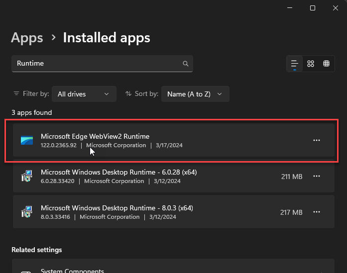

# Programmatic Html to PDF Generation using the WebView2 Control with .NET


I've been using HTML to PDF generation for quite some time for a variety of purposes specifically in [Markdown Monster](https://markdownmonster.west-wind.com/). There are many solutions available - some good, some bad and many very expensive - but I've had good success in the past with the [wkHtml2Pdf](https://wkhtmltopdf.org/) which is an open source solution that uses a standalone executable on Windows that allows conversion via the command line. While whHtml2Pdf works, it's getting a bit long in the tooth as it's based on a very old version of Chromium that is no longer maintained and well... there are a few quirks that will never get fixed as it's deprecated at this point. 

Over the last couple of years, I've been looking at other solutions and frankly have been summarily disappointed as almost none of them have the feature breadth of wkHtml2Pdf. That even though newer solutions work with more modern versions of Chromium and therefore have better browser feature support and more importantly support for JavaScript rendering for getting 'live' content printed. Yet many lack some of the support niceties like table of contents, page-break options at the exporter level, font and injected CSS support to mention a few features that wkHtml2Pdf provided and that are not available for any of the other tools I've seen. In order for that to happen you need to basically create a custom version of Chromium as wkHtml2Pdf did.

I've also been doing a lot of work with the [WebView2 control on Windows](https://weblog.west-wind.com/posts/2021/Jan/14/Taking-the-new-Chromium-WebView2-Control-for-a-Spin-in-NET-Part-1) in several apps and it too has support for generating PDF output both natively in the actual visual control as well as via a programmatic interface that can trigger PDF conversion in code. This type of output works somewhat differently than wkHtml2Pdf essentially keying of the live document tree which can include dynamically generated content. But it too has the same limitations compared to wkHtml2Pdf, but at least it provides the functionality out of the box with a few advantages like the non-requirement for Chromium distribution and the fact that it's available out of the box without an outrageous price tag (as many of the Pdf tools have).

In this post I dig into how to use this WebView2 PDF automation interface and how you can use it to 'invisibly' generate PDF output from HTML very efficiently. I'll discuss how we can make this as unobtrusive as possible and also discuss some of the shortcomings and limitations.

If you just want to dig into the code:

* [Using Westwind.WebView.HtmlToPdf](#using-the-library)
* [Westwind.WebView.HtmlToPdf GitHub Repository](https://github.com/RickStrahl/WestWind.WebView.HtmlToPdf)
* [Westwind.WebView.HtmlToPdf NuGet](https://www.nuget.org/packages/Westwind.WebView.HtmlToPdf)

For more detail,keep reading...

##AD##

## WebView2 Control and PDF Support in the WebView UI
The .NET WebView2 control is a wrapper Windows control around a hosted Chromium instance which is now a core Windows component called the Microsoft Edge WebView2 Runtime:

  
<small>**Figure 1** - The WebView control is an auto-installed Windows System Component.</small>

The WebView2 Runtime is an auto-installed Windows component that is also updated with Windows update. If you have a recently updated version of Windows 11 or 10, you already have the WebView2 Runtime installed. Older versions and server editions may require explicitly installing the runtime.

In addition to the WebView2 Runtime there's also a .NET WebView2 SDK. The .NET part of the SDK consists of a NuGet package that includes versions of the WebView control for WinForms and WPF which is what I'll use in this article. There is also a C++ SDK that can be used create a WebView2 on raw Win32 windows. Either way the WebView control is intrinsically tied to a Windows window  handle so in order to automate PDF generation we'll need to create an invisible window (or really an Window context) and host the WebView on it, load a URL and then render it to PDF. 

### Limit Up!
The Window requirement turned out to be a major sticking point - I had started writing this article with a major limitation around the fact that using a Window context that required an active desktop in order to host the WebView control. Initially I was unable to get the control to render in a service environment where there is no desktop.

After a lot of digging and experimenting however, I managed to figure out a way to host the control **without requiring an explicit Window context/desktop** that allows the PDF generation to work even in service based application, such as running inside of IIS. More on that later...

### Chromium Print and PDF Output UI
If you've used the WebView2 control in your desktop apps, you probably know that it's basically a full featured instance of Microsoft Edge and as such it has native UI support for Printing and PDF Exporting through that interface. Here's the WebView2 control in a Windows Desktop application (Markdown Monster) displaying a document and popping up the Print dialog with Ctrl-P to ""

 
<small>**Figure 2** - The WebView Print UI allows for PDF Exports just as in any Chromium browser.</small>

The output this generates is based on standard Chromium PDF generation, using a common print UI that is used by every Chromium based browser like [Brave](https://brave.com/), [Vivaldi](https://vivaldi.com/), [Edge](https://www.microsoft.com/en-us/edge),  [Chrome](https://www.google.com/chrome/) and many more. The print dialog that pops up sports a preview and has customization options for margins, color or gray scale, headers and footers, pages to print, and more.

## Creating a PDF under Program Control using the WebView
The good news is that WebView includes direct print and print to PDF APIs that allow you to automate PDF creation **without displaying the Print UI and Preview**. This makes it possible to create a non-interactive HTML to PDF converter with this control that is surprisingly fast at performing this task.

For the samples in this post, I used a couple of largish local, self-contained HTML files that are captured HTML output from Markdown Monster of a couple of my blog posts. These posts are 15 and 33 printed pages long respectively and here are the test runs that produce the output:

  
<small>**Figure 3** - PDF Generation is fairly speedy with documents taking under 1 second to generate</small>

All easily under 1 second which seems pretty good! These tests use the component I discuss shortly, and they are running on a fairly high end i9 laptop. Still that seems like decent performance given that we're essentially firing up a Windows control, rendering HTML asynchronously, waiting for load complete, and then rendering to PDF. I suspect the process could be faster, but there's a lot of overhead in the waiting for various state changes that increases processing time here.

The quality of the output generated is identical to what you see from output generated through any of the Chromium Print PDF operations in the WebView control UI or any full featured Chromium browsers. That's because it's **the exact same Chromium print engine** that produces the output.

  
<small>**Figure 4** - Output generated from PDF printing test using a self-contained HTML file from a Blog post in Markdown Monster</small>

### Using @media print CSS Styling to 'help' Print Output
This is a little off topic, but one thing to keep in mind with Printing or PDF output from HTML: It really matters that there is some sort of `@media print` styling in place to help dealing with specialty scenarios for printing, like fonts and facilitating how pages break. Page breaking in particular is key as HTML has no concept of pages - if you just run an HTML page to print as is it's likely to break rather unfortunately in the middle of a paragraph or a list, or a header and following content.

For example, in Markdown Monster I use explicit print styling for HTML print output to help the output along with specific font choices that are guaranteed to work on all platforms, as well as facilitating improved page-break instructions:

```css
@media print {
    html, body {
        font-family: "Segoe UI Emoji", "Apple Color Emoji", -apple-system, BlinkMacSystemFont,"Segoe UI", Helvetica, Helvetica, Arial, sans-serif;
        text-rendering: optimizeLegibility;
        height: auto;
    }

    pre {
        white-space: pre-wrap;
        word-break: normal;
        word-wrap: normal;
    }
        pre > code {
            white-space: pre-wrap;
            padding: 1em !important;
            /* match highlightjs theme colors - must override for <code> override */
            background: #1E1E1E;
            color: #DCDCDC;
        }

    /* keep paragraphs together */
    p, li, ul, code, pre {
        page-break-inside: avoid;
        break-inside: avoid;
    }

    /* keep headers and content together */
    h1, h2, h3, h4, h5, h6 {
        page-break-after: avoid;
        break-after: avoid;
    }
}
```

This helps alot for plain document layout such as a blog post or documentation which is most common for a document editing solution such as Markdown Monster. Markdown is unlikely to include fancy HTML layout - it's mostly flowing text, images and tables. If you're building reports in HTML you probably need some custom layout hints to force pages to break properly at certain intervals.

Failing to use a custom print style often results pretty crappy output, especially if you have sites that use layered HTML. For example, I have that problem on some of my own sites that embarrassingly don't have any custom print styling:

    
<small>**Figure 5** - Not having a print stylesheet in your CSS can make for shitty PDF output</small>
 
and not surprisingly that output looks like shit when printed. Now it's pretty unlikely that anybody will print a landing page like this one, but even so it would be nice that if this worked better than what you see in **Figure 5**. I guess I know what I'll be doing tonight :smile:

In short: Know what you're printing and if at all possible provide specific `@media print` styling for your printed or PDF documents.

> And just to be clear: **PDF output is print output** - PDF output uses the same print engine inside Chromium that is used to print to printers.

## Using the WebView HTML to PDF Component
Alright it's time to get our hands dirty and talk about creating PDF output from HTML using a custom component that wraps the WebView. 

The [Westwind.WebView.HtmlToPdf](https://github.com/RickStrahl/Westwind.WebView.HtmlToPdf) library provides a quick way to print HTML to PDF on Windows using the WebView control. You can generate PDF from HTML using a few different mechanisms:

* To file
* To Stream
* Using Async Call
* Using Event Callbacks

This library uses the built-in **WebView2 Runtime in Windows so it has no external dependencies for your applications** assuming you are running on a recent version of Windows that has the WebView2 Runtime installed.

You can grab this component from [NuGet](https://www.nuget.org/packages?q=Westwind.webview.htmltopdf):

```ps
dotnet add package westwind.webview.htmltopdf
```

or you can grab the source code from Github

* [Westwind.WebView.HtmlToPdf on GitHub](https://github.com/RickStrahl/Westwind.WebView.HtmlToPdf?tab=readme-ov-file)

Targets:

* **net6.0-windows**
* **net8.0-windows**
* **net472**

In addition it has two dependencies in order to run:

* [.NET Windows Desktop Runtime](https://dotnet.microsoft.com/en-us/download/dotnet/8.0)  
This runtime is required by the WebView2 .NET SDK and also by the code that makes it work in server environments (dependency on Windows Forms basically). And yes you can install that on a server as a one time installation.

* [Microsoft Edge WebView2 Runtime](https://developer.microsoft.com/en-us/microsoft-edge/webview2/)  
It's installed by recent updates for Windows 11 and 10 and it's an auto-updated Windows component. On Windows Server you have to install it manually I believe but once installed it auto-updates as well. Many desktop applications like Markdown Monster that run .NET also install the Desktop Runtime if not present.


### Using the Library
The library consists of a top level `HtmlToPdfHost` class that provides the various methods to do the conversion. All operations are literally a couple of lines of code for the actual output generation.

All methods have a Url/File parameter that is the source HTML document that gets rendered into the WebView. 

##AD##

In the case of the file output overload, an output file name is also passed which is used to generate the PDF file on disk. Finally an optional `WebViewPrintSettings` object can be used to customize the print process by specifying margins, orientation, pages to print, scale, headers and other print related settings.

**All methods perform their task asynchronously** and return a `WebViewPrintResult` that provides status and error information and in the case of a stream result the `MemoryStream` that holds the PDF in binary form. Two async styles are supported: Task based and Callback mode. You'll want to use the `async` Task mechanism if you are running in an async .NET context, but the callback event mode can be easier to work with if your application is not already in an async cascade.

#### Usage Examples
Here are some examples that demonstrate each variation of operations:

#### Async Call Syntax for Stream Result

```csharp
// Fully qualified File path or URL
var outputFile = Path.GetFullPath(@".\test3.pdf");
var htmlFile = Path.GetFullPath("HtmlSampleFileLonger-SelfContained.html");
File.Delete(outputFile);

var host = new HtmlToPdfHost();
var pdfPrintSettings = new WebViewPrintSettings()
{
    ShouldPrintHeaderAndFooter = true,
    HeaderTitle = "Blog Post Title"
};

// We're interested in result.ResultStream
var result = await host.PrintToPdfStreamAsync(htmlFile, pdfPrintSettings);

Assert.IsTrue(result.IsSuccess, result.Message);
Assert.IsNotNull(result.ResultStream); // THIS

Debug.WriteLine($"Stream Length: {result.ResultStream.Length}");

// Copy resultstream to output file
File.Delete(outputFile);
using var fstream = new FileStream(outputFile, FileMode.OpenOrCreate, FileAccess.Write);
result.ResultStream.CopyTo(fstream);
result.ResultStream.Close(); // Close returned stream!

ShellUtils.OpenUrl(outputFile);
```

#### Async Call for PDF File Generation Result

```csharp
// File or URL to render
var htmlFile = Path.GetFullPath("HtmlSampleFileLonger-SelfContained.html");
var outputFile = Path.GetFullPath(@".\test2.pdf");
File.Delete(outputFile);

var host = new HtmlToPdfHost();
var pdfPrintSettings = new WebViewPrintSettings()
{
    // margins are 0.4F default
    MarginTop = 0.3f,
    MarginBottom = 0.3F,
    MarginLeft = 0.2f,
    MarginRight = 0.2f,                
    ScaleFactor = 0.9F,

    // no effect
    Copies = 2,
    PagesPerSide = 4, 
    ColorMode = WebViewPrintColorModes.Grayscale,
    Collation = WebViewPrintCollations.UnCollated,
     Duplex = WebViewPrintDuplexes.TwoSidedShortEdge
};
var result = await host.PrintToPdfAsync(htmlFile, outputFile, pdfPrintSettings);

Assert.IsTrue(result.IsSuccess, result.Message);
ShellUtils.OpenUrl(outputFile);
```

#### Event Syntax to Stream

```csharp
// File or URL
var htmlFile = Path.GetFullPath("HtmlSampleFile-SelfContained.html");                       
var host = new HtmlToPdfHost();

// Callback on completion
host.OnPrintCompleteAction = (result) =>
{
    if (result.IsSuccess)
    {
        // create file so we can display
        var outputFile = Path.GetFullPath(@".\test1.pdf");
        File.Delete(outputFile);

        using var fstream = new FileStream(outputFile, FileMode.OpenOrCreate, FileAccess.Write);
        result.ResultStream.CopyTo(fstream);

        result.ResultStream.Close(); // Close returned stream!

        ShellUtils.OpenUrl(outputFile);
        Assert.IsTrue(true);
    }
    else
    {
        Assert.Fail(result.Message);
    }
};
var pdfPrintSettings = new WebViewPrintSettings()
{
    MarginBottom = 0.2F,
    MarginLeft = 0.2f,
    MarginRight = 0.2f,
    MarginTop = 0.4f,
    ScaleFactor = 0.8f,
};
host.PrintToPdfStream(htmlFile, pdfPrintSettings);
```


#### Event Syntax to PDF File

```csharp
var htmlFile = Path.GetFullPath("HtmlSampleFile-SelfContained.html");
var outputFile = Path.GetFullPath(@".\test.pdf");
File.Delete(outputFile);

var host = new HtmlToPdfHost();            

// Callback when complete
host.OnPrintCompleteAction = (result) =>
{
    if (result.IsSuccess)
    {
        ShellUtils.OpenUrl(outputFile);
        Assert.IsTrue(true);
    }
    else
    {
        Assert.Fail(result.Message);
    }
};
var pdfPrintSettings = new WebViewPrintSettings()
{
    // default margins are 0.4F
    MarginBottom = 0.2F,
    MarginLeft = 0.2f,
    MarginRight = 0.2f,
    MarginTop = 0.4f,
    ScaleFactor = 0.8f,
    PageRanges = "3-6"
};
host.PrintToPdf(htmlFile, outputFile, pdfPrintSettings);
```

You can see that the code to use the component is pretty simple - create the `HtmlToPdfHost` and call the appropriate method and deal with the returned result - either as a direct async return value, or as a result parameter in a callback handler.

Here's one other example to demonstrate running code like this in a non-interactive scenario: The following code uses Html to PDF generated inside of an ASP.NET Core application in a controller method with asynchronous stream output:

```csharp
/// <summary>
/// Return raw data as PDF
/// </summary>
/// <returns></returns>
[HttpGet("rawpdfex")]
public async Task<IActionResult> RawPdf()
{
    var file = Path.GetFullPath("./HtmlSampleFile-SelfContained.html");

    var pdf = new HtmlToPdfHost();
    var pdfResult = await pdf.PrintToPdfStreamAsync(file, new WebViewPrintSettings {  PageRanges = "1-10"});

    if (pdfResult == null || !pdfResult.IsSuccess)
    {
        Response.StatusCode = 500;                
        return new JsonResult(new
        {
            isError = true,
            message = pdfResult.Message
        });
    }

    return new FileStreamResult(pdfResult.ResultStream, "application/pdf");             
}
```

To make sure this works even inside of service hosted applications with access to the desktop, I ran this in a local IIS instance and it worked great:

  
<small>**Figure 6** - Using the proper event handling and threading, Html to PDF now works inside of services and any other un-attended scenarios</small>


#### Some Settings that don't do anything
The `WebViewPrintSettings` object is a wrapper around the native WebView `CoreWebView2PrintSettings` class. The wrapper is meant to keep the WebView2 innards out of your top level project, so you don't have to take an explicit dependency on it.
  
However, there are several settings that appear to not work currently at least for PDF Generation:

* **ColorMode** - Color mode is currently ignored and output is always printed in color. This does work in the 

Print Only 

* **PagesPerSide** - Does nothing in PDF output (probably only relevant for print)
* **PrinterName** - obviously ignored as internally printed to PDF

### A few Shortcomings
This control basically provides all of the features that the Chromium engine provides via it's exposed API. Nothing more nothing less. The `CoreWebView2PrintSettings` basically mimic most of the features that you see on the Web Browser print dialog, so most of those options are exposed and can also be programmatically driven.

However there are some things that I miss and wish where available:

* **Bookmark Table of Contents** - some PDF tools as well as wkHtml2Pdf produce automatic bookmarks for each heading in the document. This bookmark toc is then displayed in the PDF view as part of the document navigations. Unfortunately the Chromium default PDF generation does not create this bookmark TOC automatically.

  
<small>**Figure 7** - Sadly Bookmark TOCs like this one generated by wkHtml2Pdf, aren't an option for WebView2 PDF output </small>

* **Auto Page Break Management** - wkHtmlToPdf automatically injects some styling into HTML to force it to render page-breaks more consistently than default HTML rendering. You can do this with your own style sheets in the generated HTML **before you send it to the converter**, however it would be cool as we could optionally inject this HTML before rendering to PDF.

## How it works
As mentioned the WebView2 control has support for printing loaded HTML content to PDF programmatically which is the key feature that makes it possible to generate PDF files non-interactively.

Sounds easy enough, but the process is actually a lot more complicated than you might think because we want this control to work in **any environment even outside of a Windows application/desktop** and in order to do that it can't depend on an existing Windows event loop from a Desktop application. 

So it actually requires a quite a few steps internally in order to generically render to PDF:

* Create a new STA Thread
* Create an invisible  WebView Control (a WebViewController really)
* Wait for the control to initialize
* Load the HTML into the document
* Wait for the document to load
* Render the PDF from the loaded document
* Wait for completion

The wrapper handles all of these operations and the provides an interface that:

* Notifies you of the result
   * Using an async method result
   * Using a callback (for non-async applications)
   
The WebView is pretty finicky when it comes to its event lifetime - there are many truly asynchronous operations that occur that you have to wait to complete for before you can move on to the next step: Making sure the control has initialized before you can even navigate to a URL, making sure the document has completed loading before you can start PDF output and finally waiting for completion of the PDF output generation. 

The other key issue is the threading environment to ensure the context can run outside of the context of a Desktop application even in service scenarios. When I initially posted about being able to print to PDF on X, **one of the very first comments** was: *Does it work in unattended mode, and does it run in a server environment?* The initial answer was no, as I was using the visual control with a hidden Desktop window. This works great as long as a desktop is available, but it it doesn't if you're running inside of a service non-terminal context. To make the service environment work requires messing around with custom threads and synchronization contexts and a few other things. In the end I managed to get this to work, just at the point where I was ready to give up on that and I'm glad for it as I have use cases for that myself! :smile:

The bottom line is that now this component lets you **print HTML to PDF in any Windows execution environment including inside services and IIS**.

### Implementation
The process of generically creating a WebView and using it to print to PDF is bit torturous with a lot of icky details that have to do with the peculiarities of Windows event loop programming.

#### Gimme a Thread - Not just any thread!
The main thing that's important **the WebView is a Windows UI component and as such it needs a Windows event loop**. This means:

* It needs to run on an STA Thread
* It needs an event loop such as `Application.Run()` or `Dispatcher.Run()`

In practice the component is split up into two key components:

* **HtmlToPdf Host**  
The top level component you interact with and which provides the top level thread setup for each of the methods. Basically a single method that you call to perform the PDF conversion.

* **CoreWebViewHeadlessHost**  
This is the headless WebView wrapper that wraps and instantiates `CoreWebView2Controller` and then coordinates the HTML loading and PDF printing.

These two components interact with each other, with the `HtmlToPdf` host setting up the execution environment for the `CoreWebViewHeadlessHost` so that it can safely execute in any Windows execution context.

#### HtmlToPdf Host - All about Thread Handling
The hardest part to figure in this entire process has been how to set up a threading environment that works even inside of non-UI, service environments. The WebView at its heart is a Win32 component, but it does have support for not-well-documented headless mode via the a CoreWebView2 controller. This controller **can run in unattended scenarios** but it has to be set up very specifically.

The key bit of code involves three thread related operations:

* A TaskCompletionSource for handling the Task result of the top level method
* A new STA Thread
* SynchronizationContext.Post()
  
Doesn't that sound like fun, **mixing three different threading models into one call sequence**? :joy:

The Task completion source is used as a wrapper around the required thread creation. The TCS allows making the thread operation essentially behave like an `async` call. You can create the TCS and then when complete fill the value to return.

Why not just use tasks? The Webview requires is essentially a UI component so the one requirement is that it needs to execute on an STA thread. Therefore if we want to be sure we can execute in non-UI scenarios we need to make sure we have an STA thread that we are starting from.

The STA thread however is not enough - in addition you still need Windows message loop that's running in order for even the WebView headless mode to work. Without the message loop trying to create the CoreWebView2 controller just hangs. `Application.Run()`, and `SynchronizationContext.Post()` are the operations I use to accomplish this as I'm trying to stick to Windows forms constructs. You could also use `Dispatcher.Run()` and `Dispatcher.Invoke()` to achieve the same with WPF constructs.

> It would be nice if there was a way to do this without requiring dependencies on `<UseWindowsForms>` or `<UseWpf>` as these require `net8.0-windows` target frameworks which would be preferrable. But I not sure if that's possible. If you can think of native ways to do this without Windows Forms or WPF, please leave a comment.

The  relevant top level code (modified) that handles this Task over Thread over Windows Event loop flow looks like this:

```csharp
public PdfPrintResult PrintToPdfStreamAsync(string url) 
{
    var tcs = new TaskCompletionSource<PdfPrintResult>();
    
    Thread thread = new Thread( () =>
    {
       // Create a Windows Forms Synchronization Context we can execute
       // which works without a desktop!
       SynchronizationContext.SetSynchronizationContext(new WindowsFormsSynchronizationContext());
       if (SynchronizationContext.Current == null)
       { 
           tcs.SetResult(new PdfPrintResult {  IsSuccess = false, Message = "Couldn't create STA Synchronization Context." });
           return;
       }
       SynchronizationContext.Current.Post( async (state)=>                 
       {
           // result =  ... code to load and print
           
           tcs.SetResult(result);  // indicate task completion
           Application.ExitThread();
       }
       Application.Run()
       
    });   
    
    thread.SetApartmentState(ApartmentState.STA); // MUST BE STA!
    thread.Start();
    
    // return the incomplete task - caller awaits PpfPrintResult
    return tcs.Task;   
}
```

The code inside of the `SynchronizationContext` (which could also be a `Dispatcher.CurrentDispatcher.Invoke()` if using WPF semantics) then creates the actual WebView wrapper and executes the print operation:

```csharp
SynchronizationContext.Current.Post( async (state)=>                 
{
    try
    {
        IsComplete = false;
        
        var host = new CoreWebViewHeadlessHost(this);
        await host.PrintFromUrlStream(url);

        await WaitForHostComplete(host);  // spin until IsComplete = true                          

        if (!host.IsComplete)
        {
            result = new PdfPrintResult()
            {
                IsSuccess = false,
                Message = "Pdf generation timed out or failed to render inside of a non-Desktop context."
            };
        }
        else
        {
            result = new PdfPrintResult()
            {
                IsSuccess = host.IsSuccess,
                Message = host.IsSuccess ? "PDF was generated." : "PDF generation failed: " + host.LastException?.Message,
                ResultStream = host.ResultStream,
                LastException = host.LastException
            };
        }
        OnPrintCompleteAction?.Invoke(result);
        tcs.SetResult(result);
    }
    catch (Exception ex)
    {
        result.IsSuccess = false;
        result.Message = ex.ToString();
        result.LastException = ex;
        tcs.SetResult(result);
    }
    finally
    {
        IsComplete = true;
        Application.ExitThread();  // now kill the event loop and thread
    }
}, null);                
Application.Run();  // Windows Event loop needed for WebView in system context!
```

You'll probably notice at the top of the code there's are several `IsComplete` properties that are used to keep track of state of execution. In several places there is code that basically does:

```cs
private async Task WaitForHostComplete(CoreWebViewHeadlessHost host)
{
    for (int i = 0; i < RenderTimeoutMs / 20; i++)
    {
        if (host.IsComplete)
            break;
        await Task.Delay(10);
    }
}
```

I feel dirty! But this works surprisingly well and beats some of the other alternatives of dealing with low level locks and reset events. 

The jist of the code above is basically to create an instance of the `CoreWebViewHeadlessHost` and wait for printing to complete. 

Once complete the `PdfPrintResult` is assembled and returns back the `IsSuccess` status and an error message if there was an error. If the result is a stream (rather than an output file), the stream is captured and stored on the result.

Note that `ResultStream` is a `MemoryStream` that captures the entire response. This isn't optimal but due the way this new thread and synchronization context is set up we want to get in get the content and release everything, so creating the captured stream is the cleanest way to do that. Unfortunately this can mean a large memory hit if you're printing a large PDF.

#### WebView Eventing
When I originally started this project I used a Windows Form with a WebView control on it. That worked fine, but as it turns out you can't instantiate a Windows form (or a dialog via `ShowDialog()`) without an active Desktop. So while the Windows form worked in Desktop and Console apps running in an Interactive Windows session, it failed when run from within a service.

Here is one of my early attempts trying to host the component in IIS in ASP.NET application:

  
<small>**Figure 8** - Using a Windows Form for WebView2 hosting doesn't work for hosting in a Windows Service/System context</small>

Luckily using the event structure shown above plus the `CreateCoreWebView2ControllerAsync()` allow making this work. Read on...

#### Create CreateCoreWebView2ControllerAsync and the Windows Event Loop
After a lot of digging through forum posts on the WebView Feedback site I ran into the following code which is meant to create a Headless WebView control using an obscure function called `CreateCoreWebView2ControllerAsync()` which is supposed to create a headless WebView 'controller' which is basically the rendering surface minus the actual control wrapper (ie. similar to `WebViewControl.CoreWebView2`).

Here's what calling this method looks like:

```csharp
private IntPtr HWND_MESSAGE = new IntPtr(-3);

protected async void InitializeAsync()
{
    // must create a data folder if running out of a secured folder that can't write like Program Files
    var environment = await CoreWebView2Environment.CreateAsync(userDataFolder HtmlToPdfHost.WebViewEnvironmentPath);

    // Create a Headless WebView
    var controller = await environment.CreateCoreWebView2ControllerAsync(HWND_MESSAGE);
    WebView = controller.CoreWebView2;   // the WebView instance (not the control)
    
    _IsInitialized = true;
    WebView.DOMContentLoaded += CoreWebView2_DOMContentLoaded;      
}
```

Note that I'm calling `CreateCoreWebView2ControllerAsync()` with `new IntPtr(-3)` which is a special Windows `HWND_MESSAGE` message type meant for non-visual, non-desktop use cases. This is vaguely mentioned in the docs, but they fail to mention that this only works if there's an active Windows event loop (ie. `Application.Run()` or `Dispatcher.Run()`).

However, this code alone doesn't work, **unless you are running in a dispatched Windows event loop** - meaning inside of an existing desktop application using WinForms or WPF or Win32.  When I first found this code I had no luck getting this to work **because although I was running on an STA thread, I did not have an active event loop**! 

Remember the code I showed earlier regarding the `Application.Run()` and `SynchronizationContext.Current.Post()`? That code is what made the initialization finally work! The event loop is required - without the call simply hangs forever!

#### Events, Events, they're not my Friends
WebView initialization is always tricky if you need to synchronize your loading of content. When you use the WebViewController the only way to load a URL into the WebVIew is by calling the Navigate method - unlike the control there's no Source property, so you can't force the URL on startup to navigate as soon as the control is ready. Instead you have to wait for it to be 'ready' to be navigated.

```cs
var controller = await environment.CreateCoreWebView2ControllerAsync( new IntPtr(-3) ); // HWMD_MSG
```
Just like `WebView.EnsureCoreWebView2Async()` for the control, the above method does not immediately fire - there's some delay as the WebView has to create a startup environment and ensure that it can render. For the visual control that means it doesn't actual complete until it becomes visible. The controller doesn't wait for visibility but it still takes at least 100ms or so at minimum (ask me how I know - I initially used fix Delay).

The problem here is this: You can't navigate the control until it's been initialized. Hence the `_IsInitialized property` which is then checked before we navigate:

```csharp
public async Task PrintFromUrlStream(string url)
{
    // wait for _IsInitialized=true
    await WaitForInitialized();

    // only now can we navigate
    PdfPrintOutputMode = PdfPrintOutputModes.Stream;
    WebView.Navigate(url);
}
```

This only submits the URL, now the page navigates and we have to wait for the `DOMContentLoaded` event to handle actually 

```csharp
private async void CoreWebView2_DOMContentLoaded(object sender, Microsoft.Web.WebView2.Core.CoreWebView2DOMContentLoadedEventArgs e)
{
    try
    {
        if (PdfPrintOutputMode == PdfPrintOutputModes.File)
            await PrintToPdf();
        else
            await PrintToPdfStream();
    }
    finally
    {
        IsComplete = true;
    }
}

internal async Task<Stream> PrintToPdfStream()
{
    var webViewPrintSettings = SetWebViewPrintSettings(); // map settings

    try
    {
        // we have to turn the stream into something physical because the form won't stay alive
        await using var stream = await WebView.PrintToPdfStreamAsync(webViewPrintSettings);
        var ms = new MemoryStream();
        await stream.CopyToAsync(ms);
        ms.Position = 0;
        
        ResultStream = ms;
        IsSuccess = true;
        return ResultStream;
    }
    catch (Exception ex)
    {
        IsSuccess = false;
        LastException = ex;
        return null;
    }
}
```

The key here is  `IsComplete` being set to `true` which now triggers the `HtmlToPdfHost` to continue processing and pick up the result from the CoreWebView host:


```csharp
IsComplete = false;
var host = new CoreWebViewHeadlessHost(this);
await host.PrintFromUrlStream(url);

// wait for WebView to finish
await WaitForHostComplete(host);                        

// now pick up the results that we can return
if (!host.IsComplete)
{
    result = new PdfPrintResult()
    {
        IsSuccess = false,
        Message = "Pdf generation timed out or failed to render inside of a non-Desktop context."
    };
}
else
{
    result = new PdfPrintResult()
    {
        IsSuccess = host.IsSuccess,
        Message = host.IsSuccess ? "PDF was generated." : "PDF generation failed: " + host.LastException?.Message,
        ResultStream = host.ResultStream,
        LastException = host.LastException
    };
}

// Also fire the event action if set
OnPrintCompleteAction?.Invoke(result);

// return as a Task result
tcs.SetResult(result);
```

In these steps I've shown one of the operational modes with the Async Stream result flow. The output file flow looks slightly different - rather than returning the stream it simply writes the file and returns `IsSuccess` in the result structure.

##AD## 

Exceptions are captured in all cases, since they won't flow across threads - if they weren't handled they'd blow up the thread and fail silently. So rather than failing silently we capture exceptions and return the error state, message and last exception as part of the result message.

You can check out the entire code for these two components on GitHub:

* [HtmlToPdfHost.cs](https://github.com/RickStrahl/WestWind.WebView.HtmlToPdf/blob/master/Westwind.WebView.HtmlToPdf/HtmlToPdfHost.cs)
* [CoreWebViewHeadlessHost](https://github.com/RickStrahl/WestWind.WebView.HtmlToPdf/blob/master/Westwind.WebView.HtmlToPdf/CoreWebViewHeadlessHost.cs)

## Summary
It's been a long journey to get here, but at this point I have a generic PDF to HTML engine that works on Windows. It uses standard Windows components that in most cases doesn't require a huge runtime distribution and... last but not least it's free to use and open source.

It'd be cool to see if we can provide some of the functionality that wkHtml2Pdf provided. I could see optionally injecting CSS for improved page-breaking and perhaps using a third party library to add the PDF TOC/Bookmarks to the document (PdfPig?).

If you find this tool useful, please consider supporting with contributions or by using the [Sponsor link on Github](https://github.com/sponsors/RickStrahl). Value for Value.

Enjoy.

## Resources

* [Westwind.WebView.HtmlToPdf GitHub Repository](https://github.com/RickStrahl/WestWind.WebView.HtmlToPdf)
* [Westwind.WebView.HtmlToPdf NuGet](https://www.nuget.org/packages/Westwind.WebView.HtmlToPdf)
* [WebView2 Feedback](https://github.com/MicrosoftEdge/WebView2Feedback)
* [wkHtml2Pdf](https://wkhtmltopdf.org/)
* [HtmlToPdfHost.cs](https://github.com/RickStrahl/WestWind.WebView.HtmlToPdf/blob/master/Westwind.WebView.HtmlToPdf/HtmlToPdfHost.cs)
* [CoreWebViewHeadlessHost](https://github.com/RickStrahl/WestWind.WebView.HtmlToPdf/blob/master/Westwind.WebView.HtmlToPdf/CoreWebViewHeadlessHost.cs)
* [CoreWebView2Environment.CreateCoreWebView2ControllerAsync](https://learn.microsoft.com/en-us/dotnet/api/microsoft.web.webview2.core.corewebview2environment.createcorewebview2controllerasync?view=webview2-dotnet-1.0.2210.55)

<div style="margin-top: 30px;font-size: 0.8em;
            border-top: 1px solid #eee;padding-top: 8px;">
    
    this post created and published with the 
    <a href="https://markdownmonster.west-wind.com" 
       target="top">Markdown Monster Editor</a> 
</div>