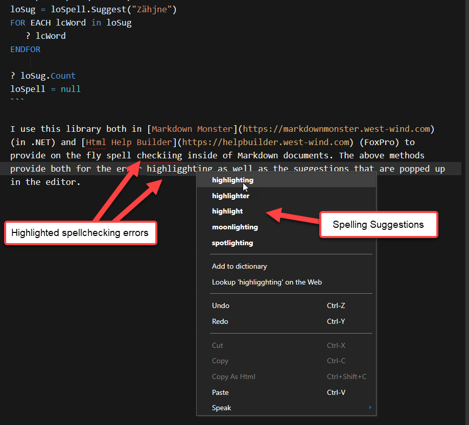

# wwDotnetBridge and Loading Native Dependencies for .NET Assemblies


When using wwDotnetBridge to access .NET components you may run into .NET components that have native binary dependencies. When I say 'native' here I mean, non-.NET Win32/C++ dependencies that are generally not following the same assembly loading rules as the .NET host.

## An Example: NHunspell, Spellchecking and Word Suggestions
Just for context, this is the `NHunspell` Spell checking component I highlighted in a [Southwest FoxSession all the way back in 2016](https://bitbucket.org/RickStrahl/swfox16_wwdotnetbridge_10uses/raw/master/Documents/Strahl_wwdotnetBridge_10Uses.pdf). This library is based on the popular HUnspell native library, for which NHUnspell is basically a .NET wrapper. The .NET wrapper just makes the appropriate interop calls to native C++ library.

I created a FoxPro class around the .NET component using [wwDotnetBridge](https://github.com/RickStrahl/wwDotnetBridge):

```foxpro
*************************************************************
DEFINE CLASS HunspellChecker AS Custom
*************************************************************
*: Author: Rick Strahl
*:         (c) West Wind Technologies, 2015
*:Contact: http://www.west-wind.com
*:Created: 08/07/15
*************************************************************
oBridge = null
oSpell = null
cLanguage = "en_US"
cDictionaryFolder = "" && root

************************************************************************
*  init
****************************************
FUNCTION init(lcLang, lcDictFolder)

IF EMPTY(lcLang)
   lcLang = this.cLanguage
ENDIF
IF EMPTY(lcDictFolder)
   lcDictFolder = this.cDictionaryFolder
ENDIF
   
this.oBridge = GetwwDotnetBridge()
IF ISNULL(this.oBridge)
      ERROR "Failed to load HUnspell: " + this.oBridge.cErrorMsg
ENDIF

* ? this.oBridge.GetDotnetVersion()

IF !this.oBridge.LoadAssembly("NHunspell.dll")
  ERROR "Failed to load HUnspell: " + this.oBridge.cErrorMsg
ENDIF

IF !EMPTY(lcDictFolder)
	lcDictFolder = ADDBS(lcDictFolder)
ELSE
    lcDictFolder = ""
ENDIF

this.oSpell = this.oBridge.CreateInstance("NHunspell.Hunspell",;
                                  lcDictFolder + lcLang + ".aff",;
                                  lcDictFolder + lcLang + ".dic")
                                  
IF VARTYPE(this.oSpell) # "O"
   ERROR "Failed to load HUnspell: " + this.oBridge.cErrorMsg
ENDIF  
                                  
IF FILE(lcDictFolder + lcLang + "_custom.txt")
  lcFile = FILETOSTR(lcDictFolder + lcLang + "_custom.txt")
  lcFile = STRTRAN(lcFile,CHR(13) + CHR(10),CHR(10))
  lcFile = STRTRAN(lcFile,CHR(13),CHR(10))
  LOCAL ARRAY laLines[1]
  LOCAL lnX, lnLine
  lnLines = ALINES(laLines,lcFile,1 + 4,CHR(10))
  FOR lnX = 1 TO lnLines
      this.oSpell.Add(laLines[lnx])            
  ENDFOR
ENDIF
                                  
IF ISNULL(this.oSpell)
  ERROR "Failed to load HUnspell: " + this.oBridge.cErrorMsg
ENDIF

ENDFUNC
*   init

************************************************************************
*  Spell
****************************************
***  Function: Checks to see if a word is a known word in the dictionary
************************************************************************
FUNCTION Spell(lcWord)

IF ISNULL(lcWord) OR EMPTY(lcWord) OR LEN(lcWord) = 1
   RETURN .T.
ENDIF

RETURN this.oSpell.Spell(lcWord)
ENDFUNC
*   Spell

************************************************************************
*  Suggest
****************************************
***  Function: Gives back a collection of word suggestions for 
***            the passed in word
************************************************************************
FUNCTION Suggest(lcWord)
LOCAL loWords, lnx

loCol = CREATEOBJECT("collection")
loWords = this.obridge.InvokeMethod(this.oSpell,"Suggest",lcWord)
? lowords
? this.oBridge.cErrorMsg

lnCount = this.oBridge.GetProperty(loWords,"Count")
? this.oBridge.cErrormsg
?  "Count: " + TRANSFORM(lnCount)


FOR lnX = 0 TO lnCount -1
    lcWord =  loWords.Item(lnX)
    loCol.Add( lcWord )
ENDFOR


RETURN loCol
ENDFUNC
*   Suggest


************************************************************************
*  AddWordToDictionary
****************************************
FUNCTION AddWordToDictionary(lcWord, lcLang)

lcFile = "editors\" + lcLang + "_custom.txt"
AppendToFile(lcWord + CHR(13) + CHR(10),lcFile)
this.oSpell.Add(lcWord)

ENDFUNC
*   AddWordToDictionary

************************************************************************
*  Destroy
****************************************
FUNCTION Destroy()

*** MUST dispose to release memory for spell checker
this.oSpell.Dispose()
this.oSpell = null

ENDFUNC
*   Destroy

ENDDEFINE
*EOC HunspellChecker
```

To use it you just instantiate the class and pass in a dictionary, then check for spelling or get suggestions:

```foxpro
loSpell = CREATEOBJECT("HunspellChecker","en_US",".\Editors")   
? loSpell.Spell("Testing")
? loSpell.Spell("Tesdting")   

lcWord = "aren'tt"
? "Suggest Testding"
loSug = loSpell.Suggest(lcWord)
? loSug.Count
FOR EACH lcWord in loSug
   ? lcWord
ENDFOR
loSpell = null

loSpell = CREATEOBJECT("HunspellChecker","de_DE",".\Editors")
? loSpell.Spell("Zahn")
? loSpell.Spell("Zähne") 
? loSpell.Spell("läuft") 
loSug = loSpell.Suggest("Zähjne")
FOR EACH lcWord in loSug
   ? lcWord
ENDFOR
      
? loSug.Count
loSpell = null
```

I use this library both in [Markdown Monster](https://markdownmonster.west-wind.com) (in .NET) and [Html Help Builder](https://helpbuilder.west-wind.com) (FoxPro) to provide on the fly spell checkiing inside of Markdown documents. The above methods provide both for the error highligghting as well as the suggestions that are popped up in the editor.



Surprisingly, this is very fast even accounting for interop between JavaScript and FoxPro and FoxPro to .NET! 

This is just to give you some context of a library that has a native dependency (and because I know some of you would ask about the functionality :smile:)

## Library and Dependencies: Watch Load Location
So NHunspell has a .NET assembly `NHUnspell.dll`  and a **native dependency** for the underlying Win32 32 bit `hunspellx86.dll` (or `hunspell.dll` for the 64bit version). 

So the two file dependencies for the .NET component are:

* NHunspell.dll (.NET assembly)
* HUnspellx86.dll (Win32 native dll)

### Standard.NET Assembly Loading Behavior
Natively .NET dependencies resolve only out of the EXE's startup path or an optional `PrivateBin` path that can be assigned in `app.config` or through the hosting runtime instantiation. 

For a FoxPro application that would mean 1 of 2 things:

* Your EXE's startup folder when running the EXE
* VFP9.exe's startup folder

### wwDotnetBridge Assembly Loading Behavior
wwDotnetBridge tries to be a little more helpful and basically tries to resolve assembly paths for you **if you explicitly load assemblies via `LoadAssembly()`**: 

```foxpro
loBridge = GetwwDotnetBridge()

*** Looks in current and FoxPro Path
loBridge.LoadAssembly("NHUnspell.dll")
```

If you specify a non-pathed DLL name, wwDotnetBridge does `FULLPATH(lcAssembly)` on it, which resolves to the current path or anything along the FoxPro path to eventually provide an absolute path to the DLL. .NET by default looks for other assemblies in both the startup path and the location an explicitly loaded assembly is loaded from. IOW, any child dependencies automatically inherit the path of the parent for trying to find assemblies.

Alternately you can also specify an explicit path directly:

```foxpro
loBridge.LoadASsembly("c:\libraries\bin\NHUnspell.dll")
```

All this is great and predictable, but... it only applies to .NET assemblies, not any natively loaded assemblies.

### Natively loaded Dependencies
If a .NET component has a native dependency as NHunspell has in the form of `hunspellx86.dll` that native DLL either has to be explicitly discovered and found by the .NET component, or it uses the default path resolution.

#### Default Native Path Resolution
The **default path resolution** for a native dependency is that it is loaded only out of the launching EXE's startup folder.

#### Custom Native Path Resolution
Some libraries use **custom path resolution** which set up their own folders and **EXPLICITLY** load out of that folder. For example, the popular `LibGit2Sharp` library uses a custom `runtime/win-x86` folder where `win-x86` is the platform you are using (x86 for FoxPro 32 bit). 

The best way to see where things are expected is to create a .NET project and install the NuGet package into it, and then see exactly where files are placed. Then use the same 'offset' in your own project: If it dumps it into the root, use the same folder as your EXE, if there's a runtime folder duplicate that structure and put the DLL there.

### NUnspell Loading
NHUnspell uses default native path resolution so if you are going to use the functionality both in your deployed application and in the FoxPro IDE you need to put the native `hunspellx86.dll` in two places:

* Your EXE's startup folder
* VFP9.exe startup folder if you're running in the Fox IDE

## How this can bite you
I'm writing about this because this bit me hard today. I recently set up a new laptop and ended up reinstalling all of my applications including Visual FoxPro. I ran Help Builder which was installed using its installer from Chocolatey and it ran fine. Then I fired it up in the FoxPro IDE and it kept crashing on the spell library with `.oSpell` not found when running from within VFP.

Of course I didn't immediately remember that the spell checking logic has a native dependency so I started trying to track down the error. Only fails at dev time, not at deployed runtime. Weird, huh? Not with what we know now, but 3 years from now???

The problem is that I reinstalled VFP 9 and of course **did not remember to install the `hunspellx86.dll`** in the VFP IDE folder. Once I moved the DLL into the VFP9 install folder all is well.

To be clear though - my deployed application that runs the EXE still worked because the installer copies the `hunspellx86.dll` into the install directory - no issue there, but the VFP install is tricky because you're not going to see anything wrong until you run your specialized application a long time after installation. 

Make notes, and hopefully you'll remember to read them... I will and probably won't remember. Ha!

## Summary
The jist of this post is that when you use a library with native dependencies make sure you understand the native libraries have different load behavior than the .NET libraries, with the default behavior being that it will load out of the startup EXE's startup folder. And remember that for FoxPro applications you typically have two root EXEs that you need to worry about for development in the IDE using VFP9.exe and for development with your own compiled EXE.