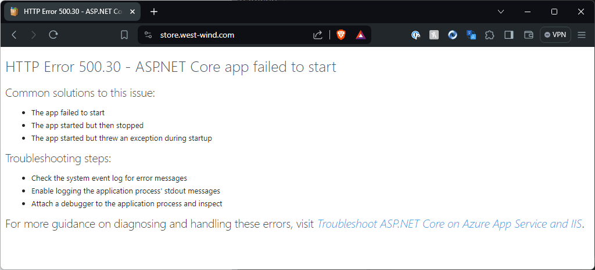
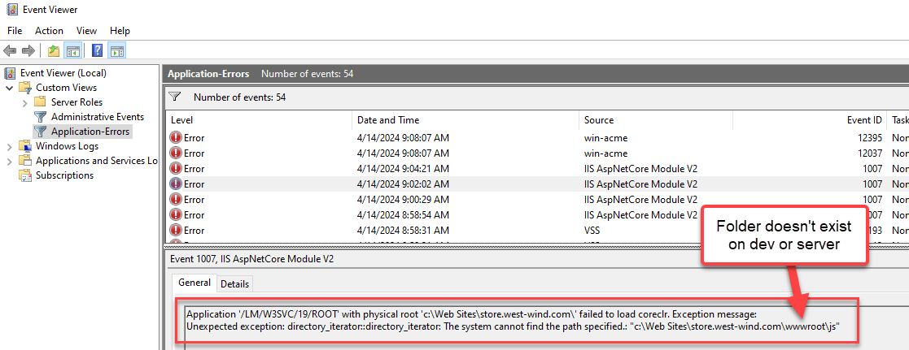
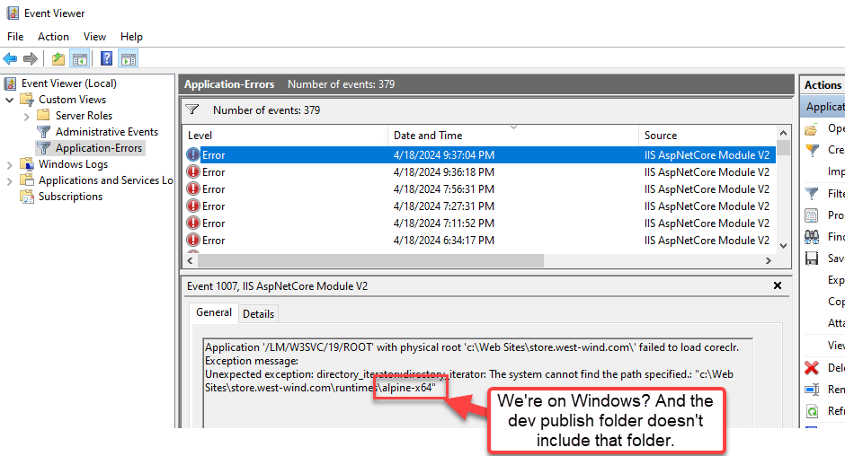
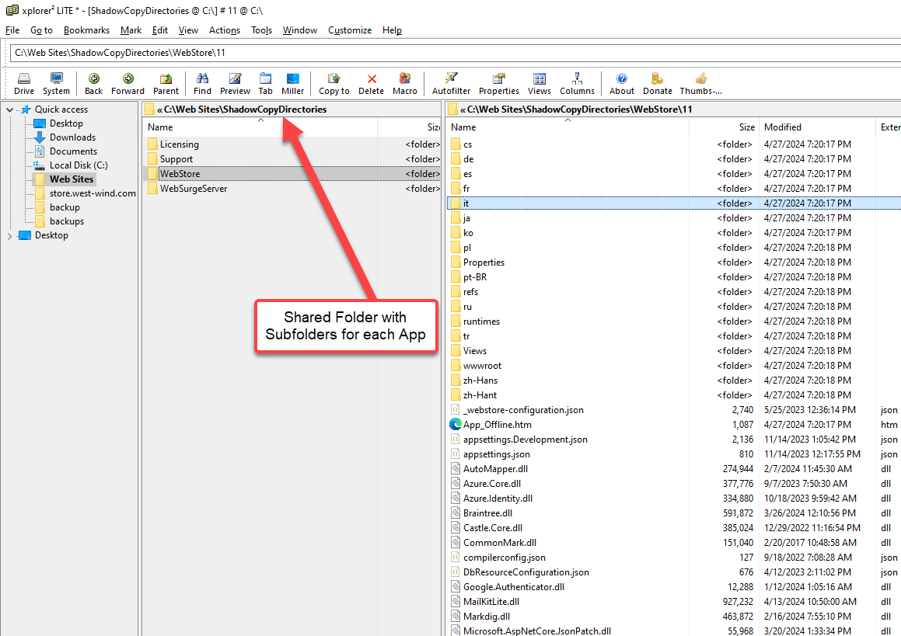

# ASP.NET Core Hosting Module with Shadow Copy Not Starting: Separate your Shadow Copy Folders!


I recently ran into a problem with random failures of my ASP.NET Core Web application on IIS where I would get the dreaded **ACNM Error Page** (ASP.NET Core Module):



This is on what used to a be a stable app that's been running without issues for a few years, and that uses Shadow Copy for execution. I [wrote about Shadow Copy Execution](https://weblog.west-wind.com/posts/2022/Nov/07/Avoid-WebDeploy-Locking-Errors-to-IIS-with-Shadow-Copy-for-ASPNET-Core-Apps) previously.

Recently after updating the ASP.NET runtime and hosting bundle from 8.0.1 to 8.0.4 I started running into some very frustrating problems resulting in the above error page randomly.

The error scenario goes something like this:

* Publish app to the server
* App starts and runs the new version
* At some point app restarts due to timeouts/manual restart
* App starts and runs fine
* App then restarts again at a later point
* App now starts erroring with ACNM Error Page and won't stop until republished and recycled


It's not consistent:  The app is running, running, restarting, running, restarting, running and it all works fine, but then all of a sudden - seemingly randomly - it starts failing.

Looking in the event log to see what additional information I could find I then see ANCM errors that relate to missing folders:



The above is an old folder that used to be in my app - or more specifically used to have files in it and now does not. WebDeploy to IIS doesn't publish the folder so that somehow broke the app.

I removed the folder once I saw the error, but unfortunately that didn't stop the errors. It shifted to something else:



which is equally as baffling: The file points to a runtime folder for the Alpine Linux distro, which is not referenced anywhere in the build or publish output. Huh?

##AD##

## Re-Publish and Win? Not Quite
So in the past when I've run into ANCM problems I just re-published, which always would fix the problem. But in this case it did not fix the issue. Because I'm using Shadow Copy deploy (where files are executed out of a copied folder in another location) a republish updates an existing shadow copied folder and that continues on the same error vector. 

The only way I could get this to resolve symptomatically was to:

* Shut down IIS (`IISRESET /STOP`)
* Delete all sub-folders in my Shadow Copy folder
* Restart IIS (`IISRESET /START`)
* Republish (if needed)

The app(s) then runs again for a while, until the cycle repeats.

Not cool!

## Fix: Separate your ShadowCopy Directories for different Apps
I found this fix in a bit of a roundabout way [through the GitHub issue I posted](https://github.com/dotnet/aspnetcore/issues/55216) which pointed at several related issues. 

To cut through the suspense the solution was to:

* Separate multiple applications **into their own dedicated ShadowCopyDirectory folders**

I had been running **with a single ShadowCopy directory** for multiple applications, and that has started to cause some issues.

There's no documentation that suggests that you have to separate multiple applications into their own shadow copy directories. Shadow Copy itself creates uniquely numbered folders to hold shadow copied content, so it never occurred to me that you would need to separate folders. And I've been running several apps with a shared folder for a couple of years without any issues. Yet, now problems started creeping up when I installed the 8.0.4 Hosting Bundle recently.

After isolating each application **to use its own Shadow Copy directory** however, **the problems disappeared**!

So now, I use a common **base ShadowCopyDirectories** folder, but each application gets its own dedicated sub-folder. Here's what that looks like on disk in my setup:



And here's the `web.config` handler configuration pointing to that app specific folder for one of the apps:

```xml
<handlerSettings>
    <handlerSetting name="enableShadowCopy" value="true" />
    <handlerSetting name="shadowCopyDirectory" value="../ShadowCopyDirectories/WebStore" />

    <!-- undocumented feature:  not needed in most cases -->    
    <!-- <handlerSetting name="cleanShadowCopyDirectory" value="true />" -->
</handlerSetting>
```

And this works. I put this in nearly two weeks ago and there have been no weird ANCM startup failures since!

So yay for this fix! But not so yay that something that was working now broke and caused some really strange and hard to track crash behavior in my Web applications!

## A little more Forensics on ShadowCopyDirectory
I didn't find this solution right away, and it took a few false starts to get to this final solution. It also looks like there is a bug in .NET 8.0 in the ANCM that has been fixed, but it's not available in 8.x - it has to wait for 9.0 and I wasn't able to test whether this fixes the issue. 

You can follow some of the discussion related to the issue I posted:

* [My GitHub Issue](https://github.com/dotnet/aspnetcore/issues/55216)
* [Related: cleanShadowDirectory](https://github.com/dotnet/aspnetcore/issues/48233)
* [Related: cleanShadowDirectory and multiple Sites](https://github.com/dotnet/aspnetcore/issues/50531)

Two things:

**1.)** There's an undocumented `cleanShadowCopyDirectory` handlerSetting that you can use to clean up your Shadow Copy directory **every time your application restarts**. This was my initial attempt at fixing the problem of the funky missing folders to ensure that each load would start with a clean setup. Unfortunately that backfired horribly as `cleanShadowCopyDirectory` was nuking **all folders** in the specified folder - including those of my other apps. Now all of my apps were failing even more frequently! Yikes!

I used this feature as a potential fix, as it is supposed to give you a clean shadow copy **every time the application restarts**. Based on my errors I figured that this would help with the weird missing folders that somehow were missing. But since I was still using a shared folder for Shadow Copy this now deleted folders for other applications resulting in even more startup failures. 

This is a feature that probably has very limited use cases and should be used only if there are specific issues you run into with Shadow Copy deployed applications, probably resulting in errors similar to the ones I showed above. If you see those kinds of errors **once you've ensured each app has its own shadow copy directory**, then you might be a candidate to use this feature to ensure you get a clean install on each launch.

IAC, for my apps, once I moved to separated shadow deploy folders, **I did not** re-enable `cleanShadowCopyDirectory` and that works fine for all of my applications.

**2.)** I'm still not sure **what caused the initial problem** I ran into, as somehow **the already existing application's shadow copy directory got corrupted** when multiple apps were sharing a single shadow copy directory. That should never have happened when `cleanShadowCopyDirectory` was not enabled. This seems to suggest that the shadow copy directories were somehow interfering with each other. When I started using separate folders the problem went away and apps have been stable ever since.

I hate unresolved mysteries like this. It looks like there's some sort of fix for an issue that will show up for .NET 9.0 but I can't verify as I don't want to install this early preview on my live server at this point. It'd be nice if this was fixed in a future .NET 8.0 update since this is a breaking change.

For me, the moral of the story is:

> Always use a separate Shadow Copy Folder for each application. Even if this turns out to be an odd regression bug in the ANCM, it still make sense to separate out the folders for each application just to be sure!

##AD## 

## Summary
The good news is that this problem has an easy fix: Don't share a single Shadow Copy folder for multiple applications! The bad news is that this is not documented and in theory should not be a problem since Shadow Copy folders create their own private folders for each 'iteration'. So one would assume it would all work off a single folder - but alas it does not. And worse failures with that single folder scenario are sketchy and inconsistent and hard to track. So keep it simple, and separate your folders.

Even if for some reason this is a bug that will get fixed, from now on I will always separate my Shadow Copy folders. Now we know! 😄


## Resources
* [Avoid WebDeploy Locking Errors to IIS with Shadow Copy for ASP.NET Core Apps](https://weblog.west-wind.com/posts/2022/Nov/07/Avoid-WebDeploy-Locking-Errors-to-IIS-with-Shadow-Copy-for-ASPNET-Core-Apps)
* [My Shadow Copy GitHub Issue](https://github.com/dotnet/aspnetcore/issues/55216)
* [Related: cleanShadowDirectory](https://github.com/dotnet/aspnetcore/issues/48233)
* [Related: cleanShadowDirectory and multiple Sites](https://github.com/dotnet/aspnetcore/issues/50531)