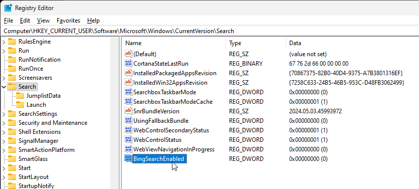

# Speed up your Start Menu by disabling Web Search

I ran into a great tip yesterday on X, that is too good not to pass on:

<blockquote class="twitter-tweet" data-theme="dark"><p lang="en" dir="ltr">Holy hannah! Disabling web search on the start menu makes it so much faster and effective. No lag at all anymore! <br><br>HKEY_CURRENT_USER\SOFTWARE\Microsoft\Windows\CurrentVersion\Search <br><br>Make a new DWORD (32-bit) called: BingSearchEnabled<br><br>Ensure the value = 0</p>&mdash; Albert Thomas, Cooling Reviewer (@ultrawide219) <a href="https://twitter.com/ultrawide219/status/1786104392753766466?ref_src=twsrc%5Etfw">May 2, 2024</a></blockquote> <script async src="https://platform.twitter.com/widgets.js" charset="utf-8"></script>

And yeah, it really is a huge improvement - I've been having issues with delayed opening of the start menu  or sometimes the menu not opening at all and requiring multiple hits of the Windows key - even on an otherwise blazing fast machine. 

Well, no more - the start menu now pops up instantly and there are no more 'misses'.

Here's what that looks like:



To set via Powershell:

```ps
New-ItemProperty HKCU:\Software\Microsoft\Windows\CurrentVersion\Search -Name "BingSearchEnabled" -Value "0" -PropertyType dword
```

or use a .reg file or copy and paste the key directly into the registry:

```
Windows Registry Editor Version 5.00

[HKEY_CURRENT_USER\Software\Microsoft\Windows\CurrentVersion\Search]
"BingSearchEnabled"=dword:00000000
```

Leaving this here, mainly as a point of reference for future me, installing Windows again...